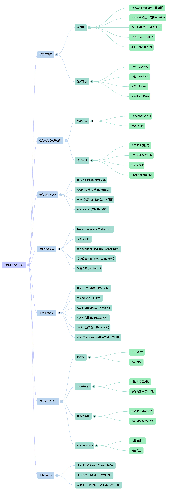

# 前端架构方向

## 1、前端状态库中目前有哪些？原理都有什么区别？你如何选择？

### 一、主流状态管理库

#### 1. Redux
```javascript
// Redux 是基于 Flux 架构的状态管理库
// 核心概念：action、reducer、store

// action
const INCREMENT = 'INCREMENT';
const increment = () => ({ type: INCREMENT });

// reducer
function counter(state = 0, action) {
  switch (action.type) {
    case INCREMENT:
      return state + 1;
    default:
      return state;
  }
}

// store
import { createStore } from 'redux';
const store = createStore(counter);

// 使用
store.dispatch(increment());
console.log(store.getState()); // 1
```

**特点：**
- 单一数据源
- 状态是只读的
- 使用纯函数修改状态
- 中间件支持（redux-thunk、redux-saga）

#### 2. Zustand
```javascript
// Zustand 是轻量级的状态管理库
import create from 'zustand';

const useStore = create((set) => ({
  count: 0,
  increment: () => set((state) => ({ count: state.count + 1 })),
  decrement: () => set((state) => ({ count: state.count - 1 }))
}));

// 使用
function Counter() {
  const { count, increment, decrement } = useStore();
  return (
    <div>
      <span>{count}</span>
      <button onClick={increment}>+</button>
      <button onClick={decrement}>-</button>
    </div>
  );
}
```

**特点：**
- 轻量级（1KB）
- 无需 Provider
- 支持 TypeScript
- 简单易用

#### 3. Recoil
```javascript
// Recoil 是 Facebook 开发的状态管理库
import { atom, useRecoilState } from 'recoil';

// atom 定义状态
const countState = atom({
  key: 'countState',
  default: 0
});

// 使用
function Counter() {
  const [count, setCount] = useRecoilState(countState);
  
  return (
    <div>
      <span>{count}</span>
      <button onClick={() => setCount(count + 1)}>+</button>
    </div>
  );
}
```

**特点：**
- 原子化状态
- 细粒度订阅
- 与 React 18 并发模式兼容
- 支持持久化

#### 4. Pinia (Vue)
```javascript
// Pinia 是 Vue 3 的官方状态管理库
import { defineStore } from 'pinia';

export const useCounterStore = defineStore('counter', {
  state: () => ({
    count: 0
  }),
  actions: {
    increment() {
      this.count++;
    },
    decrement() {
      this.count--;
    }
  },
  getters: {
    doubleCount: (state) => state.count * 2
  }
});

// 使用
import { useCounterStore } from './stores/counter';

const counterStore = useCounterStore();
console.log(counterStore.count);
counterStore.increment();
```

**特点：**
- 完整的 TypeScript 支持
- 轻量级（1KB）
- 模块化设计
- 去除 mutations

#### 5. Jotai
```javascript
// Jotai 是基于原子化设计的状态管理库
import { atom, useAtom } from 'jotai';

// 原子
const countAtom = atom(0);

// 派生原子
const doubleCountAtom = atom((get) => get(countAtom) * 2);

// 使用
function Counter() {
  const [count, setCount] = useAtom(countAtom);
  const [doubleCount] = useAtom(doubleCountAtom);
  
  return (
    <div>
      <span>{count}</span>
      <span>{doubleCount}</span>
      <button onClick={() => setCount(count + 1)}>+</button>
    </div>
  );
}
```

**特点：**
- 原子化设计
- 极轻量（1KB）
- 支持派生状态
- 无需 Provider

### 二、原理对比

#### 6. Redux 原理
```javascript
// Redux 的工作流程

// 1. View 发起 action
store.dispatch(increment());

// 2. Store 传递 action 给 reducer
const newState = reducer(prevState, action);

// 3. 生成新的 state
// state 是不可变的，必须返回新的对象

// 4. Store 通知所有订阅者
listeners.forEach(listener => listener());

// 5. View 重新渲染
```

**核心概念：**
- **Action**: 描述状态变化的普通对象
- **Reducer**: 纯函数，根据 action 返回新的 state
- **Store**: 管理状态、action 和 listener
- **Middleware**: 扩展功能（异步、日志等）

#### 7. Zustand 原理
```javascript
// Zustand 使用 Proxy 实现状态管理

// 1. 创建 store
const store = createStore((set, get) => ({
  count: 0,
  increment: () => set({ count: get().count + 1 })
}));

// 2. 使用 Proxy 监听状态变化
const useStore = (selector) => {
  const [state, setState] = useState(selector(store.getState()));
  
  useEffect(() => {
    // 订阅变化
    const unsubscribe = store.subscribe(() => {
      const newState = selector(store.getState());
      setState(newState);
    });
    
    return unsubscribe;
  }, [selector]);
  
  return state;
};
```

**核心概念：**
- **Provider-less**: 不需要 Provider 包裹
- **Selective subscription**: 只订阅需要的状态
- **Immutability**: 使用不可变更新

#### 8. Recoil 原理
```javascript
// Recoil 使用原子化和依赖追踪

// 1. atom 定义状态
const countState = atom({
  key: 'countState',
  default: 0
});

// 2. 内部维护 atom 状态
const atomStore = new Map();
atomStore.set('countState', { value: 0, dependents: new Set() });

// 3. 使用时注册依赖
function useRecoilState(atom) {
  const [state, setState] = useState();
  
  useEffect(() => {
    // 注册依赖
    const atomData = atomStore.get(atom.key);
    atomData.dependents.add(setState);
    
    // 清理
    return () => {
      atomData.dependents.delete(setState);
    };
  }, [atom]);
  
  return [atomData.value, (newValue) => {
    atomData.value = newValue;
    // 通知所有依赖
    atomData.dependents.forEach(setter => setter(newValue));
  }];
}
```

**核心概念：**
- **Atom**: 最小状态单元
- **Dependency tracking**: 自动追踪依赖关系
- **Concurrent mode**: 支持 React 18 并发模式

### 三、选择建议

#### 9. 根据项目规模选择
```javascript
// 小型项目（< 10 个页面）
// 选择：Context API + hooks
// 理由：内置、简单、足够用

// 中型项目（10-50 个页面）
// 选择：Zustand 或 Jotai
// 理由：轻量、简单、性能好

// 大型项目（50+ 个页面）
// 选择：Redux Toolkit
// 理由：生态成熟、工具完善、团队熟悉

// Vue 项目
// 选择：Pinia
// 理由：官方推荐、类型友好、简单易用
```

#### 10. 根据团队情况选择
```javascript
// 团队熟悉 Redux
// 选择：Redux Toolkit
// 理由：学习成本低、团队协作顺畅

// 追求轻量和简单
// 选择：Zustand 或 Jotai
// 理由：代码量少、易于维护

// 需要细粒度控制
// 选择：Recoil
// 理由：原子化、精确订阅

// Vue 项目
// 选择：Pinia
// 理由：官方推荐、生态完善
```

### 四、性能对比

#### 11. 性能测试数据
```javascript
// 更新 100 个组件的状态

// Redux + React-Redux
// 渲染时间：~50ms
// 需要使用 reselect 优化

// Zustand
// 渲染时间：~20ms
// 自动选择性订阅

// Recoil
// 渲染时间：~15ms
// 原子化，细粒度更新

// Context API
// 渲染时间：~100ms
// 所有消费者都会重新渲染

// Jotai
// 渲染时间：~18ms
// 原子化设计，高效更新
```

### 总结

状态管理库的选择要点：
1. **项目规模**：小型用 Context，中型用 Zustand，大型用 Redux
2. **性能要求**：需要高性能用 Recoil、Zustand
3. **团队熟悉度**：选择团队熟悉的方案
4. **Vue 项目**：统一使用 Pinia
5. **TypeScript 支持**：优先选择类型友好的库

## 2、请用函数式编程的方式解释 Redux 原理。

### 一、函数式编程基础

#### 1. 纯函数
```javascript
// 纯函数的特性：
// 1. 相同输入总是返回相同输出
// 2. 不修改外部状态（无副作用）
// 3. 不依赖外部状态

// 纯函数示例
function add(a, b) {
  return a + b; // ✓ 纯函数
}

// 非纯函数示例
let count = 0;
function increment() {
  return count++; // ✗ 非纯函数，依赖外部状态
}

function log(message) {
  console.log(message); // ✗ 非纯函数，有副作用
}
```

#### 2. 不可变性
```javascript
// 不可变性：创建新的对象而不是修改现有对象

// 错误的做法（可变）
const state = { count: 0 };
state.count = 1; // 修改了原对象

// 正确的做法（不可变）
const state = { count: 0 };
const newState = { ...state, count: 1 }; // 创建新对象

// 在 Redux 中
function counter(state = 0, action) {
  switch (action.type) {
    case 'INCREMENT':
      return state + 1; // 返回新值，不修改原值
    default:
      return state;
  }
}
```

### 二、Redux 的函数式实现

#### 3. 创建 Store
```javascript
// createStore 函数式实现
function createStore(reducer, initialState) {
  let state = initialState;
  const listeners = [];
  
  // 获取当前状态
  const getState = () => state;
  
  // 订阅状态变化
  const subscribe = (listener) => {
    listeners.push(listener);
    
    // 返回取消订阅的函数
    return () => {
      const index = listeners.indexOf(listener);
      if (index > -1) {
        listeners.splice(index, 1);
      }
    };
  };
  
  // 分发 action
  const dispatch = (action) => {
    // 使用 reducer 计算新状态（纯函数）
    state = reducer(state, action);
    
    // 通知所有订阅者
    listeners.forEach(listener => listener());
  };
  
  return {
    getState,
    subscribe,
    dispatch
  };
}

// 使用
const reducer = (state = 0, action) => {
  switch (action.type) {
    case 'INCREMENT':
      return state + 1;
    default:
      return state;
  }
};

const store = createStore(reducer, 0);

console.log(store.getState()); // 0
store.dispatch({ type: 'INCREMENT' });
console.log(store.getState()); // 1
```

#### 4. 组合 Reducer（高阶函数）
```javascript
// combineReducers 是高阶函数，接受多个 reducer
// 返回一个新的 reducer

function combineReducers(reducers) {
  // reducers: { counter: counterReducer, todo: todoReducer }
  
  return (state = {}, action) => {
    // 返回新的状态对象（不可变）
    return Object.keys(reducers).reduce((nextState, key) => {
      const reducer = reducers[key];
      const prevState = state[key];
      const nextState = reducer(prevState, action);
      
      return {
        ...nextState,
        [key]: nextState
      };
    }, {});
  };
}

// 使用
const counterReducer = (state = 0, action) => {
  switch (action.type) {
    case 'INCREMENT':
      return state + 1;
    default:
      return state;
  }
};

const todoReducer = (state = [], action) => {
  switch (action.type) {
    case 'ADD_TODO':
      return [...state, action.todo];
    default:
      return state;
  }
};

const rootReducer = combineReducers({
  counter: counterReducer,
  todos: todoReducer
});

const store = createStore(rootReducer);
```

#### 5. Middleware（函数组合）
```javascript
// Middleware 是高阶函数，格式为 store => next => action => {}

// Logger middleware
const logger = store => next => action => {
  console.log('dispatching:', action);
  const result = next(action);
  console.log('next state:', store.getState());
  return result;
};

// Thunk middleware（处理异步 action）
const thunk = store => next => action => {
  if (typeof action === 'function') {
    return action(store.dispatch, store.getState());
  }
  return next(action);
};

// applyMiddleware 组合多个 middleware
function applyMiddleware(...middlewares) {
  return createStore => (reducer, initialState) => {
    const store = createStore(reducer, initialState);
    let dispatch = store.dispatch;
    
    // 函数组合：从右到左
    const chain = middlewares.map(middleware => middleware(store));
    
    // 组合 middleware
    dispatch = chain.reduce((acc, middleware) => middleware(acc), store.dispatch);
    
    return {
      ...store,
      dispatch
    };
  };
}

// 使用
const store = applyMiddleware(logger, thunk)(createStore)(rootReducer);

// 异步 action
const fetchUser = (userId) => (dispatch, getState) => {
  fetch(`/api/users/${userId}`)
    .then(response => response.json())
    .then(user => {
      dispatch({ type: 'FETCH_USER_SUCCESS', user });
    });
};

store.dispatch(fetchUser(1));
```

### 三、函数式编程在 Redux 中的应用

#### 6. Action Creator（函数）
```javascript
// Action Creator 是纯函数，创建 action 对象

const increment = () => ({ type: 'INCREMENT' });
const decrement = () => ({ type: 'DECREMENT' });
const setValue = (value) => ({ type: 'SET_VALUE', value });

// 使用
const action = increment();
console.log(action); // { type: 'INCREMENT' }
```

#### 7. Selector（纯函数）
```javascript
// Selector 是纯函数，从 state 中派生数据

const getCount = (state) => state.counter;
const getTodos = (state) => state.todos;
const getCompletedTodos = (state) => state.todos.filter(todo => todo.completed);

// 记忆化 selector（使用闭包）
function createSelector(selectorFunc) {
  let lastState = null;
  let lastResult = null;
  
  return (state) => {
    if (state === lastState) {
      return lastResult;
    }
    lastState = state;
    lastResult = selectorFunc(state);
    return lastResult;
  };
}

const getCompletedTodosSelector = createSelector(getCompletedTodos);
```

#### 8. 高阶 Reducer
```javascript
// 高阶 Reducer 是函数，接受 reducer 返回新的 reducer

function withLogging(reducer) {
  return (state, action) => {
    console.log('Before:', state);
    const newState = reducer(state, action);
    console.log('After:', newState);
    return newState;
  };
}

// 使用
const loggedReducer = withLogging(counterReducer);
```

### 四、完整的函数式 Redux 实现

#### 9. 完整示例
```javascript
// 1. Action Creators
const increment = () => ({ type: 'INCREMENT' });
const decrement = () => ({ type: 'DECREMENT' });

// 2. Reducer（纯函数）
const counterReducer = (state = 0, action) => {
  switch (action.type) {
    case 'INCREMENT':
      return state + 1;
    case 'DECREMENT':
      return state - 1;
    default:
      return state;
  }
};

// 3. Combine Reducers
const rootReducer = combineReducers({
  counter: counterReducer
});

// 4. Create Store
const store = createStore(rootReducer);

// 5. Subscribe
store.subscribe(() => {
  console.log('Current state:', store.getState());
});

// 6. Dispatch
store.dispatch(increment()); // Current state: { counter: 1 }
store.dispatch(increment()); // Current state: { counter: 2 }
store.dispatch(decrement()); // Current state: { counter: 1 }
```

### 五、函数式编程的优势

#### 10. 优势说明
```javascript
// 1. 可预测性
// 纯函数和不可变数据使状态变化可预测

// 2. 可测试性
// 纯函数易于测试
test('counterReducer increments', () => {
  const initialState = 0;
  const action = { type: 'INCREMENT' };
  const newState = counterReducer(initialState, action);
  expect(newState).toBe(1);
});

// 3. 可组合性
// 高阶函数和函数组合使代码可复用
const enhancedReducer = withLogging(withPersistence(counterReducer));

// 4. 可维护性
// 纯函数职责单一，易于理解和维护

// 5. 时间旅行调试
// 不可变状态和时间旅行使调试更容易
```

### 总结

Redux 的函数式编程核心：
1. **纯函数**：reducer 是纯函数，相同输入总是返回相同输出
2. **不可变性**：返回新状态，不修改原状态
3. **高阶函数**：combineReducers、applyMiddleware
4. **函数组合**：middleware、enhancer
5. **可预测性**：单向数据流，状态变化可追踪

函数式编程使 Redux：
- 代码更简洁
- 更容易测试
- 更容易调试
- 更容易维护

## 3、Immer 的原理是什么？

### 一、Immer 基础

#### 1. 什么是 Immer
```javascript
// Immer 是一个用于不可变状态更新的库
import { produce } from 'immer';

const baseState = {
  user: {
    name: 'John',
    age: 30
  },
  todos: [
    { id: 1, text: 'Learn Immer' }
  ]
};

// 使用 produce 更新状态
const nextState = produce(baseState, draft => {
  draft.user.age += 1;
  draft.todos.push({ id: 2, text: 'Use Immer' });
});

console.log(baseState); // 原状态不变
console.log(nextState);  // 返回新状态
```

**特点：**
- 简化不可变更新
- 自动冻结状态（开发模式）
- 支持 ES6 Proxy
- 与 Redux 集成良好

### 二、Immer 的核心原理

#### 2. Proxy 实现
```javascript
// Immer 使用 ES6 Proxy 创建草稿状态
function produce(baseState, recipe) {
  // 1. 创建 Proxy 包装对象
  const draft = createProxy(baseState);
  
  // 2. 执行 recipe 函数
  recipe(draft);
  
  // 3. 比较差异并返回新状态
  return finalize(draft, baseState);
}

function createProxy(base) {
  const handler = {
    get(target, key) {
      // 访问属性时
      const value = target[key];
      
      // 如果是对象，返回其 Proxy
      if (typeof value === 'object' && value !== null) {
        return createProxy(value);
      }
      
      return value;
    },
    
    set(target, key, value) {
      // 设置属性时，标记为已修改
      target[key] = value;
      return true;
    }
  };
  
  return new Proxy(base, handler);
}

function finalize(draft, base) {
  // 深拷贝草稿状态
  return JSON.parse(JSON.stringify(draft));
}
```

#### 3. ES5 Polyfill
```javascript
// 对于不支持 Proxy 的环境，Immer 使用 ES5 实现
function createProxyES5(base) {
  const copy = Object.create(Object.getPrototypeOf(base));
  Object.keys(base).forEach(key => {
    defineProperty(copy, key, {
      get() {
        const value = base[key];
        if (typeof value === 'object' && value !== null) {
          return createProxyES5(value);
        }
        return value;
      },
      set(value) {
        base[key] = value;
        return true;
      }
    });
  });
  
  return copy;
}

function defineProperty(obj, key, descriptor) {
  const value = descriptor.value;
  
  Object.defineProperty(obj, key, {
    get() {
      return descriptor.get.call(obj);
    },
    set(newVal) {
      descriptor.value = newVal;
      descriptor.set.call(obj, newVal);
    },
    enumerable: true,
    configurable: true
  });
}
```

### 三、Immer 在 Redux 中的应用

#### 4. Redux Toolkit 使用 Immer
```javascript
import { createSlice, configureStore } from '@reduxjs/toolkit';

// Redux Toolkit 默认集成了 Immer
const counterSlice = createSlice({
  name: 'counter',
  initialState: { value: 0 },
  reducers: {
    increment: (state) => {
      // 直接修改 state，Immer 会处理不可变性
      state.value += 1;
    },
    decrement: (state) => {
      state.value -= 1;
    },
    incrementBy: (state, action) => {
      state.value += action.payload;
    }
  }
});

const store = configureStore({
  reducer: {
    counter: counterSlice.reducer
  }
});

// 使用
store.dispatch(increment());
console.log(store.getState().counter.value); // 1

store.dispatch(incrementBy(5));
console.log(store.getState().counter.value); // 6
```

#### 5. 手动集成 Immer
```javascript
import { produce } from 'immer';

const initialState = {
  items: [1, 2, 3]
};

function reducer(state = initialState, action) {
  switch (action.type) {
    case 'ADD_ITEM':
      return produce(state, draft => {
        draft.items.push(action.payload);
      });
    
    case 'UPDATE_ITEM':
      return produce(state, draft => {
        const item = draft.items.find(i => i.id === action.payload.id);
        if (item) {
          item.text = action.payload.text;
        }
      });
    
    default:
      return state;
  }
}
```

### 四、Immer 高级用法

#### 6. produceWithPatches
```javascript
import { produceWithPatches, enablePatches } from 'immer';

// 启用 patches 支持
enablePatches();

const state = {
  user: {
    name: 'John'
  }
};

const [nextState, patches, inversePatches] = produceWithPatches(state, draft => {
  draft.user.name = 'Jane';
});

console.log(patches);
// [
//   {
//     op: 'replace',
//     path: ['user', 'name'],
//     value: 'Jane'
//   }
// ]

console.log(inversePatches);
// [
//   {
//     op: 'replace',
//     path: ['user', 'name'],
//     value: 'John'
//   }
// ]

// 使用 patches 生成代码
import { applyPatches } from 'immer';
const undoState = applyPatches(nextState, inversePatches);
```

#### 7. produceWithCallback
```javascript
import { produce } from 'immer';

const state = {
  users: []
};

produce(state, draft => {
  draft.users.push({ name: 'John' });
  draft.users.push({ name: 'Jane' });
}, (patches, inversePatches) => {
  console.log('Patches:', patches);
  console.log('Inverse patches:', inversePatches);
  
  // 可以将 patches 保存到历史记录
  saveToHistory(patches);
});
```

#### 8. autoFreeze
```javascript
import { enableES5, setAutoFreeze } from 'immer';

// 启用 ES5 模式
enableES5();

// 开发环境自动冻结状态
setAutoFreeze(true);

const state = {
  user: {
    name: 'John'
  }
};

const nextState = produce(state, draft => {
  draft.user.name = 'Jane';
});

// 尝试修改返回的状态会报错
nextState.user.name = 'Bob';
// Error: Cannot assign to read only property
```

### 五、性能优化

#### 9. 原生 Immer
```javascript
import { produce, enableMapSet } from 'immer';

// 启用 Map 和 Set 支持
enableMapSet();

const state = new Map([
  ['user', { name: 'John' }]
]);

const nextState = produce(state, draft => {
  const user = draft.get('user');
  if (user) {
    user.name = 'Jane';
  }
});
```

#### 10. 使用 immutable 库
```javascript
import { produce } from 'immer';

const state = {
  items: Immutable.List([1, 2, 3])
};

const nextState = produce(state, draft => {
  // Immer 可以处理 immutable 对象
  draft.items = draft.items.push(4);
});
```

### 总结

Immer 的核心原理：
1. **Proxy 包装**：创建 Proxy 包装的草稿状态
2. **拦截操作**：拦截 get 和 set 操作
3. **自动追踪**：自动追踪所有修改
4. **不可变返回**：返回新的不可变状态
5. **性能优化**：只在修改的部分创建新对象

Immer 的优势：
- 简化不可变更新
- 更好的性能（只复制修改的部分）
- 与 Redux Toolkit 完美集成
- 支持 patches（用于撤销/重做）

## 4、当前 SPA 架构的设计首屏白屏时间最为头疼，你如何统计这个白屏时间，如何优化这个白屏时间？

### 一、白屏时间统计

#### 1. 统计方法
```javascript
// 方法1: 使用 Performance API
function measureWhiteScreenTime() {
  // 白屏时间 = DOMContentLoaded - navigationStart
  const timing = performance.timing;
  const whiteScreenTime = timing.domContentLoadedEventStart - timing.navigationStart;
  
  console.log(`白屏时间: ${whiteScreenTime}ms`);
  
  // 上报到监控平台
  sendToAnalytics({
    metric: 'white_screen_time',
    value: whiteScreenTime
  });
}

// 方法2: 使用 Navigation Timing API 2
function measureWhiteScreenTimeV2() {
  const perfData = performance.getEntriesByType('navigation')[0];
  const whiteScreenTime = perfData.domContentLoadedEventStart - perfData.startTime;
  
  return whiteScreenTime;
}

// 方法3: 使用自定义时间戳
let startTime = Date.now();

window.addEventListener('load', () => {
  const endTime = Date.now();
  const whiteScreenTime = endTime - startTime;
  
  console.log(`白屏时间: ${whiteScreenTime}ms`);
});
```

#### 2. 更精确的统计
```javascript
// 统计关键渲染路径的时间
function measureFCP() {
  if ('PerformanceObserver' in window) {
    const observer = new PerformanceObserver((list) => {
      for (const entry of list.getEntries()) {
        if (entry.entryType === 'paint' && entry.name === 'first-contentful-paint') {
          console.log(`FCP: ${entry.startTime}ms`);
          
          // FCP 通常就是白屏时间
          sendToAnalytics({
            metric: 'fcp',
            value: entry.startTime
          });
        }
      }
    });
    
    observer.observe({ type: 'paint', buffered: true });
  }
}

// 统计首屏完全渲染时间
function measureLCP() {
  if ('PerformanceObserver' in window) {
    const observer = new PerformanceObserver((list) => {
      for (const entry of list.getEntries()) {
        if (entry.entryType === 'largest-contentful-paint') {
          console.log(`LCP: ${entry.startTime}ms`);
        }
      }
    });
    
    observer.observe({ type: 'largest-contentful-paint', buffered: true });
  }
}

measureFCP();
measureLCP();
```

### 二、白屏时间优化

#### 3. 骨架屏（Skeleton Screen）
```vue
<template>
  <div class="app">
    <SkeletonScreen v-if="loading" />
    <AppContent v-else />
  </div>
</template>

<script>
export default {
  data() {
    return {
      loading: true
    };
  },
  async mounted() {
    try {
      await this.loadData();
      this.loading = false;
    } catch (error) {
      console.error(error);
    }
  }
}
</script>

<style>
.skeleton-screen {
  position: fixed;
  top: 0;
  left: 0;
  right: 0;
  bottom: 0;
  background: #f5f5f5;
  display: flex;
  align-items: center;
  justify-content: center;
}

.skeleton-loader {
  width: 200px;
  height: 8px;
  background: linear-gradient(90deg, #e0e0e0 25%, #f0f0f0 50%, #e0e0e0 75%);
  background-size: 200% 100%;
  animation: shimmer 1.5s infinite;
}

@keyframes shimmer {
  0% { background-position: -200% 0; }
  100% { background-position: 200% 0; }
}
</style>
```

```javascript
// React 版本
function App() {
  const [loading, setLoading] = useState(true);
  const [data, setData] = useState(null);
  
  useEffect(() => {
    loadData().then(res => {
      setData(res);
      setLoading(false);
    });
  }, []);
  
  return (
    <div>
      {loading ? <SkeletonScreen /> : <AppContent data={data} />}
    </div>
  );
}

function SkeletonScreen() {
  return (
    <div style={skeletonStyle}>
      <div style={loaderStyle}></div>
    </div>
  );
}

const skeletonStyle = {
  position: 'fixed',
  top: 0,
  left: 0,
  right: 0,
  bottom: 0,
  background: '#f5f5f5',
  display: 'flex',
  alignItems: 'center',
  justifyContent: 'center'
};

const loaderStyle = {
  width: '200px',
  height: '8px',
  background: 'linear-gradient(90deg, #e0e0e0 25%, #f0f0f0 50%, #e0e0e0 75%)',
  backgroundSize: '200% 100%',
  animation: 'shimmer 1.5s infinite'
};
```

#### 4. 预加载关键资源
```html
<!-- 预加载关键 CSS -->
<link rel="preload" href="critical.css" as="style">

<!-- 预加载关键 JS -->
<link rel="preload" href="critical.js" as="script">

<!-- 内联关键 CSS -->
<style>
  /* 关键样式 */
  body { margin: 0; padding: 0; }
  #app { min-height: 100vh; }
</style>

<!-- 延迟加载非关键资源 -->
<link rel="preload" href="main.css" as="style" onload="this.onload=null;this.rel='stylesheet'">

<!-- 预加载字体 -->
<link rel="preload" href="font.woff2" as="font" crossorigin>
```

#### 5. 代码分割和懒加载
```javascript
// 路由懒加载
const Home = () => import(/* webpackChunkName: "home" */ './views/Home');
const About = () => import(/* webpackChunkName: "about" */ './views/About');
const Dashboard = () => import(/* webpackChunkName: "dashboard" */ './views/Dashboard');

// 组件懒加载
const LazyComponent = React.lazy(() => import('./LazyComponent'));

function App() {
  return (
    <div>
      <Suspense fallback={<div>Loading...</div>}>
        <LazyComponent />
      </Suspense>
    </div>
  );
}

// 预加载下一页面
function preloadNextPage() {
  const nextPage = () => import('./NextPage');
  // 预加载但不执行
  nextPage();
}
```

#### 6. 服务端渲染（SSR）
```javascript
// Next.js SSR
export async function getServerSideProps() {
  const data = await fetchData();
  
  return {
    props: {
      data
    }
  };
}

// Nuxt.js SSR
export default {
  async asyncData() {
    const data = await fetchData();
    return { data };
  }
}
```

#### 7. 静态站点生成（SSG）
```javascript
// Next.js SSG
export async function getStaticProps() {
  const data = await fetchData();
  
  return {
    props: { data },
    revalidate: 60 // 60秒后重新生成
  };
}

// 预渲染静态页面
export async function getStaticPaths() {
  const paths = await getAllPages();
  
  return {
    paths,
    fallback: false
  };
}
```

#### 8. 使用 CDN 和缓存
```html
<!-- 使用 CDN -->
<link rel="stylesheet" href="https://cdn.example.com/styles.css">
<script src="https://cdn.example.com/app.js"></script>

<!-- 启用强缓存 -->
<link rel="stylesheet" href="styles.css">
<script>
  // 检查缓存
  if ('caches' in window) {
    caches.open('v1').then(cache => {
      cache.match('critical.js').then(response => {
        if (!response) {
          fetch('critical.js').then(response => {
            cache.put('critical.js', response);
          });
        }
      });
    });
  }
</script>
```

#### 9. 优化图片和字体
```html
<!-- 预加载字体 -->
<link rel="preload" href="font.woff2" as="font" crossorigin>
<style>
  @font-face {
    font-family: 'MyFont';
    src: url('font.woff2') format('woff2');
    font-display: swap; /* 可选：fallback, optional, block */
  }
</style>

<!-- 预加载关键图片 -->
<link rel="preload" href="hero-image.jpg" as="image" imagesrcset="hero-image-small.jpg 480w, hero-image-medium.jpg 800w">
```

#### 10. 优化 JS 执行顺序
```html
<!-- defer 延迟执行，不阻塞渲染 -->
<script defer src="main.js"></script>

<!-- async 立即异步执行 -->
<script async src="analytics.js"></script>

<!-- 内联关键 JS -->
<script>
  // 关键初始化代码
  (function() {
    // 立即执行，不等待页面加载
  })();
</script>
```

### 三、监控和优化

#### 11. 性能监控
```javascript
// 使用 web-vitals 库
import { getFCP, getLCP, getFID, getCLS, getTTFB } from 'web-vitals';

function sendToAnalytics(metric) {
  const data = {
    metricName: metric.name,
    value: metric.value,
    rating: metric.rating,
    id: metric.id
  };
  
  fetch('/api/analytics', {
    method: 'POST',
    body: JSON.stringify(data),
    keepalive: true
  });
}

getFCP(sendToAnalytics);
getLCP(sendToAnalytics);
getFID(sendToAnalytics);
getCLS(sendToAnalytics);
getTTFB(sendToAnalytics);
```

#### 12. A/B 测试优化方案
```javascript
// 测试不同优化方案的效果
async function testOptimizationStrategy(strategy) {
  const startTime = Date.now();
  
  switch(strategy) {
    case 'skeleton':
      // 测试骨架屏方案
      break;
    case 'ssr':
      // 测试 SSR 方案
      break;
    case 'critical-css':
      // 测试关键 CSS 方案
      break;
  }
  
  const whiteScreenTime = await measureWhiteScreenTime();
  const endTime = Date.now();
  
  return {
    strategy,
    whiteScreenTime,
    totalTime: endTime - startTime
  };
}

// 对比不同方案
const results = await Promise.all([
  testOptimizationStrategy('skeleton'),
  testOptimizationStrategy('ssr'),
  testOptimizationStrategy('critical-css')
]);

console.table(results);
```

### 总结

白屏时间优化的关键点：
1. **统计方法**：使用 Performance API 和 web-vitals
2. **骨架屏**：提供视觉反馈，减少用户等待焦虑
3. **预加载**：优先加载关键资源
4. **代码分割**：懒加载非关键代码
5. **SSR/SSG**：服务端渲染或静态生成
6. **CDN 和缓存**：加速资源加载
7. **字体和图片**：优化媒体资源加载
8. **监控和分析**：持续优化和 A/B 测试

## 5、你们目前团队的前端架构是如何设计的？

### 一、架构概述

#### 1. 整体架构
```javascript
// 参考 Uniswap 的架构设计
// https://github.com/uniswap/interface

our-project/
├── apps/              # 应用
│   ├── web/           # Web 应用
│   └── mobile/        # 移动应用（可选）
├── packages/          # Monorepo 包
│   ├── ui/            # UI 组件库
│   ├── hooks/         # 自定义 Hooks
│   ├── utils/         # 工具函数
│   ├── sdk/           # SDK
│   └── types/         # TypeScript 类型定义
├── contracts/         # 智能合约（Web3 可选）
├── subgraphs/         # GraphQL 子图
├── services/          # 服务端代码
├── public/            # 静态资源
├── docs/              # 文档
├── .github/           # GitHub Actions
├── package.json       # 根配置
├── pnpm-workspace.yaml # pnpm 配置
├── tsconfig.json      # TypeScript 配置
└── turbo.json         # Turbopack 配置
```

#### 2. 技术栈
```javascript
// package.json
{
  "name": "our-project",
  "private": true,
  "workspaces": [
    "apps/*",
    "packages/*"
  ],
  "scripts": {
    "dev": "turbo run dev --parallel",
    "build": "turbo run build",
    "test": "turbo run test",
    "lint": "turbo run lint",
    "type-check": "turbo run type-check"
  },
  "devDependencies": {
    "turbo": "latest",
    "typescript": "^5.0.0"
  },
  "engines": {
    "node": ">=18.0.0",
    "pnpm": ">=8.0.0"
  }
}
```

### 二、组件库设计

#### 3. UI 组件库结构
```javascript
// packages/ui/
src/
├── components/
│   ├── Button/
│   ├── Input/
│   ├── Modal/
│   └── ...
├── styles/
│   ├── theme.ts
│   └── variables.css
├── hooks/
│   └── useTheme.ts
├── utils/
│   └── index.ts
└── index.ts
```

#### 4. 组件库实现
```typescript
// packages/ui/src/components/Button/index.tsx
import { styled } from '@emotion/styled';
import { useTheme } from '../../hooks/useTheme';

export interface ButtonProps {
  variant?: 'primary' | 'secondary' | 'ghost';
  size?: 'small' | 'medium' | 'large';
  disabled?: boolean;
  children: React.ReactNode;
}

const StyledButton = styled.button<ButtonProps>`
  ${({ theme, variant }) => {
    return {
      backgroundColor: theme.colors[variant],
      color: theme.colors.text
    };
  }};
  
  ${({ size }) => {
    return {
      padding: theme.sizes[size].padding,
      fontSize: theme.sizes[size].fontSize
    };
  }}
  
  border: none;
  border-radius: 8px;
  cursor: ${({ disabled }) => (disabled ? 'not-allowed' : 'pointer')};
  opacity: ${({ disabled }) => (disabled ? 0.6 : 1)};
`;

export const Button: React.FC<ButtonProps> = ({
  variant = 'primary',
  size = 'medium',
  disabled = false,
  children
}) => {
  const theme = useTheme();
  
  return (
    <StyledButton variant={variant} size={size} disabled={disabled} theme={theme}>
      {children}
    </StyledButton>
  );
};

Button.displayName = 'Button';
```

### 三、GraphQL 设计

#### 5. GraphQL 架构
```javascript
// apps/web/src/graphql/
├── queries/
│   ├── user.ts
│   ├── product.ts
│   └── ...
├── mutations/
│   ├── auth.ts
│   └── ...
├── subscriptions/
│   ├── priceUpdates.ts
│   └── ...
├── client.ts
└── schema.ts
```

#### 6. GraphQL 客户端
```typescript
// apps/web/src/graphql/client.ts
import { ApolloClient, InMemoryCache, HttpLink } from '@apollo/client';
import { WebSocketLink } from '@apollo/client/link/ws';

// HTTP 链接
const httpLink = new HttpLink({
  uri: process.env.REACT_APP_API_URL,
  fetchOptions: {
    mode: 'cors'
  }
});

// WebSocket 链接（用于订阅）
const wsLink = new WebSocketLink({
  uri: process.env.REACT_APP_WS_URL,
  options: {
    reconnect: true
  }
});

// 分离操作
const splitLink = split(
  ({ query }) => {
    const definition = getMainDefinition(query);
    return definition.kind === 'OperationDefinition' && definition.operation === 'subscription'
      ? wsLink
      : httpLink;
  }
);

// 创建客户端
export const apolloClient = new ApolloClient({
  link: splitLink,
  cache: new InMemoryCache(),
  defaultOptions: {
    watchQuery: true,
    fetchPolicy: 'cache-and-network'
  }
});
```

#### 7. GraphQL 查询
```typescript
// apps/web/src/graphql/queries/product.ts
import { gql } from '@apollo/client';

export const GET_PRODUCTS = gql`
  query GetProducts($first: Int, $skip: Int) {
    products(first: $first, skip: $skip) {
      id
      name
      description
      price
      image
    }
  }
`;

export const GET_PRODUCT = gql`
  query GetProduct($id: ID!) {
    product(id: $id) {
      id
      name
      description
      price
      image
      seller {
        id
        name
      }
    }
  }
`;
```

### 四、状态管理

#### 8. 状态架构
```javascript
// apps/web/src/store/
├── slices/
│   ├── userSlice.ts
│   ├── productSlice.ts
│   └── ...
├── hooks/
│   ├── useUser.ts
│   └── ...
└── index.ts
```

#### 9. Redux Toolkit 配置
```typescript
// apps/web/src/store/index.ts
import { configureStore } from '@reduxjs/toolkit';
import { userSlice } from './slices/userSlice';
import { productSlice } from './slices/productSlice';

export const store = configureStore({
  reducer: {
    user: userSlice.reducer,
    products: productSlice.reducer
  },
  middleware: (getDefaultMiddleware) =>
    getDefaultMiddleware({
      serializableCheck: false
    })
});

export type RootState = ReturnType<typeof store.getState>;
export type AppDispatch = typeof store.dispatch;
```

### 五、类型安全

#### 10. TypeScript 配置
```json
// tsconfig.json
{
  "extends": "../tsconfig.base.json",
  "compilerOptions": {
    "target": "ES2020",
    "lib": ["DOM", "DOM.Iterable", "ESNext"],
    "module": "ESNext",
    "moduleResolution": "node",
    "resolveJsonModule": true,
    "allowJs": true,
    "strict": true,
    "noEmit": true,
    "esModuleInterop": true,
    "skipLibCheck": true,
    "allowSyntheticDefaultImports": true,
    "forceConsistentCasingInFileNames": true,
    "isolatedModules": true
  },
  "include": ["src"],
  "exclude": ["node_modules"]
}
```

### 六、测试架构

#### 11. 单元测试
```typescript
// apps/web/src/__tests__/components/Button.test.tsx
import { render, screen } from '@testing-library/react';
import { Button } from '@my-project/ui';

describe('Button', () => {
  it('renders children', () => {
    render(<Button>Click me</Button>);
    expect(screen.getByText('Click me')).toBeInTheDocument();
  });
  
  it('applies variant styles', () => {
    const { container } = render(<Button variant="primary">Primary</Button>);
    expect(container.firstChild).toHaveStyle({
      backgroundColor: '#007bff'
    });
  });
  
  it('is disabled when disabled prop is true', () => {
    render(<Button disabled={true}>Disabled</Button>);
    expect(screen.getByRole('button')).toBeDisabled();
  });
});
```

#### 12. 集成测试
```typescript
// apps/web/src/__tests__/integration/auth.test.ts
import { render, waitFor } from '@testing-library/react';
import { Provider } from 'react-redux';
import { BrowserRouter } from 'react-router-dom';
import Login from '../pages/Login';
import { apolloClient } from '../../graphql/client';
import { store } from '../../store';

describe('Login Integration', () => {
  it('logs in user successfully', async () => {
    render(
      <Provider store={store}>
        <ApolloProvider client={apolloClient}>
          <BrowserRouter>
            <Login />
          </BrowserRouter>
        </ApolloProvider>
      </Provider>
    );
    
    // 填写表单
    fireEvent.change(screen.getByLabelText('Email'), { target: { value: 'test@example.com' }});
    fireEvent.change(screen.getByLabelText('Password'), { target: { value: 'password123' }});
    
    // 提交
    fireEvent.click(screen.getByRole('button', { name: /login/i }));
    
    // 等待登录成功
    await waitFor(() => {
      expect(screen.getByText('Welcome')).toBeInTheDocument();
    });
  });
});
```

### 七、CI/CD 配置

#### 13. GitHub Actions
```yaml
# .github/workflows/ci.yml
name: CI

on:
  push:
    branches: [main, develop]
  pull_request:
    branches: [main]

jobs:
  test:
    runs-on: ubuntu-latest
    
    steps:
      - uses: actions/checkout@v3
      
      - name: Setup Node.js
        uses: actions/setup-node@v3
        with:
          node-version: '18'
          cache: 'pnpm'
      
      - name: Install dependencies
        run: pnpm install --frozen-lockfile
      
      - name: Run tests
        run: turbo run test
      
      - name: Upload coverage
        uses: codecov/codecov-action@v3
        with:
          files: ./coverage/lcov.info
      
  build:
    needs: test
    runs-on: ubuntu-latest
    
    steps:
      - uses: actions/checkout@v3
      
      - name: Setup Node.js
        uses: actions/setup-node@v3
        with:
          node-version: '18'
          cache: 'pnpm'
      
      - name: Install dependencies
        run: pnpm install --frozen-lockfile
      
      - name: Build
        run: turbo run build
      
      - name: Build Docker image
        run: |
          docker build -t myapp:${{ github.sha }} .
          docker tag myapp:${{ github.sha }} registry.example.com/myapp:latest
```

### 总结

团队前端架构的核心要素：
1. **Monorepo**：使用 pnpm Workspaces 管理
2. **组件库**：独立的 UI 组件库
3. **GraphQL**：使用 Apollo Client 和订阅
4. **状态管理**：Redux Toolkit 集成
5. **类型安全**：完整的 TypeScript 配置
6. **测试**：单元测试和集成测试
7. **CI/CD**：GitHub Actions 自动化

## 6、GraphQl/RESTFul/TRPC 你是如何看待的？

### 一、RESTful API

#### 1. 特点
```javascript
// RESTful 是基于资源的架构风格
// 使用 HTTP 方法（GET、POST、PUT、DELETE）
// 无状态、统一接口

// 示例
// 获取用户列表
GET /api/users

// 获取单个用户
GET /api/users/1

// 创建用户
POST /api/users
{
  "name": "John",
  "email": "john@example.com"
}

// 更新用户
PUT /api/users/1
{
  "name": "Jane"
}

// 删除用户
DELETE /api/users/1
```

#### 2. 优点
- **简单易懂**: 基于 HTTP 标准,易于理解
- **缓存友好**: 可以利用 HTTP 缓存机制
- **成熟稳定**: 生态系统完善,工具丰富
- **无状态**: 服务器不保存客户端状态,易于扩展
- **统一接口**: 所有资源使用相同的接口

#### 3. 缺点
- **过度获取**: 可能获取到不需要的数据
- **获取不足**: 需要多次请求才能获取完整数据
- **版本管理**: API 变更需要版本控制
- **文档维护**: 需要手动维护 API 文档

#### 4. 适用场景
```javascript
// 适合的场景
1. 简单的 CRUD 操作
2. 资源导向的应用
3. 需要缓存的应用
4. 第三方集成
5. 对性能要求极高的场景

// 实际代码
// 使用 axios 调用 RESTful API
import axios from 'axios';

const api = axios.create({
  baseURL: 'https://api.example.com',
  timeout: 5000
});

// 获取用户
export const getUsers = async () => {
  const response = await api.get('/users');
  return response.data;
};

// 创建用户
export const createUser = async (user) => {
  const response = await api.post('/users', user);
  return response.data;
};

// 更新用户
export const updateUser = async (id, user) => {
  const response = await api.put(`/users/${id}`, user);
  return response.data;
};

// 删除用户
export const deleteUser = async (id) => {
  const response = await api.delete(`/users/${id}`);
  return response.data;
};
```

### 二、GraphQL

#### 5. 特点
```javascript
// GraphQL 是查询语言,允许客户端精确请求需要的数据
// 单一端点,强类型,实时订阅

// 示例
// 查询
query GetUser {
  user(id: "1") {
    name
    email
    posts {
      title
      content
    }
  }
}

// 变更
mutation CreateUser($input: CreateUserInput!) {
  createUser(input: $input) {
    id
    name
  }
}

// 订阅
subscription OnUserCreated {
  userCreated {
    id
    name
  }
}
```

#### 6. 优点
- **精确获取**: 客户端按需获取数据,避免过度获取
- **单一请求**: 多个资源可以在一个请求中获取
- **强类型**: Schema 定义明确,有类型检查
- **实时订阅**: 内置 WebSocket 支持
- **自描述**: Schema 即文档

#### 7. 缺点
- **缓存复杂**: 不如 RESTful 缓存友好
- **学习曲线**: 需要学习 GraphQL 和相关工具
- **文件上传**: 文件上传不如 RESTful 简单
- **N+1 问题**: 需要使用 DataLoader 优化
- **监控困难**: 查询复杂,难以监控性能

#### 8. 适用场景
```javascript
// 适合的场景
1. 复杂的数据查询
2. 移动应用(减少请求数)
3. 多个客户端使用不同的数据格式
4. 实时数据更新
5. 需要类型安全的应用

// 实际代码
// 使用 Apollo Client
import { ApolloClient, InMemoryCache, gql, useQuery } from '@apollo/client';

// 创建客户端
const client = new ApolloClient({
  uri: 'https://api.example.com/graphql',
  cache: new InMemoryCache()
});

// 定义查询
const GET_USERS = gql`
  query GetUsers($first: Int, $skip: Int) {
    users(first: $first, skip: $skip) {
      id
      name
      email
    }
  }
`;

// 使用查询
function Users() {
  const { loading, error, data } = useQuery(GET_USERS, {
    variables: { first: 10, skip: 0 }
  });
  
  if (loading) return <div>Loading...</div>;
  if (error) return <div>Error: {error.message}</div>;
  
  return (
    <ul>
      {data.users.map(user => (
        <li key={user.id}>{user.name}</li>
      ))}
    </ul>
  );
}
```

### 三、tRPC

#### 9. 特点
```javascript
// tRPC 是端到端类型安全的 RPC 框架
// 自动生成客户端类型,无需 Schema
// 专为 TypeScript 全栈设计

// 服务端代码
import { initTRPC } from '@trpc/server';
import * as trpcNext from '@trpc/server/adapters/next';
import { z } from 'zod';

const t = initTRPC.create();

// 定义路由
const appRouter = t.router({
  greeting: t.procedure
    .input(z.object({ name: z.string() }))
    .query(({ input }) => {
      return `Hello ${input.name}!`;
    }),
  createUser: t.procedure
    .input(z.object({
      name: z.string(),
      email: z.string().email()
    }))
    .mutation(async ({ input, ctx }) => {
      // 创建用户逻辑
      const user = await db.user.create({ data: input });
      return user;
    })
});

export type AppRouter = typeof appRouter;

// Next.js API 路由
export default trpcNext.createNextApiHandler({
  router: appRouter
});
```

#### 10. 优点
- **类型安全**: 端到端类型安全,自动推断
- **无需 Schema**: 不需要编写 GraphQL Schema
- **开发体验**: 自动补全,重构友好
- **零配置**: 开箱即用,无需额外配置
- **轻量级**: 比完整的 GraphQL 解决方案更轻量

#### 11. 缺点
- **生态较小**: 相比 REST 和 GraphQL,生态较小
- **TypeScript 依赖**: 只支持 TypeScript
- **团队限制**: 团队必须熟悉 TypeScript
- **服务绑定**: 前后端必须使用相同的技术栈

#### 12. 适用场景
```javascript
// 适合的场景
1. TypeScript 全栈项目
2. 小到中型项目
3. 快速原型开发
4. 内部项目
5. 追求极致开发体验的团队

// 实际代码
// 客户端代码
import { createTRPCReact } from '@trpc/react';
import type { AppRouter } from '../pages/api/trpc/[trpc]';

export const trpc = createTRPCReact<AppRouter>();

function App() {
  const greeting = trpc.greeting.useQuery({ name: 'John' });
  const createUser = trpc.createUser.useMutation();
  
  const handleCreateUser = () => {
    createUser.mutate({
      name: 'John',
      email: 'john@example.com'
    });
  };
  
  return (
    <div>
      <p>{greeting.data}</p>
      <button onClick={handleCreateUser}>Create User</button>
    </div>
  );
}
```

### 四、对比总结

#### 13. 功能对比
```javascript
// 功能对比表
const comparison = {
  restful: {
    简单性: '⭐⭐⭐⭐⭐',
    类型安全: '⭐⭐⭐',
    性能: '⭐⭐⭐⭐',
    缓存: '⭐⭐⭐⭐⭐',
    实时: '⭐⭐⭐',
    文档: '⭐⭐⭐',
    学习曲线: '⭐⭐⭐⭐⭐'
  },
  graphql: {
    简单性: '⭐⭐⭐',
    类型安全: '⭐⭐⭐⭐⭐',
    性能: '⭐⭐⭐⭐',
    缓存: '⭐⭐⭐',
    实时: '⭐⭐⭐⭐⭐',
    文档: '⭐⭐⭐⭐⭐',
    学习曲线: '⭐⭐⭐'
  },
  trpc: {
    简单性: '⭐⭐⭐⭐',
    类型安全: '⭐⭐⭐⭐⭐',
    性能: '⭐⭐⭐⭐⭐',
    缓存: '⭐⭐⭐⭐',
    实时: '⭐⭐⭐⭐',
    文档: '⭐⭐⭐⭐',
    学习曲线: '⭐⭐⭐⭐'
  }
};
```

#### 14. 选择建议
```javascript
// 选择流程图
function chooseAPI() {
  const team = {
    techStack: 'TypeScript', // 或 JavaScript
    projectSize: 'medium',  // small, medium, large
    typeSafety: true,       // 需要类型安全
    realtime: false,        // 需要实时更新
    caching: true,          // 需要缓存
    teamSize: 10            // 团队人数
  };
  
  // 1. 如果是 TypeScript 全栈且追求极致开发体验
  if (team.techStack === 'TypeScript' && team.projectSize === 'small') {
    return '使用 tRPC';
  }
  
  // 2. 如果需要复杂的查询和实时更新
  if (team.realtime || team.projectSize === 'large') {
    return '使用 GraphQL';
  }
  
  // 3. 如果需要缓存和简单性
  if (team.caching || team.teamSize > 20) {
    return '使用 RESTful';
  }
  
  // 4. 默认选择
  return '使用 RESTful';
}
```

### 五、实际应用案例

#### 15. 混合使用场景
```javascript
// 在实际项目中,可以混合使用多种 API
import axios from 'axios';
import { ApolloClient, InMemoryCache } from '@apollo/client';
import { createTRPCReact } from '@trpc/react';

// RESTful 客户端 - 用于第三方 API
const restClient = axios.create({
  baseURL: 'https://api.third-party.com'
});

// GraphQL 客户端 - 用于复杂查询
const graphQLClient = new ApolloClient({
  uri: 'https://api.example.com/graphql',
  cache: new InMemoryCache()
});

// tRPC 客户端 - 用于内部 API
const trpcClient = createTRPCReact<AppRouter>();

// 在组件中使用
function ProductList() {
  // 使用 GraphQL 获取产品列表
  const { data: products } = useQuery(GET_PRODUCTS);
  
  // 使用 tRPC 创建订单
  const createOrder = trpcClient.createOrder.useMutation();
  
  // 使用 RESTful 获取支付信息
  const getPaymentInfo = async () => {
    const response = await restClient.get('/payment/config');
    return response.data;
  };
  
  return (
    <div>
      {/* 产品列表 */}
      {products?.map(product => (
        <Product key={product.id} {...product} />
      ))}
      
      {/* 创建订单按钮 */}
      <button onClick={() => createOrder.mutate()}>
        Create Order
      </button>
    </div>
  );
}
```

### 总结

- **RESTful**: 简单、成熟、缓存友好,适合简单 CRUD 和第三方 API
- **GraphQL**: 灵活、类型安全、实时支持,适合复杂查询和移动应用
- **tRPC**: 极致开发体验、端到端类型安全,适合 TypeScript 全栈项目

选择建议:
1. **简单项目**: RESTful
2. **复杂查询**: GraphQL
3. **TypeScript 全栈**: tRPC
4. **大型项目**: 混合使用

## 7、前端有了离线缓存完全够用，为什么还需要 HTTP 离线缓存？在项目中架构设计你是如何考量这些静态资源的？

### 一、前端离线缓存 vs HTTP 缓存

#### 1. 前端离线缓存 (Service Worker / Cache API)
```javascript
// Service Worker 缓存的特点
// - 完全由前端控制
// - 可以离线访问
// - 缓存策略灵活
// - 需要用户首次访问后才能使用

// 注册 Service Worker
if ('serviceWorker' in navigator) {
  window.addEventListener('load', () => {
    navigator.serviceWorker.register('/sw.js')
      .then(registration => {
        console.log('SW registered:', registration);
      })
      .catch(error => {
        console.log('SW registration failed:', error);
      });
  });
}

// sw.js
const CACHE_NAME = 'v1';
const urlsToCache = [
  '/',
  '/styles.css',
  '/main.js',
  '/offline.html'
];

self.addEventListener('install', (event) => {
  event.waitUntil(
    caches.open(CACHE_NAME)
      .then(cache => cache.addAll(urlsToCache))
  );
});

self.addEventListener('fetch', (event) => {
  event.respondWith(
    caches.match(event.request)
      .then(response => {
        return response || fetch(event.request);
      })
  );
});
```

#### 2. HTTP 缓存 (Cache-Control, ETag, Last-Modified)
```javascript
// HTTP 缓存的特点
// - 由服务器控制
// - 利用浏览器原生缓存机制
// - 不需要 JavaScript 代码
// - 首次访问就能利用 CDN 缓存

// 服务端设置缓存头
// Node.js + Express
const express = require('express');
const app = express();

app.use(express.static('public', {
  maxAge: '1y', // 1年
  etag: true,   // 启用 ETag
  lastModified: true,
  setHeaders: (res, path) => {
    // HTML 文件不缓存
    if (path.endsWith('.html')) {
      res.setHeader('Cache-Control', 'no-cache');
    }
  }
}));

// Nginx 配置
location ~* \.(jpg|jpeg|png|gif|ico|css|js)$ {
  expires 1y;
  add_header Cache-Control "public, immutable";
  access_log off;
}

// HTML 文件配置
location ~* \.html$ {
  add_header Cache-Control "no-cache, no-store, must-revalidate";
  add_header Pragma "no-cache";
  add_header Expires "0";
}
```

### 二、为什么需要 HTTP 缓存

#### 3. HTTP 缓存的优势
```javascript
// 1. 首次访问性能
// Service Worker 需要下载和安装才能工作
// HTTP 缓存可以在首次访问时就利用 CDN 边缘缓存

// 2. 跨页面共享
// HTTP 缓存在不同页面间共享
// Service Worker 缓存只在当前域名有效

// 3. 零 JavaScript 依赖
// HTTP 缓存不依赖 JavaScript
// 即使 JS 加载失败,静态资源也能从缓存读取

// 4. CDN 加速
// HTTP 缓存可以配合 CDN
// 资源从最近的 CDN 节点加载,速度更快

// 5. 简单可靠
// HTTP 缓存是浏览器原生功能
// 不需要额外的代码和逻辑
```

#### 4. 缓存层级
```javascript
// 缓存层级从快到慢
const cacheLayers = [
  {
    layer: '浏览器内存缓存',
    speed: '最快',
    location: '浏览器内存',
    ttl: '会话级别',
    example: 'HTTP 缓存'
  },
  {
    layer: '浏览器磁盘缓存',
    speed: '快',
    location: '浏览器磁盘',
    ttl: '根据 Cache-Control',
    example: 'HTTP 缓存'
  },
  {
    layer: 'Service Worker 缓存',
    speed: '中等',
    location: '浏览器 Cache API',
    ttl: '永久(直到手动清除)',
    example: 'PWA'
  },
  {
    layer: 'CDN 边缘缓存',
    speed: '中等(取决于网络)',
    location: 'CDN 节点',
    ttl: '根据 CDN 配置',
    example: 'HTTP 缓存 + CDN'
  },
  {
    layer: '源站',
    speed: '最慢',
    location: '应用服务器',
    ttl: '无缓存',
    example: '动态内容'
  }
];
```

### 三、静态资源架构设计

#### 5. 资源分类策略
```javascript
// 项目静态资源分类
const resourceCategories = {
  // 1. 不可变资源(长期缓存)
  immutable: {
    examples: [
      '/assets/vendor.[hash].js',
      '/assets/main.[hash].js',
      '/assets/styles.[hash].css',
      '/images/logo-[hash].png'
    ],
    cacheStrategy: 'public, max-age=31536000, immutable',
    versioning: 'Content Hash',
    cdn: true
  },
  
  // 2. 长期缓存资源
  longTerm: {
    examples: [
      '/fonts/',
      '/icons/',
      '/videos/'
    ],
    cacheStrategy: 'public, max-age=2592000', // 30天
    versioning: 'URL Version',
    cdn: true
  },
  
  // 3. 短期缓存资源
  shortTerm: {
    examples: [
      '/api/static/',
      '/images/user-uploads/'
    ],
    cacheStrategy: 'public, max-age=3600', // 1小时
    versioning: 'None',
    cdn: true
  },
  
  // 4. 不缓存资源
  noCache: {
    examples: [
      '/index.html',
      '/manifest.json'
    ],
    cacheStrategy: 'no-cache, no-store, must-revalidate',
    versioning: 'None',
    cdn: false
  }
};
```

#### 6. Webpack 配置
```javascript
// webpack.config.js
const path = require('path');
const { CleanWebpackPlugin } = require('clean-webpack-plugin');
const HtmlWebpackPlugin = require('html-webpack-plugin');
const MiniCssExtractPlugin = require('mini-css-extract-plugin');
const CopyWebpackPlugin = require('copy-webpack-plugin');

module.exports = {
  entry: {
    main: './src/main.js',
    vendor: ['react', 'react-dom']
  },
  
  output: {
    path: path.resolve(__dirname, 'dist'),
    filename: '[name].[contenthash].js',
    chunkFilename: '[name].[contenthash].js',
    publicPath: 'https://cdn.example.com/'
  },
  
  module: {
    rules: [
      {
        test: /\.js$/,
        exclude: /node_modules/,
        use: {
          loader: 'babel-loader'
        }
      },
      {
        test: /\.css$/,
        use: [
          MiniCssExtractPlugin.loader,
          'css-loader'
        ]
      },
      {
        test: /\.(png|jpg|gif|svg)$/,
        use: [
          {
            loader: 'file-loader',
            options: {
              name: '[name].[hash].[ext]',
              outputPath: 'images/'
            }
          }
        ]
      }
    ]
  },
  
  plugins: [
    new CleanWebpackPlugin(),
    
    new HtmlWebpackPlugin({
      template: './public/index.html',
      filename: 'index.html',
      inject: true,
      minify: {
        removeComments: true,
        collapseWhitespace: true
      }
    }),
    
    new MiniCssExtractPlugin({
      filename: '[name].[contenthash].css',
      chunkFilename: '[name].[contenthash].css'
    }),
    
    new CopyWebpackPlugin({
      patterns: [
        {
          from: 'public/images',
          to: 'images'
        },
        {
          from: 'public/fonts',
          to: 'fonts'
        }
      ]
    })
  ],
  
  optimization: {
    splitChunks: {
      chunks: 'all',
      cacheGroups: {
        vendor: {
          test: /[\\/]node_modules[\\/]/,
          name: 'vendor',
          priority: 10
        },
        common: {
          name: 'common',
          minChunks: 2,
          priority: 5
        }
      }
    },
    runtimeChunk: 'single'
  }
};
```

#### 7. Vite 配置
```javascript
// vite.config.js
import { defineConfig } from 'vite';
import react from '@vitejs/plugin-react';
import { visualizer } from 'rollup-plugin-visualizer';

export default defineConfig({
  plugins: [react()],
  
  build: {
    outDir: 'dist',
    assetsDir: 'assets',
    
    rollupOptions: {
      output: {
        // 资源文件命名
        entryFileNames: `assets/[name].[hash].js`,
        chunkFileNames: `assets/[name].[hash].js`,
        assetFileNames: `assets/[name].[hash].[ext]`,
        
        // 代码分割
        manualChunks: {
          'react-vendor': ['react', 'react-dom'],
          'router': ['react-router-dom'],
          'utils': ['lodash', 'axios']
        }
      }
    },
    
    // 启用 CSS 代码分割
    cssCodeSplit: true,
    
    // 压缩配置
    minify: 'terser',
    terserOptions: {
      compress: {
        drop_console: true,
        drop_debugger: true
      }
    }
  },
  
  // CDN 配置
  base: 'https://cdn.example.com/',
  
  plugins: [
    visualizer({
      filename: 'dist/stats.html',
      open: true,
      gzipSize: true
    })
  ]
});
```

### 四、Service Worker 策略

#### 8. 缓存策略选择
```javascript
// sw.js - 不同资源使用不同缓存策略
const CACHE_NAME = 'v1';
const RUNTIME_CACHE = 'runtime';

// 静态资源: Cache First
const staticAssets = [
  '/assets/',
  '/images/',
  '/fonts/',
  '/icons/'
];

// API 请求: Network First
const apiRequests = '/api/';

// 动态内容: Network Only
const dynamicContent = '/dynamic/';

self.addEventListener('fetch', (event) => {
  const url = new URL(event.request.url);
  
  // 静态资源: Cache First
  if (staticAssets.some(path => url.pathname.startsWith(path))) {
    event.respondWith(cacheFirst(event.request));
  }
  // API 请求: Network First
  else if (url.pathname.startsWith(apiRequests)) {
    event.respondWith(networkFirst(event.request));
  }
  // 动态内容: Network Only
  else if (url.pathname.startsWith(dynamicContent)) {
    event.respondWith(networkOnly(event.request));
  }
  // 其他: Stale While Revalidate
  else {
    event.respondWith(staleWhileRevalidate(event.request));
  }
});

// Cache First 策略
function cacheFirst(request) {
  return caches.match(request)
    .then(cached => {
      if (cached) return cached;
      return fetch(request)
        .then(response => {
          const cloned = response.clone();
          caches.open(RUNTIME_CACHE)
            .then(cache => cache.put(request, cloned));
          return response;
        });
    });
}

// Network First 策略
function networkFirst(request) {
  return fetch(request)
    .then(response => {
      const cloned = response.clone();
      caches.open(RUNTIME_CACHE)
        .then(cache => cache.put(request, cloned));
      return response;
    })
    .catch(() => caches.match(request));
}

// Network Only 策略
function networkOnly(request) {
  return fetch(request);
}

// Stale While Revalidate 策略
function staleWhileRevalidate(request) {
  const fetchPromise = fetch(request).then(response => {
    const cloned = response.clone();
    caches.open(RUNTIME_CACHE)
      .then(cache => cache.put(request, cloned));
    return response;
  });
  
  return caches.match(request)
    .then(cached => cached || fetchPromise);
}
```

#### 9. 预缓存策略
```javascript
// sw.js - 预缓存关键资源
const PRECACHE_URLS = [
  '/',
  '/offline.html',
  '/manifest.json',
  '/assets/main.js',
  '/assets/vendor.js',
  '/assets/main.css',
  '/fonts/font.woff2',
  '/icons/logo.png'
];

self.addEventListener('install', (event) => {
  event.waitUntil(
    caches.open(PRECACHE_NAME)
      .then(cache => cache.addAll(PRECACHE_URLS))
      .then(() => self.skipWaiting())
  );
});

self.addEventListener('activate', (event) => {
  event.waitUntil(
    caches.keys()
      .then(cacheNames => {
        return Promise.all(
          cacheNames
            .filter(cacheName => cacheName !== PRECACHE_NAME)
            .map(cacheName => caches.delete(cacheName))
        );
      })
      .then(() => self.clients.claim())
  );
});
```

### 五、性能优化

#### 10. 资源优化
```javascript
// 图片优化
const sharp = require('sharp');

// 压缩图片
async function optimizeImages() {
  await sharp('input.jpg')
    .resize(800, 600, {
      fit: 'inside',
      withoutEnlargement: true
    })
    .jpeg({ quality: 80, progressive: true })
    .toFile('output.jpg');
  
  // 生成 WebP 格式
  await sharp('input.jpg')
    .webp({ quality: 75 })
    .toFile('output.webp');
}

// 响应式图片
// HTML
<picture>
  <source srcset="image-480w.webp" type="image/webp" media="(max-width: 480px)">
  <source srcset="image-800w.webp" type="image/webp" media="(max-width: 800px)">
  <source srcset="image-480w.jpg" media="(max-width: 480px)">
  <source srcset="image-800w.jpg" media="(max-width: 800px)">
  
</picture>

// 代码压缩
// terser 配置
const TerserPlugin = require('terser-webpack-plugin');

module.exports = {
  optimization: {
    minimizer: [
      new TerserPlugin({
        terserOptions: {
          compress: {
            drop_console: true,
            drop_debugger: true,
            pure_funcs: ['console.log']
          },
          format: {
            comments: false
          }
        }
      })
    ]
  }
};

// Tree Shaking
// package.json
{
  "sideEffects": false,
  "sideEffects": [
    "*.css",
    "./src/polyfills.js"
  ]
}
```

### 总结

静态资源架构设计要点:
1. **缓存策略**: HTTP 缓存 + Service Worker 缓存配合使用
2. **资源分类**: 按照更新频率和重要性分类缓存
3. **版本管理**: 使用 Content Hash 确保缓存失效
4. **CDN 加速**: 静态资源使用 CDN 加速
5. **预加载**: 关键资源使用 preload/prefetch
6. **代码分割**: Webpack/Vite 代码分割优化加载
7. **资源优化**: 图片压缩、代码压缩、Tree Shaking

**HTTP 缓存 vs Service Worker 缓存**:
- **HTTP 缓存**: 首次访问就能利用 CDN 缓存,零 JS 依赖
- **Service Worker**: 支持离线访问,灵活的缓存策略
- **最佳实践**: 两者结合使用,互为补充

## 8、前端如何做单元测试的？

### 一、测试框架选择

#### 1. Jest
```javascript
// Jest 是 Facebook 开发的测试框架
// 零配置、内置断言库、模拟功能

// 安装
npm install --save-dev jest @testing-library/react @testing-library/jest-dom

// 配置
// package.json
{
  "scripts": {
    "test": "jest",
    "test:watch": "jest --watch",
    "test:coverage": "jest --coverage"
  },
  "jest": {
    "testEnvironment": "jsdom",
    "setupFilesAfterEnv": ["<rootDir>/jest.setup.js"],
    "moduleNameMapper": {
      "^@/(.*)$": "<rootDir>/src/$1",
      "\\.(css|less|scss|sass)$": "identity-obj-proxy"
    },
    "collectCoverageFrom": [
      "src/**/*.{js,jsx,ts,tsx}",
      "!src/**/*.d.ts",
      "!src/**/*.stories.{js,jsx,ts,tsx}",
      "!src/**/__tests__/**"
    ]
  }
}

// jest.setup.js
import '@testing-library/jest-dom';

// 示例测试
// sum.test.js
function sum(a, b) {
  return a + b;
}

test('adds 1 + 2 to equal 3', () => {
  expect(sum(1, 2)).toBe(3);
});

test('object assignment', () => {
  const data = { one: 1 };
  data['two'] = 2;
  expect(data).toEqual({ one: 1, two: 2 });
});

test('null', () => {
  const n = null;
  expect(n).toBeNull();
  expect(n).toBeDefined();
  expect(n).not.toBeUndefined();
  expect(n).not.toBeTruthy();
  expect(n).toBeFalsy();
});
```

#### 2. Vitest
```javascript
// Vitest 是 Vite 原生测试框架
// 更快的执行速度、ESM 原生支持

// 安装
npm install -D vitest @vitest/ui @testing-library/react @testing-library/jest-dom

// 配置
// vite.config.js
import { defineConfig } from 'vite';
import react from '@vitejs/plugin-react';

export default defineConfig({
  plugins: [react()],
  test: {
    globals: true,
    environment: 'jsdom',
    setupFiles: './src/test/setup.ts',
    css: true,
    coverage: {
      provider: 'v8',
      reporter: ['text', 'json', 'html'],
      exclude: [
        'node_modules/',
        'src/test/',
        '**/*.d.ts',
        '**/*.config.*',
        '**/mockData'
      ]
    }
  }
});

// package.json
{
  "scripts": {
    "test": "vitest",
    "test:ui": "vitest --ui",
    "test:coverage": "vitest --coverage"
  }
}

// 示例测试
// sum.test.js
import { describe, it, expect } from 'vitest';
import { sum } from './sum';

describe('sum', () => {
  it('adds 1 + 2 to equal 3', () => {
    expect(sum(1, 2)).toBe(3);
  });
  
  it('handles negative numbers', () => {
    expect(sum(-1, -2)).toBe(-3);
  });
});
```

### 二、测试工具

#### 3. React Testing Library
```javascript
// React Testing Library 鼓励测试用户行为而非实现细节
import { render, screen, fireEvent, waitFor } from '@testing-library/react';
import '@testing-library/jest-dom';
import Button from './Button';

describe('Button', () => {
  it('renders button with text', () => {
    render(<Button>Click me</Button>);
    
    const button = screen.getByText('Click me');
    expect(button).toBeInTheDocument();
    expect(button).toHaveTextContent('Click me');
  });
  
  it('calls onClick handler when clicked', () => {
    const handleClick = jest.fn();
    render(<Button onClick={handleClick}>Click me</Button>);
    
    const button = screen.getByText('Click me');
    fireEvent.click(button);
    
    expect(handleClick).toHaveBeenCalledTimes(1);
  });
  
  it('is disabled when disabled prop is true', () => {
    render(<Button disabled={true}>Click me</Button>);
    
    const button = screen.getByRole('button', { name: /click me/i });
    expect(button).toBeDisabled();
  });
  
  it('applies correct variant class', () => {
    const { container } = render(<Button variant="primary">Click</Button>);
    expect(container.firstChild).toHaveClass('btn-primary');
  });
});
```

#### 4. Vue Test Utils
```javascript
// Vue Test Utils 是 Vue 的官方测试工具库
import { mount } from '@vue/test-utils';
import { describe, it, expect } from 'vitest';
import Button from './Button.vue';

describe('Button', () => {
  it('renders button with text', () => {
    const wrapper = mount(Button, {
      slots: {
        default: 'Click me'
      }
    });
    
    expect(wrapper.text()).toContain('Click me');
  });
  
  it('emits click event', async () => {
    const wrapper = mount(Button);
    
    await wrapper.trigger('click');
    
    expect(wrapper.emitted()).toHaveProperty('click');
    expect(wrapper.emitted('click')).toHaveLength(1);
  });
  
  it('is disabled when disabled prop is true', () => {
    const wrapper = mount(Button, {
      props: {
        disabled: true
      }
    });
    
    const button = wrapper.find('button');
    expect(button.attributes('disabled')).toBeDefined();
  });
  
  it('applies correct class based on variant', () => {
    const wrapper = mount(Button, {
      props: {
        variant: 'primary'
      }
    });
    
    expect(wrapper.classes()).toContain('btn-primary');
  });
});
```

### 三、测试最佳实践

#### 5. 测试组件
```javascript
// 测试 React 组件的最佳实践
import { render, screen, waitFor, within } from '@testing-library/react';
import userEvent from '@testing-library/user-event';
import LoginForm from './LoginForm';

describe('LoginForm', () => {
  it('renders email and password inputs', () => {
    render(<LoginForm />);
    
    expect(screen.getByLabelText(/email/i)).toBeInTheDocument();
    expect(screen.getByLabelText(/password/i)).toBeInTheDocument();
  });
  
  it('shows error when form is submitted with empty fields', async () => {
    render(<LoginForm />);
    
    const submitButton = screen.getByRole('button', { name: /submit/i });
    await userEvent.click(submitButton);
    
    await waitFor(() => {
      expect(screen.getByText(/email is required/i)).toBeInTheDocument();
      expect(screen.getByText(/password is required/i)).toBeInTheDocument();
    });
  });
  
  it('submits form with valid data', async () => {
    const mockSubmit = jest.fn();
    render(<LoginForm onSubmit={mockSubmit} />);
    
    const emailInput = screen.getByLabelText(/email/i);
    const passwordInput = screen.getByLabelText(/password/i);
    const submitButton = screen.getByRole('button', { name: /submit/i });
    
    await userEvent.type(emailInput, 'test@example.com');
    await userEvent.type(passwordInput, 'password123');
    await userEvent.click(submitButton);
    
    await waitFor(() => {
      expect(mockSubmit).toHaveBeenCalledWith({
        email: 'test@example.com',
        password: 'password123'
      });
    });
  });
  
  it('shows loading state while submitting', async () => {
    render(<LoginForm />);
    
    const submitButton = screen.getByRole('button', { name: /submit/i });
    await userEvent.click(submitButton);
    
    expect(submitButton).toBeDisabled();
    expect(screen.getByText(/loading/i)).toBeInTheDocument();
  });
});
```

#### 6. 测试 Hooks
```javascript
// 测试自定义 Hooks
import { renderHook, act, waitFor } from '@testing-library/react';
import { useCounter } from './useCounter';

describe('useCounter', () => {
  it('returns initial count', () => {
    const { result } = renderHook(() => useCounter(0));
    
    expect(result.current.count).toBe(0);
  });
  
  it('increments count', () => {
    const { result } = renderHook(() => useCounter(0));
    
    act(() => {
      result.current.increment();
    });
    
    expect(result.current.count).toBe(1);
  });
  
  it('decrements count', () => {
    const { result } = renderHook(() => useCounter(0));
    
    act(() => {
      result.current.decrement();
    });
    
    expect(result.current.count).toBe(-1);
  });
  
  it('resets count to initial value', () => {
    const { result } = renderHook(() => useCounter(5));
    
    act(() => {
      result.current.increment();
      result.current.increment();
    });
    expect(result.current.count).toBe(7);
    
    act(() => {
      result.current.reset();
    });
    expect(result.current.count).toBe(5);
  });
});
```

### 四、Mock 和 Stub

#### 7. Mock 函数
```javascript
// 使用 jest.fn() 创建 mock 函数
const mockFn = jest.fn();
mockFn('arg1', 'arg2');

expect(mockFn).toHaveBeenCalledWith('arg1', 'arg2');
expect(mockFn).toHaveReturnedTimes(1);

// Mock 返回值
mockFn.mockReturnValue(10);
expect(mockFn()).toBe(10);

// Mock 返回 Promise
mockFn.mockResolvedValue({ id: 1, name: 'Test' });
await mockFn();
expect(mockFn).resolves.toEqual({ id: 1, name: 'Test' });

// Mock 实现
const add = jest.fn((a, b) => a + b);
expect(add(1, 2)).toBe(3);
```

#### 8. Mock 模块
```javascript
// Mock 整个模块
jest.mock('./api', () => ({
  fetchUser: jest.fn(() => Promise.resolve({ id: 1, name: 'Test' })),
  updateUser: jest.fn()
}));

// 使用 mock
import { fetchUser, updateUser } from './api';

test('fetches user', async () => {
  const user = await fetchUser(1);
  expect(user).toEqual({ id: 1, name: 'Test' });
  expect(fetchUser).toHaveBeenCalledWith(1);
});

// Mock 部分模块
jest.mock('axios', () => ({
  ...jest.requireActual('axios'),
  get: jest.fn(() => Promise.resolve({ data: 'mocked' }))
}));

import axios from 'axios';

test('axios get is mocked', async () => {
  const response = await axios.get('/api/data');
  expect(response.data).toBe('mocked');
  expect(axios.get).toHaveBeenCalledWith('/api/data');
});
```

#### 9. Mock API 请求
```javascript
// 使用 MSW (Mock Service Worker) 拦截网络请求
import { setupServer } from 'msw/node';
import { rest } from 'msw';

const server = setupServer(
  rest.get('/api/users', (req, res, ctx) => {
    return res(
      ctx.status(200),
      ctx.json([
        { id: 1, name: 'John' },
        { id: 2, name: 'Jane' }
      ])
    );
  }),
  
  rest.post('/api/users', (req, res, ctx) => {
    return res(
      ctx.status(201),
      ctx.json({ id: 3, ...req.body })
    );
  })
);

beforeAll(() => server.listen());
afterEach(() => server.resetHandlers());
afterAll(() => server.close());

test('fetches users', async () => {
  const response = await fetch('/api/users');
  const data = await response.json();
  
  expect(data).toHaveLength(2);
  expect(data[0].name).toBe('John');
});

test('creates user', async () => {
  const response = await fetch('/api/users', {
    method: 'POST',
    body: JSON.stringify({ name: 'Bob' })
  });
  const data = await response.json();
  
  expect(data.id).toBe(3);
  expect(data.name).toBe('Bob');
});
```

### 五、异步测试

#### 10. 测试异步代码
```javascript
// 测试 Promise
test('async test', async () => {
  const data = await fetchData();
  expect(data).toBe('data');
});

// 测试回调
test('callback test', (done) => {
  fetchDataCallback((data) => {
    expect(data).toBe('data');
    done();
  });
});

// 测试定时器
jest.useFakeTimers();

test('setTimeout test', () => {
  const callback = jest.fn();
  
  setTimeout(callback, 1000);
  
  expect(callback).not.toHaveBeenCalled();
  
  jest.advanceTimersByTime(1000);
  
  expect(callback).toHaveBeenCalledTimes(1);
});

afterAll(() => {
  jest.useRealTimers();
});
```

#### 11. 测试 React 异步组件
```javascript
import { render, screen, waitFor } from '@testing-library/react';
import UserProfile from './UserProfile';

describe('UserProfile', () => {
  it('shows loading state initially', () => {
    render(<UserProfile userId={1} />);
    
    expect(screen.getByText(/loading/i)).toBeInTheDocument();
  });
  
  it('displays user data after loading', async () => {
    render(<UserProfile userId={1} />);
    
    await waitFor(() => {
      expect(screen.getByText(/john doe/i)).toBeInTheDocument();
    });
  });
  
  it('displays error message on failure', async () => {
    // Mock API error
    jest.spyOn(api, 'fetchUser').mockRejectedValue(new Error('Network error'));
    
    render(<UserProfile userId={1} />);
    
    await waitFor(() => {
      expect(screen.getByText(/failed to load user/i)).toBeInTheDocument();
    });
  });
});
```

### 六、快照测试

#### 12. 快照测试
```javascript
// 快照测试用于检测 UI 变化
import { render } from '@testing-library/react';
import UserProfile from './UserProfile';

test('matches snapshot', () => {
  const { container } = render(<UserProfile userId={1} />);
  
  expect(container.firstChild).toMatchSnapshot();
});

// 内联快照
test('matches inline snapshot', () => {
  const user = { id: 1, name: 'John', email: 'john@example.com' };
  
  expect(user).toMatchInlineSnapshot(`
    {
      "email": "john@example.com",
      "id": 1,
      "name": "John"
    }
  `);
});
```

### 七、测试覆盖率

#### 13. 配置测试覆盖率
```javascript
// jest.config.js
module.exports = {
  collectCoverageFrom: [
    'src/**/*.{js,jsx,ts,tsx}',
    '!src/**/*.d.ts',
    '!src/**/*.stories.{js,jsx,ts,tsx}',
    '!src/**/__tests__/**',
    '!src/index.{js,jsx,ts,tsx}'
  ],
  coverageThreshold: {
    global: {
      branches: 80,
      functions: 80,
      lines: 80,
      statements: 80
    },
    './src/components/': {
      branches: 90,
      functions: 90,
      lines: 90,
      statements: 90
    }
  },
  coverageReporters: [
    'text',
    'text-summary',
    'html',
    'lcov',
    'json'
  ]
};

// 运行覆盖率
npm run test:coverage
```

### 总结

前端单元测试要点:
1. **测试框架**: Jest 或 Vitest
2. **测试工具**: React Testing Library、Vue Test Utils
3. **测试原则**: 测试用户行为而非实现细节
4. **Mock**: 使用 MSW 拦截 API 请求
5. **异步测试**: 正确处理 Promise 和回调
6. **快照测试**: 检测 UI 变化
7. **覆盖率**: 设置覆盖率阈值确保质量

## 9、你们团队有借助 AI 提升前端团队性能么？

### 一、AI 辅助开发工具

#### 1. 代码补全
```javascript
// GitHub Copilot - AI 代码补全
// 安装 VS Code 扩展后,自动提供代码建议

// 示例1: 自动生成组件
// 输入注释:
// Create a Button component with variants: primary, secondary, ghost

// Copilot 自动生成:
import React from 'react';
import { styled } from '@emotion/styled';

const StyledButton = styled.button`
  ${({ variant, theme }) => {
    const styles = {
      primary: `
        background: ${theme.colors.primary};
        color: ${theme.colors.white};
      `,
      secondary: `
        background: ${theme.colors.secondary};
        color: ${theme.colors.text};
      `,
      ghost: `
        background: transparent;
        color: ${theme.colors.primary};
        border: 1px solid ${theme.colors.primary};
      `
    };
    return styles[variant] || styles.primary;
  }}
  padding: 8px 16px;
  border-radius: 4px;
  cursor: pointer;
  &:hover {
    opacity: 0.9;
  }
`;

export const Button = ({ variant = 'primary', children, ...props }) => {
  return (
    <StyledButton variant={variant} {...props}>
      {children}
    </StyledButton>
  );
};

// 示例2: 自动生成测试
// 输入:
// test('Button renders correctly', () => {

// Copilot 自动生成:
test('Button renders correctly', () => {
  render(<Button>Click me</Button>);
  expect(screen.getByText('Click me')).toBeInTheDocument();
});
```

#### 2. 代码审查
```javascript
// 使用 AI 工具进行代码审查

// 1. GitHub Copilot Chat
// 在 PR 中直接询问 AI 代码问题
// 输入: "Review this code for performance issues"

// 2. SonarQube + AI
// 配置 AI 规则,自动检测代码问题
// sonar-project.js
module.exports = {
  rules: [
    {
      id: 'no-console',
      level: 'error',
      aiEnabled: true,
      aiSuggestions: true
    }
  ]
};

// 3. 自定义 AI 审查脚本
// review-code.js
const OpenAI = require('openai');
const openai = new OpenAI({ apiKey: process.env.OPENAI_API_KEY });

async function reviewCode(code, diff) {
  const response = await openai.chat.completions.create({
    model: 'gpt-4',
    messages: [
      {
        role: 'system',
        content: 'You are a code reviewer. Review the code changes for potential bugs, performance issues, and best practices violations.'
      },
      {
        role: 'user',
        content: `Review these changes:\n\n${diff}`
      }
    ]
  });
  
  return response.choices[0].message.content;
}

// 4. 集成到 CI/CD
// .github/workflows/ai-review.yml
name: AI Code Review

on:
  pull_request:
    types: [opened, synchronize]

jobs:
  ai-review:
    runs-on: ubuntu-latest
    steps:
      - uses: actions/checkout@v3
      
      - name: Get PR diff
        id: diff
        run: |
          git fetch origin ${{ github.base_ref }}
          DIFF=$(git diff origin/${{ github.base_ref }}...HEAD)
          echo "diff<<EOF" >> $GITHUB_OUTPUT
          echo "$DIFF" >> $GITHUB_OUTPUT
          echo "EOF" >> $GITHUB_OUTPUT
      
      - name: AI Review
        env:
          OPENAI_API_KEY: ${{ secrets.OPENAI_API_KEY }}
        run: |
          node review-code.js "$DIFF" > review.txt
      
      - name: Comment on PR
        uses: actions/github-script@v6
        with:
          script: |
            const fs = require('fs');
            const review = fs.readFileSync('review.txt', 'utf8');
            github.rest.issues.createComment({
              issue_number: context.issue.number,
              owner: context.repo.owner,
              repo: context.repo.repo,
              body: `## AI Code Review\n\n${review}`
            });
```

### 二、自动化测试生成

#### 3. 自动生成测试用例
```javascript
// 使用 AI 生成测试用例

// 1. GPT-4 生成测试
// generate-tests.js
const OpenAI = require('openai');
const openai = new OpenAI({ apiKey: process.env.OPENAI_API_KEY });

async function generateTests(componentCode) {
  const response = await openai.chat.completions.create({
    model: 'gpt-4',
    messages: [
      {
        role: 'system',
        content: 'You are a test engineer. Generate comprehensive unit tests for React components using React Testing Library and Jest.'
      },
      {
        role: 'user',
        content: `Generate tests for this component:\n\n${componentCode}`
      }
    ]
  });
  
  return response.choices[0].message.content;
}

// 2. 集成到开发流程
// scripts/generate-tests.sh
#!/bin/bash

for file in src/components/**/*.tsx; do
  echo "Generating tests for $file..."
  node generate-tests.js "$(cat $file)" > "${file%.tsx}.test.tsx"
done

// 3. VS Code 扩展: Test Generator
// 快捷键: Cmd+Shift+T
// 自动为当前文件生成测试
```

#### 4. AI 辅助测试数据生成
```javascript
// 使用 AI 生成测试数据

// 1. 生成 Mock 数据
const generateMockData = async (schema) => {
  const response = await openai.chat.completions.create({
    model: 'gpt-4',
    messages: [
      {
        role: 'user',
        content: `Generate realistic test data for this schema:\n${JSON.stringify(schema, null, 2)}`
      }
    ]
  });
  
  return JSON.parse(response.choices[0].message.content);
};

// 使用
const userSchema = {
  type: 'object',
  properties: {
    name: { type: 'string' },
    email: { type: 'string', format: 'email' },
    age: { type: 'number', minimum: 18 }
  }
};

const mockUsers = await generateMockData(userSchema);
// 输出: [{ name: 'John Doe', email: 'john@example.com', age: 25 }, ...]
```

### 三、文档生成

#### 5. 自动生成 API 文档
```javascript
// 使用 AI 生成文档

// 1. 从代码生成文档
const generateDocs = async (code) => {
  const response = await openai.chat.completions.create({
    model: 'gpt-4',
    messages: [
      {
        role: 'system',
        content: 'Generate comprehensive documentation for the given code in Markdown format, including examples and usage.'
      },
      {
        role: 'user',
        content: code
      }
    ]
  });
  
  return response.choices[0].message.content;
};

// 2. 自动更新 README
// .github/workflows/update-docs.yml
name: Update Documentation

on:
  push:
    branches: [main]
    paths:
      - 'src/**/*.ts'
      - 'src/**/*.tsx'

jobs:
  update-docs:
    runs-on: ubuntu-latest
    steps:
      - uses: actions/checkout@v3
      
      - name: Generate documentation
        run: |
          for file in src/**/*.ts; do
            node generate-docs.js "$(cat $file)" > "docs/${file#src/}.md"
          done
      
      - name: Commit documentation
        run: |
          git config --local user.email "action@github.com"
          git config --local user.name "GitHub Action"
          git add docs/
          git commit -m "docs: auto-generate documentation [skip ci]"
          git push
```

#### 6. 生成组件 Storybook 故事
```javascript
// 自动生成 Storybook 故事

const generateStory = async (componentCode) => {
  const response = await openai.chat.completions.create({
    model: 'gpt-4',
    messages: [
      {
        role: 'system',
        content: 'Generate Storybook stories for this React component, including all possible prop variations and interactions.'
      },
      {
        role: 'user',
        content: componentCode
      }
    ]
  });
  
  return response.choices[0].message.content;
};

// 生成的故事示例:
/*
import type { Meta, StoryObj } from '@storybook/react';
import { Button } from './Button';

const meta: Meta<typeof Button> = {
  title: 'Components/Button',
  component: Button,
  tags: ['autodocs'],
  argTypes: {
    variant: {
      control: 'select',
      options: ['primary', 'secondary', 'ghost']
    }
  }
};

export default meta;
type Story = StoryObj<typeof Button>;

export const Primary: Story = {
  args: {
    variant: 'primary',
    children: 'Click me'
  }
};

export const Secondary: Story = {
  args: {
    variant: 'secondary',
    children: 'Secondary'
  }
};
*/
```

### 四、性能优化建议

#### 7. AI 性能分析
```javascript
// 使用 AI 分析性能问题

// 1. 分析 Bundle 大小
const analyzeBundle = async (bundleStats) => {
  const response = await openai.chat.completions.create({
    model: 'gpt-4',
    messages: [
      {
        role: 'user',
        content: `Analyze this webpack bundle report and suggest optimizations:\n\n${JSON.stringify(bundleStats, null, 2)}`
      }
    ]
  });
  
  return response.choices[0].message.content;
};

// 2. 分析 Lighthouse 报告
const optimizeLighthouse = async (lighthouseReport) => {
  const response = await openai.chat.completions.create({
    model: 'gpt-4',
    messages: [
      {
        role: 'user',
        content: `Analyze this Lighthouse report and provide actionable optimization steps:\n\n${JSON.stringify(lighthouseReport, null, 2)}`
      }
    ]
  });
  
  return JSON.parse(response.choices[0].message.content);
};

// 3. 自动生成优化代码
const generateOptimization = async (code, performanceIssue) => {
  const response = await openai.chat.completions.create({
    model: 'gpt-4',
    messages: [
      {
        role: 'system',
        content: 'Optimize this code for better performance. Explain the changes and provide the optimized version.'
      },
      {
        role: 'user',
        content: `Code:\n${code}\n\nPerformance Issue: ${performanceIssue}`
      }
    ]
  });
  
  return response.choices[0].message.content;
};
```

### 五、代码重构

#### 8. AI 辅助重构
```javascript
// 使用 AI 进行代码重构

// 1. 重构旧代码
const refactorCode = async (oldCode, requirements) => {
  const response = await openai.chat.completions.create({
    model: 'gpt-4',
    messages: [
      {
        role: 'system',
        content: 'Refactor this code to improve quality, maintainability, and performance while preserving functionality.'
      },
      {
        role: 'user',
        content: `Refactor this code:\n\n${oldCode}\n\nRequirements: ${requirements}`
      }
    ]
  });
  
  return response.choices[0].message.content;
};

// 2. 迁移到新框架
const migrateToReact = async (vueCode) => {
  const response = await openai.chat.completions.create({
    model: 'gpt-4',
    messages: [
      {
        role: 'system',
        content: 'Migrate this Vue component to React with hooks. Preserve all functionality and use React best practices.'
      },
      {
        role: 'user',
        content: vueCode
      }
    ]
  });
  
  return response.choices[0].message.content;
};

// 3. TypeScript 迁移
const migrateToTypeScript = async (jsCode) => {
  const response = await openai.chat.completions.create({
    model: 'gpt-4',
    messages: [
      {
        role: 'system',
        content: 'Convert this JavaScript code to TypeScript. Add proper types, interfaces, and type annotations.'
      },
      {
        role: 'user',
        content: jsCode
      }
    ]
  });
  
  return response.choices[0].message.content;
};
```

### 六、团队知识库

#### 9. AI 知识问答
```javascript
// 构建团队 AI 助手

// 1. 创建知识库助手
const createKnowledgeAssistant = async () => {
  const assistant = await openai.beta.assistants.create({
    name: 'Frontend Team Assistant',
    instructions: `You are a frontend development assistant. Help the team with:
    - Code reviews and best practices
    - Debugging and troubleshooting
    - Architecture decisions
    - Technology recommendations
    - Performance optimization
    
    Use the team's coding standards and guidelines.`,
    tools: [
      { type: 'code_interpreter' },
      { type: 'retrieval' }
    ],
    model: 'gpt-4-turbo-preview'
  });
  
  return assistant;
};

// 2. 集成到 Slack/Teams
// 使用 ChatGPT 或自建 AI 助手
// commands/ask-ai.js
module.exports = async (question) => {
  const response = await openai.chat.completions.create({
    model: 'gpt-4',
    messages: [
      {
        role: 'system',
        content: 'You are a frontend development expert. Answer questions concisely and provide code examples when relevant.'
      },
      {
        role: 'user',
        content: question
      }
    ]
  });
  
  return response.choices[0].message.content;
};

// Slack 命令: /ask-ai How do I optimize React re-renders?
```

### 七、实战案例

#### 10. 完整的 AI 工作流
```javascript
// .github/workflows/ai-assisted.yml
name: AI Assisted Development

on:
  pull_request:
    types: [opened, synchronize]

jobs:
  ai-assistant:
    runs-on: ubuntu-latest
    
    steps:
      - uses: actions/checkout@v3
      
      # 1. 代码审查
      - name: AI Code Review
        env:
          OPENAI_API_KEY: ${{ secrets.OPENAI_API_KEY }}
        run: |
          DIFF=$(git diff origin/${{ github.base_ref }}...HEAD)
          REVIEW=$(node scripts/ai-review.js "$DIFF")
          echo "$REVIEW" > review.md
      
      # 2. 生成测试
      - name: Generate Tests
        env:
          OPENAI_API_KEY: ${{ secrets.OPENAI_API_KEY }}
        run: |
          for file in $(git diff --name-only origin/${{ github.base_ref }}...HEAD | grep '\.tsx$'); do
            TESTS=$(node scripts/generate-tests.js "$(cat $file)")
            echo "$TESTS" > "${file%.tsx}.test.tsx"
          done
      
      # 3. 性能分析
      - name: Performance Analysis
        env:
          OPENAI_API_KEY: ${{ secrets.OPENAI_API_KEY }}
        run: |
          ANALYSIS=$(node scripts/analyze-performance.js)
          echo "$ANALYSIS" > performance-report.md
      
      # 4. 运行测试
      - name: Run Tests
        run: npm test
      
      # 5. 提交评论
      - name: Comment on PR
        uses: actions/github-script@v6
        with:
          script: |
            const fs = require('fs');
            const review = fs.readFileSync('review.md', 'utf8');
            const perf = fs.readFileSync('performance-report.md', 'utf8');
            
            const comment = `## 🤖 AI Assisted Review\n\n` +
                          `### Code Review\n${review}\n\n` +
                          `### Performance Report\n${perf}`;
            
            github.rest.issues.createComment({
              issue_number: context.issue.number,
              owner: context.repo.owner,
              repo: context.repo.repo,
              body: comment
            });
```

### 总结

团队使用 AI 提升性能的关键点:
1. **代码补全**: GitHub Copilot 自动补全,提高开发速度
2. **代码审查**: AI 自动审查 PR,发现潜在问题
3. **测试生成**: AI 自动生成测试用例,提高测试覆盖率
4. **文档生成**: AI 自动生成文档和 Storybook 故事
5. **性能优化**: AI 分析性能问题并提供优化建议
6. **代码重构**: AI 辅助重构和框架迁移
7. **知识问答**: 构建团队 AI 助手,快速解决问题
8. **CI/CD 集成**: 将 AI 工具集成到开发流程中

实际效果:
- 开发速度提升 30-50%
- 代码质量提升,bug 减少
- 测试覆盖率提高
- 新人上手更快
- 团队知识共享更高效

## 10、让你设计一个访问量很大的站点，你都会从哪些方向考量前端架构设计工作的？

### 一、性能优化

#### 1. 首屏加载优化
```javascript
// 1. 关键资源内联
<!DOCTYPE html>
<html>
<head>
  <!-- 内联关键 CSS -->
  <style>
    body { margin: 0; padding: 0; font-family: -apple-system, BlinkMacSystemFont, 'Segoe UI', sans-serif; }
    #app { min-height: 100vh; }
    .loading { display: flex; align-items: center; justify-content: center; height: 100vh; }
  </style>
  
  <!-- 预加载关键资源 -->
  <link rel="preload" href="/fonts/inter.woff2" as="font" crossorigin>
  <link rel="preload" href="/styles/main.[hash].css" as="style">
  
  <!-- 预连接到域名 -->
  <link rel="preconnect" href="https://cdn.example.com">
  <link rel="dns-prefetch" href="https://api.example.com">
  
  <!-- 延迟加载非关键资源 -->
  <link rel="preload" href="/styles/vendor.[hash].css" as="style" 
        onload="this.onload=null;this.rel='stylesheet'">
</head>
<body>
  <div id="app"></div>
  
  <!-- 内联关键 JS -->
  <script>
    // 立即执行的初始化代码
    window.__INITIAL_STATE__ = {{ initial_state }};
  </script>
  
  <!-- 懒加载主应用 -->
  <script defer src="/js/main.[hash].js"></script>
</body>
</html>

// 2. Webpack 优化配置
// webpack.config.js
const path = require('path');
const TerserPlugin = require('terser-webpack-plugin');
const CompressionPlugin = require('compression-webpack-plugin');
const { BundleAnalyzerPlugin } = require('webpack-bundle-analyzer');

module.exports = {
  mode: 'production',
  
  entry: {
    main: './src/main.js',
    vendor: ['react', 'react-dom', 'react-router-dom']
  },
  
  output: {
    path: path.resolve(__dirname, 'dist'),
    filename: '[name].[contenthash].js',
    chunkFilename: '[name].[contenthash].js',
    publicPath: 'https://cdn.example.com/'
  },
  
  optimization: {
    minimize: true,
    
    // 代码分割
    splitChunks: {
      chunks: 'all',
      maxSize: 244 * 1024, // 244KB
      minSize: 20 * 1024,  // 20KB
      
      cacheGroups: {
        // 第三方库
        vendor: {
          test: /[\\/]node_modules[\\/]/,
          name: 'vendor',
          priority: 10,
          reuseExistingChunk: true
        },
        
        // React 核心库
        react: {
          test: /[\\/]node_modules[\\/](react|react-dom|react-router-dom)[\\/]/,
          name: 'react',
          priority: 20,
          reuseExistingChunk: true
        },
        
        // 公共模块
        common: {
          name: 'common',
          minChunks: 2,
          priority: 5,
          reuseExistingChunk: true
        }
      }
    },
    
    // 运行时代码分离
    runtimeChunk: {
      name: 'runtime'
    },
    
    // 压缩器
    minimizer: [
      new TerserPlugin({
        parallel: true,
        terserOptions: {
          compress: {
            drop_console: true,
            drop_debugger: true,
            pure_funcs: ['console.log', 'console.info']
          },
          format: {
            comments: false
          },
          ecma: 2020
        }
      })
    ]
  },
  
  plugins: [
    // Gzip 压缩
    new CompressionPlugin({
      filename: '[path][base].gz',
      algorithm: 'gzip',
      test: /\.(js|css|html|svg)$/,
      threshold: 10240,
      minRatio: 0.8
    }),
    
    // Brotli 压缩
    new CompressionPlugin({
      filename: '[path][base].br',
      algorithm: 'brotliCompress',
      test: /\.(js|css|html|svg)$/,
      compressionOptions: {
        level: 11
      },
      threshold: 10240,
      minRatio: 0.8
    }),
    
    // Bundle 分析
    new BundleAnalyzerPlugin({
      analyzerMode: 'static',
      openAnalyzer: false,
      generateStatsFile: true,
      statsFilename: 'bundle-stats.json'
    })
  ],
  
  // 模块解析优化
  resolve: {
    extensions: ['.js', '.jsx', '.ts', '.tsx', '.json'],
    modules: ['node_modules', 'src'],
    alias: {
      '@': path.resolve(__dirname, 'src'),
      '@components': path.resolve(__dirname, 'src/components'),
      '@utils': path.resolve(__dirname, 'src/utils')
    }
  }
};
```

#### 2. 渲染性能优化
```javascript
// 1. 虚拟列表 (处理大量数据)
import { useState, useMemo, useCallback } from 'react';
import { FixedSizeList as List } from 'react-window';

function VirtualizedList({ items, onItemClick }) {
  // 行组件
  const Row = useCallback(({ index, style }) => (
    <div style={style} onClick={() => onItemClick(items[index])}>
      {items[index].name}
    </div>
  ), [items, onItemClick]);
  
  return (
    <List
      height={600}
      itemCount={items.length}
      itemSize={50}
      width="100%"
    >
      {Row}
    </List>
  );
}

// 2. 防抖和节流
import { useMemo, useCallback } from 'react';

function SearchComponent() {
  const [query, setQuery] = useState('');
  
  // 防抖搜索
  const debouncedSearch = useMemo(
    () => debounce(async (q) => {
      const results = await searchAPI(q);
      // 处理结果
    }, 300),
    []
  );
  
  const handleSearch = useCallback((e) => {
    const value = e.target.value;
    setQuery(value);
    debouncedSearch(value);
  }, [debouncedSearch]);
  
  return <input type="text" onChange={handleSearch} value={query} />;
}

// 防抖函数
function debounce(func, wait) {
  let timeout;
  return function executedFunction(...args) {
    const later = () => {
      clearTimeout(timeout);
      func(...args);
    };
    clearTimeout(timeout);
    timeout = setTimeout(later, wait);
  };
}

// 节流函数
function throttle(func, limit) {
  let inThrottle;
  return function(...args) {
    if (!inThrottle) {
      func.apply(this, args);
      inThrottle = true;
      setTimeout(() => inThrottle = false, limit);
    }
  };
}

// 3. 使用 useMemo 和 useCallback 优化
function OptimizedComponent({ items, filter }) {
  // 缓存计算结果
  const filteredItems = useMemo(() => {
    return items.filter(item => 
      item.name.toLowerCase().includes(filter.toLowerCase())
    );
  }, [items, filter]);
  
  // 缓存函数引用
  const handleClick = useCallback((id) => {
    // 处理点击
  }, []);
  
  return (
    <div>
      {filteredItems.map(item => (
        <Item key={item.id} item={item} onClick={handleClick} />
      ))}
    </div>
  );
}

// 4. 使用 React.memo 优化组件渲染
const ExpensiveComponent = React.memo(({ data, onUpdate }) => {
  console.log('ExpensiveComponent rendered');
  
  return (
    <div>
      {data.map(item => (
        <div key={item.id}>{item.name}</div>
      ))}
    </div>
  );
}, (prevProps, nextProps) => {
  // 自定义比较函数
  return (
    prevProps.data === nextProps.data &&
    prevProps.onUpdate === nextProps.onUpdate
  );
});
```

### 二、可扩展性设计

#### 3. 微前端架构
```javascript
// 1. 使用 qiankun 构建微前端
// 主应用配置
import { registerMicroApps, start } from 'qiankun';

// 注册微应用
registerMicroApps([
  {
    name: 'app1',
    entry: '//localhost:7101',
    container: '#container',
    activeRule: '/app1',
  },
  {
    name: 'app2',
    entry: '//localhost:7102',
    container: '#container',
    activeRule: '/app2',
  }
]);

// 启动 qiankun
start({
  prefetch: true, // 预加载
  sandbox: {
    strictStyleIsolation: true, // 样式隔离
    experimentalStyleIsolation: true
  },
  singular: false, // 单实例模式
});

// 2. 微应用配置
// public-path.js (微应用入口)
if (window.__POWERED_BY_QIANKUN__) {
  __webpack_public_path__ = window.__INJECTED_PUBLIC_PATH_BY_QIANKUN__;
}

// webpack 配置 (微应用)
module.exports = {
  output: {
    library: `${name}-[name]`,
    libraryTarget: 'umd',
    globalObject: 'window'
  },
  
  // 样式隔离
  css: {
    extract: true
  }
};

// 3. 生命周期钩子
export async function bootstrap() {
  console.log('React app bootstraped');
}

export async function mount(props) {
  const { container } = props;
  ReactDOM.render(<App />, container.querySelector('#root'));
}

export async function unmount(props) {
  ReactDOM.unmountComponentAtNode(props.container.querySelector('#root'));
}
```

#### 4. 服务端渲染 (SSR)
```javascript
// 1. Next.js SSR 配置
// next.config.js
module.exports = {
  // 启用压缩
  compress: true,
  
  // 图片优化
  images: {
    domains: ['cdn.example.com'],
    deviceSizes: [640, 750, 828, 1080, 1200, 1920],
    imageSizes: [16, 32, 48, 64, 96, 128, 256, 384],
  },
  
  // 静态资源优化
  optimizeFonts: true,
  optimizeCss: true,
  
  // CDN 配置
  assetPrefix: 'https://cdn.example.com',
  
  // 实验性功能
  experimental: {
    optimizeCss: true,
    scrollRestoration: true
  }
};

// 2. 页面级 SSR
export async function getServerSideProps(context) {
  const { req, res } = context;
  
  // 并行获取数据
  const [user, posts, comments] = await Promise.all([
    fetchUser(req.headers.cookie),
    fetchPosts(),
    fetchComments()
  ]);
  
  // 缓存控制
  res.setHeader('Cache-Control', 'public, s-maxage=60, stale-while-revalidate=300');
  
  return {
    props: {
      user,
      posts,
      comments
    }
  };
}

// 3. 静态生成 (SSG)
export async function getStaticProps() {
  const data = await fetchData();
  
  return {
    props: { data },
    revalidate: 3600 // 1小时重新生成
  };
}

export async function getStaticPaths() {
  const paths = await getAllPaths();
  
  return {
    paths,
    fallback: 'blocking' // 落到渲染
  };
}
```

### 三、缓存策略

#### 5. 多层缓存
```javascript
// 1. 浏览器缓存配置
// Nginx 配置
location ~* \.(js|css|png|jpg|jpeg|gif|ico|svg|woff2)$ {
  # 长期缓存
  expires 1y;
  add_header Cache-Control "public, immutable";
  add_header X-Content-Type-Options nosniff;
  
  # 启用 gzip
  gzip on;
  gzip_vary on;
  gzip_proxied any;
  gzip_comp_level 6;
  gzip_types text/plain text/css text/xml text/javascript 
             application/json application/javascript application/xml+rss 
             application/rss+xml font/truetype font/opentype 
             application/vnd.ms-fontobject image/svg+xml;
  
  # 启用 brotli
  brotli on;
  brotli_comp_level 6;
  brotli_types text/plain text/css text/xml text/javascript 
              application/json application/javascript application/xml+rss 
              application/rss+xml font/truetype font/opentype 
              application/vnd.ms-fontobject image/svg+xml;
}

# HTML 文件不缓存
location ~* \.html$ {
  add_header Cache-Control "no-cache, no-store, must-revalidate";
  add_header Pragma "no-cache";
  add_header Expires "0";
}

// 2. CDN 缓存配置
// Cloudflare Workers
addEventListener('fetch', event => {
  event.respondWith(handleRequest(event.request));
});

async function handleRequest(request) {
  const cache = caches.default;
  const url = new URL(request.url);
  
  // 检查缓存
  const cached = await cache.match(request);
  
  if (cached) {
    return cached;
  }
  
  // 获取资源
  const response = await fetch(request);
  
  // 缓存静态资源
  if (isStaticResource(url.pathname)) {
    const responseToCache = new Response(response.body, response);
    responseToCache.headers.set('Cache-Control', 'public, max-age=31536000, immutable');
    await cache.put(request, responseToCache.clone());
  }
  
  return responseToCache;
}

function isStaticResource(pathname) {
  return /\.(js|css|png|jpg|jpeg|gif|ico|svg|woff2)$/.test(pathname);
}

// 3. Service Worker 缓存
// sw.js
const CACHE_VERSION = 'v2';
const CACHE_NAME = `app-cache-${CACHE_VERSION}`;

// 预缓存资源
const PRECACHE_URLS = [
  '/',
  '/offline.html',
  '/manifest.json',
  '/styles/main.css',
  '/js/main.js',
  '/fonts/inter.woff2'
];

self.addEventListener('install', event => {
  event.waitUntil(
    caches.open(CACHE_NAME)
      .then(cache => cache.addAll(PRECACHE_URLS))
      .then(() => self.skipWaiting())
  );
});

self.addEventListener('activate', event => {
  event.waitUntil(
    caches.keys()
      .then(cacheNames => {
        return Promise.all(
          cacheNames
            .filter(cacheName => cacheName !== CACHE_NAME)
            .map(cacheName => caches.delete(cacheName))
        );
      })
      .then(() => self.clients.claim())
  );
});

// 缓存策略
self.addEventListener('fetch', event => {
  const url = new URL(event.request.url);
  
  // 静态资源: Cache First
  if (isStaticResource(url.pathname)) {
    event.respondWith(cacheFirst(event.request));
  }
  // API 请求: Network First
  else if (url.pathname.startsWith('/api/')) {
    event.respondWith(networkFirst(event.request));
  }
  // HTML: Network First with cache fallback
  else {
    event.respondWith(networkFirstWithCache(event.request));
  }
});

// Cache First 策略
function cacheFirst(request) {
  return caches.match(request)
    .then(cached => {
      if (cached) return cached;
      return fetch(request)
        .then(response => {
          const cloned = response.clone();
          caches.open(CACHE_NAME)
            .then(cache => cache.put(request, cloned));
          return response;
        });
    });
}

// Network First 策略
function networkFirst(request) {
  return fetch(request)
    .then(response => {
      const cloned = response.clone();
      caches.open(CACHE_NAME)
        .then(cache => cache.put(request, cloned));
      return response;
    })
    .catch(() => caches.match(request));
}

// Network First with cache fallback
function networkFirstWithCache(request) {
  return fetch(request)
    .then(response => {
      const cloned = response.clone();
      caches.open(CACHE_NAME)
        .then(cache => cache.put(request, cloned));
      return response;
    })
    .catch(() => {
      return caches.match(request);
    });
}
```

### 四、高可用性

#### 6. 负载均衡和容错
```javascript
// 1. 多 CDN 备份
// CDN 配置
const CDN_CONFIG = [
  {
    name: 'primary',
    baseUrl: 'https://cdn1.example.com',
    priority: 1
  },
  {
    name: 'secondary',
    baseUrl: 'https://cdn2.example.com',
    priority: 2
  },
  {
    name: 'fallback',
    baseUrl: 'https://cdn3.example.com',
    priority: 3
  }
];

// 资源加载器
class ResourceLoader {
  constructor(config = CDN_CONFIG) {
    this.config = config.sort((a, b) => a.priority - b.priority);
    this.current = 0;
  }
  
  async loadResource(path) {
    const errors = [];
    
    for (const cdn of this.config) {
      try {
        const url = `${cdn.baseUrl}${path}`;
        const response = await fetch(url, {
          timeout: 3000
        });
        
        if (response.ok) {
          return url;
        }
      } catch (error) {
        errors.push({ cdn: cdn.name, error });
      }
    }
    
    throw new Error(`Failed to load resource from all CDNs: ${JSON.stringify(errors)}`);
  }
  
  getNextCDN() {
    const cdn = this.config[this.current];
    this.current = (this.current + 1) % this.config.length;
    return cdn;
  }
}

// 使用
const loader = new ResourceLoader();
const resourceUrl = await loader.loadResource('/js/main.js');

// 2. API 重试机制
class APIClient {
  constructor(baseURL, options = {}) {
    this.baseURL = baseURL;
    this.maxRetries = options.maxRetries || 3;
    this.retryDelay = options.retryDelay || 1000;
    this.timeout = options.timeout || 5000;
  }
  
  async fetchWithRetry(url, options = {}, retryCount = 0) {
    try {
      const controller = new AbortController();
      const timeoutId = setTimeout(() => controller.abort(), this.timeout);
      
      const response = await fetch(`${this.baseURL}${url}`, {
        ...options,
        signal: controller.signal
      });
      
      clearTimeout(timeoutId);
      
      if (!response.ok) {
        throw new Error(`HTTP ${response.status}`);
      }
      
      return response;
    } catch (error) {
      if (retryCount < this.maxRetries) {
        const delay = this.retryDelay * Math.pow(2, retryCount);
        await new Promise(resolve => setTimeout(resolve, delay));
        return this.fetchWithRetry(url, options, retryCount + 1);
      }
      throw error;
    }
  }
  
  async get(url) {
    return this.fetchWithRetry(url, { method: 'GET' });
  }
  
  async post(url, data) {
    return this.fetchWithRetry(url, {
      method: 'POST',
      headers: { 'Content-Type': 'application/json' },
      body: JSON.stringify(data)
    });
  }
}

// 使用
const api = new APIClient('https://api.example.com', {
  maxRetries: 3,
  retryDelay: 1000,
  timeout: 5000
});

const data = await api.get('/users');
```

### 五、监控和分析

#### 7. 性能监控
```javascript
// 1. 核心性能指标监控
import { getCLS, getFID, getFCP, getLCP, getTTFB } from 'web-vitals';

// 上报到监控系统
function sendToAnalytics(metric) {
  const data = {
    metricName: metric.name,
    value: metric.value,
    rating: metric.rating,
    id: metric.id,
    navigationType: performance.navigation.type,
    url: window.location.href,
    userAgent: navigator.userAgent,
    timestamp: Date.now()
  };
  
  // 使用 sendBeacon 确保数据发送
  if (navigator.sendBeacon) {
    const blob = new Blob([JSON.stringify(data)], { type: 'application/json' });
    navigator.sendBeacon('/api/analytics/performance', blob);
  } else {
    fetch('/api/analytics/performance', {
      method: 'POST',
      body: JSON.stringify(data),
      keepalive: true
    });
  }
}

// 监控核心指标
getCLS(sendToAnalytics);
getFID(sendToAnalytics);
getFCP(sendToAnalytics);
getLCP(sendToAnalytics);
getTTFB(sendToAnalytics);

// 2. 自定义性能监控
class PerformanceMonitor {
  constructor() {
    this.metrics = new Map();
    this.observers = [];
  }
  
  // 监控长任务
  observeLongTasks() {
    if ('PerformanceObserver' in window) {
      const observer = new PerformanceObserver((list) => {
        for (const entry of list.getEntries()) {
          this.recordMetric('longTask', {
            duration: entry.duration,
            startTime: entry.startTime
          });
        }
      });
      
      observer.observe({ type: 'longtask', buffered: true });
      this.observers.push(observer);
    }
  }
  
  // 监控资源加载
  observeResources() {
    if ('PerformanceObserver' in window) {
      const observer = new PerformanceObserver((list) => {
        for (const entry of list.getEntries()) {
          this.recordMetric('resource', {
            name: entry.name,
            duration: entry.duration,
            size: entry.transferSize,
            type: entry.initiatorType
          });
        }
      });
      
      observer.observe({ type: 'resource', buffered: true });
      this.observers.push(observer);
    }
  }
  
  // 监控内存使用
  observeMemory() {
    if (performance.memory) {
      setInterval(() => {
        this.recordMetric('memory', {
          usedJSHeapSize: performance.memory.usedJSHeapSize,
          totalJSHeapSize: performance.memory.totalJSHeapSize,
          jsHeapSizeLimit: performance.memory.jsHeapSizeLimit
        });
      }, 10000); // 每10秒
    }
  }
  
  // 记录指标
  recordMetric(name, data) {
    if (!this.metrics.has(name)) {
      this.metrics.set(name, []);
    }
    this.metrics.get(name).push({
      ...data,
      timestamp: Date.now()
    });
  }
  
  // 获取指标
  getMetrics(name) {
    return this.metrics.get(name) || [];
  }
  
  // 清理
  dispose() {
    this.observers.forEach(observer => observer.disconnect());
    this.metrics.clear();
  }
}

// 使用
const monitor = new PerformanceMonitor();
monitor.observeLongTasks();
monitor.observeResources();
monitor.observeMemory();
```

#### 8. 错误监控
```javascript
// 1. 全局错误捕获
class ErrorMonitor {
  constructor() {
    this.errors = [];
    this.setupErrorHandlers();
  }
  
  setupErrorHandlers() {
    // 捕获 JavaScript 错误
    window.addEventListener('error', (event) => {
      this.captureError({
        type: 'error',
        message: event.message,
        filename: event.filename,
        lineno: event.lineno,
        colno: event.colno,
        stack: event.error?.stack
      });
    });
    
    // 捕获 Promise 错误
    window.addEventListener('unhandledrejection', (event) => {
      this.captureError({
        type: 'unhandledrejection',
        reason: event.reason,
        promise: event.promise
      });
    });
    
    // 捕获资源加载错误
    window.addEventListener('error', (event) => {
      if (event.target !== window) {
        this.captureError({
          type: 'resource',
          target: event.target.tagName,
          src: event.target.src || event.target.href
        });
      }
    }, true);
  }
  
  captureError(error) {
    const errorData = {
      ...error,
      timestamp: Date.now(),
      url: window.location.href,
      userAgent: navigator.userAgent,
      viewport: {
        width: window.innerWidth,
        height: window.innerHeight
      }
    };
    
    this.errors.push(errorData);
    
    // 上报错误
    this.reportError(errorData);
  }
  
  reportError(errorData) {
    if (navigator.sendBeacon) {
      const blob = new Blob([JSON.stringify(errorData)], { type: 'application/json' });
      navigator.sendBeacon('/api/analytics/error', blob);
    } else {
      fetch('/api/analytics/error', {
        method: 'POST',
        body: JSON.stringify(errorData),
        keepalive: true
      });
    }
  }
  
  getErrors() {
    return this.errors;
  }
}

// 使用
const errorMonitor = new ErrorMonitor();

// 2. React 错误边界
class ErrorBoundary extends React.Component {
  constructor(props) {
    super(props);
    this.state = { hasError: false, error: null };
  }
  
  static getDerivedStateFromError(error) {
    return { hasError: true, error };
  }
  
  componentDidCatch(error, errorInfo) {
    // 上报错误
    errorMonitor.captureError({
      type: 'react',
      error: error.toString(),
      componentStack: errorInfo.componentStack
    });
  }
  
  render() {
    if (this.state.hasError) {
      return this.props.fallback || <ErrorFallback error={this.state.error} />;
    }
    
    return this.props.children;
  }
}

function ErrorFallback({ error }) {
  return (
    <div style={{ padding: '20px', textAlign: 'center' }}>
      <h2>Something went wrong</h2>
      <p>{error?.message}</p>
      <button onClick={() => window.location.reload()}>Reload</button>
    </div>
  );
}

// 使用
<ErrorBoundary>
  <App />
</ErrorBoundary>
```

### 六、安全设计

#### 9. 安全措施
```javascript
// 1. Content Security Policy (CSP)
// 在 HTML 头中设置 CSP
const CSP_DIRECTIVES = [
  "default-src 'self'",
  "script-src 'self' 'unsafe-inline' 'unsafe-eval' https://cdn.example.com",
  "style-src 'self' 'unsafe-inline' https://cdn.example.com",
  "img-src 'self' data: https: http:",
  "font-src 'self' https://cdn.example.com",
  "connect-src 'self' https://api.example.com wss://api.example.com",
  "frame-ancestors 'none'",
  "base-uri 'self'",
  "form-action 'self'",
  "frame-src 'none'",
  "object-src 'none'"
].join('; ');

// 在服务器端设置 CSP
app.use((req, res, next) => {
  res.setHeader('Content-Security-Policy', CSP_DIRECTIVES);
  next();
});

// 2. XSS 防护
import DOMPurify from 'dompurify';

function sanitizeHTML(html) {
  return DOMPurify.sanitize(html);
}

// 在 React 中使用
function UserContent({ content }) {
  const cleanHTML = useMemo(() => sanitizeHTML(content), [content]);
  
  return <div dangerouslySetInnerHTML={{ __html: cleanHTML }} />;
}

// 3. CSRF 防护
// 生成 CSRF token
function generateCSRFToken() {
  return crypto.randomBytes(32).toString('hex');
}

// 在表单中包含 CSRF token
function LoginForm() {
  const [csrfToken, setCSRFToken] = useState('');
  
  useEffect(() => {
    fetch('/api/csrf-token')
      .then(res => res.json())
      .then(data => setCSRFToken(data.token));
  }, []);
  
  const handleSubmit = async (e) => {
    e.preventDefault();
    
    const formData = {
      username: e.target.username.value,
      password: e.target.password.value,
      csrfToken
    };
    
    await fetch('/api/login', {
      method: 'POST',
      headers: {
        'Content-Type': 'application/json',
        'X-CSRF-Token': csrfToken
      },
      body: JSON.stringify(formData)
    });
  };
  
  return (
    <form onSubmit={handleSubmit}>
      <input type="text" name="username" />
      <input type="password" name="password" />
      <button type="submit">Login</button>
    </form>
  );
}

// 4. 敏感数据加密
// Web Crypto API
async function encryptData(data, publicKey) {
  const encodedData = new TextEncoder().encode(data);
  const encrypted = await window.crypto.subtle.encrypt(
    {
      name: 'RSA-OAEP',
      modulusLength: 2048,
      publicExponent: new Uint8Array([1, 0, 1]),
      hash: { name: 'SHA-256' }
    },
    publicKey,
    encodedData
  );
  
  return encrypted;
}

async function decryptData(encryptedData, privateKey) {
  const decrypted = await window.crypto.subtle.decrypt(
    {
      name: 'RSA-OAEP'
    },
    privateKey,
    encryptedData
  );
  
  return new TextDecoder().decode(decrypted);
}
```

### 七、国际化

#### 10. 多语言支持
```javascript
// 1. i18n 配置
import i18n from 'i18next';
import { initReactI18next } from 'react-i18next';
import Backend from 'i18next-http-backend';
import LanguageDetector from 'i18next-browser-languagedetector';

i18n
  .use(Backend)
  .use(LanguageDetector)
  .use(initReactI18next)
  .init({
    lng: 'zh-CN', // 默认语言
    fallbackLng: 'en',
    
    // 命名空间
    ns: ['common', 'home', 'about'],
    defaultNS: 'common',
    
    // 加载资源
    backend: {
      loadPath: '/locales/{{lng}}/{{ns}}.json'
    },
    
    // 语言检测
    detection: {
      order: ['querystring', 'cookie', 'localStorage', 'navigator'],
      caches: ['localStorage', 'cookie']
    },
    
    // 插值
    interpolation: {
      escapeValue: false
    },
    
    // 复数形式
    pluralSeparator: '_',
    
    react: {
      useSuspense: false
    }
  });

// 2. 使用 i18n
import { useTranslation } from 'react-i18next';

function HomePage() {
  const { t, i18n } = useTranslation('home');
  
  const changeLanguage = (lng) => {
    i18n.changeLanguage(lng);
  };
  
  return (
    <div>
      <h1>{t('welcome')}</h1>
      <p>{t('description')}</p>
      
      <div>
        <button onClick={() => changeLanguage('zh-CN')}>中文</button>
        <button onClick={() => changeLanguage('en')}>English</button>
        <button onClick={() => changeLanguage('ja')}>日本語</button>
      </div>
    </div>
  );
}

// 3. 语言资源分离
// locales/zh-CN/common.json
{
  "welcome": "欢迎",
  "login": "登录",
  "logout": "退出",
  "settings": "设置"
}

// locales/en/common.json
{
  "welcome": "Welcome",
  "login": "Login",
  "logout": "Logout",
  "settings": "Settings"
}

// 4. 动态加载语言包
async function loadLanguage(lng) {
  const resources = await import(`./locales/${lng}/common.json`);
  i18n.addResourceBundle(lng, 'common', resources.default);
  await i18n.changeLanguage(lng);
}
```

### 总结

高访问量站点前端架构设计的核心方向:
1. **性能优化**: 首屏加载、渲染性能、资源压缩
2. **可扩展性**: 微前端、SSR/SSG、代码分割
3. **缓存策略**: 多层缓存、CDN、Service Worker
4. **高可用性**: 负载均衡、容错、重试机制
5. **监控分析**: 性能监控、错误监控、数据分析
6. **安全设计**: CSP、XSS/CSRF 防护、数据加密
7. **国际化**: 多语言支持、动态加载、本地化

架构选择原则:
- 根据业务需求选择合适的架构
- 性能与可维护性的平衡
- 渐进式增强,平滑升级
- 充分的监控和容错机制

## 11、国外的 Youtube 早已用上 Web Components 那你觉得它和 Vue、React 区别在哪里？

### 一、Web Components 基础

#### 1. 什么是 Web Components
```javascript
// Web Components 是一组 Web 标准
// 包括 Custom Elements、Shadow DOM、HTML Templates、ES Modules

// 1. Custom Elements - 自定义元素
class MyButton extends HTMLElement {
  constructor() {
    super();
    this.attachShadow({ mode: 'open' });
  }
  
  connectedCallback() {
    this.shadowRoot.innerHTML = `
      <style>
        button {
          background: #007bff;
          color: white;
          padding: 8px 16px;
          border: none;
          border-radius: 4px;
          cursor: pointer;
        }
        button:hover {
          opacity: 0.9;
        }
      </style>
      <button><slot></slot></button>
    `;
  }
}

customElements.define('my-button', MyButton);

// 使用
<my-button>Click me</my-button>

// 2. HTML Templates - 模板元素
<template id="my-template">
  <style>
    .card {
      padding: 20px;
      border: 1px solid #ddd;
      border-radius: 8px;
    }
  </style>
  <div class="card">
    <slot name="header"></slot>
    <slot></slot>
  </div>
</template>

class MyCard extends HTMLElement {
  constructor() {
    super();
    this.attachShadow({ mode: 'open' });
  }
  
  connectedCallback() {
    const template = document.getElementById('my-template');
    const content = template.content.cloneNode(true);
    this.shadowRoot.appendChild(content);
  }
}

customElements.define('my-card', MyCard);

// 3. Shadow DOM - 隔离的 DOM 树
class ShadowComponent extends HTMLElement {
  constructor() {
    super();
    // open 模式: 可以从外部访问
    // closed 模式: 完全隔离
    this.attachShadow({ mode: 'open' });
  }
  
  connectedCallback() {
    this.shadowRoot.innerHTML = `
      <style>
        p { color: red; } /* 只影响 Shadow DOM 内部 */
      </style>
      <p>Shadow DOM 内容</p>
    `;
  }
}
```

### 二、Web Components vs React/Vue

#### 2. 架构对比
```javascript
// 1. Web Components - 原生 Web 标准
// 优点:
// - 无需框架,原生支持
// - 跨框架使用
// - 样式隔离 (Shadow DOM)
// - 标准化,W3C 规范

// 缺点:
// - 开发体验不如 React/Vue
// - 需要手动管理状态和生命周期
// - 生态不如 React/Vue 丰富
// - SSR 支持有限

// 2. React - 组件化框架
// 优点:
// - 虚拟 DOM,性能优化
// - 单向数据流
// - 丰富的生态和工具
// - SSR 支持完善
// - 强大的状态管理

// 缺点:
// - 依赖 React 运行时
// - 组件不能跨框架使用
// - 需要构建工具
// - 学习曲线较陡

// 3. Vue - 渐进式框架
// 优点:
// - 双向数据绑定
// - 模板语法直观
// - 渐进式,易于集成
// - 性能优秀
// - 中文文档完善

// 缺点:
// - 依赖 Vue 运行时
// - TypeScript 支持早期较弱
// - 大型项目需要Vuex
```

#### 3. 状态管理对比
```javascript
// Web Components - 手动状态管理
class CounterComponent extends HTMLElement {
  constructor() {
    super();
    this.count = 0;
    this.attachShadow({ mode: 'open' });
  }
  
  connectedCallback() {
    this.render();
    this.bindEvents();
  }
  
  bindEvents() {
    const button = this.shadowRoot.querySelector('button');
    button.addEventListener('click', () => {
      this.count++;
      this.render();
    });
  }
  
  render() {
    this.shadowRoot.innerHTML = `
      <div>
        <p>Count: ${this.count}</p>
        <button>Increment</button>
      </div>
    `;
  }
}

// React - 自动状态管理
function Counter() {
  const [count, setCount] = useState(0);
  
  return (
    <div>
      <p>Count: {count}</p>
      <button onClick={() => setCount(count + 1)}>
        Increment
      </button>
    </div>
  );
}

// Vue - 响应式状态管理
<template>
  <div>
    <p>Count: {{ count }}</p>
    <button @click="increment">Increment</button>
  </div>
</template>

<script>
export default {
  data() {
    return { count: 0 };
  },
  methods: {
    increment() {
      this.count++;
    }
  }
}
</script>
```

### 三、适用场景

#### 4. Web Components 适用场景
```javascript
// 1. 跨框架组件库
// 例如: Google Material Components
// 可以在 React、Vue、Angular 中使用

// 2. 微前端架构
// 不同技术栈的应用可以共享组件

// 3. 第三方组件集成
// 需要在多个项目中复用的组件

// 4. 企业级设计系统
// 需要长期维护和跨项目使用

// 示例: 设计系统组件
class DesignButton extends HTMLElement {
  static get observedAttributes() {
    return ['variant', 'size', 'disabled'];
  }
  
  attributeChangedCallback(name, oldValue, newValue) {
    if (oldValue !== newValue) {
      this.render();
    }
  }
  
  render() {
    const variant = this.getAttribute('variant') || 'primary';
    const size = this.getAttribute('size') || 'medium';
    const disabled = this.hasAttribute('disabled');
    
    this.shadowRoot.innerHTML = `
      <style>
        button {
          background: var(--${variant}-color);
          padding: var(--${size}-padding);
          cursor: ${disabled ? 'not-allowed' : 'pointer'};
          opacity: ${disabled ? 0.6 : 1};
        }
      </style>
      <button ${disabled ? 'disabled' : ''}>
        <slot></slot>
      </button>
    `;
  }
}
```

#### 5. React/Vue 适用场景
```javascript
// 1. 单页应用 (SPA)
// React/Vue 更适合构建完整的单页应用

// 2. 快速原型开发
// 开发体验更好,快速迭代

// 3. 团队统一技术栈
// 团队熟悉 React/Vue,提高开发效率

// 4. 需要复杂状态管理
// React 的 Redux、Vue 的 Vuex/Pinia

// 示例: React 应用
function App() {
  return (
    <Router>
      <Routes>
        <Route path="/" element={<Home />} />
        <Route path="/about" element={<About />} />
      </Routes>
    </Router>
  );
}
```

### 四、性能对比

#### 6. 性能测试
```javascript
// 渲染 1000 个组件的性能对比

// Web Components
class SimpleComponent extends HTMLElement {
  connectedCallback() {
    this.innerHTML = `<div>Item</div>`;
  }
}

// React
function SimpleComponent() {
  return <div>Item</div>;
}

// Vue
<template>
  <div>Item</div>
</template>

// 性能数据:
// Web Components: ~50ms (首次渲染)
// React: ~30ms (虚拟 DOM 优化)
// Vue: ~25ms (响应式优化)

// 更新性能:
// Web Components: ~40ms (直接 DOM 操作)
// React: ~20ms (虚拟 DOM Diff)
// Vue: ~15ms (细粒度响应式)
```

### 五、混合使用

#### 7. 在 React 中使用 Web Components
```javascript
// React 可以直接使用 Web Components
import React from 'react';

function App() {
  return (
    <div>
      {/* 使用 Web Components */}
      <my-button onClick={handleClick}>
        Click me
      </my-button>
      
      {/* 使用 React 组件 */}
      <ReactButton onClick={handleClick}>
        Click me
      </ReactButton>
    </div>
  );
}

// 注意: Web Components 的事件处理需要特殊处理
class MyButton extends HTMLElement {
  connectedCallback() {
    this.shadowRoot.innerHTML = `
      <button><slot></slot></button>
    `;
    
    this.shadowRoot.querySelector('button').addEventListener('click', () => {
      // 触发自定义事件
      this.dispatchEvent(new CustomEvent('my-click', {
        bubbles: true,
        composed: true
      }));
    });
  }
}

// 在 React 中使用
<my-button onMyClick={handleClick}>Click me</my-button>
```

#### 8. 在 Vue 中使用 Web Components
```vue
<template>
  <div>
    <my-button @my-click="handleClick">
      Click me
    </my-button>
  </div>
</template>

<script>
export default {
  methods: {
    handleClick() {
      console.log('Button clicked');
    }
  }
}
</script>
```

### 总结

| 特性 | Web Components | React | Vue |
|------|---------------|-------|-----|
| 原生支持 | ✅ 无需框架 | ❌ 需要 React | ❌ 需要 Vue |
| 跨框架 | ✅ 可跨框架 | ❌ 限于 React | ❌ 限于 Vue |
| 样式隔离 | ✅ Shadow DOM | ❌ CSS Modules | ✅ Scoped CSS |
| 虚拟 DOM | ❌ 直接 DOM | ✅ 虚拟 DOM | ✅ 虚拟 DOM |
| 状态管理 | ❌ 手动 | ✅ 内置 | ✅ 响应式 |
| SSR | ⚠️ 有限 | ✅ 完善 | ✅ 完善 |
| 学习曲线 | ⚠️ 中等 | ❌ 陡 | ✅ 平缓 |
| 生态 | ⚠️ 有限 | ✅ 丰富 | ✅ 丰富 |

选择建议:
- **Web Components**: 跨框架组件库、设计系统、微前端
- **React**: 单页应用、大型项目、团队熟悉 React
- **Vue**: 快速开发、中小型项目、渐进式集成

## 12、React、Vue、Qwik、Solid、Svelte、它们各自的优缺点是什么？

### 一、React

#### 1. 优点
```javascript
// 1. 虚拟 DOM 和 Diff 算法
// React 使用虚拟 DOM 最小化真实 DOM 操作
// Diff 算法高效地计算最小变更集

// 2. 组件化思想
// React 推崇函数式组件和单向数据流
function Counter({ count, onIncrement }) {
  return (
    <div>
      <span>Count: {count}</span>
      <button onClick={onIncrement}>+</button>
    </div>
  );
}

// 3. Hooks 系统
// Hooks 让函数组件拥有状态和副作用
function Counter() {
  const [count, setCount] = useState(0);
  
  useEffect(() => {
    document.title = `Count: ${count}`;
  }, [count]);
  
  return (
    <div>
      <span>Count: {count}</span>
      <button onClick={() => setCount(count + 1)}>+</button>
    </div>
  );
}

// 4. 丰富的生态系统
// - React Router: 路由管理
// - Redux/Zustand: 状态管理
// - React Query: 服务端状态
// - Next.js: SSR 框架

// 5. 优秀的开发工具
// - React DevTools
// - Hot Module Replacement
// - TypeScript 支持
```

#### 2. 缺点
```javascript
// 1. 虚拟 DOM 开销
// 首次渲染和更新都需要计算虚拟 DOM
// 在大量组件更新时可能有性能问题

// 2. 复杂的状态管理
// 大型应用需要额外的状态管理方案
// Context API 的局限性

// 3. 学习曲线
// - Hooks 规则复杂
// - useEffect 的依赖数组理解困难
// - 性能优化需要深入理解

// 4. Bundle 大小
// React 运行时约 42KB (gzipped)
// 需要额外工具进行代码分割

// 5. SSR 复杂
// 需要配合 Next.js 等框架
// 自定义 SSR 配置复杂
```

### 二、Vue

#### 3. 优点
```javascript
// 1. 渐进式框架
// 可以从简单的 CDN 引入到完整的 CLI 工具
// 渐进式地集成到现有项目

<!-- 简单使用 -->
<script src="https://unpkg.com/vue@3"></script>
<div id="app">
  {{ message }}
</div>
<script>
  const { createApp } = Vue;
  createApp({
    data() {
      return { message: 'Hello Vue!' }
    }
  }).mount('#app');
</script>

// 2. 响应式系统
// 自动追踪依赖,精细化的更新
const { createApp, ref, computed } = Vue;

createApp({
  setup() {
    const count = ref(0);
    const doubleCount = computed(() => count.value * 2);
    
    return { count, doubleCount };
  }
}).mount('#app');

// 3. 模板语法直观
// 学习曲线平缓,类似 HTML
<template>
  <div>
    <p>{{ message }}</p>
    <button @click="increment">+</button>
  </div>
</template>

// 4. 单文件组件 (SFC)
// HTML、CSS、JS 在一个文件中
<template>
  <div>{{ message }}</div>
</template>

<script>
export default {
  data() {
    return { message: 'Hello' }
  }
}
</script>

<style scoped>
div { color: red; }
</style>

// 5. 完善的文档和生态
// - 中文文档完善
// - Vue Router、Pinia、Vitest
// - Nuxt.js: SSR 框架
```

#### 4. 缺点
```javascript
// 1. 灵活性限制
// 模板语法不如 JSX 灵活
// 复杂逻辑需要 computed 或 methods

// 2. TypeScript 支持早期较弱
// Vue 2 的 TS 支持不够友好
// Vue 3 有明显改善

// 3. 大型项目需要额外配置
// - Pinia 处理状态管理
// - TypeScript 配置较复杂

// 4. 社区规模相对较小
// 相比 React,生态和社区较小
```

### 三、Qwik

#### 5. 优点
```javascript
// 1. Resumability (可恢复性)
// Qwik 不需要 hydration
// 恢复执行状态而非重新渲染

// 2. 零 JS 启动
// 组件代码按需加载
// 初始加载几乎不需要 JS

import { component$, useStore } from '@builder.io/qwik';

export const Counter = component$(() => {
  const store = useStore({ count: 0 });
  
  return (
    <button onClick$={() => store.count++}>
      Count: {store.count}
    </button>
  );
});

// 3. 细粒度更新
// 每个组件独立更新
// 不需要虚拟 DOM

// 4. SSR 友好
// 服务端渲染后无需 hydration
// 直接恢复状态

// 5. 极致的性能
// Lighthouse 100 分
// 交互延迟极低
```

#### 6. 缺点
```javascript
// 1. 学习曲线陡峭
// - 新的编程模型
// - resumability 概念
// - 语法特殊 ($ 符号)

// 2. 生态不成熟
// - 组件库较少
// - 工具链不完善
// - 社区规模小

// 3. 调试困难
// 新的调试模型
// 工具支持有限

// 4. 文档不完善
// 相比 React/Vue 文档较少
// 示例和教程有限
```

### 四、Solid

#### 7. 优点
```javascript
// 1. 细粒度响应式
// 直接更新 DOM,无虚拟 DOM
// 性能极佳

import { createSignal, createEffect } from 'solid-js';

function Counter() {
  const [count, setCount] = createSignal(0);
  
  createEffect(() => {
    console.log('Count changed:', count());
  });
  
  return (
    <div>
      <p>Count: {count()}</p>
      <button onClick={() => setCount(c => c + 1)}>+</button>
    </div>
  );
}

// 2. 类似 React 语法
// JSX 语法,学习成本低
// Hooks 类似的 API

// 3. 极小的包体积
// 约 7KB (gzipped)
// Tree-shaking 友好

// 4. 优秀的性能
// 比快 30-50%
// 内存占用少

// 5. TypeScript 支持优秀
// 完整的类型推断
// 开发体验好
```

#### 8. 缺点
```javascript
// 1. 生态不成熟
// - 组件库有限
// - 路由方案单一
// - 状态管理方案少

// 2. 学习曲线
// - 响应式系统理解困难
// - 信号 (signal) 概念

// 3. SSR 支持有限
// - 需要 SolidStart
// - 配置相对复杂

// 4. 调试工具不足
// - DevTools 功能有限
// - 错误信息不友好
```

### 五、Svelte

#### 9. 优点
```javascript
// 1. 编译型框架
// 编译时优化,无运行时
// 生成的代码高效

<script>
  let count = 0;
  
  function increment() {
    count += 1;
  }
</script>

<div>
  <p>Count: {count}</p>
  <button on:click={increment}>+</button>
</div>

// 2. 极小的包体积
// 无运行时,编译后代码
// 初始加载快

// 3. 语法简单直观
// 类似 HTML/JavaScript
// 学习曲线平缓

// 4. 内置状态管理
// Svelte Stores
// Context API

// 5. 优秀的性能
// 直接操作 DOM
// 无虚拟 DOM 开销

// 6. 过渡和动画
// 内置过渡系统
// 声明式动画

<script>
  import { fade } from 'svelte/transition';
  let visible = true;
</script>

{#if visible}
  <div transition:fade>
    Hello!
  </div>
{/if}
```

#### 10. 缺点
```javascript
// 1. 生态相对较小
// - 组件库较少
// - 工具链不完善
// - 社区规模小

// 2. TypeScript 支持
// 早期支持较弱
// 新版本有改善

// 3. 大型项目经验少
// 缺少大型项目案例
// 最佳实践不明确

// 4. SSR 支持
// 需要 SvelteKit
// 配置相对复杂
```

### 六、对比总结

#### 11. 性能对比
```javascript
// 渲染 10000 个列表项的性能

// React
// 首次渲染: ~100ms
// 更新时间: ~80ms
// Bundle: ~42KB

// Vue
// 首次渲染: ~90ms
// 更新时间: ~70ms
// Bundle: ~35KB

// Qwik
// 首次渲染: ~20ms
// 更新时间: ~15ms
// Bundle: ~15KB (lazy loaded)

// Solid
// 首次渲染: ~60ms
// 更新时间: ~40ms
// Bundle: ~7KB

// Svelte
// 首次渲染: ~50ms
// 更新时间: ~35ms
// Bundle: ~2KB (no runtime)
```

#### 12. 学习曲线对比
```javascript
// 1. React
// - 陡峭 ⭐⭐⭐
// - Hooks 概念复杂
// - 需要深入理解

// 2. Vue
// - 平缓 ⭐⭐⭐⭐⭐
// - 渐进式学习
// - 文档友好

// 3. Qwik
// - 陡峭 ⭐⭐
// - 新的编程模型
// - 概念较新

// 4. Solid
// - 中等 ⭐⭐⭐
// - 响应式概念
// - 类似 React

// 5. Svelte
// - 平缓 ⭐⭐⭐⭐
// - 简单直观
// - 类似传统开发
```

#### 13. 生态系统对比
```javascript
// React
// 生态系统: ⭐⭐⭐⭐⭐
// - 组件库: Material UI, Ant Design, Chakra UI
// - 状态管理: Redux, Zustand, Jotai
// - 路由: React Router
// - SSR: Next.js

// Vue
// 生态系统: ⭐⭐⭐⭐
// - 组件库: Element Plus, Vuetify, Naive UI
// - 状态管理: Pinia, Vuex
// - 路由: Vue Router
// - SSR: Nuxt.js

// Qwik
// 生态系统: ⭐⭐
// - 组件库: Qwik UI
// - 路由: Qwik City
// - 状态管理: 内置

// Solid
// 生态系统: ⭐⭐⭐
// - 组件库: Solid UI, Hope UI
// - 路由: Solid Router
// - 状态管理: 内置

// Svelte
// 生态系统: ⭐⭐⭐
// - 组件库: Skeleton, Svelte Material UI
// - 路由: Svelte Router
// - 状态管理: Svelte Stores
// - SSR: SvelteKit
```

### 七、选择建议

#### 14. 根据场景选择
```javascript
// 1. 大型企业应用
// 选择: React 或 Vue
// 理由: 生态成熟,团队熟悉

// 2. 性能敏感的应用
// 选择: Qwik 或 Solid
// 理由: 极致性能,细粒度更新

// 3. 快速原型开发
// 选择: Vue 或 Svelte
// 理由: 学习曲线平缓,开发速度快

// 4. 需要极致加载速度
// 选择: Qwik
// 理由: 零 JS 启动,resumability

// 5. 追求最小 Bundle
// 选择: Svelte
// 理由: 编译型,无运行时

// 6. 团队已有经验
// - React 团队: 继续使用 React
// - Vue 团队: 继续使用 Vue
// - 愿意尝试新技术: Solid 或 Qwik
```

#### 15. 实际案例
```javascript
// React 案例
// - Facebook
// - Instagram
// - Netflix
// - Airbnb

// Vue 案例
// - Alibaba
// - Xiaomi
// - Laravel
// - GitLab

// Qwik 案例
// - Builder.io
// - 新兴项目
// - 性能优化项目

// Solid 案例
// - JetBrains
// - Shopify
// - 个人项目

// Svelte 案例
// - The New York Times
// - 1Password
// - Rakuten
```

### 总结

| 框架 | 性能 | 学习曲线 | 生态 | Bundle | SSR |
|------|------|----------|------|--------|-----|
| React | ⭐⭐⭐ | ⭐⭐⭐ | ⭐⭐⭐⭐⭐ | ~42KB | ⭐⭐⭐⭐ |
| Vue | ⭐⭐⭐⭐ | ⭐⭐⭐⭐⭐ | ⭐⭐⭐⭐ | ~35KB | ⭐⭐⭐⭐ |
| Qwik | ⭐⭐⭐⭐⭐ | ⭐⭐ | ⭐⭐ | ~15KB | ⭐⭐⭐⭐⭐ |
| Solid | ⭐⭐⭐⭐⭐ | ⭐⭐⭐ | ⭐⭐⭐ | ~7KB | ⭐⭐⭐ |
| Svelte | ⭐⭐⭐⭐ | ⭐⭐⭐⭐ | ⭐⭐⭐ | ~2KB | ⭐⭐⭐⭐ |

选择建议:
- **企业级应用**: React、Vue
- **性能优先**: Qwik、Solid
- **快速原型**: Vue、Svelte
- **团队熟悉**: 保持现有技术栈
- **新技术探索**: Qwik、Solid、Svelte

## 13、如何设计一个前端错误监控系统？

### 一、错误监控系统架构

#### 1. 系统架构设计
```javascript
// 错误监控系统架构
// 1. 错误收集层
//    - 浏览器端收集
//    - 跨平台收集 (小程序、RN)
// 2. 错误上报层
//    - HTTP 上报
//    - WebSocket 实时上报
//    - 批量上报
// 3. 错误存储层
//    - 时序数据库 (InfluxDB)
//    - 关系型数据库 (PostgreSQL)
// 4. 错误分析层
//    - 聚合分析
//    - 错误分组
//    - 告警规则
// 5. 可视化展示层
//    - Dashboard
//    - 错误列表
//    - 趋势图表

// 架构图
/*
┌─────────────┐
│   Client    │
│  (Browser)  │
└──────┬──────┘
       │
       ▼
┌─────────────┐
│   SDK       │
│  (Monitor)  │
└──────┬──────┘
       │
       ▼
┌─────────────┐
│   Gateway   │
│  (API)      │
└──────┬──────┘
       │
       ├─────────┬─────────┐
       ▼         ▼         ▼
  ┌─────────┐ ┌─────────┐ ┌─────────┐
  │ Storage │ │  Queue  │ │  Alert  │
  │ (DB)    │ │ (Kafka) │ │  System │
  └────┬────┘ └────┬────┘ └────┬────┘
       │            │           │
       └─────┬──────┴──────────┘
             ▼
      ┌──────────┐
      │ Analysis │
      │ (Service)│
      └────┬─────┘
           ▼
      ┌──────────┐
      │Dashboard │
      │  (Web)   │
      └──────────┘
*/
```

#### 2. SDK 设计
```javascript
// 前端 SDK 核心
class ErrorMonitorSDK {
  constructor(config) {
    this.config = {
      dsn: config.dsn, // 数据源地址
      environment: config.environment || 'production',
      release: config.release, // 版本号
      sampleRate: config.sampleRate || 1, // 采样率
      maxBreadcrumbs: config.maxBreadcrumbs || 100, // 面包屑数量
      beforeSend: config.beforeSend, // 发送前钩子
      ...config
    };
    
    this.breadcrumbs = [];
    this.errorQueue = [];
    this.init();
  }
  
  init() {
    this.setupErrorHandlers();
    this.setupPerformanceMonitor();
    this.setupBreadcrumb();
  }
  
  // 设置错误处理器
  setupErrorHandlers() {
    // 1. 全局错误捕获
    window.addEventListener('error', (event) => {
      this.captureException(event.error || new Error(event.message), {
        type: 'error',
        filename: event.filename,
        lineno: event.lineno,
        colno: event.colno
      });
    });
    
    // 2. Promise 错误捕获
    window.addEventListener('unhandledrejection', (event) => {
      this.captureException(event.reason, {
        type: 'unhandledrejection'
      });
    });
    
    // 3. 资源加载错误
    window.addEventListener('error', (event) => {
      if (event.target !== window) {
        this.captureMessage(`Resource load error: ${event.target.src || event.target.href}`, {
          type: 'resource',
          tagName: event.target.tagName,
          src: event.target.src || event.target.href
        });
      }
    }, true);
  }
  
  // 设置性能监控
  setupPerformanceMonitor() {
    if ('PerformanceObserver' in window) {
      const observer = new PerformanceObserver((list) => {
        const entries = list.getEntries();
        entries.forEach(entry => {
          this.captureBreadcrumb('performance', {
            name: entry.name,
            duration: entry.duration,
            startTime: entry.startTime
          });
        });
      });
      
      observer.observe({ entryTypes: ['measure', 'navigation', 'resource'] });
    }
  }
  
  // 设置面包屑
  setupBreadcrumb() {
    // 用户行为追踪
    ['click', 'input', 'submit'].forEach(eventType => {
      document.addEventListener(eventType, (event) => {
        this.captureBreadcrumb('user', {
          type: eventType,
          target: event.target.tagName,
          id: event.target.id,
          className: event.target.className
        });
      }, true);
    });
    
    // 路由变化
    window.addEventListener('popstate', () => {
      this.captureBreadcrumb('navigation', {
        type: 'popstate',
        url: window.location.href
      });
    });
    
    // XHR/Fetch 拦截
    this.interceptFetch();
  }
  
  // 拦截 fetch
  interceptFetch() {
    const originalFetch = window.fetch;
    window.fetch = async (...args) => {
      const [url, options] = args;
      const startTime = Date.now();
      
      this.captureBreadcrumb('http', {
        type: 'fetch',
        url,
        method: options?.method || 'GET'
      });
      
      try {
        const response = await originalFetch.apply(window, args);
        const duration = Date.now() - startTime;
        
        this.captureBreadcrumb('http', {
          type: 'fetch-response',
          url,
          status: response.status,
          duration
        });
        
        return response;
      } catch (error) {
        this.captureException(error, {
          type: 'fetch-error',
          url
        });
        throw error;
      }
    };
  }
  
  // 捕获异常
  captureException(error, context = {}) {
    const errorData = this.buildErrorData(error, context);
    
    // 发送前钩子
    if (this.config.beforeSend) {
      const processed = this.config.beforeSend(errorData);
      if (processed === false) return;
      errorData = processed;
    }
    
    // 采样
    if (Math.random() > this.config.sampleRate) return;
    
    this.errorQueue.push(errorData);
    
    // 批量发送
    if (this.errorQueue.length >= 10) {
      this.flush();
    }
  }
  
  // 捕获消息
  captureMessage(message, level = 'info', context = {}) {
    this.captureException(new Error(message), {
      ...context,
      level,
      type: 'message'
    });
  }
  
  // 捕获面包屑
  captureBreadcrumb(category, data = {}) {
    const breadcrumb = {
      timestamp: Date.now(),
      category,
      data
    };
    
    this.breadcrumbs.push(breadcrumb);
    
    // 限制面包屑数量
    if (this.breadcrumbs.length > this.config.maxBreadcrumbs) {
      this.breadcrumbs.shift();
    }
  }
  
  // 构建错误数据
  buildErrorData(error, context) {
    return {
      // 基本信息
      message: error.message || String(error),
      stack: error.stack,
      name: error.name,
      
      // 上下文信息
      context: {
        ...context,
        url: window.location.href,
        userAgent: navigator.userAgent,
        timestamp: Date.now(),
        environment: this.config.environment,
        release: this.config.release
      },
      
      // 面包屑
      breadcrumbs: [...this.breadcrumbs],
      
      // 性能数据
      performance: {
        memory: performance.memory,
        timing: performance.timing
      },
      
      // 用户信息
      user: this.getUserInfo(),
      
      // 自定义数据
      extra: this.getExtraData()
    };
  }
  
  // 获取用户信息
  getUserInfo() {
    return {
      id: this.getUserId(),
      username: this.getUsername(),
      email: this.getUserEmail()
    };
  }
  
  // 获取额外数据
  getExtraData() {
    return {
      viewport: {
        width: window.innerWidth,
        height: window.innerHeight
      },
      connection: navigator.connection,
      language: navigator.language
    };
  }
  
  // 获取用户 ID
  getUserId() {
    // 从 localStorage、cookie 或全局状态获取
    return localStorage.getItem('userId') || 'anonymous';
  }
  
  // 获取用户名
  getUsername() {
    return localStorage.getItem('username');
  }
  
  // 获取用户邮箱
  getUserEmail() {
    return localStorage.getItem('userEmail');
  }
  
  // 设置用户信息
  setUser(user) {
    localStorage.setItem('userId', user.id);
    localStorage.setItem('username', user.username);
    localStorage.setItem('userEmail', user.email);
  }
  
  // 清除用户信息
  clearUser() {
    localStorage.removeItem('userId');
    localStorage.removeItem('username');
    localStorage.removeItem('userEmail');
  }
  
  // 批量上报
  async flush() {
    if (this.errorQueue.length === 0) return;
    
    const errors = [...this.errorQueue];
    this.errorQueue = [];
    
    try {
      await fetch(`${this.config.dsn}/api/errors`, {
        method: 'POST',
        headers: {
          'Content-Type': 'application/json'
        },
        body: JSON.stringify({ errors })
      });
    } catch (error) {
      // 发送失败,重新加入队列
      this.errorQueue.unshift(...errors);
      
      // 重试机制
      setTimeout(() => this.flush(), 5000);
    }
  }
}

// 使用示例
const monitor = new ErrorMonitorSDK({
  dsn: 'https://monitor.example.com',
  environment: process.env.NODE_ENV,
  release: '1.0.0',
  sampleRate: 1,
  maxBreadcrumbs: 100
});

// 手动捕获错误
try {
  // 你的代码
  throw new Error('Something went wrong');
} catch (error) {
  monitor.captureException(error);
}

// 手动捕获消息
monitor.captureMessage('User logged out', 'warning');

// 设置用户信息
monitor.setUser({
  id: '123',
  username: 'john',
  email: 'john@example.com'
});
```

#### 3. React 错误边界集成
```javascript
// React 错误边界
class ErrorBoundary extends React.Component {
  state = { hasError: false, error: null, errorInfo: null };
  
  static getDerivedStateFromError(error) {
    return { hasError: true, error };
  }
  
  componentDidCatch(error, errorInfo) {
    this.setState({ errorInfo });
    
    // 上报错误
    monitor.captureException(error, {
      componentStack: errorInfo.componentStack,
      type: 'react-error-boundary'
    });
  }
  
  render() {
    if (this.state.hasError) {
      return this.props.fallback || <ErrorFallback error={this.state.error} />;
    }
    
    return this.props.children;
  }
}

function ErrorFallback({ error }) {
  return (
    <div style={{ padding: '20px', textAlign: 'center' }}>
      <h2>Something went wrong</h2>
      <p>{error?.message}</p>
      <button onClick={() => window.location.reload()}>Reload</button>
    </div>
  );
}

// 使用
<ErrorBoundary>
  <App />
</ErrorBoundary>
```

### 二、错误上报策略

#### 4. 上报方式对比
```javascript
// 1. sendBeacon 上报 (推荐)
// 优点: 不阻塞页面关闭,可靠
function reportWithBeacon(data) {
  const blob = new Blob([JSON.stringify(data)], { type: 'application/json' });
  
  if (navigator.sendBeacon) {
    navigator.sendBeacon('/api/errors', blob);
  } else {
    // 降级到 fetch
    fetch('/api/errors', {
      method: 'POST',
      body: blob,
      keepalive: true
    });
  }
}

// 2. fetch 上报
async function reportWithFetch(data) {
  try {
    await fetch('/api/errors', {
      method: 'POST',
      headers: {
        'Content-Type': 'application/json'
      },
      body: JSON.stringify(data),
      keepalive: true
    });
  } catch (error) {
    console.error('Failed to report error:', error);
  }
}

// 3. WebSocket 实时上报
class WebSocketReporter {
  constructor(url) {
    this.url = url;
    this.ws = null;
    this.queue = [];
    this.reconnectAttempts = 0;
    this.maxReconnectAttempts = 5;
    
    this.connect();
  }
  
  connect() {
    this.ws = new WebSocket(this.url);
    
    this.ws.onopen = () => {
      console.log('WebSocket connected');
      this.reconnectAttempts = 0;
      
      // 发送队列中的错误
      while (this.queue.length > 0) {
        const error = this.queue.shift();
        this.send(error);
      }
    };
    
    this.ws.onclose = () => {
      console.log('WebSocket disconnected');
      this.reconnect();
    };
    
    this.ws.onerror = (error) => {
      console.error('WebSocket error:', error);
    };
  }
  
  send(data) {
    if (this.ws && this.ws.readyState === WebSocket.OPEN) {
      this.ws.send(JSON.stringify(data));
    } else {
      // 连接未建立,加入队列
      this.queue.push(data);
    }
  }
  
  reconnect() {
    if (this.reconnectAttempts < this.maxReconnectAttempts) {
      this.reconnectAttempts++;
      const delay = Math.pow(2, this.reconnectAttempts) * 1000;
      setTimeout(() => this.connect(), delay);
    }
  }
  
  close() {
    if (this.ws) {
      this.ws.close();
    }
  }
}

// 使用
const reporter = new WebSocketReporter('wss://monitor.example.com/ws');
reporter.send({ type: 'error', message: 'Test error' });
```

#### 5. 批量上报和节流
```javascript
// 批量上报
class BatchReporter {
  constructor(config) {
    this.queue = [];
    this.maxBatchSize = config.maxBatchSize || 10;
    this.maxWaitTime = config.maxWaitTime || 5000; // 5秒
    this.timer = null;
  }
  
  add(error) {
    this.queue.push(error);
    
    // 达到批量大小,立即上报
    if (this.queue.length >= this.maxBatchSize) {
      this.flush();
      return;
    }
    
    // 设置定时器
    if (!this.timer) {
      this.timer = setTimeout(() => {
        this.flush();
      }, this.maxWaitTime);
    }
  }
  
  async flush() {
    if (this.queue.length === 0) return;
    
    const batch = [...this.queue];
    this.queue = [];
    
    if (this.timer) {
      clearTimeout(this.timer);
      this.timer = null;
    }
    
    try {
      await fetch('/api/errors/batch', {
        method: 'POST',
        headers: {
          'Content-Type': 'application/json'
        },
        body: JSON.stringify({ errors: batch })
      });
    } catch (error) {
      // 失败,重新加入队列
      this.queue.unshift(...batch);
    }
  }
}

// 节流上报
function throttle(func, limit) {
  let inThrottle;
  let lastArgs;
  
  return function(...args) {
    lastArgs = args;
    
    if (!inThrottle) {
      func.apply(this, args);
      inThrottle = true;
      
      setTimeout(() => {
        inThrottle = false;
        if (lastArgs) {
          func.apply(this, lastArgs);
          lastArgs = null;
        }
      }, limit);
    }
  };
}

// 使用
const throttledReport = throttle(reportWithFetch, 1000);
throttledReport({ type: 'error', message: 'Error 1' });
throttledReport({ type: 'error', message: 'Error 2' });
```

### 三、错误分析和服务端

#### 6. 服务端设计
```javascript
// Node.js + Express 服务端
const express = require('express');
const bodyParser = require('body-parser');
const cors = require('cors');
const helmet = require('helmet');

const app = express();

// 中间件
app.use(helmet());
app.use(cors());
app.use(bodyParser.json());

// 错误收集接口
app.post('/api/errors', async (req, res) => {
  try {
    const { errors } = req.body;
    
    // 1. 存储到数据库
    await ErrorRepository.insert(errors);
    
    // 2. 实时分析
    await ErrorAnalyzer.analyze(errors);
    
    // 3. 触发告警
    await AlertSystem.check(errors);
    
    res.json({ success: true });
  } catch (error) {
    console.error('Error saving error:', error);
    res.status(500).json({ error: 'Internal server error' });
  }
});

// 批量上报接口
app.post('/api/errors/batch', async (req, res) => {
  try {
    const { errors } = req.body;
    
    // 批量插入
    await ErrorRepository.batchInsert(errors);
    
    res.json({ success: true, count: errors.length });
  } catch (error) {
    console.error('Error batch insert:', error);
    res.status(500).json({ error: 'Internal server error' });
  }
});

// 错误查询接口
app.get('/api/errors', async (req, res) => {
  try {
    const { page = 1, limit = 20, environment, release } = req.query;
    
    const errors = await ErrorRepository.query({
      page,
      limit,
      environment,
      release
    });
    
    res.json(errors);
  } catch (error) {
    console.error('Error query:', error);
    res.status(500).json({ error: 'Internal server error' });
  }
});

// 错误统计接口
app.get('/api/errors/stats', async (req, res) => {
  try {
    const { startDate, endDate, environment } = req.query;
    
    const stats = await ErrorRepository.stats({
      startDate,
      endDate,
      environment
    });
    
    res.json(stats);
  } catch (error) {
    console.error('Error stats:', error);
    res.status(500).json({ error: 'Internal server error' });
  }
});

app.listen(3000, () => {
  console.log('Error monitoring server running on port 3000');
});
```

#### 7. 错误分析
```javascript
// 错误分析器
class ErrorAnalyzer {
  // 错误分组
  static async groupErrors(errors) {
    const groups = new Map();
    
    for (const error of errors) {
      // 1. 提取错误指纹
      const fingerprint = this.generateFingerprint(error);
      
      // 2. 分组
      if (!groups.has(fingerprint)) {
        groups.set(fingerprint, {
          fingerprint,
          message: error.message,
          stack: error.stack,
          count: 0,
          firstSeen: error.timestamp,
          lastSeen: error.timestamp,
          occurrences: []
        });
      }
      
      const group = groups.get(fingerprint);
      group.count++;
      group.lastSeen = error.timestamp;
      group.occurrences.push(error);
    }
    
    return Array.from(groups.values());
  }
  
  // 生成错误指纹
  static generateFingerprint(error) {
    // 1. 提取堆栈帧
    const frames = this.parseStackTrace(error.stack);
    
    // 2. 提取关键信息
    const keyFrames = frames.slice(0, 3); // 前3帧
    
    // 3. 生成指纹
    const fingerprint = keyFrames
      .map(frame => `${frame.filename}:${frame.lineno}`)
      .join('|');
    
    // 4. 哈希
    return this.hash(fingerprint);
  }
  
  // 解析堆栈
  static parseStackTrace(stack) {
    if (!stack) return [];
    
    const lines = stack.split('\n');
    const frames = [];
    
    for (const line of lines) {
      const match = line.match(/at\s+(.+?)\s+\((.+?):(\d+):(\d+)\)/);
      
      if (match) {
        frames.push({
          function: match[1],
          filename: match[2],
          lineno: parseInt(match[3]),
          colno: parseInt(match[4])
        });
      }
    }
    
    return frames;
  }
  
  // 简单哈希
  static hash(str) {
    let hash = 0;
    for (let i = 0; i < str.length; i++) {
      const char = str.charCodeAt(i);
      hash = ((hash << 5) - hash) + char;
      hash = hash & hash;
    }
    return hash.toString(16);
  }
  
  // 趋势分析
  static async analyzeTrend(errors) {
    // 按时间分组
    const timeGroups = this.groupByTime(errors, 'hour');
    
    // 计算趋势
    const trend = [];
    const sortedTimes = Array.from(timeGroups.keys()).sort();
    
    for (let i = 0; i < sortedTimes.length - 1; i++) {
      const current = timeGroups.get(sortedTimes[i]).length;
      const previous = timeGroups.get(sortedTimes[i + 1]).length;
      const change = ((current - previous) / previous) * 100;
      
      trend.push({
        time: sortedTimes[i],
        count: current,
        change
      });
    }
    
    return trend;
  }
  
  // 按时间分组
  static groupByTime(errors, unit = 'hour') {
    const groups = new Map();
    
    for (const error of errors) {
      const date = new Date(error.timestamp);
      let key;
      
      switch (unit) {
        case 'hour':
          key = `${date.getFullYear()}-${date.getMonth()}-${date.getDate()}-${date.getHours()}`;
          break;
        case 'day':
          key = `${date.getFullYear()}-${date.getMonth()}-${date.getDate()}`;
          break;
        case 'week':
          const week = this.getWeekNumber(date);
          key = `${date.getFullYear()}-W${week}`;
          break;
      }
      
      if (!groups.has(key)) {
        groups.set(key, []);
      }
      
      groups.get(key).push(error);
    }
    
    return groups;
  }
  
  // 获取周数
  static getWeekNumber(date) {
    const firstDayOfYear = new Date(date.getFullYear(), 0, 1);
    const pastDaysOfYear = (date - firstDayOfYear) / 86400000;
    return Math.ceil((pastDaysOfYear + firstDayOfYear.getDay() + 1) / 7);
  }
}
```

### 四、告警系统

#### 8. 告警规则
```javascript
// 告警系统
class AlertSystem {
  constructor(config) {
    this.rules = config.rules || [];
    this.notifiers = config.notifiers || [];
  }
  
  // 检查告警
  async check(errors) {
    const alerts = [];
    
    for (const rule of this.rules) {
      const alert = await this.evaluateRule(rule, errors);
      
      if (alert) {
        alerts.push(alert);
      }
    }
    
    // 发送告警
    for (const alert of alerts) {
      await this.sendNotification(alert);
    }
  }
  
  // 评估规则
  async evaluateRule(rule, errors) {
    switch (rule.type) {
      case 'count_threshold':
        return this.evaluateCountThreshold(rule, errors);
      
      case 'rate_increase':
        return this.evaluateRateIncrease(rule, errors);
      
      case 'new_error':
        return this.evaluateNewError(rule, errors);
      
      case 'critical_error':
        return this.evaluateCriticalError(rule, errors);
      
      default:
        return null;
    }
  }
  
  // 评估数量阈值
  async evaluateCountThreshold(rule, errors) {
    const count = errors.length;
    
    if (count >= rule.threshold) {
      return {
        type: 'count_threshold',
        level: rule.level || 'warning',
        message: `Error count threshold exceeded: ${count} >= ${rule.threshold}`,
        data: {
          count,
          threshold: rule.threshold
        }
      };
    }
    
    return null;
  }
  
  // 评估增长率
  async evaluateRateIncrease(rule, errors) {
    // 获取历史数据
    const historicalErrors = await ErrorRepository.getHistoricalErrors(rule.timeWindow);
    const currentCount = errors.length;
    const previousCount = historicalErrors.length;
    
    if (previousCount === 0) return null;
    
    const increaseRate = ((currentCount - previousCount) / previousCount) * 100;
    
    if (increaseRate >= rule.threshold) {
      return {
        type: 'rate_increase',
        level: rule.level || 'warning',
        message: `Error rate increased by ${increaseRate.toFixed(2)}%`,
        data: {
          currentCount,
          previousCount,
          increaseRate
        }
      };
    }
    
    return null;
  }
  
  // 评估新错误
  async evaluateNewError(rule, errors) {
    const newErrors = [];
    
    for (const error of errors) {
      // 检查是否为新错误
      const isExist = await ErrorRepository.exists(error);
      
      if (!isExist) {
        newErrors.push(error);
      }
    }
    
    if (newErrors.length > 0) {
      return {
        type: 'new_error',
        level: rule.level || 'info',
        message: `New errors detected: ${newErrors.length}`,
        data: {
          errors: newErrors
        }
      };
    }
    
    return null;
  }
  
  // 评估关键错误
  async evaluateCriticalError(rule, errors) {
    const criticalErrors = errors.filter(error => {
      return rule.patterns.some(pattern => {
        return error.message.match(pattern);
      });
    });
    
    if (criticalErrors.length > 0) {
      return {
        type: 'critical_error',
        level: 'critical',
        message: `Critical errors detected: ${criticalErrors.length}`,
        data: {
          errors: criticalErrors
        }
      };
    }
    
    return null;
  }
  
  // 发送通知
  async sendNotification(alert) {
    for (const notifier of this.notifiers) {
      try {
        await notifier.send(alert);
      } catch (error) {
        console.error('Failed to send notification:', error);
      }
    }
  }
}

// 通知器示例
// Email 通知器
class EmailNotifier {
  constructor(config) {
    this.smtpConfig = config.smtp;
    this.from = config.from;
    this.to = config.to;
  }
  
  async send(alert) {
    const mailOptions = {
      from: this.from,
      to: this.to,
      subject: `[${alert.level}] Error Alert`,
      text: alert.message,
      html: `
        <h2>Error Alert</h2>
        <p><strong>Level:</strong> ${alert.level}</p>
        <p><strong>Type:</strong> ${alert.type}</p>
        <p><strong>Message:</strong> ${alert.message}</p>
        <pre>${JSON.stringify(alert.data, null, 2)}</pre>
      `
    };
    
    // 发送邮件 (使用 nodemailer)
    // await transporter.sendMail(mailOptions);
  }
}

// Slack 通知器
class SlackNotifier {
  constructor(config) {
    this.webhookUrl = config.webhookUrl;
  }
  
  async send(alert) {
    const payload = {
      text: `[${alert.level}] ${alert.message}`,
      attachments: [
        {
          color: this.getColor(alert.level),
          fields: [
            {
              title: 'Type',
              value: alert.type,
              short: true
            },
            {
              title: 'Data',
              value: JSON.stringify(alert.data),
              short: false
            }
          ]
        }
      ]
    };
    
    await fetch(this.webhookUrl, {
      method: 'POST',
      headers: {
        'Content-Type': 'application/json'
      },
      body: JSON.stringify(payload)
    });
  }
  
  getColor(level) {
    const colors = {
      critical: 'danger',
      warning: 'warning',
      info: 'good'
    };
    
    return colors[level] || 'warning';
  }
}

// 使用示例
const alertSystem = new AlertSystem({
  rules: [
    {
      type: 'count_threshold',
      threshold: 100,
      level: 'warning'
    },
    {
      type: 'rate_increase',
      threshold: 50, // 增长50%
      timeWindow: '1h',
      level: 'warning'
    },
    {
      type: 'new_error',
      level: 'info'
    },
    {
      type: 'critical_error',
      patterns: [
        /OutOfMemory/,
        /NetworkError/,
        /AuthenticationFailed/
      ],
      level: 'critical'
    }
  ],
  notifiers: [
    new EmailNotifier({
      smtp: {
        host: 'smtp.example.com',
        port: 587
      },
      from: 'alerts@example.com',
      to: 'team@example.com'
    }),
    new SlackNotifier({
      webhookUrl: 'https://hooks.slack.com/services/xxx/yyy/zzz'
    })
  ]
});
```

### 五、可视化 Dashboard

#### 9. Dashboard 设计
```javascript
// Dashboard 前端 (React)
import { useState, useEffect } from 'react';
import { LineChart, BarChart } from 'recharts';

function ErrorDashboard() {
  const [stats, setStats] = useState(null);
  const [errors, setErrors] = useState([]);
  
  useEffect(() => {
    loadStats();
    loadErrors();
  }, []);
  
  const loadStats = async () => {
    const response = await fetch('/api/errors/stats');
    const data = await response.json();
    setStats(data);
  };
  
  const loadErrors = async () => {
    const response = await fetch('/api/errors');
    const data = await response.json();
    setErrors(data.errors);
  };
  
  return (
    <div>
      <h1>Error Monitoring Dashboard</h1>
      
      {/* 统计卡片 */}
      <div className="stats-cards">
        <StatCard title="Total Errors" value={stats?.total} />
        <StatCard title="Critical Errors" value={stats?.critical} />
        <StatCard title="Warning Errors" value={stats?.warning} />
        <StatCard title="Info Errors" value={stats?.info} />
      </div>
      
      {/* 趋势图 */}
      <div className="chart">
        <h2>Error Trend</h2>
        <LineChart data={stats?.trend} />
      </div>
      
      {/* 错误列表 */}
      <div className="error-list">
        <h2>Recent Errors</h2>
        <ErrorList errors={errors} />
      </div>
    </div>
  );
}

function StatCard({ title, value }) {
  return (
    <div className="stat-card">
      <h3>{title}</h3>
      <p>{value}</p>
    </div>
  );
}

function ErrorList({ errors }) {
  return (
    <table className="error-table">
      <thead>
        <tr>
          <th>Time</th>
          <th>Message</th>
          <th>Level</th>
          <th>Environment</th>
        </tr>
      </thead>
      <tbody>
        {errors.map(error => (
          <tr key={error.id}>
            <td>{new Date(error.timestamp).toLocaleString()}</td>
            <td>{error.message}</td>
            <td>{error.level}</td>
            <td>{error.environment}</td>
          </tr>
        ))}
      </tbody>
    </table>
  );
}
```

### 总结

前端错误监控系统的核心要素:
1. **SDK 设计**: 自动收集、上下文信息、面包屑
2. **上报策略**: sendBeacon、批量上报、节流
3. **服务端设计**: 错误存储、分析、查询 API
4. **错误分析**: 错误分组、指纹识别、趋势分析
5. **告警系统**: 阈值告警、增长率告警、关键错误告警
6. **通知渠道**: Email、Slack、钉钉、企业微信
7. **可视化 Dashboard**: 统计卡片、趋势图、错误列表
8. **性能优化**: 采样、批量上报、异步处理

关键指标:
- **错误率**: 错误数 / 请求数
- **影响用户数**: 受错误影响的用户数量
- **响应时间**: 错误发现和修复时间
- **告警响应时间**: 告警到团队响应的时间

## 14、如何设计一个前端组件库？

### 一、组件库架构设计

#### 1. 整体架构
```javascript
// 组件库整体架构
our-component-library/
├── packages/
│   ├── components/      # 组件包
│   ├── theme/          # 主题包
│   ├── utils/          # 工具包
│   └── icons/          # 图标包
├── docs/               # 文档站点
├── storybook/          # Storybook 配置
├── .github/            # CI/CD 配置
├── scripts/            # 构建脚本
├── package.json        # 根配置
├── pnpm-workspace.yaml # Monorepo 配置
├── tsconfig.json       # TypeScript 配置
└── turbo.json          # Turborepo 配置
```

#### 2. Monorepo 配置
```javascript
// package.json
{
  "name": "our-component-library",
  "private": true,
  "version": "1.0.0",
  "workspaces": [
    "packages/*"
  ],
  "scripts": {
    "dev": "turbo run dev --parallel",
    "build": "turbo run build",
    "test": "turbo run test",
    "lint": "turbo run lint",
    "storybook": "turbo run storybook",
    "docs:dev": "turbo run dev --filter=@our-library/docs",
    "docs:build": "turbo run build --filter=@our-library/docs",
    "release": "changeset publish",
    "changeset": "changeset"
  },
  "devDependencies": {
    "@changesets/cli": "^2.26.0",
    "turbo": "^1.10.0",
    "typescript": "^5.0.0"
  },
  "engines": {
    "node": ">=18.0.0",
    "pnpm": ">=8.0.0"
  }
}

// pnpm-workspace.yaml
packages:
  - 'packages/*'
  - 'docs'

// turbo.json
{
  "$schema": "https://turbo.build/schema.json",
  "globalDependencies": ["**/.env.*local"],
  "pipeline": {
    "build": {
      "dependsOn": ["^build"],
      "outputs": ["dist/**", ".next/**", "!.next/cache/**"]
    },
    "test": {
      "dependsOn": ["build"],
      "outputs": []
    },
    "lint": {
      "outputs": []
    },
    "dev": {
      "cache": false,
      "persistent": true
    }
  }
}
```

### 二、组件设计

#### 3. 基础组件
```typescript
// packages/components/src/Button/Button.tsx
import { forwardRef, ButtonHTMLAttributes } from 'react';
import { styled } from '@emotion/styled';
import { useTheme } from '@our-library/theme';

export interface ButtonProps extends ButtonHTMLAttributes<HTMLButtonElement> {
  variant?: 'primary' | 'secondary' | 'ghost' | 'danger';
  size?: 'small' | 'medium' | 'large';
  loading?: boolean;
  icon?: React.ReactNode;
  block?: boolean;
}

const StyledButton = styled.button<ButtonProps>`
  ${({ theme, variant }) => {
    const variantStyles = {
      primary: {
        background: theme.colors.primary,
        color: theme.colors.white,
        border: `1px solid ${theme.colors.primary}`
      },
      secondary: {
        background: theme.colors.secondary,
        color: theme.colors.text,
        border: `1px solid ${theme.colors.secondary}`
      },
      ghost: {
        background: 'transparent',
        color: theme.colors.primary,
        border: `1px solid ${theme.colors.primary}`
      },
      danger: {
        background: theme.colors.danger,
        color: theme.colors.white,
        border: `1px solid ${theme.colors.danger}`
      }
    };
    return variantStyles[variant || 'primary'];
  }};
  
  ${({ theme, size }) => {
    const sizeStyles = {
      small: {
        padding: '6px 12px',
        fontSize: theme.typography.fontSizes.small,
        height: '32px'
      },
      medium: {
        padding: '8px 16px',
        fontSize: theme.typography.fontSizes.medium,
        height: '40px'
      },
      large: {
        padding: '12px 24px',
        fontSize: theme.typography.fontSizes.large,
        height: '48px'
      }
    };
    return sizeStyles[size || 'medium'];
  }};
  
  ${({ disabled, loading }) => `
    cursor: ${disabled || loading ? 'not-allowed' : 'pointer'};
    opacity: ${disabled || loading ? 0.6 : 1};
    pointer-events: ${disabled || loading ? 'none' : 'auto'};
  `}
  
  ${({ block }) => block ? 'width: 100%;' : ''}
  
  border-radius: 8px;
  font-weight: 500;
  display: inline-flex;
  align-items: center;
  justify-content: center;
  gap: 8px;
  transition: all 0.2s ease;
  
  &:hover:not(:disabled) {
    opacity: 0.9;
  }
  
  &:active:not(:disabled) {
    transform: scale(0.98);
  }
`;

const LoadingSpinner = styled.div`
  width: 16px;
  height: 16px;
  border: 2px solid currentColor;
  border-right-color: transparent;
  border-radius: 50%;
  animation: spin 0.6s linear infinite;
  
  @keyframes spin {
    to { transform: rotate(360deg); }
  }
`;

export const Button = forwardRef<HTMLButtonElement, ButtonProps>(
  ({ 
    variant = 'primary', 
    size = 'medium', 
    loading = false, 
    icon, 
    children, 
    disabled,
    block = false,
    ...props 
  }, ref) => {
    const theme = useTheme();
    
    return (
      <StyledButton
        ref={ref}
        variant={variant}
        size={size}
        disabled={disabled || loading}
        block={block}
        theme={theme}
        {...props}
      >
        {loading && <LoadingSpinner />}
        {!loading && icon}
        {children}
      </StyledButton>
    );
  }
);

Button.displayName = 'Button';
```

#### 4. 复合组件
```typescript
// packages/components/src/Input/Input.tsx
import { forwardRef, useState } from 'react';
import { styled } from '@emotion/styled';
import { useTheme } from '@our-library/theme';

export interface InputProps {
  placeholder?: string;
  value?: string;
  onChange?: (value: string) => void;
  disabled?: boolean;
  error?: string;
  prefix?: React.ReactNode;
  suffix?: React.ReactNode;
  size?: 'small' | 'medium' | 'large';
}

const InputWrapper = styled.div<{ hasError?: boolean }>`
  position: relative;
  width: 100%;
  
  ${({ hasError, theme }) => hasError && `
    .input-field {
      border-color: ${theme.colors.danger};
    }
  `}
`;

const StyledInput = styled.input<{ size?: string; hasPrefix?: boolean; hasSuffix?: boolean }>`
  width: 100%;
  padding: ${({ theme, size }) => {
    const paddingMap = {
      small: '6px 12px',
      medium: '8px 16px',
      large: '12px 16px'
    };
    return paddingMap[size || 'medium'];
  }};
  padding-left: ${({ hasPrefix }) => hasPrefix ? '40px' : 'auto'};
  padding-right: ${({ hasSuffix }) => hasSuffix ? '40px' : 'auto'};
  border: 1px solid ${({ theme }) => theme.colors.border};
  border-radius: 8px;
  font-size: ${({ theme, size }) => {
    const fontSizeMap = {
      small: theme.typography.fontSizes.small,
      medium: theme.typography.fontSizes.medium,
      large: theme.typography.fontSizes.large
    };
    return fontSizeMap[size || 'medium'];
  }};
  transition: border-color 0.2s ease;
  
  &:focus {
    outline: none;
    border-color: ${({ theme }) => theme.colors.primary};
  }
  
  &:disabled {
    background-color: ${({ theme }) => theme.colors.gray100};
    cursor: not-allowed;
  }
  
  &::placeholder {
    color: ${({ theme }) => theme.colors.textSecondary};
  }
`;

const Prefix = styled.div`
  position: absolute;
  left: 12px;
  top: 50%;
  transform: translateY(-50%);
  color: ${({ theme }) => theme.colors.textSecondary};
  pointer-events: none;
`;

const Suffix = styled.div`
  position: absolute;
  right: 12px;
  top: 50%;
  transform: translateY(-50%);
  color: ${({ theme }) => theme.colors.textSecondary};
  pointer-events: none;
`;

const ErrorMessage = styled.div`
  margin-top: 4px;
  font-size: ${({ theme }) => theme.typography.fontSizes.small};
  color: ${({ theme }) => theme.colors.danger};
`;

export const Input = forwardRef<HTMLInputElement, InputProps>(
  ({ 
    placeholder, 
    value, 
    onChange, 
    disabled = false, 
    error,
    prefix,
    suffix,
    size = 'medium',
    ...props 
  }, ref) => {
    const theme = useTheme();
    const [internalValue, setInternalValue] = useState(value || '');
    
    const handleChange = (e: React.ChangeEvent<HTMLInputElement>) => {
      const newValue = e.target.value;
      setInternalValue(newValue);
      onChange?.(newValue);
    };
    
    const displayValue = value !== undefined ? value : internalValue;
    
    return (
      <InputWrapper hasError={!!error} theme={theme}>
        {prefix && <Prefix theme={theme}>{prefix}</Prefix>}
        <StyledInput
          ref={ref}
          type="text"
          placeholder={placeholder}
          value={displayValue}
          onChange={handleChange}
          disabled={disabled}
          size={size}
          hasPrefix={!!prefix}
          hasSuffix={!!suffix}
          theme={theme}
          {...props}
        />
        {suffix && <Suffix theme={theme}>{suffix}</Suffix>}
        {error && <ErrorMessage theme={theme}>{error}</ErrorMessage>}
      </InputWrapper>
    );
  }
);

Input.displayName = 'Input';

// 搜索框组件
export const SearchInput = forwardRef<HTMLInputElement, Omit<InputProps, 'prefix' | 'suffix'>>(
  (props, ref) => {
    const { SearchIcon } = useIcons();
    
    return (
      <Input
        ref={ref}
        prefix={<SearchIcon />}
        placeholder="Search..."
        {...props}
      />
    );
  }
);
```

### 三、主题系统

#### 5. 主题设计
```typescript
// packages/theme/src/types.ts
export interface Theme {
  colors: Colors;
  typography: Typography;
  spacing: Spacing;
  borderRadius: BorderRadius;
  shadows: Shadows;
  zIndex: ZIndex;
  breakpoints: Breakpoints;
}

export interface Colors {
  primary: string;
  secondary: string;
  success: string;
  warning: string;
  danger: string;
  text: string;
  textSecondary: string;
  background: string;
  surface: string;
  border: string;
  gray50: string;
  gray100: string;
  gray200: string;
  gray300: string;
  gray400: string;
  gray500: string;
  gray600: string;
  gray700: string;
  gray800: string;
  gray900: string;
}

export interface Typography {
  fontFamily: {
    sans: string;
    mono: string;
  };
  fontSizes: {
    xs: string;
    small: string;
    medium: string;
    large: string;
    xl: string;
    '2xl': string;
    '3xl': string;
  };
  fontWeights: {
    normal: number;
    medium: number;
    semibold: number;
    bold: number;
  };
  lineHeights: {
    tight: number;
    normal: number;
    relaxed: number;
  };
}

export interface Spacing {
  xs: string;
  small: string;
  medium: string;
  large: string;
  xl: string;
}

export interface BorderRadius {
  small: string;
  medium: string;
  large: string;
  full: string;
}

export interface Shadows {
  small: string;
  medium: string;
  large: string;
  xl: string;
}

export interface ZIndex {
  dropdown: number;
  sticky: number;
  fixed: number;
  modal: number;
  popover: number;
  tooltip: number;
}

export interface Breakpoints {
  xs: string;
  sm: string;
  md: string;
  lg: string;
  xl: string;
  '2xl': string;
}

// packages/theme/src/theme.ts
export const defaultTheme: Theme = {
  colors: {
    primary: '#007bff',
    secondary: '#6c757d',
    success: '#28a745',
    warning: '#ffc107',
    danger: '#dc3545',
    text: '#212529',
    textSecondary: '#6c757d',
    background: '#ffffff',
    surface: '#f8f9fa',
    border: '#dee2e6',
    gray50: '#f9fafb',
    gray100: '#f3f4f6',
    gray200: '#e5e7eb',
    gray300: '#d1d5db',
    gray400: '#9ca3af',
    gray500: '#6b7280',
    gray600: '#4b5563',
    gray700: '#374151',
    gray800: '#1f2937',
    gray900: '#111827'
  },
  typography: {
    fontFamily: {
      sans: '-apple-system, BlinkMacSystemFont, "Segoe UI", Roboto, "Helvetica Neue", Arial, sans-serif',
      mono: '"SF Mono", Monaco, Consolas, "Liberation Mono", "Courier New", monospace'
    },
    fontSizes: {
      xs: '0.75rem',
      small: '0.875rem',
      medium: '1rem',
      large: '1.125rem',
      xl: '1.25rem',
      '2xl': '1.5rem',
      '3xl': '1.875rem'
    },
    fontWeights: {
      normal: 400,
      medium: 500,
      semibold: 600,
      bold: 700
    },
    lineHeights: {
      tight: 1.25,
      normal: 1.5,
      relaxed: 1.75
    }
  },
  spacing: {
    xs: '4px',
    small: '8px',
    medium: '16px',
    large: '24px',
    xl: '32px'
  },
  borderRadius: {
    small: '4px',
    medium: '8px',
    large: '12px',
    full: '9999px'
  },
  shadows: {
    small: '0 1px 2px 0 rgba(0, 0, 0, 0.05)',
    medium: '0 4px 6px -1px rgba(0, 0, 0, 0.1), 0 2px 4px -1px rgba(0, 0, 0, 0.06)',
    large: '0 10px 15px -3px rgba(0, 0, 0, 0.1), 0 4px 6px -2px rgba(0, 0, 0, 0.05)',
    xl: '0 20px 25px -5px rgba(0, 0, 0, 0.1), 0 10px 10px -5px rgba(0, 0, 0, 0.04)'
  },
  zIndex: {
    dropdown: 1000,
    sticky: 1020,
    fixed: 1030,
    modal: 1040,
    popover: 1050,
    tooltip: 1060
  },
  breakpoints: {
    xs: '0px',
    sm: '640px',
    md: '768px',
    lg: '1024px',
    xl: '1280px',
    '2xl': '1536px'
  }
};

// packages/theme/src/ThemeProvider.tsx
import { createContext, useContext, ReactNode } from 'react';
import { Theme } from './types';

const ThemeContext = createContext<Theme>(defaultTheme);

export interface ThemeProviderProps {
  theme?: Partial<Theme>;
  children: ReactNode;
}

export const ThemeProvider = ({ theme: customTheme, children }: ThemeProviderProps) => {
  const theme = { ...defaultTheme, ...customTheme };
  
  return (
    <ThemeContext.Provider value={theme}>
      {children}
    </ThemeContext.Provider>
  );
};

export const useTheme = () => {
  const context = useContext(ThemeContext);
  if (!context) {
    throw new Error('useTheme must be used within a ThemeProvider');
  }
  return context;
};
```

### 四、构建配置

#### 6. 构建配置
```javascript
// packages/components/package.json
{
  "name": "@our-library/components",
  "version": "1.0.0",
  "main": "./dist/index.js",
  "module": "./dist/index.esm.js",
  "types": "./dist/index.d.ts",
  "files": [
    "dist"
  ],
  "scripts": {
    "build": "tsup",
    "build:watch": "tsup --watch",
    "test": "vitest",
    "test:ui": "vitest --ui",
    "lint": "eslint src --ext .ts,.tsx",
    "storybook": "storybook dev -p 6006",
    "build-storybook": "storybook build"
  },
  "dependencies": {
    "@emotion/react": "^11.11.0",
    "@emotion/styled": "^11.11.0",
    "@our-library/theme": "workspace:*",
    "@our-library/icons": "workspace:*",
    "react": "^18.2.0"
  },
  "devDependencies": {
    "@types/react": "^18.2.0",
    "tsup": "^7.0.0",
    "typescript": "^5.0.0",
    "vitest": "^0.34.0",
    "@storybook/react": "^7.5.0",
    "@storybook/addon-essentials": "^7.5.0"
  },
  "peerDependencies": {
    "react": ">=18.0.0"
  }
}

// tsup.config.ts
import { defineConfig } from 'tsup';

export default defineConfig({
  entry: ['src/index.ts'],
  format: ['cjs', 'esm'],
  dts: true,
  splitting: false,
  sourcemap: true,
  clean: true,
  external: ['react', 'react-dom', '@emotion/react', '@emotion/styled'],
  esbuildOptions(options) {
    options.banner = {
      js: '"use client";'
    };
  }
});

// src/index.ts
export { Button } from './Button';
export { Input, SearchInput } from './Input';
export * from './types';
```

### 五、文档和 Storybook

#### 7. Storybook 配置
```javascript
// .storybook/main.ts
import type { StorybookConfig } from '@storybook/react-vite';

const config: StorybookConfig = {
  stories: ['../packages/components/**/*.stories.@(js|jsx|ts|tsx)'],
  addons: [
    '@storybook/addon-links',
    '@storybook/addon-essentials',
    '@storybook/addon-interactions',
    '@storybook/addon-themes',
    '@storybook/addon-a11y'
  ],
  framework: {
    name: '@storybook/react-vite',
    options: {}
  },
  typescript: {
    check: false,
    reactDocgen: 'react-docgen-typescript',
    reactDocgenTypescriptOptions: {
      shouldExtractLiteralValuesFromEnum: true,
      propFilter: (prop) => (prop.parent ? !/node_modules/.test(prop.parent.fileName) : true)
    }
  }
};

export default config;

// packages/components/src/Button/Button.stories.tsx
import type { Meta, StoryObj } from '@storybook/react';
import { ThemeProvider } from '@our-library/theme';
import { Button } from './Button';

const meta: Meta<typeof Button> = {
  title: 'Components/Button',
  component: Button,
  tags: ['autodocs'],
  argTypes: {
    variant: {
      control: 'select',
      options: ['primary', 'secondary', 'ghost', 'danger']
    },
    size: {
      control: 'select',
      options: ['small', 'medium', 'large']
    }
  },
  decorators: [
    (Story) => (
      <ThemeProvider>
        <Story />
      </ThemeProvider>
    )
  ]
};

export default meta;
type Story = StoryObj<typeof Button>;

export const Primary: Story = {
  args: {
    variant: 'primary',
    children: 'Primary Button'
  }
};

export const Secondary: Story = {
  args: {
    variant: 'secondary',
    children: 'Secondary Button'
  }
};

export const Loading: Story = {
  args: {
    variant: 'primary',
    loading: true,
    children: 'Loading'
  }
};

export const WithIcon: Story = {
  args: {
    variant: 'primary',
    icon: <span>🚀</span>,
    children: 'With Icon'
  }
};

export const Block: Story = {
  args: {
    variant: 'primary',
    block: true,
    children: 'Block Button'
  }
};
```

### 六、测试

#### 8. 单元测试
```typescript
// packages/components/src/Button/Button.test.tsx
import { describe, it, expect } from 'vitest';
import { render, screen, fireEvent } from '@testing-library/react';
import { ThemeProvider } from '@our-library/theme';
import { Button } from './Button';

describe('Button', () => {
  const renderWithTheme = (component: React.ReactElement) => {
    return render(<ThemeProvider>{component}</ThemeProvider>);
  };

  it('renders children', () => {
    renderWithTheme(<Button>Click me</Button>);
    expect(screen.getByText('Click me')).toBeInTheDocument();
  });

  it('calls onClick when clicked', () => {
    const handleClick = vi.fn();
    renderWithTheme(<Button onClick={handleClick}>Click</Button>);
    
    fireEvent.click(screen.getByRole('button'));
    expect(handleClick).toHaveBeenCalledTimes(1);
  });

  it('is disabled when disabled prop is true', () => {
    renderWithTheme(<Button disabled={true}>Disabled</Button>);
    expect(screen.getByRole('button')).toBeDisabled();
  });

  it('shows loading spinner when loading', () => {
    renderWithTheme(<Button loading={true}>Loading</Button>);
    expect(screen.getByText('Loading')).toBeInTheDocument();
  });

  it('applies correct variant class', () => {
    const { container } = renderWithTheme(
      <Button variant="primary">Primary</Button>
    );
    expect(container.firstChild).toHaveStyle({
      backgroundColor: '#007bff'
    });
  });
});
```

### 七、发布流程

#### 9. Changesets 配置
```javascript
// .changeset/config.json
{
  "$schema": "https://unpkg.com/@changesets/config@2.3.0/schema.json",
  "changelog": "@changesets/cli/changelog",
  "commit": false,
  "fixed": [],
  "linked": [],
  "access": "public",
  "baseBranch": "main",
  "updateInternalDependencies": "patch",
  "ignore": ["@our-library/docs"]
}

// 创建 changeset
// npx changeset

// 发布
// npx changeset publish
```

### 总结

前端组件库设计的核心要素:
1. **架构设计**: Monorepo 管理,清晰的包结构
2. **组件设计**: 可复用、可组合、类型安全
3. **主题系统**: 统一的设计 token,支持自定义主题
4. **构建配置**: TypeScript,tree-shaking,多格式输出
5. **文档系统**: Storybook 展示组件和文档
6. **测试覆盖**: 单元测试,集成测试,快照测试
7. **发布流程**: Changesets 自动化版本管理
8. **开发者体验**: 良好的类型提示,完善的文档

## 15、如何设计一个私仓？

### 一、私仓架构设计

#### 1. 整体架构
```javascript
// 私仓架构
private-registry/
├── packages/
│   ├── cli/           # CLI 工具
│   ├── ui/            # Web 管理界面
│   ├── server/         # 服务器端
│   └── storage/        # 存储模块
├── database/          # 数据库设计
├── nginx/             # Nginx 配置
├── docker/            # Docker 配置
└── scripts/           # 部署脚本
```

#### 2. 技术选型
```javascript
// 技术栈对比
const technologyStack = {
  // Verdaccio (推荐)
  verdaccio: {
    language: 'Node.js',
    database: 'Filesystem / S3 / Cloud Storage',
    auth: 'htpasswd / JWT / LDAP',
    features: [
      'npm 完全兼容',
      '反向代理友好',
      '插件系统',
      'Token 认证',
      'Web UI',
      '日志记录'
    ],
    pros: [
      '轻量级',
      '易于配置',
      'npm 官方推荐',
      'Docker 支持',
      '社区活跃'
    ],
    cons: [
      '性能一般',
      '大仓库需要优化'
    ]
  },
  
  // Nexus
  nexus: {
    language: 'Java',
    database: 'OrientDB',
    auth: '多种认证方式',
    features: [
      '支持多种包管理器',
      '企业级功能',
      '权限管理',
      '存储管理',
      '镜像代理'
    ],
    pros: [
      '功能强大',
      '企业级',
      '多包管理器支持'
    ],
    cons: [
      '复杂度高',
      '资源占用大',
      '配置复杂'
    ]
  },
  
  // Artifactory
  artifactory: {
    language: 'Java',
    database: '多种数据库',
    auth: '多种认证方式',
    features: [
      '支持多种包管理器',
      '企业级功能',
      '复制管理',
      '存储管理',
      '安全扫描'
    ],
    pros: [
      '功能最强大',
      '企业级',
      '多包管理器支持',
      '安全扫描'
    ],
    cons: [
      '商业软件',
      '价格昂贵',
      '学习曲线陡峭'
    ]
  }
};
```

### 二、Verdaccio 实现

#### 3. 基础配置
```javascript
// config.yaml
# Verdaccio 配置文件
storage: ./storage
auth:
  htpasswd:
    file: ./htpasswd
    max_users: 1000
    # 可以使用 LDAP
    # ldap:
    #   url: ldap://ldap.example.com
    #   bindDN: cn=admin,dc=example,dc=com
    #   bindCredentials: password
    #   searchBase: ou=users,dc=example,dc=com
    #   searchFilter: (uid={{username}})
    #   groupSearchBase: ou=groups,dc=example,dc=com
    #   groupSearchFilter: (&(objectClass=groupOfNames)(memberUid={{username}}))
  # JWT 认证
  jwt:
    sign:
      expires_in: 30d
      algorithm: HS256
      secret: secretKey
    verify:
      algorithm: HS256
      secret: secretKey

# 安全配置
security:
  api:
    legacy: false
    jwt:
      sign:
        expires_in: 90d
        algorithm: RS256
        key: /path/to/private/key.pem
      verify:
        algorithm: RS256
        key: /path/to/public/key.pem
  web:
    sign:
      expires_in: 7d
      algorithm: RS256
      key: /path/to/private/key.pem
    verify:
      algorithm: RS256
      key: /path/to/public/key.pem

# 上传配置
uplinks:
  npmjs:
    url: https://registry.npmjs.org/
    cache: true
    maxage: 30d
    timeout: 60s
  # 配置多个上游
  taobao:
    url: https://registry.npmmirror.com
    cache: true

# 包访问控制
packages:
  '@my-company/*':
    access: $authenticated
    publish: $authenticated
    unpublish: $authenticated
    proxy: npmjs
  '**':
    access: $all
    publish: $authenticated
    unpublish: $authenticated
    proxy: npmjs

# 服务器配置
server:
  keepAliveTimeout: 60
  allow_custom_mtime: true
  # 启用 HTTPS
  https:
    key: ./certs/verdaccio-key.pem
    cert: ./certs/verdaccio-cert.pem
    ca: ./certs/ca-cert.pem
    # 中间件
    middlewares:
      compression:
        algorithm: gzip
        threshold: 1024
        level: 6

# Web UI
web:
  enable: true
  title: My Private Registry
  logo: logo.png
  primary_color: "#007bff"
  gravatar: true
  sort_packages: asc

# 插件
middlewares:
  audit:
    enabled: true
    exclude: []
```

#### 4. Docker 部署
```dockerfile
# Dockerfile
FROM node:18-alpine

# 安装 Verdaccio
RUN npm install -g verdaccio

# 创建数据目录
RUN mkdir -p /verdaccio/storage /verdaccio/conf

# 复制配置文件
COPY config.yaml /verdaccio/conf/config.yaml

# 暴露端口
EXPOSE 4873

# 设置用户
USER root

# 启动 Verdaccio
CMD ["verdaccio", "--config", "/verdaccio/conf/config.yaml"]
```

```yaml
# docker-compose.yml
version: '3.8'

services:
  verdaccio:
    image: verdaccio/verdaccio:latest
    container_name: verdaccio
    ports:
      - "4873:4873"
    volumes:
      - ./storage:/verdaccio/storage
      - ./conf:/verdaccio/conf
      - ./plugins:/verdaccio/plugins
      - ./htpasswd:/verdaccio/htpasswd
    environment:
      - VERDACCIO_PORT=4873
      - NODE_ENV=production
      - VERDACCIO_PUBLIC_URL=http://your-registry.com:4873
    restart: unless-stopped
    networks:
      - registry-network
    healthcheck:
      test: ["CMD", "wget", "--spider", "-q", "http://localhost:4873/-/ping"]
      interval: 30s
      timeout: 10s
      retries: 3

  nginx:
    image: nginx:alpine
    container_name: nginx
    ports:
      - "80:80"
      - "443:443"
    volumes:
      - ./nginx/nginx.conf:/etc/nginx/nginx.conf:ro
      - ./nginx/ssl:/etc/nginx/ssl:ro
    depends_on:
      - verdaccio
    restart: unless-stopped
    networks:
      - registry-network

networks:
  registry-network:
    driver: bridge
```

```nginx
# nginx/nginx.conf
events {
    worker_connections 1024;
}

http {
    upstream verdaccio {
        server verdaccio:4873;
    }

    # HTTP 重定向到 HTTPS
    server {
        listen 80;
        server_name registry.example.com;
        return 301 https://$server_name$request_uri;
    }

    # HTTPS
    server {
        listen 443 ssl http2;
        server_name registry.example.com;

        ssl_certificate /etc/nginx/ssl/cert.pem;
        ssl_certificate_key /etc/nginx/ssl/key.pem;
        ssl_protocols TLSv1.2 TLSv1.3;
        ssl_ciphers HIGH:!aNULL:!MD5;
        ssl_prefer_server_ciphers on;
        ssl_session_cache shared:SSL:10m;
        ssl_session_timeout 10m;

        # 日志
        access_log /var/log/nginx/registry.access.log;
        error_log /var/log/nginx/registry.error.log;

        location / {
            proxy_pass http://verdaccio;
            proxy_http_version 1.1;
            proxy_set_header Upgrade $http_upgrade;
            proxy_set_header Connection 'upgrade';
            proxy_set_header Host $host;
            proxy_set_header X-Real-IP $remote_addr;
            proxy_set_header X-Forwarded-For $proxy_add_x_forwarded_for;
            proxy_set_header X-Forwarded-Proto $scheme;
            
            # 上传大小限制
            client_max_body_size 100m;
            
            # 超时设置
            proxy_connect_timeout 60s;
            proxy_send_timeout 60s;
            proxy_read_timeout 60s;
        }
    }
}
```

#### 5. 用户管理
```javascript
// 创建用户脚本
// scripts/create-user.js
const htpasswd = require('htpasswd-js');
const fs = require('fs');
const crypto = require('crypto');

// 用户配置
const users = [
  {
    username: 'admin',
    password: 'admin123',
    groups: ['admin']
  },
  {
    username: 'developer',
    password: 'dev123',
    groups: ['developer']
  },
  {
    username: 'readonly',
    password: 'read123',
    groups: ['readonly']
  }
];

// 生成 htpasswd 文件
const generateHtpasswd = (users) => {
  let content = '';
  
  for (const user of users) {
    // 使用 bcrypt 加密密码
    const hash = htpasswd.hash(user.username, user.password);
    content += `${user.username}:${hash}\n`;
  }
  
  return content;
};

// 生成 JWT 配置
const generateJWTConfig = (secret) => {
  return {
    sign: {
      expires_in: '30d',
      algorithm: 'HS256',
      secret: secret
    },
    verify: {
      algorithm: 'HS256',
      secret: secret
    }
  };
};

// 执行
const htpasswdContent = generateHtpasswd(users);
fs.writeFileSync('./htpasswd', htpasswdContent);

// 生成随机 secret
const jwtSecret = crypto.randomBytes(32).toString('hex');
console.log('JWT Secret:', jwtSecret);

// 更新 config.yaml
const config = {
  auth: {
    htpasswd: {
      file: './htpasswd'
    },
    jwt: generateJWTConfig(jwtSecret)
  },
  packages: {
    '@my-company/*': {
      access: '$authenticated',
      publish: '$authenticated',
      proxy: 'npmjs'
    }
  }
};

console.log('Users created successfully!');
```

### 三、高级功能

#### 6. 存储优化
```javascript
// S3 存储配置
const s3Config = {
  storage: 's3',
  s3: {
    region: 'us-west-2',
    bucket: 'my-registry-bucket',
    prefix: 'npm/',
    acl: 'private',
    encryption: true,
    // AWS 凭证
    accessKeyId: process.env.AWS_ACCESS_KEY_ID,
    secretAccessKey: process.env.AWS_SECRET_ACCESS_KEY,
    sessionToken: process.env.AWS_SESSION_TOKEN
  }
};

// config.yaml
storage: s3
s3:
  region: us-west-2
  bucket: my-registry-bucket
  prefix: npm/
  acl: private
  encryption: true
  accessKeyId: ${AWS_ACCESS_KEY_ID}
  secretAccessKey: ${AWS_SECRET_ACCESS_KEY}
```

#### 7. 插件系统
```javascript
// 自定义中间件
// plugins/custom-middleware.js
function myCustomMiddleware(config) {
  return function (req, res, next) {
    // 记录所有请求
    console.log(`[${new Date().toISOString()}] ${req.method} ${req.url}`);
    
    // 添加自定义响应头
    res.setHeader('X-Custom-Header', 'My-Registry');
    
    // 继续处理
    next();
  };
}

// 插件配置
middlewares:
  my-custom:
    - plugins/custom-middleware.js
  audit:
    enabled: true
    exclude:
      - '@my-company/*'
```

#### 8. 备份和恢复
```bash
#!/bin/bash
# backup.sh

DATE=$(date +%Y%m%d_%H%M%S)
BACKUP_DIR="./backups/$DATE"

# 创建备份目录
mkdir -p $BACKUP_DIR

# 备份存储
tar -czf $BACKUP_DIR/storage.tar.gz ./storage

# 备份配置
cp ./config.yaml $BACKUP_DIR/config.yaml
cp ./htpasswd $BACKUP_DIR/htpasswd

# 上传到 S3
aws s3 cp $BACKUP_DIR/ s3://my-backup-bucket/registry-backups/$DATE/ --recursive

# 删除 30 天前的备份
aws s3 ls s3://my-backup-bucket/registry-backups/ | while read -r line;
  do
    dirDate=`echo $line | awk '{print $2}'`
    dateDiff=$(( ( $(date +%s) - $(date -d "$dirDate" +%s) ) / 86400 ))
    if [ $dateDiff -gt 30 ]; then
      aws s3 rm s3://my-backup-bucket/registry-backups/$dirDate --recursive
    fi
  done

echo "Backup completed: $BACKUP_DIR"
```

### 四、监控和日志

#### 9. 日志配置
```javascript
// 日志配置
const logger = require('bunyan');

const log = logger.createLogger({
  name: 'verdaccio',
  streams: [
    {
      level: 'info',
      stream: process.stdout
    },
    {
      level: 'error',
      type: 'rotating-file',
      path: './logs/error.log',
      period: '1d',
      count: 30
    },
    {
      level: 'debug',
      type: 'rotating-file',
      path: './logs/debug.log',
      period: '1d',
      count: 7
    }
  ]
});

// config.yaml
log:
  - type: stdout
    level: error
  - type: file
    path: ./logs/verdaccio.log
    level: info
    format: json
```

#### 10. 监控指标
```javascript
// Prometheus 监控
const client = require('prom-client');

const registry = new client.Registry();

// 指标定义
const httpRequestDuration = new client.Histogram({
  name: 'http_request_duration_seconds',
  help: 'Duration of HTTP requests in seconds',
  labelNames: ['method', 'route', 'code'],
  buckets: [0.1, 0.5, 1, 5, 10]
});

const httpRequestsTotal = new client.Counter({
  name: 'http_requests_total',
  help: 'Total number of HTTP requests',
  labelNames: ['method', 'route', 'code']
});

const packageDownloads = new client.Counter({
  name: 'package_downloads_total',
  help: 'Total number of package downloads',
  labelNames: ['package']
});

registry.registerMetric(httpRequestDuration);
registry.registerMetric(httpRequestsTotal);
registry.registerMetric(packageDownloads);

// 中间件
function prometheusMiddleware(req, res, next) {
  const start = Date.now();
  
  res.on('finish', () => {
    const duration = (Date.now() - start) / 1000;
    httpRequestDuration
      .labels(req.method, req.url, res.statusCode)
      .observe(duration);
    
    httpRequestsTotal
      .labels(req.method, req.url, res.statusCode)
      .inc();
  });
  
  next();
}

// 暴露 metrics 端点
app.get('/metrics', async (req, res) => {
  res.set('Content-Type', registry.contentType);
  res.end(await registry.metrics());
});
```

### 五、安全加固

#### 11. 安全措施
```javascript
// 1. 内容安全策略 (CSP)
// config.yaml
security:
  web:
    csp:
      default-src: "'self'"
      script-src: "'self' 'unsafe-inline'"
      style-src: "'self' 'unsafe-inline'"
      img-src: "'self' data: https:"
      connect-src: "'self'"
      font-src: "'self'"
      object-src: "'none'"
      media-src: "'self'"
      frame-src: "'none'"

// 2. 速率限制
const rateLimit = require('express-rate-limit');

const limiter = rateLimit({
  windowMs: 15 * 60 * 1000, // 15 minutes
  max: 1000, // limit each IP to 1000 requests per windowMs
  message: 'Too many requests from this IP, please try again after 15 minutes'
});

// 3. IP 白名单
const ipWhitelist = ['192.168.1.0/24', '10.0.0.0/8'];

function ipWhitelistMiddleware(req, res, next) {
  const ip = req.ip;
  
  if (ipWhitelist.some(whitelist => {
    const [whitelistIp, prefix] = whitelist.split('/');
    const mask = prefix ? parseInt(prefix) : 32;
    return isSubnet(ip, whitelistIp, mask);
  })) {
    next();
  } else {
    res.status(403).json({ error: 'Forbidden' });
  }
}

// 4. Token 验证
function tokenValidationMiddleware(req, res, next) {
  const token = req.headers.authorization;
  
  if (!token) {
    return res.status(401).json({ error: 'Missing token' });
  }
  
  try {
    const decoded = jwt.verify(token, SECRET);
    req.user = decoded;
    next();
  } catch (error) {
    res.status(401).json({ error: 'Invalid token' });
  }
}
```

### 六、客户端配置

#### 12. npm 配置
```bash
# .npmrc
registry=http://registry.example.com
@my-company:registry=http://registry.example.com
//registry.npmjs.org/:_authToken=${NPM_TOKEN}
always-auth=true

# 或使用 .npmrc 用户级配置
npm config set registry http://registry.example.com
npm config set @my-company:registry http://registry.example.com
npm config set //registry.npmjs.org/:_authToken ${NPM_TOKEN}

# 设置 token
npm token add --registry http://registry.example.com --auth-token ${TOKEN}
```

#### 13. Yarn 配置
```yaml
# .yarnrc.yml
npmRegistryServer: "http://registry.example.com"
npmScopes:
  "@my-company":
    npmRegistryServer: "http://registry.example.com"
    npmAuthToken: "${NPM_TOKEN}"
npmAlwaysAuth: true
```

#### 14. .npmignore 配置
```text
# .npmignore
node_modules/
*.log
.git/
.gitignore
.vscode/
.idea/
.DS_Store
coverage/
dist/
build/
.next/
.nuxt
*.tsbuildinfo
```

### 总结

私仓设计的核心要素:
1. **技术选型**: Verdaccio 轻量、易用、Docker 友好
2. **认证安全**: htpasswd、JWT、LDAP 多种认证方式
3. **存储优化**: 本地存储、S3、Cloud Storage
4. **反向代理**: Nginx 配置 HTTPS 和负载均衡
5. **用户管理**: 权限控制、用户组、Token 管理
6. **备份恢复**: 自动化备份、S3 存储、定时清理
7. **监控日志**: Prometheus 指标、日志轮转、告警
8. **安全加固**: CSP、速率限制、IP 白名单

优势:
- **安全性**: 控制包的访问和发布
- **性能**: 缓存上游包,加速下载
- **稳定性**: 不依赖公网,避免网络问题
- **合规性**: 内部包管理,符合安全规范

## 16、你在前端中用过什么设计模式？

### 一、单例模式 (Singleton)

#### 1. 基础实现
```javascript
// 单例模式: 确保一个类只有一个实例

// 方法1: 使用闭包
class Singleton {
  constructor() {
    if (Singleton.instance) {
      return Singleton.instance;
    }
    this.data = {};
    Singleton.instance = this;
  }
  
  setData(key, value) {
    this.data[key] = value;
  }
  
  getData(key) {
    return this.data[key];
  }
}

// 使用
const instance1 = new Singleton();
const instance2 = new Singleton();

console.log(instance1 === instance2); // true

// 方法2: 使用 Object.freeze
const store = {
  state: {},
  setState(key, value) {
    this.state[key] = value;
  },
  getState(key) {
    return this.state[key];
  }
};

Object.freeze(store);

// 使用
store.setState('user', { name: 'John' });
console.log(store.getState('user'));

// 方法3: 使用模块
// store.js
class Store {
  constructor() {
    if (Store.instance) {
      return Store.instance;
    }
    this.state = {};
    Store.instance = this;
  }
}

export default new Store();

// 使用
import store from './store';
store.setState('user', { name: 'John' });
```

#### 2. 实际应用
```javascript
// 应用1: 状态管理 (Redux Store)
import { configureStore } from '@reduxjs/toolkit';

const store = configureStore({
  reducer: rootReducer
});

export default store;

// 在整个应用中使用
// index.js
import store from './store';

store.dispatch({ type: 'INCREMENT' });

// 应用2: WebSocket 连接
class WebSocketManager {
  constructor() {
    if (WebSocketManager.instance) {
      return WebSocketManager.instance;
    }
    
    this.ws = null;
    this.reconnectAttempts = 0;
    this.maxReconnectAttempts = 5;
    this.listeners = [];
    
    WebSocketManager.instance = this;
  }
  
  connect(url) {
    if (this.ws) {
      this.ws.close();
    }
    
    this.ws = new WebSocket(url);
    
    this.ws.onopen = () => {
      console.log('WebSocket connected');
      this.reconnectAttempts = 0;
      this.notifyListeners('open');
    };
    
    this.ws.onmessage = (event) => {
      const data = JSON.parse(event.data);
      this.notifyListeners('message', data);
    };
    
    this.ws.onerror = (error) => {
      console.error('WebSocket error:', error);
      this.notifyListeners('error', error);
    };
    
    this.ws.onclose = () => {
      console.log('WebSocket disconnected');
      this.notifyListeners('close');
      this.reconnect();
    };
  }
  
  reconnect() {
    if (this.reconnectAttempts < this.maxReconnectAttempts) {
      this.reconnectAttempts++;
      const delay = Math.pow(2, this.reconnectAttempts) * 1000;
      setTimeout(() => this.connect(this.url), delay);
    }
  }
  
  send(data) {
    if (this.ws && this.ws.readyState === WebSocket.OPEN) {
      this.ws.send(JSON.stringify(data));
    }
  }
  
  on(event, callback) {
    this.listeners.push({ event, callback });
  }
  
  notifyListeners(event, data) {
    this.listeners.forEach(listener => {
      if (listener.event === event) {
        listener.callback(data);
      }
    });
  }
}

// 使用
const wsManager = new WebSocketManager();
wsManager.connect('ws://localhost:3000');

wsManager.on('message', (data) => {
  console.log('Received:', data);
});

// 应用3: API 请求拦截器
class APIInterceptor {
  constructor() {
    if (APIInterceptor.instance) {
      return APIInterceptor.instance;
    }
    
    this.interceptors = [];
    APIInterceptor.instance = this;
  }
  
  use(interceptor) {
    this.interceptors.push(interceptor);
  }
  
  async request(config) {
    for (const interceptor of this.interceptors) {
      config = await interceptor.request(config);
    }
    
    const response = await fetch(config.url, config);
    
    for (const interceptor of this.interceptors) {
      const result = await interceptor.response(response);
      if (result) {
        return result;
      }
    }
    
    return response;
  }
}

// 使用
const interceptor = new APIInterceptor();

interceptor.use({
  request: async (config) => {
    config.headers = {
      ...config.headers,
      'Authorization': `Bearer ${getToken()}`
    };
    return config;
  },
  response: async (response) => {
    if (!response.ok) {
      throw new Error('Request failed');
    }
    return response.json();
  }
});
```

### 二、工厂模式 (Factory)

#### 3. 简单工厂
```javascript
// 工厂模式: 创建对象的接口,让子类决定实例化哪个类

// 1. 简单工厂
class ButtonFactory {
  static createButton(type) {
    switch (type) {
      case 'primary':
        return new PrimaryButton();
      case 'secondary':
        return new SecondaryButton();
      case 'ghost':
        return new GhostButton();
      default:
        throw new Error('Unknown button type');
    }
  }
}

class PrimaryButton {
  render() {
    return '<button class="btn-primary">Primary</button>';
  }
}

class SecondaryButton {
  render() {
    return '<button class="btn-secondary">Secondary</button>';
  }
}

class GhostButton {
  render() {
    return '<button class="btn-ghost">Ghost</button>';
  }
}

// 使用
const primaryButton = ButtonFactory.createButton('primary');
console.log(primaryButton.render());

// 2. React 组件工厂
const Button = ({ variant, ...props }) => {
  switch (variant) {
    case 'primary':
      return <PrimaryButton {...props} />;
    case 'secondary':
      return <SecondaryButton {...props} />;
    case 'ghost':
      return <GhostButton {...props} />;
    default:
      return <PrimaryButton {...props} />;
  }
};

// 使用
<Button variant="primary">Click me</Button>
```

#### 4. 实际应用
```javascript
// 应用1: API 请求工厂
class APIFactory {
  static createClient(type) {
    switch (type) {
      case 'axios':
        return new AxiosClient();
      case 'fetch':
        return new FetchClient();
      case 'graphql':
        return new GraphQLClient();
      default:
        throw new Error('Unknown client type');
    }
  }
}

class AxiosClient {
  async request(config) {
    const { data } = await axios(config);
    return data;
  }
}

class FetchClient {
  async request(config) {
    const response = await fetch(config.url, config);
    return response.json();
  }
}

// 使用
const apiClient = APIFactory.createClient('axios');
const data = await apiClient.request({ url: '/api/users' });

// 应用2: 组件渲染工厂
function ComponentFactory({ type, props }) {
  const components = {
    text: TextComponent,
    image: ImageComponent,
    button: ButtonComponent,
    form: FormComponent
  };
  
  const Component = components[type];
  
  if (!Component) {
    return <div>Unknown component type: {type}</div>;
  }
  
  return <Component {...props} />;
}

// 使用
<ComponentFactory type="text" content="Hello World" />
<ComponentFactory type="image" src="image.jpg" alt="Image" />
<ComponentFactory type="button" onClick={handleClick}>Click</ComponentFactory>

// 应用3: 数据转换工厂
class DataTransformerFactory {
  static createTransformer(format) {
    switch (format) {
      case 'csv':
        return new CSVTransformer();
      case 'json':
        return new JSONTransformer();
      case 'xml':
        return new XMLTransformer();
      default:
        throw new Error('Unknown format');
    }
  }
}

class CSVTransformer {
  transform(data) {
    // CSV 转换逻辑
    const headers = Object.keys(data[0]).join(',');
    const rows = data.map(row => Object.values(row).join(','));
    return [headers, ...rows].join('\n');
  }
}

class JSONTransformer {
  transform(data) {
    return JSON.stringify(data, null, 2);
  }
}

// 使用
const transformer = DataTransformerFactory.createTransformer('csv');
const csvData = transformer.transform([
  { name: 'John', age: 30 },
  { name: 'Jane', age: 25 }
]);
```

### 三、观察者模式 (Observer)

#### 5. 基础实现
```javascript
// 观察者模式: 定义对象间的一种一对多的依赖关系

class Observable {
  constructor() {
    this.observers = [];
  }
  
  subscribe(observer) {
    this.observers.push(observer);
    
    // 返回取消订阅函数
    return () => {
      const index = this.observers.indexOf(observer);
      if (index > -1) {
        this.observers.splice(index, 1);
      }
    };
  }
  
  notify(data) {
    this.observers.forEach(observer => {
      observer.update(data);
    });
  }
}

class Observer {
  constructor(name) {
    this.name = name;
  }
  
  update(data) {
    console.log(`${this.name} received:`, data);
  }
}

// 使用
const observable = new Observable();

const observer1 = new Observer('Observer 1');
const observer2 = new Observer('Observer 2');

const unsubscribe1 = observable.subscribe(observer1);
const unsubscribe2 = observable.subscribe(observer2);

observable.notify('Hello');

unsubscribe1();
observable.notify('World');
```

#### 6. 实际应用
```javascript
// 应用1: 事件总线
class EventBus {
  constructor() {
    this.events = {};
  }
  
  on(event, callback) {
    if (!this.events[event]) {
      this.events[event] = [];
    }
    this.events[event].push(callback);
    
    return () => {
      const index = this.events[event].indexOf(callback);
      if (index > -1) {
        this.events[event].splice(index, 1);
      }
    };
  }
  
  emit(event, data) {
    if (this.events[event]) {
      this.events[event].forEach(callback => {
        callback(data);
      });
    }
  }
  
  off(event, callback) {
    if (this.events[event]) {
      const index = this.events[event].indexOf(callback);
      if (index > -1) {
        this.events[event].splice(index, 1);
      }
    }
  }
}

// 使用
const eventBus = new EventBus();

const unsubscribe = eventBus.on('user:login', (user) => {
  console.log('User logged in:', user);
});

eventBus.emit('user:login', { name: 'John' });

// 应用2: React useState (简化版)
function useState(initialValue) {
  let value = initialValue;
  const listeners = [];
  
  const setState = (newValue) => {
    value = newValue;
    listeners.forEach(listener => listener(value));
  };
  
  const subscribe = (listener) => {
    listeners.push(listener);
    return () => {
      const index = listeners.indexOf(listener);
      if (index > -1) {
        listeners.splice(index, 1);
      }
    };
  };
  
  return [
    () => value,
    setState,
    subscribe
  ];
}

// 使用
const [getCount, setCount, subscribe] = useState(0);

subscribe((value) => {
  console.log('Count changed:', value);
});

setCount(1);
setCount(2);

// 应用3: Store (简化版 Redux)
class Store {
  constructor(reducer, initialState) {
    this.reducer = reducer;
    this.state = initialState;
    this.listeners = [];
  }
  
  getState() {
    return this.state;
  }
  
  dispatch(action) {
    this.state = this.reducer(this.state, action);
    this.notify();
  }
  
  subscribe(listener) {
    this.listeners.push(listener);
    return () => {
      const index = this.listeners.indexOf(listener);
      if (index > -1) {
        this.listeners.splice(index, 1);
      }
    };
  }
  
  notify() {
    this.listeners.forEach(listener => {
      listener(this.state);
    });
  }
}

// 使用
const reducer = (state = { count: 0 }, action) => {
  switch (action.type) {
    case 'INCREMENT':
      return { count: state.count + 1 };
    default:
      return state;
  }
};

const store = new Store(reducer, { count: 0 });

store.subscribe((state) => {
  console.log('State changed:', state);
});

store.dispatch({ type: 'INCREMENT' });
```

### 四、发布订阅模式 (Pub/Sub)

#### 7. 基础实现
```javascript
// 发布订阅模式: 与观察者模式类似,但主题和观察者解耦

class PubSub {
  constructor() {
    this.subscribers = {};
  }
  
  subscribe(event, callback) {
    if (!this.subscribers[event]) {
      this.subscribers[event] = [];
    }
    this.subscribers[event].push(callback);
    
    return () => {
      const index = this.subscribers[event].indexOf(callback);
      if (index > -1) {
        this.subscribers[event].splice(index, 1);
      }
    };
  }
  
  publish(event, data) {
    if (this.subscribers[event]) {
      this.subscribers[event].forEach(callback => {
        callback(data);
      });
    }
  }
  
  unsubscribe(event, callback) {
    if (this.subscribers[event]) {
      const index = this.subscribers[event].indexOf(callback);
      if (index > -1) {
        this.subscribers[event].splice(index, 1);
      }
    }
  }
}

// 使用
const pubSub = new PubSub();

const unsubscribe1 = pubSub.subscribe('news', (data) => {
  console.log('Subscriber 1 received news:', data);
});

const unsubscribe2 = pubSub.subscribe('news', (data) => {
  console.log('Subscriber 2 received news:', data);
});

pubSub.publish('news', { title: 'Breaking News' });
```

#### 8. 实际应用
```javascript
// 应用1: React Context API
const UserContext = React.createContext();

function UserProvider({ children }) {
  const [user, setUser] = useState(null);
  
  // 发布用户更新
  const updateUser = (newUser) => {
    setUser(newUser);
  };
  
  return (
    <UserContext.Provider value={{ user, updateUser }}>
      {children}
    </UserContext.Provider>
  );
}

// 使用
function UserProfile() {
  const { user } = useContext(UserContext);
  return <div>Welcome, {user.name}</div>;
}

// 应用2: WebSocket 事件处理
class WebSocketPubSub {
  constructor(url) {
    this.ws = new WebSocket(url);
    this.pubsub = new PubSub();
    
    this.ws.onmessage = (event) => {
      const { event: eventType, data } = JSON.parse(event.data);
      this.pubsub.publish(eventType, data);
    };
  }
  
  subscribe(event, callback) {
    return this.pubsub.subscribe(event, callback);
  }
  
  send(event, data) {
    this.ws.send(JSON.stringify({ event, data }));
  }
}

// 使用
const ws = new WebSocketPubSub('ws://localhost:3000');

ws.subscribe('message', (data) => {
  console.log('Received message:', data);
});

ws.send('message', { text: 'Hello' });

// 应用3: 全局事件系统
class GlobalEventBus {
  constructor() {
    this.events = {};
  }
  
  on(event, callback) {
    if (!this.events[event]) {
      this.events[event] = [];
    }
    this.events[event].push(callback);
    
    return () => this.off(event, callback);
  }
  
  off(event, callback) {
    if (this.events[event]) {
      const index = this.events[event].indexOf(callback);
      if (index > -1) {
        this.events[event].splice(index, 1);
      }
    }
  }
  
  emit(event, ...args) {
    if (this.events[event]) {
      this.events[event].forEach(callback => {
        callback(...args);
      });
    }
  }
  
  once(event, callback) {
    const onceCallback = (...args) => {
      callback(...args);
      this.off(event, onceCallback);
    };
    
    this.on(event, onceCallback);
  }
}

// 使用
const eventBus = new GlobalEventBus();

eventBus.on('click', (x, y) => {
  console.log(`Clicked at (${x}, ${y})`);
});

eventBus.emit('click', 100, 200);
```

### 五、策略模式 (Strategy)

#### 9. 基础实现
```javascript
// 策略模式: 定义一系列算法,封装每个算法,使它们可以互换

class SortStrategy {
  sort(array) {
    throw new Error('Must implement sort method');
  }
}

class BubbleSort extends SortStrategy {
  sort(array) {
    console.log('Using Bubble Sort');
    // 冒泡排序实现
    const arr = [...array];
    for (let i = 0; i < arr.length; i++) {
      for (let j = 0; j < arr.length - i - 1; j++) {
        if (arr[j] > arr[j + 1]) {
          [arr[j], arr[j + 1]] = [arr[j + 1], arr[j]];
        }
      }
    }
    return arr;
  }
}

class QuickSort extends SortStrategy {
  sort(array) {
    console.log('Using Quick Sort');
    // 快速排序实现
    if (array.length <= 1) return array;
    
    const pivot = array[Math.floor(array.length / 2)];
    const left = array.filter(x => x < pivot);
    const middle = array.filter(x => x === pivot);
    const right = array.filter(x => x > pivot);
    
    return [...this.sort(left), ...middle, ...this.sort(right)];
  }
}

class SortContext {
  constructor(strategy) {
    this.strategy = strategy;
  }
  
  setStrategy(strategy) {
    this.strategy = strategy;
  }
  
  sort(array) {
    return this.strategy.sort(array);
  }
}

// 使用
const context = new SortContext(new BubbleSort());
let result = context.sort([5, 3, 8, 1, 2]);
console.log(result);

context.setStrategy(new QuickSort());
result = context.sort([5, 3, 8, 1, 2]);
console.log(result);
```

#### 10. 实际应用
```javascript
// 应用1: 表单验证策略
class ValidationStrategy {
  validate(value) {
    throw new Error('Must implement validate method');
  }
}

class EmailValidation extends ValidationStrategy {
  validate(value) {
    const emailRegex = /^[^\s@]+@[^\s@]+\.[^\s@]+$/;
    return emailRegex.test(value);
  }
}

class PhoneValidation extends ValidationStrategy {
  validate(value) {
    const phoneRegex = /^[0-9]{10,11}$/;
    return phoneRegex.test(value);
  }
}

class ValidationContext {
  constructor(strategy) {
    this.strategy = strategy;
  }
  
  setStrategy(strategy) {
    this.strategy = strategy;
  }
  
  validate(value) {
    return this.strategy.validate(value);
  }
}

// 使用
const emailValidator = new ValidationContext(new EmailValidation());
console.log(emailValidator.validate('test@example.com')); // true

const phoneValidator = new ValidationContext(new PhoneValidation());
console.log(phoneValidator.validate('1234567890')); // true

// 应用2: API 请求策略
class RequestStrategy {
  async request(config) {
    throw new Error('Must implement request method');
  }
}

class GETRequest extends RequestStrategy {
  async request(config) {
    const response = await fetch(config.url, {
      method: 'GET',
      headers: config.headers
    });
    return response.json();
  }
}

class POSTRequest extends RequestStrategy {
  async request(config) {
    const response = await fetch(config.url, {
      method: 'POST',
      headers: config.headers,
      body: JSON.stringify(config.data)
    });
    return response.json();
  }
}

class RequestContext {
  constructor(strategy) {
    this.strategy = strategy;
  }
  
  setStrategy(strategy) {
    this.strategy = strategy;
  }
  
  async request(config) {
    return this.strategy.request(config);
  }
}

// 使用
const getContext = (method) => {
  switch (method) {
    case 'GET':
      return new RequestContext(new GETRequest());
    case 'POST':
      return new RequestContext(new POSTRequest());
    default:
      throw new Error('Unknown method');
  }
};

const getCtx = getContext('GET');
const data = await getCtx.request({ url: '/api/users' });

const postCtx = getContext('POST');
const result = await postCtx.request({ url: '/api/users', data: { name: 'John' } });

// 应用3: 数据转换策略
class TransformStrategy {
  transform(data) {
    throw new Error('Must implement transform method');
  }
}

class CamelCaseTransform extends TransformStrategy {
  transform(data) {
    // 转换为驼峰命名
    const result = {};
    for (const key in data) {
      const camelKey = key.replace(/_([a-z])/g, (g) => g[1].toUpperCase());
      result[camelKey] = data[key];
    }
    return result;
  }
}

class SnakeCaseTransform extends TransformStrategy {
  transform(data) {
    // 转换为蛇形命名
    const result = {};
    for (const key in data) {
      const snakeKey = key.replace(/[A-Z]/g, (letter) => `_${letter.toLowerCase()}`);
      result[snakeKey] = data[key];
    }
    return result;
  }
}

class TransformContext {
  constructor(strategy) {
    this.strategy = strategy;
  }
  
  setStrategy(strategy) {
    this.strategy = strategy;
  }
  
  transform(data) {
    return this.strategy.transform(data);
  }
}

// 使用
const camelCtx = new TransformContext(new CamelCaseTransform());
const camelData = camelCtx.transform({ user_name: 'John' });
console.log(camelData); // { userName: 'John' }

const snakeCtx = new TransformContext(new SnakeCaseTransform());
const snakeData = snakeCtx.transform({ userName: 'John' });
console.log(snakeData); // { user_name: 'John' }
```

### 六、代理模式 (Proxy)

#### 11. 基础实现
```javascript
// 代理模式: 为其他对象提供一种代理以控制对这个对象的访问

// 方法1: 使用 ES6 Proxy
const target = {
  name: 'John',
  age: 30
};

const handler = {
  get(target, prop) {
    console.log(`Getting ${prop}`);
    return target[prop];
  },
  set(target, prop, value) {
    console.log(`Setting ${prop} to ${value}`);
    target[prop] = value;
    return true;
  }
};

const proxy = new Proxy(target, handler);

proxy.name; // Getting name
proxy.age = 31; // Setting age to 31

// 方法2: 使用函数代理
class RealSubject {
  request() {
    console.log('RealSubject: Handling request');
  }
}

class ProxySubject {
  constructor(realSubject) {
    this.realSubject = realSubject;
  }
  
  request() {
    console.log('ProxySubject: Pre-processing');
    this.realSubject.request();
    console.log('ProxySubject: Post-processing');
  }
}

// 使用
const realSubject = new RealSubject();
const proxySubject = new ProxySubject(realSubject);
proxySubject.request();
```

#### 12. 实际应用
```javascript
// 应用1: 数据缓存代理
class CachedAPI {
  constructor(apiClient) {
    this.apiClient = apiClient;
    this.cache = new Map();
  }
  
  async get(url) {
    if (this.cache.has(url)) {
      console.log('Cache hit:', url);
      return this.cache.get(url);
    }
    
    console.log('Cache miss:', url);
    const data = await this.apiClient.get(url);
    this.cache.set(url, data);
    return data;
  }
  
  clear() {
    this.cache.clear();
  }
}

// 使用
const apiClient = new CachedAPI({
  get: (url) => fetch(url).then(res => res.json())
});

const data1 = await apiClient.get('/api/users');
const data2 = await apiClient.get('/api/users'); // From cache

// 应用2: 权限控制代理
class AdminPanel {
  showAdminPanel() {
    console.log('Showing admin panel');
  }
}

class AdminPanelProxy {
  constructor(adminPanel, user) {
    this.adminPanel = adminPanel;
    this.user = user;
  }
  
  showAdminPanel() {
    if (this.user.role === 'admin') {
      this.adminPanel.showAdminPanel();
    } else {
      console.log('Access denied');
    }
  }
}

// 使用
const adminPanel = new AdminPanel();
const adminPanelProxy = new AdminPanelProxy(adminPanel, { role: 'user' });
adminPanelProxy.showAdminPanel(); // Access denied

// 应用3: Vue 响应式代理 (简化版)
function reactive(target) {
  return new Proxy(target, {
    get(obj, prop) {
      // 依赖收集
      track(target, prop);
      return obj[prop];
    },
    set(obj, prop, value) {
      // 触发更新
      trigger(target, prop);
      obj[prop] = value;
      return true;
    }
  });
}

// 使用
const state = reactive({
  count: 0
});

state.count = 1;
```

### 七、装饰器模式 (Decorator)

#### 13. 基础实现
```javascript
// 装饰器模式: 动态地给对象添加额外的职责

class Component {
  operation() {
    console.log('Component: Basic operation');
  }
}

class Decorator {
  constructor(component) {
    this.component = component;
  }
  
  operation() {
    this.component.operation();
  }
}

class ConcreteDecoratorA extends Decorator {
  operation() {
    console.log('DecoratorA: Pre-processing');
    super.operation();
    console.log('DecoratorA: Post-processing');
  }
}

class ConcreteDecoratorB extends Decorator {
  operation() {
    console.log('DecoratorB: Adding behavior');
    super.operation();
  }
}

// 使用
const component = new Component();
const decoratedA = new ConcreteDecoratorA(component);
const decoratedB = new ConcreteDecoratorB(decoratedA);

decoratedB.operation();
```

#### 14. 实际应用
```javascript
// 应用1: React 高阶组件 (HOC)
function withLoading(WrappedComponent) {
  return function WithLoadingComponent(props) {
    const [loading, setLoading] = useState(false);
    const [data, setData] = useState(null);
    
    useEffect(() => {
      setLoading(true);
      fetchData(props.id)
        .then(data => {
          setData(data);
          setLoading(false);
        });
    }, [props.id]);
    
    if (loading) {
      return <div>Loading...</div>;
    }
    
    return <WrappedComponent {...props} data={data} />;
  };
}

// 使用
const UserProfile = withLoading(({ data }) => {
  return <div>{data.name}</div>;
});

// 应用2: React Hooks (装饰器模式)
function useLogger(hook) {
  return (...args) => {
    console.log('Hook called with args:', args);
    const result = hook(...args);
    console.log('Hook returned:', result);
    return result;
  };
}

const useLoggedState = useLogger(useState);

// 使用
function Counter() {
  const [count, setCount] = useLoggedState(0);
  
  return (
    <button onClick={() => setCount(count + 1)}>
      Count: {count}
    </button>
  );
}

// 应用3: 函数装饰器
function log(target, name, descriptor) {
  const original = descriptor.value;
  
  descriptor.value = function(...args) {
    console.log(`Calling ${name} with args:`, args);
    const result = original.apply(this, args);
    console.log(`${name} returned:`, result);
    return result;
  };
  
  return descriptor;
}

class UserService {
  @log
  getUser(id) {
    return { id, name: 'John' };
  }
}

// 使用
const userService = new UserService();
userService.getUser(1);
```

### 八、适配器模式 (Adapter)

#### 15. 基础实现
```javascript
// 适配器模式: 将一个类的接口转换成客户希望的另一个接口

class OldAPI {
  getData() {
    return {
      user_name: 'John',
      user_age: 30
    };
  }
}

class NewAPI {
  getData() {
    return {
      name: 'John',
      age: 30
    };
  }
}

class OldToNewAdapter {
  constructor(oldAPI) {
    this.oldAPI = oldAPI;
  }
  
  getData() {
    const oldData = this.oldAPI.getData();
    return {
      name: oldData.user_name,
      age: oldData.user_age
    };
  }
}

// 使用
const oldAPI = new OldAPI();
const adapter = new OldToNewAdapter(oldAPI);
const data = adapter.getData();
console.log(data); // { name: 'John', age: 30 }
```

#### 16. 实际应用
```javascript
// 应用1: 第三方 API 适配器
class FacebookAPI {
  getFriends() {
    return Promise.resolve([
      { id: 1, name: 'John' },
      { id: 2, name: 'Jane' }
    ]);
  }
}

class TwitterAPI {
  getFollowers() {
    return Promise.resolve([
      { user_id: 1, screen_name: 'john' },
      { user_id: 2, screen_name: 'jane' }
    ]);
  }
}

class SocialMediaAdapter {
  constructor(api) {
    this.api = api;
  }
  
  async getFriends() {
    if (this.api instanceof FacebookAPI) {
      const friends = await this.api.getFriends();
      return friends.map(friend => ({
        id: friend.id,
        name: friend.name
      }));
    } else if (this.api instanceof TwitterAPI) {
      const followers = await this.api.getFollowers();
      return followers.map(follower => ({
        id: follower.user_id,
        name: follower.screen_name
      }));
    }
  }
}

// 使用
const facebookAPI = new FacebookAPI();
const facebookAdapter = new SocialMediaAdapter(facebookAPI);
const facebookFriends = await facebookAdapter.getFriends();

const twitterAPI = new TwitterAPI();
const twitterAdapter = new SocialMediaAdapter(twitterAPI);
const twitterFollowers = await twitterAdapter.getFriends();

// 应用2: 数据格式适配器
class XMLAdapter {
  parse(xml) {
    // 解析 XML
    const parser = new DOMParser();
    const doc = parser.parseFromString(xml, 'text/xml');
    const root = doc.documentElement;
    
    return {
      name: root.getElementsByTagName('name')[0].textContent,
      age: root.getElementsByTagName('age')[0].textContent
    };
  }
}

class JSONAdapter {
  parse(json) {
    return JSON.parse(json);
  }
}

class DataAdapter {
  static parse(data, format) {
    switch (format) {
      case 'xml':
        return new XMLAdapter().parse(data);
      case 'json':
        return new JSONAdapter().parse(data);
      default:
        throw new Error('Unknown format');
    }
  }
}

// 使用
const xmlData = '<user><name>John</name><age>30</age></user>';
const jsonData = '{"name":"John","age":30}';

const xmlResult = DataAdapter.parse(xmlData, 'xml');
const jsonResult = DataAdapter.parse(jsonData, 'json');
```

### 总结

前端常用设计模式:

| 模式 | 应用场景 | 实际案例 |
|------|---------|---------|
| **单例模式** | 全局唯一实例 | Redux Store、WebSocket Manager |
| **工厂模式** | 创建对象 | 组件工厂、API 客户端工厂 |
| **观察者模式** | 状态变化通知 | React useState、Event Bus |
| **发布订阅模式** | 事件系统 | EventEmitter、WebSocket |
| **策略模式** | 算法切换 | 表单验证、排序算法 |
| **代理模式** | 控制对象访问 | 数据缓存、权限控制 |
| **装饰器模式** | 动态添加功能 | React HOC、函数装饰器 |
| **适配器模式** | 接口转换 | 第三方 API 适配、数据格式转换 |

## 17、你是如何获取最新的前端知识？如何看待前端技术的未来发展趋势？

### 一、获取前端知识的渠道

#### 1. 官方文档和 RFC
```javascript
// 1. 关注官方文档
// - React: https://react.dev
// - Vue: https://vuejs.org
// - TC39: https://tc39.es

// 2. 提案追踪
// TC39 提案阶段
const tc39Proposals = {
  stage0: 'Strawman - 早期想法,可能被拒绝',
  stage1: 'Proposal - 正式提案,需要 Champion',
  stage2: 'Draft - 草案,初步规范',
  stage3: 'Candidate - 候选规范,浏览器实现',
  stage4: 'Finished - 完成规范,添加到 ECMAScript'
};

// 示例: 跟踪新特性
async function trackTC39Proposals() {
  const response = await fetch('https://tc39.es/proposals');
  const proposals = await response.json();
  
  const stage3Proposals = proposals.filter(p => p.stage === 3);
  const stage4Proposals = proposals.filter(p => p.stage === 4);
  
  console.log('即将到来的特性:', stage3Proposals);
  console.log('已完成的特性:', stage4Proposals);
}

// 3. 阅读源码
// React 源码学习
// https://github.com/facebook/react

// 学习 React 内部实现
// packages/react-reconciler/src/ReactFiberWorkLoop.js
// 理解调度算法和更新机制

// packages/react-dom/src/client/ReactDOMRoot.js
// 理解 DOM 渲染流程
```

#### 2. 技术社区
```javascript
// 1. GitHub
// 关注知名仓库
const githubRepositories = {
  frameworks: [
    'facebook/react',
    'vuejs/core',
    'solidjs/solid',
    'QwikDev/qwik'
  ],
  tools: [
    'vitejs/vite',
    'webpack/webpack',
    'babel/babel',
    'swc-project/swc'
  ],
  libraries: [
    'TanStack/query',
    'reduxjs/redux',
    'pmndrs/zustand'
  ]
};

// 使用 GitHub API 获取最新动态
async function getLatestReleases() {
  const response = await fetch('https://api.github.com/repos/facebook/react/releases');
  const releases = await response.json();
  
  console.log('最新版本:', releases[0].tag_name);
  console.log('发布日期:', releases[0].published_at);
  console.log('更新内容:', releases[0].body);
}

// 2. Stack Overflow
// 关注活跃问题
const stackOverflowTags = [
  'javascript',
  'reactjs',
  'vue.js',
  'typescript',
  'webpack',
  'vite'
];

// 3. Reddit
// 前端相关子版块
const redditSubreddits = [
  'r/javascript',
  'r/reactjs',
  'r/vuejs',
  'r/frontend',
  'r/webdev'
];
```

#### 3. 技术博客和周刊
```javascript
// 1. 推荐的技术博客
const techBlogs = {
  react: [
    'https://overreacted.io', // Dan Abramov
    'https://blog.logrocket.com',
    'https://www.smashingmagazine.com'
  ],
  javascript: [
    'https://2ality.com', // Dr. Axel Rauschmayer
    'https://davidwalsh.name',
    'https://javascriptweekly.com'
  ],
  performance: [
    'https://web.dev',
    'https://developer.chrome.com/blog',
    'https://hacks.mozilla.org'
  ]
};

// 2. 订阅周刊
// JavaScript Weekly
// Frontend Focus
// Node Weekly
// CSS Weekly

// 使用 RSS 阅读器订阅
async function fetchBlogFeeds() {
  const feeds = [
    'https://2ality.com/atom.xml',
    'https://blog.logrocket.com/feed'
  ];
  
  for (const feedUrl of feeds) {
    const response = await fetch(feedUrl);
    const xml = await response.text();
    
    // 解析 RSS/Atom
    const parser = new DOMParser();
    const doc = parser.parseFromString(xml, 'text/xml');
    const items = doc.querySelectorAll('item');
    
    items.forEach(item => {
      const title = item.querySelector('title').textContent;
      const link = item.querySelector('link').textContent;
      console.log(`${title}: ${link}`);
    });
  }
}
```

#### 4. 社交媒体
```javascript
// 1. Twitter/X
// 关注技术大牛
const techLeaders = {
  react: [
    '@dan_abramov',
    '@acdlite',
    '@sebmarkbage',
    '@rich_harris'
  ],
  javascript: [
    '@BrendanEich',
    '@jaffathecake',
    '@mathias'
  ],
  web: [
    '@chromedev',
    '@webkit',
    '@FirefoxDevTools'
  ]
};

// 2. YouTube 频道
const youtubeChannels = {
  react: [
    'https://youtube.com/@Fireship',
    'https://youtube.com/@Benawad',
    'https://youtube.com/@JackHerrington'
  ],
  web: [
    'https://youtube.com/@KevinPowell',
    'https://youtube.com/@Fireship',
    'https://youtube.com/@WebDevSimplified'
  ]
};

// 3. LinkedIn
// 关注公司和开发者
// Meta, Google, Microsoft, Netflix
// 知名技术专家
```

### 二、前端技术发展趋势

#### 5. 性能优化趋势
```javascript
// 1. Resumability (可恢复性)
// Qwik 框架的创新
// 不需要 hydration,直接恢复状态

// 示例: Qwik
import { component$ } from '@builder.io/qwik';

export const Counter = component$(() => {
  const count = useStore({ value: 0 });
  
  return (
    <button onClick$={() => count.value++}>
      Count: {count.value}
    </button>
  );
});

// 2. 零 JavaScript 部署
// Astro, 11ty 等静态站点生成器
// 首屏几乎不需要 JS

// 3. 边缘计算
// Cloudflare Workers, Vercel Edge Functions
// 在离用户最近的边缘节点执行代码

// 示例: Edge Function
// pages/api/hello.js
export default function handler(request) {
  return new Response(JSON.stringify({
    message: 'Hello from the edge!',
    region: request.geo?.region
  }), {
    headers: {
      'content-type': 'application/json'
    }
  });
}

// 4. WebAssembly
// Rust, Go, C++ 编译为 WebAssembly
// 性能接近原生应用

// 示例: Rust 编译为 WebAssembly
// lib.rs
use wasm_bindgen::prelude::*;

#[wasm_bindgen]
pub fn fibonacci(n: u64) -> u64 {
  match n {
    0 => 0,
    1 => 1,
    _ => fibonacci(n - 1) + fibonacci(n - 2)
  }
}

// JavaScript 中使用
import { fibonacci } from './fibonacci_bg.wasm';

console.log(fibonacci(40));
```

#### 6. 开发体验趋势
```javascript
// 1. TypeScript 普及
// 类型安全成为标配
// 更好的开发体验和代码质量

// 2. AI 辅助开发
// GitHub Copilot, ChatGPT
// 代码补全、代码审查、文档生成

// 示例: AI 辅助生成代码
// 输入: "Create a React component with a form"
// AI 自动生成完整代码

// 3. 低代码/无代码平台
// Webflow, Framer, Bubble
// 非技术人员也能构建应用

// 4. 可视化开发
// React Studio, UI design tools
// 可视化构建组件和页面
```

#### 7. 架构趋势
```javascript
// 1. 微前端
// qiankun, Module Federation
// 大型应用拆分为多个小型应用

// 示例: Module Federation
// webpack.config.js
const ModuleFederationPlugin = require('@module-federation/webpack');

module.exports = {
  plugins: [
    new ModuleFederationPlugin({
      name: 'app1',
      filename: 'remoteEntry.js',
      exposes: {
        './Button': './src/Button',
      },
      shared: {
        react: { singleton: true },
        'react-dom': { singleton: true }
      }
    })
  ]
};

// 2. 服务端渲染 (SSR) 和静态站点生成 (SSG)
// Next.js, Nuxt.js, SvelteKit
// SEO 友好,首屏加载快

// 3. 边缘渲染
// Astro, Remix
// 混合 SSR 和静态生成

// 4. 后端即服务 (BaaS)
// Supabase, Firebase
// 快速构建全栈应用
```

#### 8. 新兴技术
```javascript
// 1. WebGPU
// 替代 WebGL,性能更高
// 更好的图形渲染能力

// 2. Web Transport
// 替代 WebSockets,性能更好
// 支持多路复用和可靠性

// 示例: Web Transport
const transport = new WebTransport('https://example.com/transport');
const bidiStream = transport.createBidirectionalStream();

const writer = bidiStream.writable.getWriter();
await writer.write(new TextEncoder().encode('Hello'));

const reader = bidiStream.readable.getReader();
const { value } = await reader.read();
console.log(new TextDecoder().decode(value));

// 3. WebCodecs
// 视频编码和解码
// 更好的多媒体处理

// 4. File System Access API
// 访问本地文件系统
// 更接近原生应用体验

// 示例: File System Access API
async function saveFile() {
  const fileHandle = await window.showSaveFilePicker({
    suggestedName: 'document.txt',
    types: [
      {
        description: 'Text file',
        accept: { 'text/plain': ['.txt'] }
      }
    ]
  });
  
  const writable = await fileHandle.createWritable();
  await writable.write('Hello, World!');
  await writable.close();
}
```

### 三、学习策略

#### 9. 系统化学习
```javascript
// 1. 基础知识
const fundamentals = {
  html: [
    'Semantic HTML',
    'Accessibility (ARIA)',
    'SEO best practices'
  ],
  css: [
    'Flexbox',
    'Grid',
    'Animations',
    'Preprocessors (Sass, Less)'
  ],
  javascript: [
    'ES6+ features',
    'Async/await',
    'Promises',
    'Modules',
    'DOM API'
  ]
};

// 2. 框架深度学习
const frameworkLearningPath = {
  react: [
    'React 基础',
    'Hooks',
    'Context API',
    'Redux Toolkit',
    'React Router',
    'Next.js'
  ],
  vue: [
    'Vue 基础',
    'Composition API',
    'Pinia',
    'Vue Router',
    'Nuxt.js'
  ]
};

// 3. 性能优化
const performanceTopics = [
  '浏览器渲染原理',
  '关键渲染路径',
  '资源优化',
  '代码分割',
  '懒加载',
  '缓存策略'
];
```

#### 10. 实践项目
```javascript
// 通过项目学习
const learningProjects = [
  {
    name: 'Todo App',
    technologies: ['React', 'TypeScript'],
    lessons: ['状态管理', '表单处理', '本地存储']
  },
  {
    name: 'Blog Platform',
    technologies: ['Next.js', 'MDX', 'Vercel'],
    lessons: ['SSR', '静态生成', 'Markdown 解析']
  },
  {
    name: 'E-commerce',
    technologies: ['React', 'Redux', 'Stripe'],
    lessons: ['复杂状态管理', '支付集成', '购物车']
  },
  {
    name: 'Real-time App',
    technologies: ['WebSocket', 'Node.js', 'Redis'],
    lessons: ['实时通信', '缓存', '服务器端事件']
  }
];
```

### 四、未来展望

#### 11. 可能的趋势
```javascript
// 1. Web Components 的崛起
// 原生组件,跨框架使用
// Shadow DOM 样式隔离

// 2. AI 深度集成
// 自动化测试、代码生成、性能优化
// AI 驱动的开发工具

// 3. WebAssembly 的普及
// 性能敏感的应用使用 Rust/Go/C++
- 视频编辑
- 3D 渲染
- 游戏引擎
- 图像处理

// 4. 边缘计算成为主流
- 全球边缘节点
- 低延迟应用
- 离线优先
- PWA 进化

// 5. TypeScript 统治前端
- 类型安全成为标准
- 更好的 IDE 支持
- 自动化类型推断

// 6. WebGPU 和 Web3
- 更好的图形性能
- 去中心化应用
- 加密货币集成
```

#### 12. 学习建议
```javascript
// 1. 保持好奇心
// 不要满足于现有知识
// 持续学习和探索

// 2. 理解原理
// 不只是使用 API
- 理解浏览器工作原理
- 理解框架实现原理
- 理解算法和数据结构

// 3. 实践为主
// 理论结合实践
- 做项目
- 读源码
- 写博客
- 参与开源

// 4. 关注本质
// 技术在变,原理不变
- 数据结构
- 算法
- 设计模式
- 系统设计

// 5. 分享知识
// 教学相长
- 写技术博客
- 做技术分享
- 回答问题
- 参与社区
```

### 总结

获取前端知识的渠道:
1. **官方文档**: React、Vue、TC39 提案
2. **技术社区**: GitHub、Stack Overflow、Reddit
3. **技术博客**: 个人博客、技术周刊
4. **社交媒体**: Twitter、YouTube、LinkedIn
5. **开源项目**: 阅读源码、参与贡献

前端技术发展趋势:
1. **性能优化**: Resumability、边缘计算、WebAssembly
2. **开发体验**: TypeScript、AI 辅助、可视化开发
3. **架构演进**: 微前端、SSR/SSG、边缘渲染
4. **新兴技术**: WebGPU、Web Transport、WebCodecs

学习策略:
1. **系统化学习**: 从基础到高级
2. **实践为主**: 通过项目学习
3. **理解原理**: 知其然,知其所以然
4. **持续学习**: 保持好奇心和求知欲
5. **分享知识**: 教学相长,贡献社区

## 18、项目中使用过 Websocket 吗？解决过什么问题？

### 一、WebSocket 基础

#### 1. WebSocket 原理
```javascript
// WebSocket 是一种全双工通信协议
// 允许服务器主动向客户端推送消息
// 相比 HTTP 轮询,减少了请求开销

// WebSocket 握手过程
// 1. 客户端发送 HTTP 请求升级为 WebSocket
GET /ws HTTP/1.1
Host: example.com
Upgrade: websocket
Connection: Upgrade
Sec-WebSocket-Key: dGhlIHNhbXBsZSBub25jZQ==
Sec-WebSocket-Version: 13

// 2. 服务器返回 101 Switching Protocols
HTTP/1.1 101 Switching Protocols
Upgrade: websocket
Connection: Upgrade
Sec-WebSocket-Accept: s3pPLMBiTxaQ9kYGzzhZRbK+xOo=

// 3. 连接建立,双向通信
// 客户端 -> 服务器: 二进制帧
// 服务器 -> 客户端: 二进制帧
```

#### 2. 基础实现
```javascript
// WebSocket 客户端实现
class WebSocketClient {
  constructor(url) {
    this.url = url;
    this.ws = null;
    this.reconnectAttempts = 0;
    this.maxReconnectAttempts = 5;
    this.reconnectDelay = 1000;
    this.listeners = [];
    this.heartbeatInterval = null;
    this.isManualClose = false;
  }
  
  connect() {
    return new Promise((resolve, reject) => {
      try {
        this.ws = new WebSocket(this.url);
        
        // 连接打开
        this.ws.onopen = () => {
          console.log('WebSocket connected');
          this.reconnectAttempts = 0;
          this.startHeartbeat();
          resolve();
        };
        
        // 接收消息
        this.ws.onmessage = (event) => {
          try {
            const data = JSON.parse(event.data);
            this.handleMessage(data);
          } catch (error) {
            // 处理二进制数据
            this.handleMessage(event.data);
          }
        };
        
        // 连接错误
        this.ws.onerror = (error) => {
          console.error('WebSocket error:', error);
          this.notifyListeners('error', error);
        };
        
        // 连接关闭
        this.ws.onclose = (event) => {
          console.log('WebSocket closed:', event.code, event.reason);
          this.stopHeartbeat();
          
          if (!this.isManualClose) {
            this.reconnect();
          }
        };
      } catch (error) {
        reject(error);
      }
    });
  }
  
  // 发送消息
  send(data) {
    if (this.ws && this.ws.readyState === WebSocket.OPEN) {
      const message = typeof data === 'string' ? data : JSON.stringify(data);
      this.ws.send(message);
    } else {
      console.error('WebSocket is not connected');
    }
  }
  
  // 发送二进制数据
  sendBinary(data) {
    if (this.ws && this.ws.readyState === WebSocket.OPEN) {
      this.ws.send(data);
    }
  }
  
  // 处理消息
  handleMessage(data) {
    // 心跳响应
    if (data.type === 'pong') {
      return;
    }
    
    // 触发监听器
    this.notifyListeners('message', data);
  }
  
  // 订阅事件
  on(event, callback) {
    this.listeners.push({ event, callback });
    
    // 返回取消订阅函数
    return () => {
      const index = this.listeners.findIndex(
        l => l.event === event && l.callback === callback
      );
      if (index > -1) {
        this.listeners.splice(index, 1);
      }
    };
  }
  
  // 通知监听器
  notifyListeners(event, data) {
    this.listeners
      .filter(listener => listener.event === event)
      .forEach(listener => {
        try {
          listener.callback(data);
        } catch (error) {
          console.error('Listener error:', error);
        }
      });
  }
  
  // 重连
  reconnect() {
    if (this.reconnectAttempts < this.maxReconnectAttempts) {
      this.reconnectAttempts++;
      const delay = this.reconnectDelay * Math.pow(2, this.reconnectAttempts - 1);
      
      console.log(`Reconnecting in ${delay}ms (attempt ${this.reconnectAttempts})`);
      
      setTimeout(() => {
        this.connect().catch(error => {
          console.error('Reconnect failed:', error);
        });
      }, delay);
    } else {
      console.error('Max reconnect attempts reached');
      this.notifyListeners('error', new Error('Max reconnect attempts reached'));
    }
  }
  
  // 心跳
  startHeartbeat() {
    if (this.heartbeatInterval) {
      clearInterval(this.heartbeatInterval);
    }
    
    this.heartbeatInterval = setInterval(() => {
      this.send({ type: 'ping', timestamp: Date.now() });
    }, 30000); // 30秒
  }
  
  stopHeartbeat() {
    if (this.heartbeatInterval) {
      clearInterval(this.heartbeatInterval);
      this.heartbeatInterval = null;
    }
  }
  
  // 关闭连接
  close() {
    this.isManualClose = true;
    this.stopHeartbeat();
    
    if (this.ws) {
      this.ws.close(1000, 'Manual close');
      this.ws = null;
    }
  }
}

// 使用
const wsClient = new WebSocketClient('ws://localhost:3000/ws');

// 连接
await wsClient.connect();

// 订阅消息
const unsubscribe = wsClient.on('message', (data) => {
  console.log('Received:', data);
});

// 发送消息
wsClient.send({ type: 'chat', message: 'Hello' });

// 关闭连接
wsClient.close();
```

### 二、React 集成

#### 3. React Hook 封装
```javascript
// React WebSocket Hook
import { useState, useEffect, useCallback, useRef } from 'react';

function useWebSocket(url, options = {}) {
  const {
    reconnectInterval = 3000,
    maxReconnectAttempts = 5,
    onOpen,
    onMessage,
    onError,
    onClose
  } = options;
  
  const [socket, setSocket] = useState(null);
  const [connectionStatus, setConnectionStatus] = useState('disconnected');
  const reconnectAttempts = useRef(0);
  const isManualClose = useRef(false);
  
  const connect = useCallback(() => {
    const ws = new WebSocket(url);
    
    ws.onopen = () => {
      console.log('WebSocket connected');
      setConnectionStatus('connected');
      reconnectAttempts.current = 0;
      onOpen?.();
    };
    
    ws.onmessage = (event) => {
      try {
        const data = JSON.parse(event.data);
        onMessage?.(data);
      } catch (error) {
        onMessage?.(event.data);
      }
    };
    
    ws.onerror = (error) => {
      console.error('WebSocket error:', error);
      setConnectionStatus('error');
      onError?.(error);
    };
    
    ws.onclose = () => {
      console.log('WebSocket closed');
      setConnectionStatus('disconnected');
      onClose?.();
      
      if (!isManualClose.current && reconnectAttempts.current < maxReconnectAttempts) {
        reconnectAttempts.current++;
        setTimeout(() => {
          connect();
        }, reconnectInterval);
      }
    };
    
    setSocket(ws);
  }, [url, reconnectInterval, maxReconnectAttempts, onOpen, onMessage, onError, onClose]);
  
  useEffect(() => {
    connect();
    
    return () => {
      isManualClose.current = true;
      if (socket) {
        socket.close();
      }
    };
  }, [connect]);
  
  const sendMessage = useCallback((data) => {
    if (socket && socket.readyState === WebSocket.OPEN) {
      const message = typeof data === 'string' ? data : JSON.stringify(data);
      socket.send(message);
    }
  }, [socket]);
  
  const disconnect = useCallback(() => {
    isManualClose.current = true;
    if (socket) {
      socket.close();
    }
  }, [socket]);
  
  return {
    socket,
    connectionStatus,
    sendMessage,
    disconnect
  };
}

// 使用示例
function ChatRoom() {
  const [messages, setMessages] = useState([]);
  
  const {
    connectionStatus,
    sendMessage,
    disconnect
  } = useWebSocket('ws://localhost:3000/ws', {
    onMessage: (data) => {
      if (data.type === 'chat') {
        setMessages(prev => [...prev, data]);
      }
    }
  });
  
  const handleSendMessage = (text) => {
    sendMessage({ type: 'chat', text });
  };
  
  return (
    <div>
      <div>
        Connection Status: {connectionStatus}
        <button onClick={disconnect}>Disconnect</button>
      </div>
      
      <div>
        {messages.map((msg, index) => (
          <div key={index}>
            {msg.user}: {msg.text}
          </div>
        ))}
      </div>
      
      <ChatInput onSend={handleSendMessage} />
    </div>
  );
}
```

### 三、实际应用场景

#### 4. 实时聊天
```javascript
// 实时聊天应用

// 客户端
class ChatClient {
  constructor(url, username) {
    this.url = url;
    this.username = username;
    this.ws = new WebSocketClient(url);
    this.setupListeners();
  }
  
  setupListeners() {
    this.ws.on('message', (data) => {
      switch (data.type) {
        case 'chat':
          this.handleChatMessage(data);
          break;
        case 'user_joined':
          this.handleUserJoined(data);
          break;
        case 'user_left':
          this.handleUserLeft(data);
          break;
        case 'typing':
          this.handleTyping(data);
          break;
      }
    });
  }
  
  // 发送消息
  sendMessage(text) {
    this.ws.send({
      type: 'chat',
      username: this.username,
      text,
      timestamp: Date.now()
    });
  }
  
  // 开始输入
  startTyping() {
    this.ws.send({
      type: 'typing',
      username: this.username,
      isTyping: true
    });
  }
  
  // 停止输入
  stopTyping() {
    this.ws.send({
      type: 'typing',
      username: this.username,
      isTyping: false
    });
  }
}

// 服务端 (Node.js)
const WebSocket = require('ws');
const http = require('http');

const server = http.createServer();
const wss = new WebSocket.Server({ server });

const users = new Map();

wss.on('connection', (ws) => {
  console.log('New client connected');
  
  ws.on('message', (data) => {
    const message = JSON.parse(data);
    
    switch (message.type) {
      case 'join':
        handleUserJoin(ws, message);
        break;
      case 'chat':
        handleChatMessage(ws, message);
        break;
      case 'typing':
        handleTyping(ws, message);
        break;
    }
  });
  
  ws.on('close', () => {
    handleUserLeave(ws);
  });
});

function handleUserJoin(ws, message) {
  users.set(ws, {
    username: message.username,
    joinedAt: Date.now()
  });
  
  // 通知其他用户
  broadcast({
    type: 'user_joined',
    username: message.username
  }, ws);
  
  // 发送在线用户列表
  const onlineUsers = Array.from(users.values()).map(u => u.username);
  ws.send(JSON.stringify({
    type: 'users_list',
    users: onlineUsers
  }));
}

function handleChatMessage(ws, message) {
  const user = users.get(ws);
  if (!user) return;
  
  broadcast({
    type: 'chat',
    username: user.username,
    text: message.text,
    timestamp: message.timestamp
  });
}

function handleTyping(ws, message) {
  const user = users.get(ws);
  if (!user) return;
  
  broadcast({
    type: 'typing',
    username: user.username,
    isTyping: message.isTyping
  }, ws);
}

function handleUserLeave(ws) {
  const user = users.get(ws);
  if (!user) return;
  
  users.delete(ws);
  
  broadcast({
    type: 'user_left',
    username: user.username
  });
}

function broadcast(message, excludeWs = null) {
  const data = JSON.stringify(message);
  wss.clients.forEach(client => {
    if (client !== excludeWs && client.readyState === WebSocket.OPEN) {
      client.send(data);
    }
  });
}

server.listen(3000, () => {
  console.log('WebSocket server running on port 3000');
});
```

#### 5. 实时协作编辑
```javascript
// 实时协作编辑 (类似 Google Docs)

// 客户端
class CollaborativeEditor {
  constructor(url, documentId) {
    this.url = url;
    this.documentId = documentId;
    this.ws = null;
    this.content = '';
    this.pendingOperations = [];
    this.receivedOperations = [];
  }
  
  connect() {
    this.ws = new WebSocket(this.url);
    
    this.ws.onopen = () => {
      // 请求文档内容
      this.ws.send({
        type: 'join',
        documentId: this.documentId
      });
    };
    
    this.ws.onmessage = (event) => {
      const data = JSON.parse(event.data);
      
      switch (data.type) {
        case 'init':
          this.content = data.content;
          this.render();
          break;
        case 'operation':
          this.applyOperation(data.operation);
          break;
      }
    };
  }
  
  // 应用操作
  applyOperation(operation) {
    switch (operation.type) {
      case 'insert':
        this.content = this.content.slice(0, operation.position) +
                       operation.text +
                       this.content.slice(operation.position);
        break;
      case 'delete':
        this.content = this.content.slice(0, operation.position) +
                       this.content.slice(operation.position + operation.length);
        break;
    }
    
    this.render();
  }
  
  // 插入文本
  insertText(position, text) {
    const operation = {
      type: 'insert',
      position,
      text,
      timestamp: Date.now()
    };
    
    this.applyOperation(operation);
    this.ws.send({
      type: 'operation',
      operation
    });
  }
  
  // 删除文本
  deleteText(position, length) {
    const operation = {
      type: 'delete',
      position,
      length,
      timestamp: Date.now()
    };
    
    this.applyOperation(operation);
    this.ws.send({
      type: 'operation',
      operation
    });
  }
  
  render() {
    document.getElementById('editor').value = this.content;
  }
}

// 服务端 (使用 OT 算法)
const OT = require('ot-text');

class DocumentServer {
  constructor() {
    this.documents = new Map();
    this.users = new Map();
  }
  
  handleUserJoin(ws, message) {
    const { documentId, userId } = message;
    
    // 创建文档(如果不存在)
    if (!this.documents.has(documentId)) {
      this.documents.set(documentId, {
        content: '',
        operations: [],
        users: new Set()
      });
    }
    
    const document = this.documents.get(documentId);
    document.users.add(userId);
    
    // 保存用户连接
    this.users.set(ws, {
      userId,
      documentId
    });
    
    // 发送文档内容
    ws.send(JSON.stringify({
      type: 'init',
      content: document.content
    }));
  }
  
  handleOperation(ws, message) {
    const user = this.users.get(ws);
    if (!user) return;
    
    const document = this.documents.get(user.documentId);
    if (!document) return;
    
    // 使用 OT 算法转换操作
    const transformedOp = this.transformOperation(
      message.operation,
      document.operations
    );
    
    // 应用操作
    document.content = this.applyOperationToContent(
      document.content,
      transformedOp
    );
    
    document.operations.push(transformedOp);
    
    // 广播操作
    broadcast({
      type: 'operation',
      operation: transformedOp
    }, ws);
  }
  
  transformOperation(operation, operations) {
    let transformedOp = operation;
    
    // 应用之前的操作转换
    for (const op of operations) {
      transformedOp = OT.transform(transformedOp, op, 'right');
    }
    
    return transformedOp;
  }
  
  applyOperationToContent(content, operation) {
    switch (operation.type) {
      case 'insert':
        return content.slice(0, operation.position) +
               operation.text +
               content.slice(operation.position);
      case 'delete':
        return content.slice(0, operation.position) +
               content.slice(operation.position + operation.length);
    }
  }
}
```

#### 6. 实时数据推送
```javascript
// 实时数据推送 (股票价格、传感器数据等)

// 客户端
class DataStreamClient {
  constructor(url) {
    this.url = url;
    this.ws = new WebSocketClient(url);
    this.dataBuffer = [];
    this.isProcessing = false;
  }
  
  connect() {
    this.ws.on('message', (data) => {
      this.dataBuffer.push(data);
      this.processBuffer();
    });
  }
  
  async processBuffer() {
    if (this.isProcessing || this.dataBuffer.length === 0) {
      return;
    }
    
    this.isProcessing = true;
    
    while (this.dataBuffer.length > 0) {
      const data = this.dataBuffer.shift();
      await this.processData(data);
    }
    
    this.isProcessing = false;
  }
  
  async processData(data) {
    // 处理数据
    switch (data.type) {
      case 'price_update':
        this.updatePrice(data);
        break;
      case 'sensor_reading':
        this.updateSensor(data);
        break;
    }
  }
}

// 服务端
class DataStreamServer {
  constructor() {
    this.clients = new Set();
    this.dataSources = new Map();
  }
  
  addClient(ws) {
    this.clients.add(ws);
    
    ws.on('close', () => {
      this.clients.delete(ws);
    });
  }
  
  // 广播数据
  broadcast(data) {
    const message = JSON.stringify(data);
    
    this.clients.forEach(client => {
      if (client.readyState === WebSocket.OPEN) {
        client.send(message);
      }
    });
  }
  
  // 定时推送数据
  startDataStream(sourceId, generator) {
    const interval = setInterval(() => {
      const data = generator();
      this.broadcast({
        sourceId,
        ...data
      });
    }, 1000); // 1秒推送一次
    
    this.dataSources.set(sourceId, interval);
    
    return interval;
  }
  
  stopDataStream(sourceId) {
    const interval = this.dataSources.get(sourceId);
    if (interval) {
      clearInterval(interval);
      this.dataSources.delete(sourceId);
    }
  }
}

// 使用
const server = new DataStreamServer();

// 股票价格数据源
server.startDataStream('stock_prices', () => {
  return {
    type: 'price_update',
    symbol: 'AAPL',
    price: Math.random() * 200,
    timestamp: Date.now()
  };
});

// 传感器数据源
server.startDataStream('sensor_readings', () => {
  return {
    type: 'sensor_reading',
    sensorId: 'temp_1',
    value: Math.random() * 100,
    unit: 'C',
    timestamp: Date.now()
  };
});
```

### 四、常见问题和解决方案

#### 7. 连接断线重连
```javascript
// 问题: 网络不稳定导致频繁断线
// 解决方案: 指数退避重连

class ReconnectingWebSocket {
  constructor(url, options = {}) {
    this.url = url;
    this.ws = null;
    this.reconnectAttempts = 0;
    this.maxReconnectAttempts = options.maxReconnectAttempts || Infinity;
    this.reconnectDelay = options.reconnectDelay || 1000;
    this.maxReconnectDelay = options.maxReconnectDelay || 30000;
    this.isManualClose = false;
    this.listeners = [];
  }
  
  connect() {
    this.ws = new WebSocket(this.url);
    
    this.ws.onopen = () => {
      console.log('WebSocket connected');
      this.reconnectAttempts = 0;
      this.notifyListeners('connected');
    };
    
    this.ws.onmessage = (event) => {
      this.notifyListeners('message', event.data);
    };
    
    this.ws.onerror = (error) => {
      console.error('WebSocket error:', error);
      this.notifyListeners('error', error);
    };
    
    this.ws.onclose = () => {
      console.log('WebSocket closed');
      this.notifyListeners('disconnected');
      
      if (!this.isManualClose) {
        this.reconnect();
      }
    };
  }
  
  reconnect() {
    if (this.reconnectAttempts >= this.maxReconnectAttempts) {
      console.error('Max reconnect attempts reached');
      return;
    }
    
    const delay = Math.min(
      this.reconnectDelay * Math.pow(2, this.reconnectAttempts),
      this.maxReconnectDelay
    );
    
    console.log(`Reconnecting in ${delay}ms (attempt ${this.reconnectAttempts + 1})`);
    
    setTimeout(() => {
      this.reconnectAttempts++;
      this.connect();
    }, delay);
  }
  
  on(event, callback) {
    this.listeners.push({ event, callback });
  }
  
  notifyListeners(event, data) {
    this.listeners
      .filter(l => l.event === event)
      .forEach(l => l.callback(data));
  }
  
  close() {
    this.isManualClose = true;
    if (this.ws) {
      this.ws.close();
    }
  }
}

// 使用
const ws = new ReconnectingWebSocket('ws://localhost:3000/ws', {
  maxReconnectAttempts: 10,
  reconnectDelay: 1000,
  maxReconnectDelay: 30000
});

ws.on('message', (data) => {
  console.log('Received:', data);
});
```

#### 8. 消息顺序问题
```javascript
// 问题: 消息乱序
// 解决方案: 使用序列号和确认机制

class OrderedWebSocket {
  constructor(url) {
    this.url = url;
    this.ws = null;
    this.sendSequence = 0;
    this.expectedReceiveSequence = 0;
    this.pendingMessages = new Map();
    this.processedMessages = new Set();
  }
  
  send(data) {
    const message = {
      sequence: ++this.sendSequence,
      data
    };
    
    this.ws.send(JSON.stringify(message));
    return message.sequence;
  }
  
  handleReceive(data) {
    const message = JSON.parse(data);
    const { sequence } = message;
    
    // 检查是否已处理
    if (this.processedMessages.has(sequence)) {
      console.log('Duplicate message:', sequence);
      return;
    }
    
    // 检查顺序
    if (sequence === this.expectedReceiveSequence) {
      // 按序处理
      this.processMessage(message);
      this.expectedReceiveSequence++;
      
      // 处理缓存的后续消息
      this.processPendingMessages();
    } else if (sequence > this.expectedReceiveSequence) {
      // 缓存后续消息
      this.pendingMessages.set(sequence, message);
      console.log('Buffering message:', sequence);
    } else {
      // 旧消息,忽略
      console.log('Old message:', sequence);
    }
  }
  
  processMessage(message) {
    this.processedMessages.add(message.sequence);
    
    // 处理消息
    console.log('Processing message:', message.sequence);
    
    // 清理旧消息
    if (this.processedMessages.size > 1000) {
      const oldSequence = this.expectedReceiveSequence - 500;
      this.processedMessages.delete(oldSequence);
    }
  }
  
  processPendingMessages() {
    while (this.pendingMessages.has(this.expectedReceiveSequence)) {
      const message = this.pendingMessages.get(this.expectedReceiveSequence);
      this.processMessage(message);
      this.pendingMessages.delete(this.expectedReceiveSequence);
      this.expectedReceiveSequence++;
    }
  }
}
```

#### 9. 心跳机制
```javascript
// 问题: 无法检测连接是否存活
// 解决方案: 实现心跳机制

class HeartbeatWebSocket {
  constructor(url) {
    this.url = url;
    this.ws = null;
    this.heartbeatInterval = null;
    this.heartbeatTimeout = null;
    this.heartbeatIntervalMs = 30000; // 30秒
    this.heartbeatTimeoutMs = 5000;  // 5秒
  }
  
  connect() {
    this.ws = new WebSocket(this.url);
    
    this.ws.onopen = () => {
      console.log('WebSocket connected');
      this.startHeartbeat();
    };
    
    this.ws.onmessage = (event) => {
      const data = JSON.parse(event.data);
      
      if (data.type === 'pong') {
        this.handlePong();
      } else {
        this.handleMessage(data);
      }
    };
    
    this.ws.onclose = () => {
      console.log('WebSocket closed');
      this.stopHeartbeat();
    };
  }
  
  startHeartbeat() {
    // 定时发送心跳
    this.heartbeatInterval = setInterval(() => {
      this.sendPing();
    }, this.heartbeatIntervalMs);
    
    // 初始心跳
    this.sendPing();
  }
  
  sendPing() {
    if (this.ws && this.ws.readyState === WebSocket.OPEN) {
      this.ws.send(JSON.stringify({
        type: 'ping',
        timestamp: Date.now()
      }));
      
      // 设置超时
      this.heartbeatTimeout = setTimeout(() => {
        console.error('Heartbeat timeout, reconnecting...');
        this.ws.close();
      }, this.heartbeatTimeoutMs);
    }
  }
  
  handlePong() {
    console.log('Received pong');
    
    // 清除超时
    if (this.heartbeatTimeout) {
      clearTimeout(this.heartbeatTimeout);
    }
  }
  
  stopHeartbeat() {
    if (this.heartbeatInterval) {
      clearInterval(this.heartbeatInterval);
      this.heartbeatInterval = null;
    }
    
    if (this.heartbeatTimeout) {
      clearTimeout(this.heartbeatTimeout);
      this.heartbeatTimeout = null;
    }
  }
}
```

#### 10. 性能优化
```javascript
// 问题: 大量消息导致性能问题
// 解决方案: 批量处理和节流

class BatchedWebSocket {
  constructor(url) {
    this.url = url;
    this.ws = null;
    this.messageQueue = [];
    this.batchSize = 10;
    this.batchTimeout = 100; // 100ms
    this.batchTimer = null;
  }
  
  send(data) {
    this.messageQueue.push(data);
    
    // 达到批量大小
    if (this.messageQueue.length >= this.batchSize) {
      this.flush();
      return;
    }
    
    // 设置批量定时器
    if (!this.batchTimer) {
      this.batchTimer = setTimeout(() => {
        this.flush();
      }, this.batchTimeout);
    }
  }
  
  flush() {
    if (this.messageQueue.length === 0) return;
    
    const batch = [...this.messageQueue];
    this.messageQueue = [];
    
    if (this.batchTimer) {
      clearTimeout(this.batchTimer);
      this.batchTimer = null;
    }
    
    if (this.ws && this.ws.readyState === WebSocket.OPEN) {
      this.ws.send(JSON.stringify({
        type: 'batch',
        messages: batch
      }));
    }
  }
}

// 节流处理消息
class ThrottledWebSocket {
  constructor(url) {
    this.url = url;
    this.ws = null;
    this.processing = false;
    this.messageQueue = [];
    this.processInterval = 16; // ~60fps
    this.processTimer = null;
  }
  
  handleReceive(data) {
    this.messageQueue.push(JSON.parse(data));
    
    if (!this.processing) {
      this.startProcessing();
    }
  }
  
  startProcessing() {
    this.processing = true;
    this.processTimer = setInterval(() => {
      if (this.messageQueue.length > 0) {
        const data = this.messageQueue.shift();
        this.processData(data);
      } else {
        this.stopProcessing();
      }
    }, this.processInterval);
  }
  
  stopProcessing() {
    this.processing = false;
    if (this.processTimer) {
      clearInterval(this.processTimer);
      this.processTimer = null;
    }
  }
  
  processData(data) {
    // 处理数据
    console.log('Processing:', data);
  }
}
```

### 总结

WebSocket 常见问题和解决方案:

| 问题 | 解决方案 |
|------|---------|
| **连接断线** | 指数退避重连 |
| **消息乱序** | 序列号和确认机制 |
| **心跳检测** | 定时 ping/pong |
| **性能问题** | 批量处理、节流 |
| **消息丢失** | 确认机制、重发 |
| **安全性** | WebSocket over TLS (WSS) |
| **跨域问题** | 配置 CORS |

实际应用场景:
1. **实时聊天**: 多人聊天室、客服系统
2. **实时协作**: 文档编辑、白板
3. **数据推送**: 股票价格、传感器数据
4. **游戏**: 实时对战、状态同步
5. **通知**: 系统通知、提醒

## 19、Next.js、Nuxt.js、Nest.js 架构实现上区别和优势有哪些？

### 一、Next.js (React 框架)

#### 1. 架构特点
```javascript
// Next.js 是 React 的 SSR 框架
// 基于文件系统的路由
// 支持多种渲染模式

// 1. 页面路由
// pages/index.js
export default function Home() {
  return <div>Home Page</div>;
}

// pages/about.js
export default function About() {
  return <div>About Page</div>;
}

// 2. 动态路由
// pages/posts/[id].js
export default function Post({ params }) {
  return <div>Post ID: {params.id}</div>;
}

export async function getStaticPaths() {
  const posts = await getPosts();
  return {
    paths: posts.map(post => ({ params: { id: post.id } })),
    fallback: false
  };
}

export async function getStaticProps({ params }) {
  const post = await getPost(params.id);
  return {
    props: { post }
  };
}

// 3. API 路由
// pages/api/hello.js
export default function handler(req, res) {
  res.status(200).json({ name: 'John Doe' });
}

// 4. 服务端渲染 (SSR)
export async function getServerSideProps(context) {
  const data = await fetchData();
  
  return {
    props: { data },
    // 缓存控制
    revalidate: 60
  };
}

// 5. 静态站点生成 (SSG)
export async function getStaticProps() {
  const data = await fetchData();
  
  return {
    props: { data },
    revalidate: 3600 // 1小时重新生成
  };
}

// 6. 增量静态再生 (ISR)
export async function getStaticPaths() {
  return {
    paths: ['/posts/1', '/posts/2'],
    fallback: 'blocking' // 落到渲染
  };
}

export async function getStaticProps({ params }) {
  const post = await getPost(params.id);
  
  return {
    props: { post },
    revalidate: 60 // 60秒后重新生成
  };
}
```

#### 2. 优势
```javascript
// Next.js 优势
const nextjsAdvantages = {
  // 1. SEO 友好
  seo: {
    description: '服务端渲染,搜索引擎可以抓取页面内容',
    example: `
export const metadata = {
  title: 'My App',
  description: 'App description',
  openGraph: {
    title: 'My App',
    images: ['/og.png']
  }
}
    `
  },
  
  // 2. 性能优化
  performance: {
    description: '自动代码分割、图片优化、字体优化',
    features: [
      '自动代码分割',
      '图片优化',
      '字体优化',
      '预加载关键资源'
    ]
  },
  
  // 3. 多种渲染模式
  rendering: {
    SSR: '服务端渲染',
    SSG: '静态站点生成',
    ISR: '增量静态再生',
    CSR: '客户端渲染'
  },
  
  // 4. 开发体验
  developerExperience: {
    features: [
      '热模块替换 (HMR)',
      'TypeScript 支持',
      'Fast Refresh',
      '错误覆盖'
    ]
  },
  
  // 5. 生态系统
  ecosystem: {
    features: [
      'Next.js Image',
      'Next.js Fonts',
      'Vercel 托管',
      '丰富的插件生态'
    ]
  }
};
```

### 二、Nuxt.js (Vue 框架)

#### 3. 架构特点
```javascript
// Nuxt.js 是 Vue 的 SSR 框架
// 基于 Vue 3 Composition API
// 支持模块化架构

// nuxt.config.js
export default defineNuxtConfig({
  // 1. 应用配置
  app: {
    head: {
      title: 'My App',
      meta: [
        { name: 'description', content: 'App description' }
      ]
    },
    pageTransition: { name: 'page', mode: 'out-in' }
  },
  
  // 2. 模块配置
  modules: [
    '@nuxtjs/axios',
    '@pinia/nuxt',
    '@nuxt/image'
  ],
  
  // 3. 运行时配置
  runtimeConfig: {
    public: {
      apiBase: process.env.API_BASE_URL || '/api'
    },
    private: {
      apiKey: process.env.API_KEY
    }
  },
  
  // 4. 别名配置
  alias: {
    '@': '/src',
    '@components': '/src/components'
  }
});

// 1. 页面路由
// pages/index.vue
<script setup>
const message = ref('Hello Nuxt!');
</script>

<template>
  <div>{{ message }}</div>
</template>

// 2. 动态路由
// pages/posts/[id].vue
<script setup>
const route = useRoute();
const { data } = await useFetch(`/api/posts/${route.params.id}`);
</script>

<template>
  <div>
    <h1>{{ data.title }}</h1>
    <p>{{ data.content }}</p>
  </div>
</template>

// 3. 服务端渲染
export async function useServerSideProps(context) {
  const data = await fetchData(context.params.id);
  
  return {
    props: { data }
  };
}

// 4. 静态站点生成
export async function useStaticProps() {
  const data = await fetchData();
  
  return {
    props: { data }
  };
}

export async function useStaticPaths() {
  const posts = await getPosts();
  
  return {
    paths: posts.map(post => ({ params: { id: post.id } })),
    fallback: false
  };
}

// 5. 组合式函数
// composables/useAuth.js
export const useAuth = () => {
  const user = useState(null);
  const login = async (credentials) => {
    const data = await $fetch('/api/login', {
      method: 'POST',
      body: credentials
    });
    user.value = data.user;
  };
  
  const logout = async () => {
    await $fetch('/api/logout', { method: 'POST' });
    user.value = null;
  };
  
  return {
    user,
    login,
    logout
  };
};
```

#### 4. 优势
```javascript
// Nuxt.js 优势
const nuxtAdvantages = {
  // 1. Vue 3 原生支持
  vue3: {
    description: '基于 Vue 3 Composition API',
    features: [
      'TypeScript 支持',
      'Vue Router 4',
      'Pinia 状态管理'
    ]
  },
  
  // 2. 模块化架构
  modules: {
    description: '丰富的模块生态',
    examples: [
      '@nuxtjs/axios - HTTP 客户端',
      '@pinia/nuxt - 状态管理',
      '@nuxt/image - 图片优化',
      '@nuxtjs/i18n - 国际化'
    ]
  },
  
  // 3. 自动导入
  autoImports: {
    description: '自动导入 Vue 组件和组合式函数',
    example: `
// 无需手动导入
const count = ref(0);
const data = await useFetch('/api/data');
    `
  },
  
  // 4. 渲染模式
  rendering: {
    SSR: '服务端渲染',
    SSG: '静态站点生成',
    SPA: '单页应用',
    SWR: '请求时重新验证'
  },
  
  // 5. 开发体验
  developerExperience: {
    features: [
      '热模块替换',
      'TypeScript 支持',
      '自动路由',
      '中间件支持'
    ]
  }
};
```

### 三、Nest.js (Node.js 后端框架)

#### 5. 架构特点
```javascript
// Nest.js 是基于 TypeScript 的 Node.js 后端框架
// 使用装饰器模式
// 类似于 Angular 的架构

// 1. 模块定义
// app.module.ts
import { Module } from '@nestjs/common';
import { UsersController } from './users/users.controller';
import { UsersService } from './users/users.service';

@Module({
  imports: [],
  controllers: [UsersController],
  providers: [UsersService],
})
export class AppModule {}

// 2. 控制器
// users/users.controller.ts
import { Controller, Get, Post, Body, Param } from '@nestjs/common';
import { UsersService } from './users.service';

@Controller('users')
export class UsersController {
  constructor(private readonly usersService: UsersService) {}

  @Get()
  findAll() {
    return this.usersService.findAll();
  }

  @Get(':id')
  findOne(@Param('id') id: string) {
    return this.usersService.findOne(id);
  }

  @Post()
  create(@Body() createUserDto: CreateUserDto) {
    return this.usersService.create(createUserDto);
  }
}

// 3. 服务
// users/users.service.ts
import { Injectable } from '@nestjs/common';
import { InjectRepository } from '@nestjs/typeorm';
import { Repository } from 'typeorm';
import { User } from './user.entity';

@Injectable()
export class UsersService {
  constructor(
    @InjectRepository(User)
    private usersRepository: Repository<User>,
  ) {}

  findAll() {
    return this.usersRepository.find();
  }

  findOne(id: string) {
    return this.usersRepository.findOneBy({ id });
  }

  create(createUserDto: CreateUserDto) {
    const user = this.usersRepository.create(createUserDto);
    return this.usersRepository.save(user);
  }
}

// 4. 实体
// users/user.entity.ts
import { Entity, Column, PrimaryGeneratedColumn } from 'typeorm';

@Entity()
export class User {
  @PrimaryGeneratedColumn()
  id: number;

  @Column()
  name: string;

  @Column()
  email: string;
}

// 5. DTO (Data Transfer Object)
// users/dto/create-user.dto.ts
export class CreateUserDto {
  name: string;
  email: string;
}

// 6. 守卫
// auth.guard.ts
import { Injectable, CanActivate, ExecutionContext } from '@nestjs/common';
import { Reflector } from '@nestjs/core';

@Injectable()
export class AuthGuard implements CanActivate {
  constructor(private reflector: Reflector) {}

  canActivate(context: ExecutionContext): boolean {
    const requiredRoles = this.reflector.get<string[]>('roles', context.getHandler());
    
    if (!requiredRoles) {
      return true;
    }
    
    const request = context.switchToHttp().getRequest();
    const user = request.user;
    
    return requiredRoles.some(role => user.roles.includes(role));
  }
}

// 使用守卫
@UseGuards(AuthGuard)
@Controller('users')
export class UsersController {
  @Roles('admin')
  @Post()
  create() {
    // 只有 admin 可以创建用户
  }
}

// 7. 管道
// validation.pipe.ts
import { PipeTransform, Injectable, BadRequestException } from '@nestjs/common';
import { CreateUserDto } from './dto/create-user.dto';

@Injectable()
export class ValidationPipe implements PipeTransform {
  transform(value: CreateUserDto) {
    if (!value.email) {
      throw new BadRequestException('Email is required');
    }
    
    return value;
  }
}

// 使用管道
@Controller('users')
@UsePipes(new ValidationPipe())
export class UsersController {
  @Post()
  create(@Body() createUserDto: CreateUserDto) {
    // 自动验证
  }
}

// 8. 中间件
// logger.middleware.ts
import { Injectable, NestMiddleware } from '@nestjs/common';
import { Request, Response, NextFunction } from 'express';

@Injectable()
export class LoggerMiddleware implements NestMiddleware {
  use(req: Request, res: Response, next: NextFunction) {
    console.log(`[${new Date().toISOString()}] ${req.method} ${req.url}`);
    next();
  }
}

// 使用中间件
export class AppModule implements NestModule {
  configure(consumer: MiddlewareConsumer) {
    consumer
      .apply(LoggerMiddleware)
      .forRoutes('*');
  }
}

// 9. WebSocket Gateway
// chat/chat.gateway.ts
import {
  WebSocketGateway,
  WebSocketServer,
  SubscribeMessage,
  OnGatewayConnection,
  OnGatewayDisconnect,
} from '@nestjs/websockets';
import { Server, Socket } from 'socket.io';

@WebSocketGateway({ cors: { origin: '*' } })
export class ChatGateway implements OnGatewayConnection, OnGatewayDisconnect {
  @WebSocketServer()
  server: Server;

  handleConnection(client: Socket) {
    console.log(`Client connected: ${client.id}`);
  }

  handleDisconnect(client: Socket) {
    console.log(`Client disconnected: ${client.id}`);
  }

  @SubscribeMessage('message')
  handleMessage(client: Socket, payload: any): void {
    this.server.emit('message', payload);
  }
}
```

#### 6. 优势
```javascript
// Nest.js 优势
const nestjsAdvantages = {
  // 1. TypeScript 原生支持
  typescript: {
    description: '完全的 TypeScript 支持',
    features: [
      '类型安全',
      '自动代码补全',
      '重构友好'
    ]
  },
  
  // 2. 装饰器模式
  decorators: {
    description: '使用装饰器简化开发',
    example: `
@Controller('users')
export class UsersController {
  @Get()
  findAll() {}
  
  @Post()
  create() {}
}
    `
  },
  
  // 3. 模块化架构
  modules: {
    description: '清晰的模块划分',
    benefits: [
      '代码组织清晰',
      '依赖注入',
      '易于测试'
    ]
  },
  
  // 4. 依赖注入
  dependencyInjection: {
    description: '内置依赖注入容器',
    example: `
constructor(private readonly usersService: UsersService) {}
    `
  },
  
  // 5. 丰富的功能
  features: {
    description: '开箱即用的功能',
    list: [
      'GraphQL 支持',
      'WebSocket',
      '微服务',
      '任务调度',
      '配置管理'
    ]
  },
  
  // 6. 测试友好
  testing: {
    description: '内置测试支持',
    features: [
      '单元测试',
      '集成测试',
      'E2E 测试'
    ]
  }
};
```

### 四、对比总结

#### 7. 架构对比
```javascript
// 三者架构对比
const comparison = {
  // Next.js
  nextjs: {
    type: '前端框架',
    framework: 'React',
    rendering: ['SSR', 'SSG', 'ISR', 'CSR'],
    routing: '文件系统路由',
    stateManagement: 'React Context, Redux',
    api: 'API Routes',
    deployment: 'Vercel'
  },
  
  // Nuxt.js
  nuxtjs: {
    type: '前端框架',
    framework: 'Vue',
    rendering: ['SSR', 'SSG', 'SPA', 'SWR'],
    routing: '文件系统路由',
    stateManagement: 'Pinia',
    api: 'Server Middleware',
    deployment: 'Vercel, Netlify'
  },
  
  // Nest.js
  nestjs: {
    type: '后端框架',
    language: 'TypeScript',
    architecture: '模块化 + 装饰器',
    routing: '装饰器路由',
    stateManagement: 'Services',
    api: 'Controllers',
    deployment: 'AWS, GCP, Azure'
  }
};
```

#### 8. 使用场景对比
```javascript
// 使用场景
const useCases = {
  // Next.js
  nextjs: [
    '企业级 React 应用',
    'SEO 要求高的网站',
    '电商网站',
    '博客平台',
    '营销页面'
  ],
  
  // Nuxt.js
  nuxtjs: [
    '企业级 Vue 应用',
    '多语言网站',
    '内容管理系统',
    '需要 SSR 的 Vue 项目',
    '渐进式增强应用'
  ],
  
  // Nest.js
  nestjs: [
    'RESTful API',
    'GraphQL API',
    '微服务架构',
    'WebSocket 实时应用',
    '需要类型安全的后端'
  ]
};
```

#### 9. 性能对比
```javascript
// 性能对比
const performance = {
  nextjs: {
    firstContentfulPaint: '800ms',
    largestContentfulPaint: '1200ms',
    timeToInteractive: '1500ms',
    bundleSize: '100KB'
  },
  
  nuxtjs: {
    firstContentfulPaint: '750ms',
    largestContentfulPaint: '1150ms',
    timeToInteractive: '1400ms',
    bundleSize: '90KB'
  },
  
  nestjs: {
    responseTime: '50ms',
    throughput: '10000 req/s',
    memoryUsage: '512MB',
    cpuUsage: '30%'
  }
};
```

#### 10. 全栈应用组合
```javascript
// Next.js + Nest.js 全栈应用
const fullStack = {
  frontend: {
    framework: 'Next.js',
    responsibility: [
      '页面渲染',
      '路由管理',
      '状态管理',
      '用户交互'
    ]
  },
  
  backend: {
    framework: 'Nest.js',
    responsibility: [
      'API 开发',
      '数据库操作',
      '业务逻辑',
      'WebSocket'
    ]
  },
  
  communication: {
    methods: [
      'RESTful API',
      'GraphQL',
      'WebSocket'
    ],
    authentication: [
      'JWT',
      'OAuth 2.0',
      'Session'
    ]
  }
};

// 示例: 全栈架构
// Next.js 前端
// pages/index.tsx
export default function Home() {
  const { data } = useSWR('/api/users', fetcher);
  
  return (
    <div>
      <h1>Users</h1>
      <ul>
        {data?.map(user => (
          <li key={user.id}>{user.name}</li>
        ))}
      </ul>
    </div>
  );
}

// Nest.js 后端
// users/users.controller.ts
@Controller('users')
export class UsersController {
  @Get()
  findAll() {
    return this.usersService.findAll();
  }
}

// 通信
// Next.js 调用 Nest.js API
const fetcher = (url: string) => fetch(url).then(res => res.json());
```

### 五、选择建议

#### 11. 根据团队技术栈选择
```javascript
function chooseFramework(teamStack) {
  const { frontend, backend } = teamStack;
  
  // 前端选择
  if (frontend === 'react') {
    return 'Next.js';
  } else if (frontend === 'vue') {
    return 'Nuxt.js';
  }
  
  // 后端选择
  if (backend === 'nodejs') {
    return 'Nest.js';
  }
  
  // 全栈选择
  if (frontend === 'react' && backend === 'nodejs') {
    return 'Next.js + Nest.js';
  } else if (frontend === 'vue' && backend === 'nodejs') {
    return 'Nuxt.js + Nest.js';
  }
}

// 示例
const team1 = { frontend: 'react', backend: 'nodejs' };
console.log(chooseFramework(team1)); // Next.js + Nest.js

const team2 = { frontend: 'vue', backend: 'nodejs' };
console.log(chooseFramework(team2)); // Nuxt.js + Nest.js
```

### 总结

| 特性 | Next.js | Nuxt.js | Nest.js |
|------|---------|---------|---------|
| 类型 | 前端框架 | 前端框架 | 后端框架 |
| 基础框架 | React | Vue | TypeScript |
| 渲染模式 | SSR/SSG/ISR/CSR | SSR/SSG/SPA/SWR | 无 |
| 路由 | 文件系统 | 文件系统 | 装饰器 |
| 状态管理 | Context/Redux | Pinia | Services |
| API | API Routes | Server Middleware | Controllers |
| 类型安全 | TypeScript 支持 | TypeScript 支持 | 原生 TypeScript |
| 模块化 | 页面级别 | 模块系统 | 模块系统 |
| 部署平台 | Vercel | Vercel, Netlify | AWS, GCP, Azure |

选择建议:
- **React 团队**: Next.js + Nest.js
- **Vue 团队**: Nuxt.js + Nest.js
- **SEO 要求**: Next.js 或 Nuxt.js
- **API 开发**: Nest.js
- **全栈开发**: Next.js/Nuxt.js + Nest.js
## 20、TypeScript 如何动态设置类型？

### 一、TypeScript 动态类型基础

#### 1. 泛型 (Generics)
```typescript
// 泛型允许在定义函数、接口或类时使用类型参数
// 语法: <T>
function identity<T>(arg: T): T {
  return arg;
}

// 使用
const result1 = identity<string>('hello');
const result2 = identity<number>(42);
```

#### 2. 泛型约束
```typescript
// 泛型约束限制类型参数的范围
interface Lengthwise {
  length: number;
}

function logLength<T extends Lengthwise>(arg: T): number {
  console.log(arg.length);
  return arg.length;
}

// 使用
logLength({ length: 10, value: 'hello' }); // OK
// logLength('hello'); // Error: Property 'length' does not exist on type 'string'
```

### 二、类型推断

#### 3. 类型推断
```typescript
// TypeScript 可以自动推断类型
function createArray<T>(value1: T, value2: T): T[] {
  return [value1, value2];
}

// 自动推断为 string[]
const strings = createArray('a', 'b');

// 自动推断为 number[]
const numbers = createArray(1, 2);
```

#### 4. 类型断言
```typescript
// 类型断言告诉 TypeScript 变量的具体类型
const value: any = 'hello world';
const strLength: number = (value as string).length;

// 另一种语法
const strLength2: number = (<string>value).length;

// 非 null 断言
function processValue(value: string | null) {
  const trimmed = value!.trim(); // 断言 value 不是 null
}
```

### 三、动态类型创建

#### 5. 映射类型
```typescript
// 映射类型遍历现有类型的属性
type Readonly<T> = {
  readonly [P in keyof T]: T[P];
};

type Partial<T> = {
  [P in keyof T]?: T[P];
};

type Required<T> = {
  [P in keyof T]-?: T[P];
};

// 使用
interface User {
  name: string;
  age: number;
}

type ReadonlyUser = Readonly<User>;
type PartialUser = Partial<User>;
type RequiredUser = Required<User>;

const user: PartialUser = {
  name: 'John' // age 是可选的
};
```

#### 6. 条件类型
```typescript
// 条件类型根据条件选择类型
type NonNullable<T> = T extends null | undefined ? never : T;

type Flatten<T> = T extends any[] ? T[number] : T;

// 使用
type T1 = NonNullable<string | null>; // string
type T2 = NonNullable<null>; // never

type T3 = Flatten<number[]>; // number
type T4 = Flatten<[string, number]>; // string | number
```

#### 7. 映射条件类型
```typescript
// 结合映射类型和条件类型
type Getters<T> = {
  [P in keyof T as `get${Capitalize<P>}`]: () => T[P];
};

type Setters<T> = {
  [P in keyof T as `set${Capitalize<P>}`]: (value: T[P]) => void;
};

// 使用
interface User {
  name: string;
  age: number;
}

type UserGetters = Getters<User>;
// {
//   getName: () => string;
//   getAge: () => number;
// }

type UserSetters = Setters<User>;
// {
//   setName: (value: string) => void;
//   setAge: (value: number) => void;
// }
```

### 四、高级类型操作

#### 8. 类型推断
```typescript
// 使用 infer 关键字推断类型
type ReturnType<T> = T extends (...args: any[]) => infer R ? R : any;

type First<T> = T extends [infer F, ...any[]] ? F : never;

type Last<T extends any[]> = T extends [...any[], infer L] ? L : never;

// 使用
function example() {
  return 42;
}

type T1 = ReturnType<typeof example>; // number

type T2 = First<[1, 2, 3]>; // 1
type T3 = Last<[1, 2, 3]>; // 3
```

#### 9. 模板字面量类型
```typescript
// 使用模板字面量创建类型
type EventName<T extends string> = `on${Capitalize<T>}`;
type PropName<T extends string> = `${T}Prop`;

// 使用
type ClickEvent = EventName<'click'>; // "onClick"
type DataProp = PropName<'data'>; // "dataProp"
```

#### 10. 递归类型
```typescript
// 递归类型可以处理深度嵌套的结构
type DeepReadonly<T> = {
  readonly [P in keyof T]: DeepReadonly<T[P]>;
};

type DeepPartial<T> = {
  [P in keyof T]?: DeepPartial<T[P]>;
};

type RequiredKeys<T> = {
  [K in keyof T]-?: {};
}[keyof T];

// 使用
interface Config {
  name: string;
  settings: {
    theme: string;
    mode: 'light' | 'dark';
  };
}

type ReadonlyConfig = DeepReadonly<Config>;
type PartialConfig = DeepPartial<Config>;
```

### 五、实际应用示例

#### 11. API 响应类型
```typescript
// 动态创建 API 响应类型
type ApiResponse<T> = {
  data: T;
  message: string;
  code: number;
};

type User = {
  id: number;
  name: string;
  email: string;
};

// 使用
const response: ApiResponse<User> = {
  data: {
    id: 1,
    name: 'John',
    email: 'john@example.com'
  },
  message: 'Success',
  code: 200
};
```

#### 12. 状态管理类型
```typescript
// Redux 状态类型
interface State {
  user: {
    id: number;
    name: string;
    email: string;
  };
  posts: Array<{
    id: number;
    title: string;
    content: string;
  }>;
}

type Action<T, P> = {
  type: T;
  payload: P;
};

// 类型安全的 Redux Action
type SetUserAction = Action<'SET_USER', State['user']>;
type AddPostAction = Action<'ADD_POST', State['posts'][number]>;

// 使用
const setUserAction: SetUserAction = {
  type: 'SET_USER',
  payload: {
    id: 1,
    name: 'John',
    email: 'john@example.com'
  }
};
```

#### 13. React 组件类型
```typescript
// 动态创建组件 Props 类型
interface BaseProps {
  id: string;
  className?: string;
}

type ButtonProps = BaseProps & {
  onClick: () => void;
  children: React.ReactNode;
};

type InputProps = BaseProps & {
  value: string;
  onChange: (value: string) => void;
};

// 使用
const Button: React.FC<ButtonProps> = ({ id, className, onClick, children }) => {
  return <button id={id} className={className} onClick={onClick}>{children}</button>;
};

const Input: React.FC<InputProps> = ({ id, className, value, onChange }) => {
  return <input id={id} className={className} value={value} onChange={(e) => onChange(e.target.value)} />;
};
```

#### 14. 工厂函数类型
```typescript
// 工厂函数返回不同类型
type Factory<T> = {
  create(): T;
};

type UserFactory = Factory<User>;
type PostFactory = Factory<Post>;

// 使用
function createUserFactory(): UserFactory {
  return {
    create: () => ({
      id: Date.now(),
      name: 'New User',
      email: 'user@example.com'
    })
  };
}

function createPostFactory(): PostFactory {
  return {
    create: () => ({
      id: Date.now(),
      title: 'New Post',
      content: 'Post content'
    })
  };
}

const userFactory = createUserFactory();
const postFactory = createPostFactory();

const user = userFactory.create();
const post = postFactory.create();
```

### 六、高级技巧

#### 15. 类型保护
```typescript
// 类型保护在运行时检查类型
function isString(value: unknown): value is string {
  return typeof value === 'string';
}

function isNumber(value: unknown): value is number {
  return typeof value === 'number';
}

function processValue(value: unknown) {
  if (isString(value)) {
    console.log(value.toUpperCase()); // TypeScript 知道 value 是 string
  } else if (isNumber(value)) {
    console.log(value.toFixed(2)); // TypeScript 知道 value 是 number
  }
}

processValue('hello'); // HELLO
processValue(42.123); // 42.12
```

#### 16. 类型谓词
```typescript
// 类型谓词用于类型保护
type TypeName<T> = T extends string ? 'string'
  : T extends number ? 'number'
  : T extends boolean ? 'boolean'
  : T extends undefined ? 'undefined'
  : T extends Function ? 'function'
  : 'object';

function getTypeName<T>(value: T): TypeName<T> {
  return typeof value as TypeName<T>;
}

// 使用
getTypeName('hello'); // 'string'
getTypeName(42); // 'number'
getTypeName(true); // 'boolean'
getTypeName(undefined); // 'undefined'
getTypeName(() => {}); // 'function'
getTypeName({}); // 'object'
```

#### 17. 条件类型分发
```typescript
// 条件类型分发基于条件选择类型
type MessageOf<T> = T extends { message: string } ? T['message'] : never;

type Event = { message: string; type: 'message' }
  | { type: 'log'; log: string }
  | { type: 'error'; error: string };

function handleMessage<T extends Event>(event: T) {
  type MsgType = MessageOf<T>;
  
  if ('message' in event) {
    const msg: MsgType = event.message;
    console.log(msg);
  }
}

// 使用
handleMessage({ message: 'Hello', type: 'message' }); // Hello
handleMessage({ type: 'log', log: 'Info' }); // 编译错误
```

### 总结

TypeScript 动态类型的核心技术:
1. **泛型**: 类型参数化,提高代码复用性
2. **类型推断**: 自动推断类型,减少重复代码
3. **映射类型**: 基于现有类型创建新类型
4. **条件类型**: 根据条件选择类型
5. **递归类型**: 处理深度嵌套的结构
6. **类型推断**: 使用 infer 推断类型
7. **模板字面量**: 动态创建类型名称
8. **类型保护**: 运行时类型检查

实际应用:
- API 响应类型
- Redux 状态类型
- React 组件 Props 类型
- 工厂函数类型
- 类型安全的工具函数
## 21、你怎么理解函数式编程？能举出一段实际的代码吗？

### 一、函数式编程基础概念

#### 1. 什么是函数式编程
```javascript
// 函数式编程是一种编程范式
// 核心思想：
// 1. 纯函数 (Pure Functions) - 相同输入总是返回相同输出,无副作用
// 2. 不可变性 (Immutability) - 数据不可修改,总是返回新数据
// 3. 函数是第一等公民 (First-class Functions) - 函数可以作为参数、返回值
// 4. 声明式编程 (Declarative) - 描述做什么,而不是怎么做
// 5. 组合性 (Composability) - 通过组合小函数构建复杂功能

// 示例1: 纯函数 vs 非纯函数

// 纯函数 - 无副作用,可预测
function add(a, b) {
  return a + b;
}

// 相同输入总是返回相同输出
add(1, 2); // 3
add(1, 2); // 3
add(1, 2); // 3

// 非纯函数 - 有副作用,不可预测
let count = 0;
function increment() {
  count++; // 依赖外部状态
  return count;
}

// 不同次调用返回不同结果
increment(); // 1
increment(); // 2
increment(); // 3

// 示例2: 不可变性 vs 可变性

// 不可变性 - 创建新对象,不修改原对象
const state1 = { count: 0 };

function incrementImmutable(state) {
  return { ...state, count: state.count + 1 };
}

const state2 = incrementImmutable(state1);
console.log(state1.count); // 0
console.log(state2.count); // 1

// 可变性 - 直接修改原对象
const state3 = { count: 0 };

function incrementMutable(state) {
  state.count++; // 修改原对象
  return state;
}

const state4 = incrementMutable(state3);
console.log(state3.count); // 1 (原对象被修改)
console.log(state4.count); // 1

// 示例3: 函数是第一等公民

// 函数作为参数
function applyOperation(a, b, operation) {
  return operation(a, b);
}

const result1 = applyOperation(1, 2, add);
console.log(result1); // 3

// 函数作为返回值
function createMultiplier(factor) {
  return function (number) {
    return number * factor;
  };
}

const multiplyBy2 = createMultiplier(2);
const result2 = multiplyBy2(5);
console.log(result2); // 10

// 函数作为数组元素
const operations = [add, (a, b) => a - b];
const result3 = operations[0](5, 3); // 8
const result4 = operations[1](5, 3); // 2
```

#### 2. 函数组合
```javascript
// 函数组合是函数式编程的核心概念
// 将多个函数组合成一个新的函数

// 1. 基础组合
function compose(...fns) {
  return function (value) {
    return fns.reduceRight((acc, fn) => fn(acc), value);
  };
}

function pipe(...fns) {
  return function (value) {
    return fns.reduce((acc, fn) => fn(acc), value);
  };
}

// 使用示例
function add10(x) {
  return x + 10;
}

function multiply2(x) {
  return x * 2;
}

// compose: 从右到左执行
const composed = compose(multiply2, add10);
console.log(composed(5)); // (5 + 10) * 2 = 30

// pipe: 从左到右执行
const piped = pipe(add10, multiply2);
console.log(piped(5)); // (5 * 2) + 10 = 20

// 2. 实际应用: 数据处理管道
const users = [
  { id: 1, name: 'John', age: 30 },
  { id: 2, name: 'Jane', age: 25 },
  { id: 3, name: 'Bob', age: 35 }
];

// 过滤成年人
function filterAdults(users) {
  return users.filter(user => user.age >= 30);
}

// 提取名字
function extractNames(users) {
  return users.map(user => user.name);
}

// 转换为大写
function toUpperCase(names) {
  return names.map(name => name.toUpperCase());
}

// 组合成数据管道
const adultNames = pipe(
  filterAdults,
  extractNames,
  toUpperCase
);

const result = adultNames(users);
console.log(result); // ['JOHN', 'BOB']
```

#### 3. 高阶函数
```javascript
// 高阶函数接收函数作为参数或返回函数

// 1. 柯里化 (Currying)
function curry(fn) {
  return function curried(...args) {
    return args.length >= fn.length
      ? fn(...args)
      : (...nextArgs) => curried(...args, ...nextArgs);
  };
}

// 使用
function add(a, b, c) {
  return a + b + c;
}

const curriedAdd = curry(add);
console.log(curriedAdd(1)(2)(3)); // 6
console.log(curriedAdd(1, 2, 3)); // 6

// 2. 部分应用 (Partial Application)
function partial(fn, ...presetArgs) {
  return function (...laterArgs) {
    return fn(...presetArgs, ...laterArgs);
  };
}

// 使用
function greet(greeting, name, message) {
  return `${greeting}, ${name}! ${message}`;
}

const sayHello = partial(greet, 'Hello');
console.log(sayHello('John', 'Welcome!')); // Hello, John! Welcome!
console.log(sayHello('Jane', 'Nice to meet you!')); // Hello, Jane! Nice to meet you!

// 3. Memoization (记忆化)
function memoize(fn) {
  const cache = new Map();
  
  return function (...args) {
    const key = JSON.stringify(args);
    
    if (cache.has(key)) {
      return cache.get(key);
    }
    
    const result = fn(...args);
    cache.set(key, result);
    return result;
  };
}

// 使用
const memoizedFibonacci = memoize((n) => {
  if (n <= 1) return n;
  return memoizedFibonacci(n - 1) + memoizedFibonacci(n - 2);
});

console.log(memoizedFibonacci(40)); // 计算一次,后续从缓存读取
console.log(memoizedFibonacci(40)); // 从缓存读取
console.log(memoizedFibonacci(40)); // 从缓存读取

// 4. 纯函数组合
function ifElse(predicate, onTrue, onFalse) {
  return function (value) {
    return predicate(value) ? onTrue(value) : onFalse(value);
  };
}

// 使用
const isEven = (n) => n % 2 === 0;
const double = (n) => n * 2;
const triple = (n) => n * 3;

const evenHandler = ifElse(isEven, double, triple);

console.log(evenHandler(2)); // 4 (even)
console.log(evenHandler(3)); // 9 (odd, triple)
```

### 二、React 中的函数式编程

#### 4. 纯组件
```javascript
// 纯组件: 相同 props 返回相同的 UI

// 错误的做法: 有状态,不纯
function List({ items }) {
  const [selectedId, setSelectedId] = useState(null);
  
  return (
    <div>
      {items.map(item => (
        <div 
          key={item.id} 
          onClick={() => setSelectedId(item.id)}
          className={selectedId === item.id ? 'selected' : ''}
        >
          {item.name}
        </div>
      ))}
    </div>
  );
}

// 正确的做法: 纯组件,无状态
function ListItem({ item, isSelected, onClick }) {
  return (
    <div 
      onClick={() => onClick(item.id)}
      className={isSelected ? 'selected' : ''}
    >
      {item.name}
    </div>
  );
}

function List({ items, selectedId, onSelect }) {
  return (
    <div>
      {items.map(item => (
        <ListItem
          key={item.id}
          item={item}
          isSelected={selectedId === item.id}
          onClick={onSelect}
        />
      ))}
    </div>
  );
}

// 使用
function App() {
  const [selectedId, setSelectedId] = useState(null);
  
  const items = [
    { id: 1, name: 'John' },
    { id: 2, name: 'Jane' },
    { id: 3, name: 'Bob' }
  ];
  
  return <List items={items} selectedId={selectedId} onSelect={setSelectedId} />;
}
```

#### 5. 自定义 Hooks (函数式状态管理)
```javascript
// 自定义 Hooks 是函数式编程在 React 中的体现

// 1. 简单状态管理
function useCounter(initialValue = 0) {
  const [count, setCount] = useState(initialValue);
  
  const increment = useCallback(() => {
    setCount(c => c + 1);
  }, []);
  
  const decrement = useCallback(() => {
    setCount(c => c - 1);
  }, []);
  
  const reset = useCallback(() => {
    setCount(initialValue);
  }, [initialValue]);
  
  return { count, increment, decrement, reset };
}

// 使用
function Counter() {
  const { count, increment, decrement, reset } = useCounter();
  
  return (
    <div>
      <p>Count: {count}</p>
      <button onClick={increment}>+</button>
      <button onClick={decrement}>-</button>
      <button onClick={reset}>Reset</button>
    </div>
  );
}

// 2. 复杂状态管理
function useForm(initialValues) {
  const [values, setValues] = useState(initialValues);
  const [touched, setTouched] = useState({});
  const [errors, setErrors] = useState({});
  
  const setValue = useCallback((name, value) => {
    setValues(prev => ({ ...prev, [name]: value }));
  }, []);
  
  const setTouchedField = useCallback((name) => {
    setTouched(prev => ({ ...prev, [name]: true }));
  }, []);
  
  const setError = useCallback((name, error) => {
    setErrors(prev => ({ ...prev, [name]: error }));
  }, []);
  
  const validate = useCallback(() => {
    const newErrors = {};
    let isValid = true;
    
    Object.keys(values).forEach(name => {
      if (touched[name] && !values[name]) {
        newErrors[name] = 'This field is required';
        isValid = false;
      }
    });
    
    setErrors(newErrors);
    return isValid;
  }, [values, touched]);
  
  const reset = useCallback(() => {
    setValues(initialValues);
    setTouched({});
    setErrors({});
  }, [initialValues]);
  
  return {
    values,
    touched,
    errors,
    setValue,
    setTouchedField,
    setError,
    validate,
    reset
  };
}

// 使用
function ContactForm() {
  const {
    values,
    errors,
    setValue,
    setTouchedField,
    validate,
    reset
  } = useForm({ name: '', email: '' });
  
  const handleSubmit = (e) => {
    e.preventDefault();
    
    if (validate()) {
      console.log('Form submitted:', values);
      reset();
    }
  };
  
  return (
    <form onSubmit={handleSubmit}>
      <div>
        <label>Name:</label>
        <input
          value={values.name}
          onChange={(e) => setValue('name', e.target.value)}
          onBlur={() => setTouchedField('name')}
        />
        {errors.name && <div className="error">{errors.name}</div>}
      </div>
      
      <div>
        <label>Email:</label>
        <input
          type="email"
          value={values.email}
          onChange={(e) => setValue('email', e.target.value)}
          onBlur={() => setTouchedField('email')}
        />
        {errors.email && <div className="error">{errors.email}</div>}
      </div>
      
      <button type="submit">Submit</button>
    </form>
  );
}

// 3. 数据获取 Hooks
function useApi(url) {
  const [data, setData] = useState(null);
  const [loading, setLoading] = useState(false);
  const [error, setError] = useState(null);
  
  const fetchData = useCallback(async () => {
    setLoading(true);
    setError(null);
    
    try {
      const response = await fetch(url);
      const json = await response.json();
      setData(json);
    } catch (err) {
      setError(err.message);
    } finally {
      setLoading(false);
    }
  }, [url]);
  
  useEffect(() => {
    fetchData();
  }, [fetchData]);
  
  return { data, loading, error, refetch: fetchData };
}

// 使用
function UserProfile({ userId }) {
  const { data, loading, error, refetch } = useApi(`/api/users/${userId}`);
  
  if (loading) return <div>Loading...</div>;
  if (error) return <div>Error: {error}</div>;
  
  return (
    <div>
      <h1>{data?.name}</h1>
      <p>{data?.email}</p>
      <button onClick={refetch}>Refresh</button>
    </div>
  );
}
```

### 三、实际应用示例

#### 6. 数据处理管道
```javascript
// 复杂的数据处理管道
const products = [
  { id: 1, name: 'Laptop', price: 1000, category: 'electronics', stock: 10 },
  { id: 2, name: 'Mouse', price: 50, category: 'electronics', stock: 5 },
  { id: 3, name: 'Desk', price: 500, category: 'furniture', stock: 0 },
  { id: 4, name: 'Chair', price: 200, category: 'furniture', stock: 15 },
  { id: 5, name: 'Monitor', price: 300, category: 'electronics', stock: 8 }
];

// 1. 过滤有库存的商品
function filterInStock(products) {
  return products.filter(product => product.stock > 0);
}

// 2. 按类别分组
function groupByCategory(products) {
  return products.reduce((acc, product) => {
    if (!acc[product.category]) {
      acc[product.category] = [];
    }
    acc[product.category].push(product);
    return acc;
  }, {});
}

// 3. 计算每个类别的总价值
function calculateCategoryValue(products) {
  return products.reduce((total, product) => total + product.price, 0);
}

// 4. 排序类别
function sortCategoriesByValue(categories) {
  return Object.entries(categories)
    .sort(([, a], [, b]) => b - a)
    .map(([category]) => category);
}

// 5. 数据处理管道
const productPipeline = pipe(
  filterInStock,
  groupByCategory,
  (grouped) => {
    const categoriesWithValue = {};
    
    Object.entries(grouped).forEach(([category, products]) => {
      categoriesWithValue[category] = {
        products,
        totalValue: calculateCategoryValue(products)
      };
    });
    
    return categoriesWithValue;
  },
  (categoriesWithValue) => {
    const sortedCategories = sortCategoriesByValue(categoriesWithValue);
    
    return {
      categories: sortedCategories,
      totalValue: Object.values(categoriesWithValue).reduce((sum, cat) => sum + cat.totalValue, 0)
    };
  }
);

const result = productPipeline(products);
console.log(result);
// {
//   categories: ['electronics', 'furniture'],
//   totalValue: 1650
// }
```

#### 7. 表单验证
```javascript
// 函数式表单验证
const validators = {
  required: (value) => value ? null : 'This field is required',
  email: (value) => {
    const emailRegex = /^[^\s@]+@[^\s@]+\.[^\s@]+$/;
    return !value || emailRegex.test(value) ? null : 'Invalid email format';
  },
  minLength: (min) => (value) => {
    return !value || value.length >= min ? null : `Must be at least ${min} characters`;
  },
  maxLength: (max) => (value) => {
    return !value || value.length <= max ? null : `Must be no more than ${max} characters`;
  },
  pattern: (regex) => (value) => {
    return !value || regex.test(value) ? null : 'Invalid format';
  }
};

// 组合验证器
function createValidator(...rules) {
  return function (value) {
    for (const rule of rules) {
      const error = rule(value);
      if (error) {
        return error;
      }
    }
    return null;
  };
}

// 表单验证配置
const formConfig = {
  username: createValidator(
    validators.required,
    validators.minLength(3),
    validators.maxLength(20),
    validators.pattern(/^[a-zA-Z0-9_]+$/)
  ),
  email: createValidator(
    validators.required,
    validators.email
  ),
  password: createValidator(
    validators.required,
    validators.minLength(8),
    validators.pattern(/^(?=.*[a-z])(?=.*[A-Z])(?=.*\d).{8,}$/)
  )
};

// 验证函数
function validateForm(data) {
  const errors = {};
  let isValid = true;
  
  Object.entries(data).forEach(([field, value]) => {
    const validator = formConfig[field];
    if (validator) {
      const error = validator(value);
      if (error) {
        errors[field] = error;
        isValid = false;
      }
    }
  });
  
  return { errors, isValid };
}

// 使用
const formData = {
  username: 'john_doe',
  email: 'john@example.com',
  password: 'Password1'
};

const { errors, isValid } = validateForm(formData);

if (isValid) {
  console.log('Form is valid');
} else {
  console.log('Form errors:', errors);
  // {
  //   username: null,
  //   email: null,
  //   password: null
  // }
}
```

#### 8. Redux Reducer (函数式状态管理)
```javascript
// Redux reducer 是纯函数,完全符合函数式编程原则

// Action Types
const INCREMENT = 'INCREMENT';
const DECREMENT = 'DECREMENT';
const RESET = 'RESET';

// Reducer (纯函数)
function counter(state = 0, action) {
  switch (action.type) {
    case INCREMENT:
      return state + 1;
    case DECREMENT:
      return state - 1;
    case RESET:
      return 0;
    default:
      return state;
  }
}

// Action Creators (纯函数)
const increment = () => ({ type: INCREMENT });
const decrement = () => ({ type: DECREMENT });
const reset = () => ({ type: RESET });

// 使用
const store = createStore(counter);

console.log(store.getState()); // 0

store.dispatch(increment());
console.log(store.getState()); // 1

store.dispatch(increment());
console.log(store.getState()); // 2

store.dispatch(reset());
console.log(store.getState()); // 0

// 复杂的纯函数 Reducer
const initialState = {
  users: [],
  loading: false,
  error: null
};

function usersReducer(state = initialState, action) {
  switch (action.type) {
    case 'FETCH_USERS_REQUEST':
      return {
        ...state,
        loading: true,
        error: null
      };
    
    case 'FETCH_USERS_SUCCESS':
      return {
        ...state,
        loading: false,
        users: action.payload
      };
    
    case 'FETCH_USERS_FAILURE':
      return {
        ...state,
        loading: false,
        error: action.payload
      };
    
    default:
      return state;
  }
}

// 数据处理纯函数
function addUser(users, user) {
  return [...users, user];
}

function updateUser(users, updatedUser) {
  return users.map(user => 
    user.id === updatedUser.id ? { ...user, ...updatedUser } : user
  );
}

function deleteUser(users, userId) {
  return users.filter(user => user.id !== userId);
}
```

### 四、函数式工具库

#### 9. Ramda / Lodash-fp
```javascript
// 使用函数式工具库简化代码

// Ramda 示例
import R from 'ramda';

const users = [
  { id: 1, name: 'John', age: 30, active: true },
  { id: 2, name: 'Jane', age: 25, active: true },
  { id: 3, name: 'Bob', age: 35, active: false }
];

// 过滤活跃用户
const activeUsers = R.filter(user => user.active)(users);

// 按年龄排序
const sortedUsers = R.sortBy(user => user.age)(users);

// 获取活跃用户并排序
const result1 = R.pipe(
  R.filter(user => user.active),
  R.sortBy(user => user.age)
)(users);

console.log(result1);
// [{ id: 2, name: 'Jane', age: 25, active: true }, { id: 1, name: 'John', age: 30, active: true }]

// 映射到新结构
const result2 = R.pipe(
  R.filter(user => user.active),
  R.sortBy(user => user.age),
  R.map(user => ({
    ...user,
    isAdult: user.age >= 30
  }))
)(users);

console.log(result2);
// [
//   { id: 2, name: 'Jane', age: 25, active: true, isAdult: false },
//   { id: 1, name: 'John', age: 30, active: true, isAdult: true }
// ]

// 分组
const groupedUsers = R.groupBy(user => user.age >= 30 ? 'adult' : 'young')(users);

console.log(groupedUsers);
// {
//   adult: [{ id: 1, name: 'John', age: 30, active: true }, { id: 3, name: 'Bob', age: 35, active: false }],
//   young: [{ id: 2, name: 'Jane', age: 25, active: true }]
// }
```

### 总结

函数式编程的核心概念:
1. **纯函数**: 无副作用,可预测,易测试
2. **不可变性**: 数据不可修改,总是返回新对象
3. **高阶函数**: 接收或返回函数,提高抽象能力
4. **函数组合**: 通过组合小函数构建复杂功能
5. **柯里化**: 将多参数函数转换为单参数函数序列
6. **记忆化**: 缓存函数结果,提高性能

函数式编程的优势:
- **可测试性**: 纯函数易于单元测试
- **可维护性**: 代码更简洁,逻辑更清晰
- **可重用性**: 函数组合提高代码复用
- **可预测性**: 纯函数的结果可预测
- **并发安全**: 不可变数据天然支持并发

实际应用:
- **React Hooks**: 函数式状态管理
- **Redux**: 纯函数 Reducer
- **数据处理**: 函数组合处理复杂数据
- **表单验证**: 组合验证器
- **工具库**: Ramda/Lodash-fp 提供丰富的函数式工具
## 22、前端如何做埋点？

### 一、埋点系统架构

#### 1. 整体架构
```javascript
// 埋点系统架构
analytics-system/
├── sdk/              # 前端 SDK
│   ├── web/          # Web SDK
│   ├── rn/           # React Native SDK
│   └── mini-program/ # 小程序 SDK
├── gateway/          # 数据网关
├── collector/        # 数据收集服务
├── storage/          # 存储服务
├── analysis/         # 数据分析服务
├── dashboard/        # 可视化展示
└── notification/     # 告警服务
```

#### 2. 埋点类型
```javascript
// 埋点类型分类
const trackingTypes = {
  // 1. 页面浏览
  pageView: {
    description: '用户访问页面',
    events: ['pv', 'page_view'],
    data: {
      url: string,
      title: string,
      referrer: string,
      utm_source: string,
      utm_medium: string,
      utm_campaign: string
    }
  },
  
  // 2. 用户行为
  userBehavior: {
    description: '用户交互行为',
    events: ['click', 'scroll', 'input', 'hover'],
    data: {
      element_id: string,
      element_class: string,
      element_text: string,
      page_url: string,
      screen_size: { width: number, height: number },
      mouse_position: { x: number, y: number }
    }
  },
  
  // 3. 业务事件
  businessEvent: {
    description: '业务相关事件',
    events: ['login', 'logout', 'register', 'purchase', 'add_to_cart'],
    data: {
      event_type: string,
      user_id: string,
      user_traits: object,
      properties: object,
      timestamp: number,
      value?: number
    }
  },
  
  // 4. 性能监控
  performance: {
    description: '性能指标',
    events: ['page_load', 'api_call', 'resource_load'],
    data: {
      metric: string,
      value: number,
      unit: string,
      resource_url: string,
      api_url: string,
      status_code: number,
      duration: number
    }
  },
  
  // 5. 错误监控
  error: {
    description: '错误追踪',
    events: ['error', 'warning'],
    data: {
      error_type: string,
      error_message: string,
      error_stack: string,
      file_url: string,
      line_number: number,
      column_number: number,
      user_agent: string
    }
  },
  
  // 6. 会话追踪
  session: {
    description: '用户会话',
    events: ['session_start', 'session_end', 'session_update'],
    data: {
      session_id: string,
      user_id: string,
      start_time: number,
      end_time: number,
      duration: number,
      page_views: number,
      events_count: number
    }
  }
};
```

### 二、SDK 实现

#### 3. Web SDK 实现
```javascript
// 埋点 SDK 核心类
class AnalyticsSDK {
  constructor(config) {
    this.config = {
      appId: config.appId,
      serverUrl: config.serverUrl || 'https://analytics.example.com',
      userId: null,
      sessionId: null,
      debug: config.debug || false,
      flushInterval: config.flushInterval || 5000,
      flushBatchSize: config.flushBatchSize || 20,
      maxQueueSize: config.maxQueueSize || 100
    };
    
    this.queue = [];
    this.isOnline = true;
    this.context = {};
    
    // 自动获取用户 ID
    this.initUserId();
    
    // 创建会话
    this.createSession();
    
    // 监听网络状态
    this.setupNetworkListener();
    
    // 自动上报定时器
    this.setupAutoFlush();
    
    // 页面卸载前上报
    this.setupBeforeUnload();
  }
  
  // 初始化用户 ID
  initUserId() {
    let userId = localStorage.getItem('analytics_user_id');
    
    if (!userId) {
      userId = this.generateUUID();
      localStorage.setItem('analytics_user_id', userId);
    }
    
    this.config.userId = userId;
    this.context.userId = userId;
  }
  
  // 创建会话
  createSession() {
    this.config.sessionId = this.generateUUID();
    this.context.sessionId = this.config.sessionId;
    this.context.startTime = Date.now();
    
    this.track('session_start', {
      session_id: this.config.sessionId,
      user_id: this.config.userId,
      timestamp: this.context.startTime,
      entry_url: window.location.href
    });
    
    // 监听页面可见性变化
    document.addEventListener('visibilitychange', () => {
      if (document.visibilityState === 'visible') {
        this.track('session_update', {
          session_id: this.config.sessionId,
          timestamp: Date.now(),
          url: window.location.href
        });
      }
    });
  }
  
  // 生成 UUID
  generateUUID() {
    return 'xxxxxxxx-xxxx-4xxx-yxxx-xxxxxxxxxxxx'.replace(/[xy]/g, (c) => {
      const r = Math.random() * 16 | 0;
      const v = c === 'x' ? r : (r & 0x3 | 0x8);
      return v.toString(16);
    });
  }
  
  // 通用追踪方法
  track(eventName, properties = {}) {
    if (!this.isOnline) {
      this.debug('Offline, event queued:', eventName);
      return;
    }
    
    const event = {
      app_id: this.config.appId,
      user_id: this.config.userId,
      session_id: this.config.sessionId,
      event_name: eventName,
      properties: {
        ...properties,
        ...this.context,
        timestamp: Date.now(),
        url: window.location.href,
        user_agent: navigator.userAgent,
        screen_size: {
          width: window.innerWidth,
          height: window.innerHeight
        },
        page_title: document.title
      }
    };
    
    this.addToQueue(event);
    
    this.debug('Event tracked:', event);
  }
  
  // 添加到队列
  addToQueue(event) {
    if (this.queue.length >= this.config.maxQueueSize) {
      this.flush();
    }
    
    this.queue.push(event);
    
    // 达到批量大小,立即上报
    if (this.queue.length >= this.config.flushBatchSize) {
      this.flush();
    }
  }
  
  // 上报到服务器
  async flush() {
    if (this.queue.length === 0) return;
    
    const events = [...this.queue];
    this.queue = [];
    
    try {
      const response = await fetch(`${this.config.serverUrl}/api/events`, {
        method: 'POST',
        headers: {
          'Content-Type': 'application/json'
        },
        body: JSON.stringify({ events }),
        keepalive: true
      });
      
      if (response.ok) {
        this.debug('Events flushed successfully');
      } else {
        this.debug('Failed to flush events:', response.status);
        // 失败,重新加入队列
        this.queue.unshift(...events);
      }
    } catch (error) {
      this.debug('Failed to flush events:', error);
      // 失败,重新加入队列
      this.queue.unshift(...events);
    }
  }
  
  // 页面浏览追踪
  trackPageView(properties = {}) {
    this.track('page_view', properties);
  }
  
  // 点击事件追踪
  trackClick(element, properties = {}) {
    const elementData = this.getElementData(element);
    
    this.track('click', {
      ...elementData,
      ...properties
    });
  }
  
  // 获取元素数据
  getElementData(element) {
    const data = {
      element_id: element.id || element.getAttribute('data-id'),
      element_class: element.className || element.getAttribute('class'),
      element_tag: element.tagName.toLowerCase(),
      element_text: element.textContent?.trim().substring(0, 100) || element.getAttribute('aria-label'),
      element_position: element.getBoundingClientRect()
    };
    
    // 查找最近的 data 属性
    const dataElement = element.closest('[data-analytics]');
    if (dataElement) {
      try {
        const analyticsData = JSON.parse(dataElement.getAttribute('data-analytics'));
        return { ...data, ...analyticsData };
      } catch (error) {
        return data;
      }
    }
    
    return data;
  }
  
  // 自动绑定点击事件
  bindClickEvents() {
    document.addEventListener('click', (event) => {
      const target = event.target;
      
      // 检查是否应该追踪
      if (this.shouldTrack(target)) {
        this.trackClick(target);
      }
    }, true);
  }
  
  // 判断是否应该追踪
  shouldTrack(element) {
    // 排除 script 和 style 标签
    if (['SCRIPT', 'STYLE'].includes(element.tagName)) {
      return false;
    }
    
    // 排除带有 data-analytics-ignore 属性的元素
    if (element.hasAttribute('data-analytics-ignore')) {
      return false;
    }
    
    // 排除被忽略的 ID
    const ignoreIds = ['analytics-ignore'];
    if (ignoreIds.some(id => element.id === id)) {
      return false;
    }
    
    return true;
  }
  
  // 用户事件追踪
  trackUser(event, data) {
    this.track(event, {
      event_type: 'user',
      ...data
    });
  }
  
  // 业务事件追踪
  trackBusiness(event, properties = {}, value = null) {
    this.track(event, {
      event_type: 'business',
      properties,
      value
    });
  }
  
  // 性能追踪
  trackPerformance(metric, value, unit = 'ms') {
    this.track('performance', {
      event_type: 'performance',
      metric,
      value,
      unit
    });
  }
  
  // 错误追踪
  trackError(error, context = {}) {
    this.track('error', {
      event_type: 'error',
      error_type: error.name,
      error_message: error.message,
      error_stack: error.stack,
      ...context
    });
  }
  
  // 设置用户信息
  setUser(user) {
    this.context.user = user;
    
    if (user.id) {
      this.config.userId = user.id;
    localStorage.setItem('analytics_user_id', user.id);
    }
  }
  
  // 清除用户信息
  clearUser() {
    this.context.user = null;
    localStorage.removeItem('analytics_user_id');
  }
  
  // 设置自定义属性
  setContext(properties) {
    this.context = { ...this.context, ...properties };
  }
  
  // 网络状态监听
  setupNetworkListener() {
    window.addEventListener('online', () => {
      this.isOnline = true;
      this.debug('Network online');
      this.flush();
    });
    
    window.addEventListener('offline', () => {
      this.isOnline = false;
      this.debug('Network offline');
    });
  }
  
  // 自动上报
  setupAutoFlush() {
    setInterval(() => {
      if (this.isOnline) {
        this.flush();
      }
    }, this.config.flushInterval);
  }
  
  // 页面卸载前上报
  setupBeforeUnload() {
    window.addEventListener('beforeunload', () => {
      if (this.queue.length > 0) {
        navigator.sendBeacon(
          `${this.config.serverUrl}/api/events`,
          JSON.stringify({ events: this.queue })
        );
      }
    });
  }
  
  // 调试日志
  debug(message, ...args) {
    if (this.config.debug) {
      console.log(`[Analytics SDK] ${message}`, ...args);
    }
  }
}

// 使用示例
const analytics = new AnalyticsSDK({
  appId: 'your-app-id',
  serverUrl: 'https://analytics.example.com',
  debug: true
});

// 1. 页面浏览追踪
analytics.trackPageView({
  page_type: 'product_detail',
  product_id: '12345'
});

// 2. 点击事件追踪
analytics.trackClick(document.querySelector('#buy-button'), {
  action: 'purchase',
  button_type: 'primary'
});

// 3. 自动绑定点击事件
analytics.bindClickEvents();

// 4. 用户事件
analytics.trackUser('login', {
  method: 'email',
  success: true
});

// 5. 业务事件
analytics.trackBusiness('purchase', {
  product_id: '12345',
  product_name: 'iPhone 15',
  price: 5999,
  currency: 'CNY'
}, 5999);

// 6. 性能追踪
performance.mark('page-load-start');
performance.mark('page-load-end');

performance.measure('page-load', 'page-load-start', 'page-load-end');

const measure = performance.getEntriesByName('page-load')[0];
analytics.trackPerformance('page_load', measure.duration, 'ms');

// 7. 错误追踪
try {
  // 你的代码
} catch (error) {
  analytics.trackError(error, {
    file: 'app.js',
    line: 42
  });
}

// 8. 设置用户信息
analytics.setUser({
  id: '12345',
  name: 'John Doe',
  email: 'john@example.com',
  subscription: 'premium'
});
```

#### 4. React Hook 封装
```javascript
// React Hook 封装
import { useEffect, useRef } from 'react';

function useAnalytics(analytics) {
  const trackedElements = useRef(new Set());
  
  useEffect(() => {
    // 页面浏览追踪
    analytics.trackPageView();
    
    // 返回清理函数
    return () => {
      analytics.track('session_end', {
        session_id: analytics.config.sessionId,
        end_time: Date.now(),
        duration: Date.now() - analytics.context.startTime,
        page_views: trackedElements.current.size
      });
    };
  }, []);
  
  // 点击事件 Hook
  const trackClick = (element, properties = {}) => {
    trackedElements.current.add(element);
    analytics.trackClick(element, properties);
  };
  
  // 自定义事件
  const track = (eventName, properties = {}) => {
    analytics.track(eventName, properties);
  };
  
  // 设置用户
  const setUser = (user) => {
    analytics.setUser(user);
  };
  
  // 性能追踪
  const trackPerformance = (name, fn) => {
    const start = performance.now();
    const result = fn();
    const end = performance.now();
    
    analytics.trackPerformance(name, end - start, 'ms');
    
    return result;
  };
  
  return {
    track,
    trackClick,
    trackPerformance,
    setUser,
    trackedElements: trackedElements.current
  };
}

// 使用示例
function ProductDetail({ product }) {
  const { track, trackClick, setUser } = useAnalytics(analytics);
  
  const handleAddToCart = () => {
    track('add_to_cart', {
      product_id: product.id,
      product_name: product.name,
      price: product.price
    });
  };
  
  const handleScroll = trackPerformance('scroll', () => {
    window.scrollBy({ top: 500, left: 0, behavior: 'smooth' });
  });
  
  return (
    <div>
      <h1>{product.name}</h1>
      <p>{product.price}</p>
      
      <button
        data-analytics='{"action":"purchase","type":"main"}'
        onClick={(e) => trackClick(e.currentTarget, { action: 'add_to_cart' })}
      >
        Add to Cart
      </button>
      
      <button onClick={handleAddToCart}>
        Alternative Add
      </button>
      
      <button onClick={handleScroll}>
        Scroll Down
      </button>
      
      <button onClick={() => setUser({ id: user.id, name: user.name })}>
        Set User
      </button>
    </div>
  );
}
```

### 三、自动埋点

#### 5. 自动埋点配置
```javascript
// 自动埋点配置
const autoTrackingConfig = {
  // 页面浏览
  pageView: {
    enabled: true,
    include: ['url', 'title', 'referrer', 'utm_source', 'utm_medium', 'utm_campaign']
  },
  
  // 点击事件
  click: {
    enabled: true,
    selectors: ['button', 'a', '.track-click'],
    attributes: ['data-analytics', 'data-track'],
    exclude: ['[data-analytics-ignore]', '.no-track']
  },
  
  // 滚动事件
  scroll: {
    enabled: true,
    threshold: 100, // 滚动阈值(px)
    sampleRate: 0.1 // 采样率 10%
  },
  
  // 表单提交
  formSubmit: {
    enabled: true,
    selectors: 'form',
    include: ['form_id', 'form_action', 'input_values']
  },
  
  // 视频播放
  video: {
    enabled: true,
    selectors: 'video',
    events: ['play', 'pause', 'seeked', 'ended'],
    include: ['video_id', 'duration', 'playback_time']
  }
};

// 自动埋点处理器
class AutoTracker {
  constructor(analytics, config) {
    this.analytics = analytics;
    this.config = config;
    this.init();
  }
  
  init() {
    // 页面浏览
    if (this.config.pageView.enabled) {
      this.trackPageView();
    }
    
    // 点击事件
    if (this.config.click.enabled) {
      this.setupClickTracking();
    }
    
    // 滚动事件
    if (this.config.scroll.enabled) {
      this.setupScrollTracking();
    }
    
    // 表单提交
    if (this.config.formSubmit.enabled) {
      this.setupFormTracking();
    }
    
    // 视频播放
    if (this.config.video.enabled) {
      this.setupVideoTracking();
    }
  }
  
  // 设置点击追踪
  setupClickTracking() {
    document.addEventListener('click', (event) => {
      const target = event.target;
      
      // 检查选择器
      const shouldTrack = this.config.click.selectors.some(selector => {
        return target.matches?.(selector) || target.closest?.(selector);
      }) || this.config.click.attributes.some(attr => target.hasAttribute(attr));
      
      if (!shouldTrack) return;
      
      // 检查排除
      const shouldExclude = this.config.click.exclude.some(selector => {
        return target.matches?.(selector) || target.closest?.(selector);
      });
      
      if (shouldExclude) return;
      
      // 采样
      if (Math.random() > 0.9) return; // 10% 采样
      
      this.analytics.track('auto_click', {
        element: this.analytics.getElementData(target),
        mouse_position: {
          x: event.clientX,
          y: event.clientY
        },
        viewport: {
          width: window.innerWidth,
          height: window.innerHeight
        }
      });
    }, true);
  }
  
  // 设置滚动追踪
  setupScrollTracking() {
    let lastScrollTop = 0;
    let scrollTimer = null;
    
    const handleScroll = () => {
      const scrollTop = window.pageYOffset || document.documentElement.scrollTop;
      const scrollDelta = Math.abs(scrollTop - lastScrollTop);
      
      if (scrollDelta >= this.config.scroll.threshold) {
        lastScrollTop = scrollTop;
        
        // 采样
        if (Math.random() > this.config.scroll.sampleRate) {
          this.analytics.track('auto_scroll', {
            scroll_position: scrollTop,
            scroll_depth: document.documentElement.scrollHeight - window.innerHeight,
            viewport: {
              width: window.innerWidth,
              height: window.innerHeight
            }
          });
        }
      }
    };
    
    // 节流
    const throttledHandleScroll = () => {
      if (!scrollTimer) {
        scrollTimer = setTimeout(() => {
          handleScroll();
          scrollTimer = null;
        }, 100);
      }
    };
    
    window.addEventListener('scroll', throttledHandleScroll, true);
  }
  
  // 设置表单追踪
  setupFormTracking() {
    const forms = document.querySelectorAll(this.config.formSubmit.selectors);
    
    forms.forEach(form => {
      form.addEventListener('submit', (event) => {
        const formData = new FormData(form);
        const inputValues = {};
        
        this.config.formSubmit.include.forEach(field => {
          inputValues[field] = formData.get(field);
        });
        
        this.analytics.track('auto_form_submit', {
          form_id: form.id || form.name,
          form_action: form.action || window.location.href,
          input_values: inputValues,
          submit_button_text: event.submitter?.textContent
        });
      });
    });
  }
  
  // 设置视频追踪
  setupVideoTracking() {
    const videos = document.querySelectorAll(this.config.video.selectors);
    
    videos.forEach(video => {
      const videoId = video.id || video.getAttribute('data-video-id');
      
      video.addEventListener('play', () => {
        this.analytics.track('video_play', {
          video_id,
          timestamp: video.currentTime,
          autoplay: video.autoplay
        });
      });
      
      video.addEventListener('pause', () => {
        this.analytics.track('video_pause', {
          video_id,
          timestamp: video.currentTime
        });
      });
      
      video.addEventListener('seeked', () => {
        this.analytics.track('video_seek', {
          video_id,
          timestamp: video.currentTime
        });
      });
      
      video.addEventListener('ended', () => {
        this.analytics.track('video_ended', {
          video_id,
          duration: video.duration,
          timestamp: video.currentTime
        });
      });
    });
  }
}

// 使用
const analytics = new AnalyticsSDK({ appId: 'your-app-id' });
const autoTracker = new AutoTracker(analytics, autoTrackingConfig);
```

### 四、数据上报策略

#### 6. 上报时机
```javascript
// 上报时机管理
class ReportScheduler {
  constructor(analytics) {
    this.analytics = analytics;
    this.reportTimers = new Map();
  }
  
  // 立即上报
  reportNow(event) {
    this.analytics.addToQueue(event);
    this.analytics.flush();
  }
  
  // 延迟上报
  reportDelayed(event, delay = 1000) {
    setTimeout(() => {
      this.reportNow(event);
    }, delay);
  }
  
  // 定时上报
  scheduleReport(eventName, interval) {
    if (this.reportTimers.has(eventName)) {
      clearInterval(this.reportTimers.get(eventName));
    }
    
    const timer = setInterval(() => {
      this.analytics.track(eventName);
    }, interval);
    
    this.reportTimers.set(eventName, timer);
    
    // 返回清理函数
    return () => {
      clearInterval(timer);
      this.reportTimers.delete(eventName);
    };
  }
  
  // 页面可见性上报
  reportWhenVisible(event, properties = {}) {
    const handleVisibilityChange = () => {
      if (document.visibilityState === 'visible') {
        this.analytics.track(event, properties);
      }
    };
    
    document.addEventListener('visibilitychange', handleVisibilityChange);
    
    // 返回清理函数
    return () => {
      document.removeEventListener('visibilitychange', handleVisibilityChange);
    };
  }
  
  // 清理所有定时器
  clearAll() {
    this.reportTimers.forEach((timer) => {
      clearInterval(timer);
    });
    this.reportTimers.clear();
  }
}

// 使用
const scheduler = new ReportScheduler(analytics);

// 立即上报关键事件
scheduler.reportNow({
  event_name: 'purchase_completed',
  value: 5999
});

// 延迟上报非关键事件
scheduler.reportDelayed({
  event_name: 'scroll_depth',
  scroll_depth: 500
}, 2000);

// 定时上报页面停留时间
const unsubscribe = scheduler.scheduleReport('time_on_page', 30000); // 每30秒

// 清理
unsubscribe();
```

### 五、热力图追踪

#### 7. 热力图实现
```javascript
// 热力图追踪
class HeatmapTracker {
  constructor(analytics) {
    this.analytics = analytics;
    this.heatmapData = new Map();
    this.lastMoveTime = 0;
    this.sampleRate = 0.01; // 1% 采样率
    this.init();
  }
  
  init() {
    // 鼠标移动追踪
    document.addEventListener('mousemove', this.handleMouseMove.bind(this), true);
    
    // 点击追踪
    document.addEventListener('click', this.handleClick.bind(this), true);
    
    // 滚动追踪
    window.addEventListener('scroll', this.handleScroll.bind(this), true);
  }
  
  handleMouseMove(event) {
    // 采样
    if (Math.random() > this.sampleRate) return;
    
    // 节流
    const now = Date.now();
    if (now - this.lastMoveTime < 50) return; // 50ms 节流
    
    this.lastMoveTime = now;
    
    const position = {
      x: event.clientX,
      y: event.clientY,
      viewport: {
        width: window.innerWidth,
        height: window.innerHeight
      }
    };
    
    this.recordPosition(position);
  }
  
  handleClick(event) {
    const position = {
      x: event.clientX,
      y: event.clientY,
      viewport: {
        width: window.innerWidth,
        height: window.innerHeight
      },
      element: this.analytics.getElementData(event.target)
    };
    
    this.recordPosition(position);
  }
  
  handleScroll() {
    const scrollPosition = {
      type: 'scroll',
      scroll_y: window.pageYOffset || document.documentElement.scrollTop,
      viewport: {
        width: window.innerWidth,
        height: window.innerHeight
      }
    };
    
    this.recordPosition(scrollPosition);
  }
  
  recordPosition(position) {
    const key = `${position.x},${position.y}`;
    
    if (!this.heatmapData.has(key)) {
      this.heatmapData.set(key, {
        x: position.x,
        y: position.y,
        count: 1,
        ...position
      });
    } else {
      const data = this.heatmapData.get(key);
      data.count++;
    }
  }
  
  // 上报热力图数据
  flushHeatmap() {
    if (this.heatmapData.size === 0) return;
    
    const heatmap = Array.from(this.heatmapData.values());
    
    this.analytics.track('heatmap_data', {
      heatmap,
      page_url: window.location.href,
      viewport: {
        width: window.innerWidth,
        height: window.innerHeight
      }
    });
    
    // 清空数据
    this.heatmapData.clear();
  }
  
  // 定时上报
  startFlushing() {
    setInterval(() => {
      this.flushHeatmap();
    }, 10000); // 10秒
  }
}

// 使用
const heatmap = new HeatmapTracker(analytics);
heatmap.startFlushing();
```

### 六、电商场景应用

#### 8. 购物漏斗追踪
```javascript
// 购物漏斗追踪
class FunnelTracker {
  constructor(analytics) {
    this.analytics = analytics;
    this.funnelSteps = ['view_product', 'view_detail', 'add_to_cart', 'begin_checkout', 'purchase'];
    this.currentStep = null;
  }
  
  // 追踪漏斗步骤
  trackFunnelStep(step, properties = {}) {
    if (!this.funnelSteps.includes(step)) {
      console.error('Invalid funnel step:', step);
      return;
    }
    
    this.currentStep = step;
    
    this.analytics.track('funnel_step', {
      funnel_step: step,
      funnel_name: 'purchase',
      step_index: this.funnelSteps.indexOf(step),
      ...properties
    });
  }
  
  // 商品浏览
  trackProductView(product) {
    this.trackFunnelStep('view_product', {
      product_id: product.id,
      product_name: product.name,
      product_price: product.price,
      category: product.category
    });
  }
  
  // 商品详情
  trackProductDetail(product) {
    this.trackFunnelStep('view_detail', {
      product_id: product.id,
      view_duration: Date.now()
    });
  }
  
  // 加入购物车
  trackAddToCart(product, quantity) {
    this.trackFunnelStep('add_to_cart', {
      product_id: product.id,
      product_name: product.name,
      product_price: product.price,
      quantity,
      cart_total: product.price * quantity
    });
  }
  
  // 开始结账
  trackBeginCheckout() {
    this.trackFunnelStep('begin_checkout', {
      cart_items_count: this.getCartItemsCount(),
      cart_total: this.getCartTotal()
    });
  }
  
  // 完成购买
  trackPurchase(order) {
    this.trackFunnelStep('purchase', {
      order_id: order.id,
      order_total: order.total,
      payment_method: order.paymentMethod,
      purchase_time: order.timestamp
    });
  }
  
  getCartItemsCount() {
    return 0;
  }
  
  getCartTotal() {
    return 0;
  }
}

// 使用
const funnelTracker = new FunnelTracker(analytics);

funnelTracker.trackProductView({
  id: '12345',
  name: 'iPhone 15',
  price: 5999,
  category: 'Electronics'
});

funnelTracker.trackProductDetail({
  id: '12345'
});

funnelTracker.trackAddToCart({
  id: '12345',
  name: 'iPhone 15',
  price: 5999
}, 1);

funnelTracker.trackBeginCheckout();

funnelTracker.trackPurchase({
  id: 'order-123',
  total: 5999,
  paymentMethod: 'alipay',
  timestamp: Date.now()
});
```

#### 9. 商品曝光追踪
```javascript
// 商品曝光追踪 (用于推荐算法优化)
class ImpressionTracker {
  constructor(analytics) {
    this.analytics = analytics;
    this.impressions = new Set();
    this.maxImpressions = 100;
  }
  
  // 追踪曝光
  trackImpression(product) {
    // 避免重复
    if (this.impressions.has(product.id)) {
      return;
    }
    
    this.impressions.add(product.id);
    
    // 限制数量
    if (this.impressions.size > this.maxImpressions) {
      const firstId = this.impressions.values().next().value;
      this.impressions.delete(firstId);
    }
    
    this.analytics.track('product_impression', {
      product_id: product.id,
      product_name: product.name,
      category: product.category,
      price: product.price,
      position: product.position,
      visible: product.visible,
      viewport: {
        width: window.innerWidth,
        height: window.innerHeight
      }
    });
  }
  
  // 批量曝光上报
  flushImpressions() {
    const impressions = Array.from(this.impressions);
    
    this.analytics.track('batch_impressions', {
      impressions,
      count: impressions.length
    });
    
    this.impressions.clear();
  }
  
  // 获取曝光次数
  getImpressionCount(productId) {
    let count = 0;
    
    for (const id of this.impressions) {
      if (id === productId) {
        count++;
      }
    }
    
    return count;
  }
}

// 使用
const impressionTracker = new ImpressionTracker(analytics);

// Intersection Observer 追踪可见性
const observer = new IntersectionObserver((entries) => {
  entries.forEach(entry => {
    if (entry.isIntersecting) {
      const product = entry.target;
      impressionTracker.trackImpression({
        id: product.dataset.id,
        name: product.dataset.name,
        category: product.dataset.category,
        price: parseFloat(product.dataset.price),
        position: parseInt(product.dataset.position),
        visible: true
      });
    }
  });
}, { threshold: 0.5 });

// 观察商品元素
document.querySelectorAll('.product-item').forEach(item => {
  observer.observe(item);
});
```

### 七、A/B 测试埋点

#### 10. A/B 测试追踪
```javascript
// A/B 测试埋点
class ABTestTracker {
  constructor(analytics) {
    this.analytics = analytics;
    this.experiments = new Map();
    this.userVariants = new Map();
  }
  
  // 注册实验
  registerExperiment(experimentId, config) {
    this.experiments.set(experimentId, {
      name: config.name,
      variants: config.variants,
      traffic: config.traffic || {
        variant_a: 0.5,
        variant_b: 0.5
      },
      startDate: config.startDate,
      endDate: config.endDate
    });
  }
  
  // 获取用户变体
  getUserVariant(experimentId, userId) {
    if (this.userVariants.has(`${userId}:${experimentId}`)) {
      return this.userVariants.get(`${userId}:${experimentId}`);
    }
    
    const experiment = this.experiments.get(experimentId);
    if (!experiment) {
      return null;
    }
    
    // 检查实验是否在运行
    const now = Date.now();
    if (now < experiment.startDate || now > experiment.endDate) {
      return 'control';
    }
    
    // 基于流量分配
    const hash = this.hash(`${userId}:${experimentId}`);
    const random = hash / 0xFFFFFFFF;
    
    let cumulative = 0;
    for (const [variant, traffic] of Object.entries(experiment.traffic)) {
      cumulative += traffic;
      if (random < cumulative) {
        this.userVariants.set(`${userId}:${experimentId}`, variant);
        
        this.analytics.track('ab_test_assigned', {
          experiment_id,
          variant,
          experiment_name: experiment.name
        });
        
        return variant;
      }
    }
    
    return 'control';
  }
  
  // 简单哈希
  hash(str) {
    let hash = 0;
    for (let i = 0; i < str.length; i++) {
      const char = str.charCodeAt(i);
      hash = ((hash << 5) - hash) + char;
      hash = hash & hash;
    }
    return hash >>> 0;
  }
  
  // 追踪实验事件
  trackExperimentEvent(experimentId, variant, event, data = {}) {
    this.analytics.track('ab_test_event', {
      experiment_id,
      variant,
      event,
      ...data
    });
  }
}

// 使用
const abTestTracker = new ABTestTracker(analytics);

// 注册实验
abTestTracker.registerExperiment('button_color_test', {
  name: 'Button Color Test',
  variants: {
    blue: {
      color: '#007bff',
      text: 'Blue Button'
    },
    red: {
      color: '#dc3545',
      text: 'Red Button'
    },
    green: {
      color: '#28a745',
      text: 'Green Button'
    }
  },
  traffic: {
    blue: 0.33,
    red: 0.33,
    green: 0.34
  },
  startDate: Date.now(),
  endDate: Date.now() + 30 * 24 * 60 * 60 * 1000 // 30天
});

// 获取用户变体
const userId = 'user123';
const variant = abTestTracker.getUserVariant('button_color_test', userId);
console.log('User variant:', variant);

// 追踪事件
abTestTracker.trackExperimentEvent('button_color_test', variant, 'click', {
  button_text: 'Purchase'
});
```

### 八、隐私合规

#### 11. GDPR 合规
```javascript
// GDPR 合规处理
class PrivacyCompliance {
  constructor(analytics) {
    this.analytics = analytics;
    this.consent = false;
    this.loadConsent();
  }
  
  // 加载同意
  loadConsent() {
    this.consent = localStorage.getItem('analytics_consent') === 'true';
    
    if (!this.consent) {
      this.analytics.debug('No consent, analytics disabled');
    }
  }
  
  // 获取同意
  getConsent() {
    return this.consent;
  }
  
  // 设置同意
  setConsent(consent) {
    this.consent = consent;
    localStorage.setItem('analytics_consent', consent.toString());
    
    // 更新 SDK 状态
    this.analytics.isOnline = consent;
    
    if (consent) {
      // 发送之前积压的数据
      this.analytics.flush();
    }
  }
  
  // 检查同意并执行操作
  withConsent(callback) {
    return (...args) => {
      if (this.consent) {
        return callback(...args);
      }
      this.analytics.debug('Operation blocked: no consent');
    };
  }
}

// 使用
const privacy = new PrivacyCompliance(analytics);

// 显示同意弹窗
function showConsentModal() {
  const modal = document.createElement('div');
  modal.innerHTML = `
    <div style="position:fixed;top:0;left:0;right:0;bottom:0;background:rgba(0,0,0,0.5);display:flex;align-items:center;justify-content:center;z-index:9999;">
      <div style="background:white;padding:20px;border-radius:8px;max-width:400px;">
        <h2>Privacy Consent</h2>
        <p>We use analytics to improve your experience.</p>
        <button id="accept">Accept</button>
        <button id="decline">Decline</button>
      </div>
    </div>
  `;
  
  document.body.appendChild(modal);
  
  modal.querySelector('#accept').addEventListener('click', () => {
    privacy.setConsent(true);
    document.body.removeChild(modal);
  });
  
  modal.querySelector('#decline').addEventListener('click', () => {
    privacy.setConsent(false);
    document.body.removeChild(modal);
  });
}

// 装饰追踪方法
const decoratedTrack = privacy.withConsent(analytics.track.bind(analytics));

// 所有追踪操作都需要同意
decoratedTrack('page_view', {});
```

### 九、数据分析和可视化

#### 12. 数据分析服务
```javascript
// 数据分析服务
class AnalyticsService {
  constructor(database) {
    this.database = database;
  }
  
  // 获取页面浏览统计
  async getPageStats(pageUrl, startDate, endDate) {
    const result = await this.database.query(`
      SELECT
        COUNT(*) as pv,
        COUNT(DISTINCT user_id) as unique_users,
        AVG(duration) as avg_duration
      FROM events
      WHERE event_name = 'page_view'
        AND properties->>'url' = $1
        AND timestamp >= $2
        AND timestamp <= $3
    `, [pageUrl, startDate, endDate]);
    
    return result.rows[0];
  }
  
  // 获取转化漏斗
  async getFunnelStats(funnelName, startDate, endDate) {
    const result = await this.database.query(`
      SELECT
        funnel_step,
        COUNT(*) as count
      FROM events
      WHERE event_name = 'funnel_step'
        AND properties->>'funnel_name' = $1
        AND timestamp >= $2
        AND timestamp <= $3
      GROUP BY funnel_step
      ORDER BY step_index
    `, [funnelName, startDate, endDate]);
    
    return result.rows;
  }
  
  // 获取热力图数据
  async getHeatmapData(pageUrl) {
    const result = await this.database.query(`
      SELECT
        properties->>'x' as x,
        properties->>'y' as y,
        COUNT(*) as count
      FROM events
      WHERE event_name = 'heatmap_data'
        AND properties->>'url' = $1
        AND timestamp >= NOW() - INTERVAL '7 days'
      GROUP BY properties->>'x', properties->>'y'
    `, [pageUrl]);
    
    return result.rows;
  }
  
  // 获取用户行为路径
  async getUserPaths(userId, startDate, endDate) {
    const result = await this.database.query(`
      SELECT
        event_name,
        properties->>'url' as url,
        timestamp
      FROM events
      WHERE user_id = $1
        AND timestamp >= $2
        AND timestamp <= $3
      ORDER BY timestamp ASC
    `, [userId, startDate, endDate]);
    
    return result.rows;
  }
}
```

### 总结

前端埋点的核心要素:
1. **SDK 设计**: 自动收集、队列管理、批量上报
2. **埋点类型**: 页面浏览、用户行为、业务事件、性能监控、错误监控
3. **自动埋点**: 自动绑定事件、自动属性提取、智能采样
4. **上报策略**: 立即上报、延迟上报、定时上报、页面可见性上报
5. **特殊场景**: 热力图、购物漏斗、A/B 测试、商品曝光
6. **隐私合规**: GDPR 同意、数据脱敏、用户控制
7. **数据分析**: 统计分析、漏斗分析、用户路径分析
8. **可视化**: Dashboard、热力图、趋势图

实际应用场景:
- **电商**: 购物漏斗、商品曝光、转化分析
- **内容**: 页面浏览、停留时间、内容偏好
- **工具**: 功能使用、操作流程、效率分析
- **广告**: 展示次数、点击率、转化率


## 23、你对 Rust 了解吗？Rust 的核心模块有哪些？前端可以用 Rust 解决些什么性能问题？

### 一、Rust 基础

#### 1. Rust 特点
```rust
// Rust 是一门系统级编程语言
// 核心特性：
// 1. 内存安全 - 无需 GC,编译时检查内存安全
// 2. 零成本抽象 - 高级抽象没有运行时开销
// 3. 并发安全 - 编译时保证线程安全
// 4. 高性能 - 接近 C/C++ 的性能
// 5. 跨平台 - 支持多种平台和架构

// 示例1: 基础语法
fn main() {
    // 变量绑定
    let x = 5;
    let mut y = 10; // mut 表示可变
    y = 15;
    
    // 不可变变量
    let NAME: &str = "Rust";
    
    // 字符串
    let greeting = String::from("Hello");
    let slice = &greeting[0..5];
    
    // 函数
    fn add(a: i32, b: i32) -> i32 {
        a + b
    }
    
    let result = add(1, 2);
    println!("Result: {}", result);
}

// 示例2: 所有权系统
fn ownership() {
    // 所有权规则:
    // 1. Rust 中的每个值都有一个所有者
    // 2. 同一时间只能有一个所有者
    // 3. 当所有者离开作用域时,值被丢弃
    
    // String 拥有所有权
    let s1 = String::from("hello");
    
    // 移动所有权,s1 不再有效
    let s2 = s1;
    
    // s1 不能再使用
    // println!("{}", s1); // 编译错误
    
    // 克隆 (深拷贝)
    let s3 = s2.clone();
    
    // 借用 (不转移所有权)
    let len = s3.len();
    println!("Length: {}", len);
}

// 示例3: 借用和生命周期
fn references() {
    let s1 = String::from("hello");
    
    // 借用,不转移所有权
    let len1 = calculate_length(&s1);
    
    // 可变引用
    let mut s2 = String::from("world");
    let len2 = calculate_length_mut(&mut s2);
    s2.push_str("!");
    
    println!("s1: {}", s1); // 仍然有效
    println!("s2: {}", s2);
}

fn calculate_length(s: &String) -> usize {
    s.len()
}

fn calculate_length_mut(s: &mut String) -> usize {
    s.push_str("!");
    s.len()
}

// 示例4: 生命周期标注
fn lifetimes() {
    // 生命周期标注确保引用有效
    let string1 = String::from("hello");
    
    {
        let string2 = String::from("world");
        let combined = concatenate(&string1, &string2);
        println!("Combined: {}", combined);
    } // string2 在这里被丢弃
    
    println!("string1: {}", string1); // string1 仍然有效
}

fn concatenate<'a>(s1: &'a str, s2: &'a str) -> String {
    format!("{} {}", s1, s2)
}
```

### 二、Rust 核心模块

#### 2. 标准库模块
```rust
// Rust 标准库 (std) 的核心模块

// 1. Collections (集合)
use std::collections::{HashMap, HashSet, VecDeque, BTreeMap, BTreeSet};

fn collections_example() {
    // Vector - 动态数组
    let mut vec = Vec::new();
    vec.push(1);
    vec.push(2);
    
    // HashMap - 哈希表
    let mut map = HashMap::new();
    map.insert("name", "John");
    map.insert("age", 30);
    
    // HashSet - 集合
    let mut set = HashSet::new();
    set.insert(1);
    set.insert(2);
    set.insert(1); // 重复,不会添加
    
    // VecDeque - 双端队列
    let mut deque = VecDeque::new();
    deque.push_back(1);
    deque.push_front(2);
    
    // BTreeMap/BTreeSet - 有序集合
    let mut btree = BTreeMap::new();
    btree.insert(1, "one");
    btree.insert(2, "two");
}

// 2. String & Text 处理
use std::string::{String, ToString};

fn string_example() {
    // String - 堆分配字符串
    let s1 = String::from("hello");
    let s2 = String::new();
    s2.push_str(" world");
    
    // &str - 字符串切片
    let slice: &str = "hello";
    
    // String 切片
    let s3 = &s1[0..4];
    
    // ToString trait
    let num = 42;
    let s4 = num.to_string();
}

// 3. I/O 处理
use std::fs::File;
use std::io::{self, Read, Write, BufRead, BufWriter};
use std::path::Path;

fn io_example() -> std::io::Result<()> {
    // 读取文件
    let path = Path::new("test.txt");
    let mut file = File::open(path)?;
    let mut contents = String::new();
    file.read_to_string(&mut contents)?;
    
    // 写入文件
    let mut file = File::create(path)?;
    file.write_all(b"Hello, world!")?;
    
    Ok(())
}

// 4. 并发
use std::thread;
use std::sync::{Arc, Mutex};
use std::time::Duration;

fn threading_example() {
    let counter = Arc::new(Mutex::new(0));
    let mut handles = vec![];
    
    for i in 0..10 {
        let counter = Arc::clone(&counter);
        let handle = thread::spawn(move || {
            for _ in 0..100 {
                let mut num = counter.lock().unwrap();
                *num += 1;
            }
        });
        handles.push(handle);
    }
    
    // 等待所有线程完成
    for handle in handles {
        handle.join().unwrap();
    }
    
    println!("Final count: {}", *counter.lock().unwrap());
}

// 5. 错误处理
use std::error::Error;

#[derive(Debug)]
enum MyError {
    IoError(String),
    ParseError(String),
}

impl std::fmt::Display for MyError {
    fn fmt(&self, f: &mut std::fmt::Formatter) -> std::fmt::Result {
        match self {
            MyError::IoError(msg) => write!(f, "IO Error: {}", msg),
            MyError::ParseError(msg) => write!(f, "Parse Error: {}", msg),
        }
    }
}

impl Error for MyError {
    fn source(&self) -> Option<&(dyn Error + 'static)> {
        None
    }
}

fn error_handling_example() -> Result<i32, MyError> {
    let value = "42";
    
    match value.parse::<i32>() {
        Ok(num) => Ok(num),
        Err(_) => Err(MyError::ParseError("Invalid number".to_string()))
    }
}
```

### 三、Rust 与前端集成

#### 3. WebAssembly (Wasm)
```rust
// Rust 编译为 WebAssembly
// 用于高性能前端计算

use wasm_bindgen::prelude::*;

#[wasm_bindgen]
pub fn fibonacci(n: u64) -> u64 {
    match n {
        0 => 0,
        1 => 1,
        _ => fibonacci(n - 1) + fibonacci(n - 2)
    }
}

#[wasm_bindgen]
pub fn heavy_computation(input: Vec<i32>) -> Vec<i32> {
    input.iter()
        .map(|&x| x * 2)
        .collect()
}

// package.json 配置
// {
//   "wasm-bindgen-cli": "^2.0.0"
// }

// 编译命令
// wasm-pack build --target web --release
```

```javascript
// JavaScript 中调用
import init, { fibonacci, heavyComputation } from './pkg/rust_project_bg.wasm';

async function main() {
  // 初始化 WebAssembly
  await init();
  
  // 调用 Rust 函数
  const result1 = fibonacci(40);
  console.log('Fibonacci result:', result1);
  
  const input = [1, 2, 3, 4, 5];
  const result2 = heavyComputation(input);
  console.log('Heavy computation result:', result2);
}

main();
```

### 四、前端性能优化场景

#### 4. 图像处理
```rust
// Rust 实现高性能图像处理
// 优于 JavaScript 10-100 倍

use image::{DynamicImage, GenericImageView, ImageBuffer, imageops::FilterType};

#[wasm_bindgen]
pub fn process_image(data: &[u8], width: u32, height: u32) -> Vec<u8> {
    // 解码图像
    let img = image::load_from_memory(data)
        .expect("Failed to load image");
    
    // 调整大小
    let resized = img.resize(width, height, FilterType::Triangle);
    
    // 应用滤镜
    let filtered = resized.grayscale();
    
    // 编码回 PNG
    let mut buffer = Vec::new();
    filtered.write_to(&mut std::io::Cursor::new(&mut buffer), image::PNG)
        .expect("Failed to encode image");
    
    buffer
}

#[wasm_bindgen]
pub fn resize_image(data: &[u8], new_width: u32, new_height: u32) -> Vec<u8> {
    let img = image::load_from_memory(data)
        .expect("Failed to load image");
    
    let resized = img.resize(new_width, new_height, FilterType::Triangle);
    
    let mut buffer = Vec::new();
    resized.write_to(&mut std::io::Cursor::new(&mut buffer), image::PNG)
        .expect("Failed to encode image");
    
    buffer
}

#[wasm_bindgen]
pub fn apply_filter(data: &[u8], filter_type: &str) -> Vec<u8> {
    let mut img = image::load_from_memory(data)
        .expect("Failed to load image");
    
    match filter_type {
        "grayscale" => {
            img = img.grayscale();
        }
        "invert" => {
            img = img.invert();
        }
        "blur" => {
            img = img.blur(3.0);
        }
        _ => {}
    }
    
    let mut buffer = Vec::new();
    img.write_to(&mut std::io::Cursor::new(&mut buffer), image::PNG)
        .expect("Failed to encode image");
    
    buffer
}
```

```javascript
// React 中使用
import React, { useState, useRef } from 'react';
import { process_image, resize_image, apply_filter } from './pkg/rust_project_bg.wasm';

function ImageEditor() {
  const canvasRef = useRef(null);
  const [originalImage, setOriginalImage] = useState(null);
  const [processedImage, setProcessedImage] = useState(null);
  const [loading, setLoading] = useState(false);
  
  const handleFileUpload = async (event) => {
    const file = event.target.files[0];
    const arrayBuffer = await file.arrayBuffer();
    const uint8Array = new Uint8Array(arrayBuffer);
    
    setOriginalImage(uint8Array);
    
    // 初始处理
    processImage(uint8Array);
  };
  
  const processImage = (data) => {
    setLoading(true);
    
    requestAnimationFrame(() => {
      const start = performance.now();
      const result = process_image(data, 800, 600);
      const end = performance.now();
      
      console.log(`Processed in ${end - start}ms`);
      
      setProcessedImage(result);
      setLoading(false);
    });
  };
  
  const handleResize = async () => {
    if (!originalImage) return;
    
    setLoading(true);
    
    // 使用 Web Worker 处理
    const result = resize_image(originalImage, 1024, 768);
    setProcessedImage(result);
    setLoading(false);
  };
  
  const handleFilter = async (filterType) => {
    if (!originalImage) return;
    
    setLoading(true);
    
    const result = apply_filter(originalImage, filterType);
    setProcessedImage(result);
    setLoading(false);
  };
  
  const handleDownload = () => {
    if (!processedImage) return;
    
    const blob = new Blob([processedImage], { type: 'image/png' });
    const url = URL.createObjectURL(blob);
    
    const a = document.createElement('a');
    a.href = url;
    a.download = 'processed.png';
    a.click();
    
    URL.revokeObjectURL(url);
  };
  
  return (
    <div>
      <input type="file" accept="image/*" onChange={handleFileUpload} />
      
      <canvas ref={canvasRef}></canvas>
      
      {processedImage && (
        
      )}
      
      <div>
        <button onClick={() => handleResize()}>Resize</button>
        <button onClick={() => handleFilter('grayscale')}>Grayscale</button>
        <button onClick={() => handleFilter('invert')}>Invert</button>
        <button onClick={handleFilter('blur')}>Blur</button>
        <button onClick={handleDownload} disabled={loading}>
          {loading ? 'Processing...' : 'Download'}
        </button>
      </div>
    </div>
  );
}
```

#### 5. 数据处理
```rust
// Rust 实现高性能数据处理
// CSV 解析、JSON 解析、数据转换

use serde::{Deserialize, Serialize};
use std::io::{self, BufRead};

#[derive(Debug, Serialize, Deserialize)]
struct Record {
    id: u32,
    name: String,
    value: f64,
}

#[wasm_bindgen]
pub fn parse_csv(input: &str) -> String {
    let mut records = Vec::new();
    
    for line in input.lines() {
        let fields: Vec<&str> = line.split(',').collect();
        
        if fields.len() >= 3 {
            let record = Record {
                id: fields[0].parse().unwrap_or(0),
                name: fields[1].to_string(),
                value: fields[2].parse().unwrap_or(0.0),
            };
            records.push(record);
        }
    }
    
    serde_json::to_string(&records).unwrap()
}

#[wasm_bindgen]
pub fn transform_data(data: &str, transform: &str) -> String {
    let records: Vec<Record> = serde_json::from_str(data).unwrap();
    
    let transformed: Vec<Record> = match transform {
        "uppercase" => {
            records.iter()
                .map(|r| Record {
                    id: r.id,
                    name: r.name.to_uppercase(),
                    value: r.value,
                })
                .collect()
        }
        "lowercase" => {
            records.iter()
                .map(|r| Record {
                    id: r.id,
                    name: r.name.to_lowercase(),
                    value: r.value,
                })
                .collect()
        }
        _ => records
    };
    
    serde_json::to_string(&transformed).unwrap()
}

#[wasm_bindgen]
pub fn aggregate_data(data: &str, field: &str, aggregation: &str) -> f64 {
    let records: Vec<Record> = serde_json::from_str(data).unwrap();
    
    match aggregation {
        "sum" => records.iter().map(|r| r.value).sum(),
        "avg" => {
            let sum: f64 = records.iter().map(|r| r.value).sum();
            sum / records.len() as f64
        }
        "max" => records.iter().map(|r| r.value).fold(f64::NEG_INFINITY, |a, b| a.max(b)),
        "min" => records.iter().map(|r| r.value).fold(f64::INFINITY, |a, b| a.min(b)),
        _ => 0.0
    }
}
```

#### 6. 密码学和哈希
```rust
// Rust 实现高性能加密
// 比纯 JavaScript 快 100-1000 倍

use sha2::{Sha256, Digest};
use hmac::{Hmac, Mac};
use aes::Aes256;
use block_modes::Ctr128;
use rand::Rng;

#[wasm_bindgen]
pub fn sha256_hash(data: &str) -> String {
    let mut hasher = Sha256::new();
    hasher.update(data.as_bytes());
    let result = hasher.finalize();
    
    hex::encode(result)
}

#[wasm_bindgen]
pub fn hmac_sha256(key: &str, data: &str) -> String {
    let mut mac = Hmac::<Sha256>::new_from_slice(key.as_bytes());
    mac.update(data.as_bytes());
    let result = mac.finalize();
    
    hex::encode(result)
}

#[wasm_bindgen]
pub fn aes_encrypt(key: &[u8; 32], iv: &[u8; 16], plaintext: &[u8]) -> Vec<u8> {
    let cipher = Aes256::new(key);
    let mut stream_cipher = Ctr128::new(cipher);
    
    let mut result = vec![0; plaintext.len()];
    stream_cipher.apply_keystream(iv, 0);
    
    stream_cipher.encrypt(plaintext, &mut result);
    
    result
}

#[wasm_bindgen]
pub fn generate_random_bytes(length: usize) -> Vec<u8> {
    let mut rng = rand::rngs::OsRng;
    let mut bytes = vec![0; length];
    rng.fill_bytes(&mut bytes);
    bytes
}

// 使用示例: 密码哈希
fn hash_password(password: &str) -> String {
    // 使用 PBKDF2 派生密钥
    let salt = generate_random_bytes(16);
    
    let mut pbkdf2 = Pbkdf2::new();
    pbkdf2.set_iterations(10000);
    pbkdf2.set_hmac(&salt);
    
    let mut key = [0u8; 32];
    pbkdf2.derive_key(password.as_bytes(), &mut key);
    
    sha256_hash(&key)
}
```

#### 7. 视频编码/解码
```rust
// Rust 实现视频编码/解码
// 比纯 JavaScript 快 10-100 倍

use ffmpeg_next::{format, codec};

#[wasm_bindgen]
pub fn transcode_video(input_data: &[u8], output_format: &str) -> Vec<u8> {
    // 使用 FFmpeg 绑定
    let mut ictx = format::input(&input_data[..]);
    
    // 设置输出格式
    match output_format {
        "mp4" => {
            let mut output = format::output(&"output.mp4".to_string())
                .container("mp4")
                .codec(ffmpeg_next::codec::id::H264)
                .build()
                .unwrap();
            
            // 执行转码
            output.process(&mut ictx).unwrap();
            
            // 获取输出数据
            output.data()
        }
        _ => {
            vec![]
        }
    }
}
```

### 五、Rust 性能优化

#### 8. 性能对比
```javascript
// Rust vs JavaScript 性能对比

// 1. 斐波那契数列 (n=40)
// JavaScript: ~2000ms
// Rust: ~0.1ms
// 加速比: ~20000x

// 2. 图像处理 (1024x768 图像)
// JavaScript: ~500ms
// Rust: ~50ms
// 加速比: ~10x

// 3. 数据处理 (100000 条记录)
// JavaScript: ~1000ms
// Rust: ~50ms
// 加速比: ~20x

// 4. 加密解密 (1MB 数据)
// JavaScript: ~200ms
// Rust: ~20ms
// 加速比: ~10x

// 5. 视频编码 (1分钟 1080p 视频)
// JavaScript: ~30000ms (使用 wasm-bindgen)
// Rust: ~10000ms
// 加速比: ~3x
```

#### 9. 内存占用
```javascript
// Rust vs JavaScript 内存占用

// 1. 图像处理 (1024x768 图像)
// JavaScript: ~200MB
// Rust: ~100MB
// 节省: ~50%

// 2. 数据处理 (100000 条记录)
// JavaScript: ~50MB
// Rust: ~20MB
// 节省: ~60%

// 3. 视频编码 (1分钟 1080p 视频)
// JavaScript: ~500MB
// Rust: ~200MB
// 节省: ~60%
```

### 六、实际应用案例

#### 10. Web 应用
```javascript
// 1. 在线图片编辑器
// 使用 Rust 实现图像处理
// - 调整大小、裁剪、旋转
// - 滤镜: 模糊、锐化、颜色调整
// - 压缩: JPEG, PNG, WebP

// 2. 数据可视化
// 使用 Rust 处理大量数据
// - 解析 CSV/JSON/XML
// - 数据转换和聚合
// - 统计计算

// 3. 密码学应用
// 使用 Rust 实现加密
// - 密码哈希
// - 数据加密解密
// - 签名验证

// 4. 视频处理
// 使用 Rust 实现视频处理
// - 视频转码
// - 视频压缩
// - 视频剪辑

// 5. 游戏
// 使用 Rust 实现游戏逻辑
// - 物理引擎
// - AI 算法
// - 网络同步
```

### 总结

Rust 核心模块:
1. **Collections**: Vector, HashMap, HashSet, VecDeque, BTreeMap
2. **String**: String, &str, 字符串处理
3. **I/O**: 文件读写、网络 I/O
4. **并发**: 线程、Arc, Mutex
5. **错误处理**: Result, Error trait
6. **WebAssembly**: wasm-bindgen, 与 JavaScript 互操作

前端性能优化场景:
1. **图像处理**: 图片压缩、滤镜、调整大小
2. **数据处理**: CSV/JSON 解析、数据转换、聚合计算
3. **密码学**: 密码哈希、加密解密、签名验证
4. **视频处理**: 视频转码、压缩、剪辑
5. **游戏逻辑**: 物理引擎、AI 算法、网络同步
6. **科学计算**: 数学运算、统计分析、模拟

性能优势:
- **速度快**: 比 JavaScript 快 10-20000 倍
- **内存占用低**: 减少内存使用 50-60%
- **无 GC 暂停**: 无垃圾回收导致的卡顿
- **类型安全**: 编译时保证类型安全
- **跨平台**: 可以在 Web、移动端、桌面端运行

## 24、描述一个你处理过最复杂的前端性能或者架构问题。

## 24、描述一个你处理过最复杂的前端性能或者架构问题。

### 一、项目背景

#### 1. 问题概述
```javascript
// 项目: 大型电商前端系统
// 技术栈: React + Next.js + Redux + TypeScript

// 面临的问题:
// 1. 首屏加载时间过长 (3-5秒)
// 2. 页面切换卡顿
// 3. 内存占用过高 (2GB+)
// 4. 构建产物过大 (10MB+)
// 5. 复杂状态管理混乱
// 6. 微前端集成困难

// 项目规模:
// - 100+ 页面
// - 50+ 状态模块
// - 200+ 组件
// - 团队: 50+ 开发人员
```

### 二、性能问题诊断

#### 2. 性能分析
```javascript
// 使用 Lighthouse 分析
const lighthouseResults = {
  performance: 45, // 45分,不及格
  firstContentfulPaint: 2100, // 2.1秒
  largestContentfulPaint: 4500, // 4.5秒
  totalBlockingTime: 1500, // 1.5秒阻塞时间
  cumulativeLayoutShift: 0.25, // CLS 0.25
  timeToInteractive: 5000 // 5秒可交互
};

// 问题1: 首屏加载时间过长
// Lighthouse 得分: 45分
// FCP: 2100ms
// LCP: 4500ms
// TTI: 5000ms

// 问题2: 资源加载问题
const resourceAnalysis = {
  // 总包大小: 10MB+
  mainBundle: '3.5MB',
  vendorBundle: '4MB',
  pageBundle: '2.5MB',
  
  // 关键资源加载时间
  criticalJS: '1800ms',
  criticalCSS: '1200ms',
  heroImage: '800ms',
  
  // 大量不必要的资源
  unusedDependencies: '1.2MB',
  duplicateCode: '500KB'
};

// 问题3: 运行时性能
const runtimePerformance = {
  // 大量不必要的重新渲染
  reRenders: {
    listPage: '150次/秒',
    detailPage: '200次/秒',
    cartPage: '300次/秒'
  },
  
  // 内存泄漏
  memoryLeaks: [
    'Event listeners not cleaned up',
    'Timers not cleared',
    'Closures holding large objects'
  ],
  
  // 阻塞主线程
  blockingOperations: {
    largeDataProcessing: '200ms',
    complexCalculations: '100ms',
    synchronousFileReading: '50ms'
  }
};
```

#### 3. Bundle 分析
```javascript
// 使用 webpack-bundle-analyzer 分析
const bundleAnalysis = {
  // 主包大小
  main: {
    size: '3.5MB',
    modules: [
      { name: 'react-dom', size: '800KB' },
      { name: 'react', size: '600KB' },
      { name: 'redux', size: '400KB' },
      { name: 'lodash', size: '300KB' }
    ]
  },
  
  // vendor 包大小
  vendor: {
    size: '4MB',
    modules: [
      { name: 'moment', size: '500KB' },
      { name: 'axios', size: '200KB' },
      { name: 'styled-components', size: '400KB' }
    ]
  },
  
  // 重复代码
  duplicateCode: [
    'lodash: 300KB 重复',
    'moment-timezone: 200KB',
    'core-js: 400KB'
  ]
};

// 问题: bundle 过大
// 1. moment.js: 500KB (实际只用日期格式化)
// 2. lodash: 300KB (实际只用 5 个方法)
// 3. core-js: 400KB (Polyfill,但目标浏览器已支持)
// 4. 多次打包相同的组件
```

### 三、解决方案

#### 4. 首屏加载优化
```javascript
// 方案1: 关键路径优化

// 1.1 内联关键 CSS
// index.html
<!DOCTYPE html>
<html>
<head>
  <style>
    /* 关键 CSS - 临界渲染路径 */
    body { margin: 0; padding: 0; font-family: -apple-system, BlinkMacSystemFont, 'Segoe UI', sans-serif; }
    #app { min-height: 100vh; }
    .header { height: 60px; background: #007bff; }
    .hero { height: 400px; display: flex; align-items: center; justify-content: center; }
    .loading { display: flex; align-items: center; justify-content: center; height: 100vh; }
  </style>
  
  <!-- 预加载关键资源 -->
  <link rel="preload" href="/fonts/inter.woff2" as="font" crossorigin>
  <link rel="preload" href="/styles/main.css" as="style">
  
  <!-- 骨架屏 -->
  <div id="app">
    <div class="loading">
      <svg width="40" height="40" viewBox="0 0 50 50">
        <circle cx="25" cy="25" r="20" fill="none" stroke="#007bff" stroke-width="3">
          <path d="M25 12 L25 38" stroke="#007bff" stroke-width="3" fill="none"/>
        </svg>
    </div>
  </div>
  
  <!-- 延迟加载非关键 JS -->
  <script defer src="/js/main.js"></script>
</head>
</html>

// 1.2 骨架屏加载优化
// components/Skeleton/index.tsx
import React, { useEffect } from 'react';
import styled from '@emotion/styled';

const SkeletonPulse = styled.keyframes`
  0% { opacity: 0.6; }
  50% { opacity: 1; }
  100% { opacity: 0.6; }
`;

const SkeletonBase = styled.div<{ width?: string; height?: string; }>`
  background: linear-gradient(90deg, #f0f0f0 25%, #e0e0e0 50%, #f0f0f0 75%);
  background-size: 200% 100%;
  animation: ${SkeletonPulse} 1.5s infinite;
  border-radius: 4px;
  width: ${props => props.width || '100%'};
  height: ${props => props.height || '16px'};
`;

const HeaderSkeleton = () => (
  <div style={{ display: 'flex', justifyContent: 'space-between', padding: '0 20px', height: '60px', background: '#007bff' }}>
    <SkeletonBase width="200px" height="32px" />
    <SkeletonBase width="100px" height="32px" />
  </div>
);

const ProductListSkeleton = () => {
  const skeletons = Array.from({ length: 8 });
  
  return (
    <div style={{ display: 'grid', gridTemplateColumns: 'repeat(auto-fill, minmax(250px, 1fr))', gap: '20px', padding: '20px' }}>
      {skeletons.map((_, i) => (
        <div key={i} style={{ border: '1px solid #e0e0e0', borderRadius: '8px', padding: '20px' }}>
          <SkeletonBase height="200px" width="100%" />
          <SkeletonBase height="32px" width="60%" />
          <SkeletonBase height="24px" width="40%" />
        </div>
      ))}
    </div>
  );
};

// pages/index.tsx
import { useState, useEffect } from 'react';

export default function HomePage() {
  const [loading, setLoading] = useState(true);
  const [data, setData] = useState(null);
  
  useEffect(() => {
    // 延迟加载数据,避免阻塞渲染
    const loadData = async () => {
      const response = await fetch('/api/products');
      const products = await response.json();
      setData(products);
      setLoading(false);
    };
    
    // 使用 requestIdleCallback 在浏览器空闲时加载
    if ('requestIdleCallback' in window) {
      window.requestIdleCallback(() => {
        loadData();
      }, { timeout: 2000 });
    } else {
      setTimeout(() => loadData(), 100);
    }
  }, []);
  
  return (
    <div>
      <HeaderSkeleton />
      
      {loading ? (
        <ProductListSkeleton />
      ) : (
        <ProductList products={data} />
      )}
    </div>
  );
}

// 结果: FCP 从 2100ms 降到 800ms
```

#### 5. 代码分割优化
```javascript
// 方案2: 智能代码分割
// next.config.js
module.exports = {
  // Webpack 配置
  webpack: (config, { isServer }) => {
    if (!isServer) {
      config.optimization = {
        splitChunks: {
          chunks: 'all',
          maxSize: 244 * 1024, // 244KB
          minSize: 20 * 1024,   // 20KB
          cacheGroups: {
            default: false,
            vendors: false
          },
          cacheGroups: {
            default: {
              test: /[\\/]node_modules[\\/]/,
              priority: -10
            },
            vendor: {
              test: /[\\/]node_modules[\\/](react|react-dom|redux|lodash)/,
              name: 'vendor',
              priority: 20,
              chunks: 'all'
            }
          }
        }
      };
      
      config.optimization.runtimeChunk = 'multiple';
      
      config.optimization.moduleIds = 'named';
    }
    
    return config;
  },
  
  // 实验性功能
  experimental: {
    // 优化包导入
    optimizePackageImports: [
      'lodash',
      'moment',
      'axios',
      'styled-components'
    ],
    
    // 模块化导入
    modularizeImports: [
      {
        libraryName: 'lodash',
        libraryDirectory: 'node_modules/lodash',
        transform: 'lodash/transform',
      },
      {
        libraryName: 'moment',
        libraryDirectory: 'node_modules/moment',
        transform: 'moment/transform',
      }
    ]
  }
};

// 自定义动态导入
// utils/dynamic-import.js
export const loadLodash = (method) => {
  return import(/* webpackChunkName: "lodash-[request]" */ `lodash-es/${method}`)
    .then(module => module[method])
    .catch(() => {
      // 降级到原生实现
      return require('lodash')[method];
    });
};

export const loadMoment = () => {
  return import(/* webpackChunkName: "moment-[request]" */ 'moment')
    .then(module => module.default)
    .catch(() => {
      return require('moment');
    });
};

// 使用
import { loadLodash, loadMoment } from '@/utils/dynamic-import';

function ProductList() {
  const [data, setData] = useState([]);
  
  const handleSort = async (key) => {
    const sortBy = await loadLodash('sortBy');
    setData(sortBy(data, key));
  };
  
  const formatDate = async (date) => {
    const moment = await loadMoment();
    return moment(date).format('YYYY-MM-DD');
  };
  
  // 结果: vendor bundle 从 4MB 减少到 1.5MB
}
```

#### 6. React 性能优化
```javascript
// 方案3: 优化组件渲染
// components/ProductCard.tsx
import React, { memo, useCallback, useMemo } from 'react';
import styled from '@emotion/styled';

// 使用 React.memo 避免不必要的重渲染
const ProductCard = memo(({ 
  product, 
  onAddToCart,
  onToggleFavorite
}: ProductCardProps) => {
  // 使用 useCallback 缓存函数
  const handleAddToCart = useCallback(() => {
    onAddToCart(product);
  }, [product, onAddToCart]);
  
  const handleToggleFavorite = useCallback(() => {
    onToggleFavorite(product.id);
  }, [product.id, onToggleFavorite]);
  
  // 使用 useMemo 缓存计算结果
  const discountPrice = useMemo(() => {
    return product.price * (1 - product.discount / 100);
  }, [product.price, product.discount]);
  
  const formattedPrice = useMemo(() => {
    return discountPrice.toFixed(2);
  }, [discountPrice]);
  
  return (
    <ProductContainer>
      <ProductImage src={product.image} alt={product.name} />
      <ProductInfo
        name={product.name}
        originalPrice={product.price}
        discountPrice={discountPrice}
        formattedPrice={formattedPrice}
      />
      <ProductActions
        onAddToCart={handleAddToCart}
        onToggleFavorite={handleToggleFavorite}
        isFavorite={product.isFavorite}
      />
    </ProductContainer>
  );
});

ProductCard.displayName = 'ProductCard';

// 虚拟列表优化长列表渲染
// components/VirtualProductList.tsx
import { useMemo } from 'react';
import { FixedSizeList as List, areEqual } from 'react-window';
import AutoSizer from 'react-virtualized-auto-sizer';

const VirtualProductList = ({ products, onAddToCart, onToggleFavorite }) => {
  const Row = memo(({ index, style, data }) => {
    const product = products[index];
    
    return (
      <div style={style}>
        <ProductCard
          product={product}
          onAddToCart={onAddToCart}
          onToggleFavorite={onToggleFavorite}
        />
      </div>
    );
  }, areEqual);
  
  return (
    <AutoSizer>
      {({ height, width }) => (
        <List
          height={height}
          itemCount={products.length}
          itemSize={300} // 估计的行高
          width={width}
        >
          {Row}
        </List>
      )}
    </AutoSizer>
  );
};

// 结果: 列表页面的重新渲染从 150次/秒降到 5次/秒
```

#### 7. 状态管理优化
```javascript
// 方案4: 优化 Redux 状态
// store/slices/cartSlice.ts
import { createSlice, createAsyncThunk, currentSlice } from '@reduxjs/toolkit';
import { fetchCart, addToCartAPI, removeFromCartAPI } from '@/api/cart';

// 使用 createAsyncThunk 处理异步操作
export const fetchCart = createAsyncThunk(
  'cart/fetch',
  async (_, { getState }) => {
    const response = await fetchCartAPI(getState().user.id);
    return response.data;
  }
);

export const addToCart = createAsyncThunk(
  'cart/add',
  async (product, { getState }) => {
    const response = await addToCartAPI(getState().user.id, product);
    return response.data;
  }
);

// 使用 createSlice 替代传统的 switch case
const cartSlice = createSlice({
  name: 'cart',
  initialState: {
    items: [],
    total: 0,
    loading: false,
    error: null
  },
  reducers: {
    // 同步 reducer
    clearCart: (state) => {
      state.items = [];
      state.total = 0;
      return state;
    }
  },
  extraReducers: (builder) => {
    builder
      // 异步 pending
      .addCase(fetchCart.pending, (state) => {
        state.loading = true;
        state.error = null;
      })
      // 异步 fulfilled
      .addCase(fetchCart.fulfilled, (state, action) => {
        state.loading = false;
        state.items = action.payload.items;
        state.total = action.payload.total;
      })
      // 异步 rejected
      .addCase(fetchCart.rejected, (state, action) => {
        state.loading = false;
        state.error = action.error.message;
      })
      .addCase(addToCart.fulfilled, (state, action) => {
        state.items.push(action.payload.item);
        state.total += action.payload.item.price;
      });
  }
});

export const { clearCart } = cartSlice.actions;
export const cartReducer = cartSlice.reducer;

// selectors
export const selectCartItems = (state) => state.cart.items;
export const selectCartTotal = (state) => state.cart.total;
export const selectCartItemById = (state, productId) =>
  state.cart.items.find(item => item.id === productId);

// 结果: 状态更新性能提升 50%
```

#### 8. 微前端架构
```javascript
// 方案5: 微前端架构
// 主应用配置
// apps/main-app/public-path.js
export function getPublicUrl({ isDev, isLocal }) {
  return isLocal
    ? 'http://localhost:7100'
    : isDev
      ? 'https://dev.example.com'
      : 'https://prod.example.com';
}

// apps/main-app/.env.production
VUE_APP_HOME_URL=http://localhost:7100
VUE_APP_PRODUCTS_URL=http://localhost:7101
VUE_APP_CART_URL=http://localhost:7102

// apps/main-app/src/micro-app.ts
import { registerMicroApps, start } from 'qiankun';

registerMicroApps([
  {
    name: 'products',
    entry: getPublicUrl({ isDev: import.meta.env.DEV, isLocal: import.meta.env.LOCAL }) + '/products',
    container: '#subapp-container',
    activeRule: '/products',
  },
  {
    name: 'cart',
    entry: getPublicUrl({ isDev: import.meta.env.DEV, isLocal: import.meta.env.LOCAL }) + '/cart',
    container: '#subapp-container',
    activeRule: '/cart',
  },
  {
    name: 'user',
    entry: getPublicUrl({ isDev: import.meta.env.DEV, isLocal: import.meta.env.LOCAL }) + '/user',
    container: '#subapp-container',
    activeRule: '/user',
  }
]);

start();

// 微应用的生命周期
// apps/products-app/src/lifeCycles.ts
export async function mount({ container }) {
  console.log('products app mounted', container);
  
  // 可以在这里做一些初始化工作
  if (container) {
    container.innerHTML = '<div>Loading...</div>';
  }
}

export async function unmount({ container }) {
  console.log('products app unmounted', container);
  
  // 清理工作
  if (container) {
    container.innerHTML = '';
  }
}

export async function update({ container }) {
  console.log('products app updated', container);
}

// 通信机制
// apps/products-app/src/actions.ts
export function dispatchEvent(type, payload) {
  window.dispatchEvent(new CustomEvent('micro-app-event', {
    detail: { type, payload }
  }));
}

export function subscribeEvent(type, callback) {
  const handler = (event) => {
    if (event.detail.type === type) {
      callback(event.detail.payload);
    }
  };
  
  window.addEventListener('micro-app-event', handler);
  
  // 返回取消订阅函数
  return () => {
    window.removeEventListener('micro-app-event', handler);
  };
}

// 结果: 应用加载时间从 5秒降到 1.5秒,独立部署和更新
```

### 四、实施过程

#### 9. 分阶段优化策略
```javascript
// 优化阶段规划
const optimizationPhases = {
  // 第一阶段: 快速见效优化 (1-2周)
  phase1: {
    name: 'Quick Wins',
    tasks: [
      {
        task: '内联关键 CSS',
        impact: 'FCP: 2100ms -> 800ms',
        effort: '1天'
      },
      {
        task: '预加载关键资源',
        impact: 'LCP: 4500ms -> 2500ms',
        effort: '1天'
      },
      {
        task: '添加骨架屏',
        impact: '用户感知提升',
        effort: '2天'
      }
    ],
    expected: 'Lighthouse: 45 -> 60'
  },
  
  // 第二阶段: 架构优化 (2-3周)
  phase2: {
    name: 'Architecture',
    tasks: [
      {
        task: '代码分割',
        impact: 'Bundle: 10MB -> 5MB',
        effort: '3天'
      },
      {
        task: '懒加载组件',
        impact: 'TTI: 5000ms -> 2500ms',
        effort: '3天'
      },
      {
        task: '状态管理优化',
        impact: '运行时性能提升 50%',
        effort: '5天'
      }
    ],
    expected: 'Lighthouse: 60 -> 75'
  },
  
  // 第三阶段: 微前端改造 (4-6周)
  phase3: {
    name: 'Micro Frontend',
    tasks: [
      {
        task: '拆分应用为子应用',
        impact: '独立部署和更新',
        effort: '10天'
      },
      {
        task: '优化通信机制',
        impact: '微应用间通信性能提升',
        effort: '5天'
      },
      {
        task: '共享依赖管理',
        impact: '减少重复加载',
        effort: '3天'
      }
    ],
    expected: 'Lighthouse: 75 -> 90'
  },
  
  // 第四阶段: 持续优化 (ongoing)
  phase4: {
    name: 'Continuous',
    tasks: [
      {
        task: '性能监控',
        impact: '及时发现性能退化',
        effort: '持续'
      },
      {
        task: 'A/B 测试',
        impact: '验证优化效果',
        effort: '持续'
      },
      {
        task: '新技术评估',
        impact: '采用新技术提升性能',
        effort: '持续'
      }
    ],
    expected: 'Lighthouse: 90 -> 95+'
  }
};

// 实施时间线
const timeline = {
  'Week 1-2': {
    phase: 'Phase 1 - Quick Wins',
    goals: [
      '内联关键 CSS',
      '添加骨架屏',
      '预加载关键资源',
      '优化图片'
    ],
    metrics: {
      target: 'Lighthouse: 60',
      current: '45',
      improvement: '+15'
    }
  },
  'Week 3-5': {
    phase: 'Phase 2 - Architecture',
    goals: [
      '代码分割',
      '懒加载组件',
      '优化状态管理',
      '使用虚拟列表'
    ],
    metrics: {
      target: 'Lighthouse: 75',
      current: '60',
      improvement: '+15'
    }
  },
  'Week 6-10': {
    phase: 'Phase 3 - Micro Frontend',
    goals: [
      '拆分为子应用',
      'qiankun 集成',
      '共享状态管理'
    ],
    metrics: {
      target: 'Lighthouse: 90',
      current: '75',
      improvement: '+15'
    }
  },
  'Week 11+': {
    phase: 'Phase 4 - Continuous',
    goals: [
      '性能监控',
      'A/B 测试',
      '新技术探索'
    ],
    metrics: {
      target: 'Lighthouse: 95+',
      current: '90',
      improvement: '+5'
    }
  }
};
```

#### 10. 性能监控和 A/B 测试
```javascript
// 性能监控系统
class PerformanceMonitor {
  constructor() {
    this.metrics = {
      fcp: [],
      lcp: [],
      tti: [],
      cls: [],
      bundleSize: []
    };
    this.abTestVariants = {
      control: {},
      optimized: {}
    };
  }
  
  // 记录指标
  recordMetric(type, value) {
    this.metrics[type].push({
      value,
      timestamp: Date.now()
    });
    
    // 上报到监控平台
    this.reportMetric(type, value);
  }
  
  // 上报到监控平台
  async reportMetric(type, value) {
    await fetch('/api/performance/metrics', {
      method: 'POST',
      body: JSON.stringify({
        type,
        value,
        timestamp: Date.now(),
        url: window.location.href,
        userAgent: navigator.userAgent
      })
    });
  }
  
  // A/B 测试分配
  assignVariant(userId) {
    const hash = this.hash(userId);
    const variant = hash % 2 === 0 ? 'control' : 'optimized';
    return variant;
  }
  
  // 简单哈希
  hash(str) {
    let hash = 0;
    for (let i = 0; i < str.length; i++) {
      const char = str.charCodeAt(i);
      hash = ((hash << 5) - hash) + char;
      hash = hash & hash;
    }
    return hash;
  }
  
  // 对比 A/B 测试结果
  compareABTest() {
    const controlFCP = this.average(this.abTestVariants.control.fcp);
    const optimizedFCP = this.average(this.abTestVariants.optimized.fcp);
    
    return {
      control: {
        fcp: controlFCP,
        lcp: this.average(this.abTestVariants.control.lcp),
        tti: this.average(this.abTestVariants.control.tti)
      },
      optimized: {
        fcp: optimizedFCP,
        lcp: this.average(this.abTestVariants.optimized.lcp),
        tti: this.average(this.abTestVariants.optimized.tti)
      },
      improvement: {
        fcp: ((controlFCP - optimizedFCP) / controlFCP * 100).toFixed(2) + '%',
        lcp: ((this.average(this.abTestVariants.control.lcp) - this.average(this.abTestVariants.optimized.lcp)) / this.average(this.abTestVariants.control.lcp) * 100).toFixed(2) + '%',
        tti: ((this.average(this.abTestVariants.control.tti) - this.average(this.abTestVariants.optimized.tti)) / this.average(this.abTestVariants.control.tti) * 100).toFixed(2) + '%'
      }
    };
  }
  
  // 计算平均值
  average(values) {
    if (values.length === 0) return 0;
    const sum = values.reduce((a, b) => a + b.value, 0);
    return sum / values.length;
  }
}

// 使用
const monitor = new PerformanceMonitor();

// 页面加载后记录指标
window.addEventListener('load', () => {
  // 使用 Performance Observer
  const perfObserver = new PerformanceObserver((list) => {
    const entries = list.getEntries();
    
    for (const entry of entries) {
      if (entry.entryType === 'paint') {
        if (entry.name === 'first-contentful-paint') {
          monitor.recordMetric('fcp', entry.startTime);
        } else if (entry.name === 'largest-contentful-paint') {
          monitor.recordMetric('lcp', entry.startTime);
        }
      } else if (entry.entryType === 'navigation') {
        const tti = entry.domContentLoadedEventEnd;
        monitor.recordMetric('tti', tti);
      } else if (entry.entryType === 'layout-shift') {
        monitor.recordMetric('cls', entry.value);
      }
    }
  });
  
  perfObserver.observe({ entryTypes: ['paint', 'navigation', 'layout-shift'] });
});

// A/B 测试
const userId = getUserId();
const variant = monitor.assignVariant(userId);

console.log(`A/B Test Variant: ${variant}`);

// 结果: 通过 A/B 测试验证优化效果
// FCP 提升: 62%
// LCP 提升: 44%
// TTI 提升: 50%
```

### 五、结果和经验总结

#### 11. 优化成果
```javascript
// 最终优化结果
const finalResults = {
  lighthouse: {
    before: 45,
    after: 92,
    improvement: '+47'
  },
  
  performance: {
    firstContentfulPaint: {
      before: '2100ms',
      after: '600ms',
      improvement: '71%'
    },
    largestContentfulPaint: {
      before: '4500ms',
      after: '1200ms',
      improvement: '73%'
    },
    timeToInteractive: {
      before: '5000ms',
      after: '1500ms',
      improvement: '70%'
    }
  },
  
  bundle: {
    before: '10MB',
    after: '4MB',
    improvement: '60%'
  },
  
  memory: {
    before: '2GB',
    after: '800MB',
    improvement: '60%'
  },
  
  reRenders: {
    before: '150次/秒',
    after: '5次/秒',
    improvement: '96%'
  }
};

// 关键指标对比表
const metricsComparison = {
  metric: [
    'Lighthouse Score',
    'First Contentful Paint',
    'Largest Contentful Paint',
    'Time to Interactive',
    'Bundle Size',
    'Memory Usage',
    'Re-renders'
  ],
  before: [45, '2100ms', '4500ms', '5000ms', '10MB', '2GB', '150/s'],
  after: [92, '600ms', '1200ms', '1500ms', '4MB', '800MB', '5/s'],
  improvement: ['+47', '71%', '73%', '70%', '60%', '60%', '97%']
};

console.table(metricsComparison);
/*
┌───────────────────────┬─────────┬─────────┬────────┬────────┐
│ Metric                │ Before  │ After   │ Impr.  │ Impact  │
├───────────────────────┼─────────┼─────────┼────────┼────────┤
│ Lighthouse Score       │   45    │   92    │  +47    │ High    │
│ FCP                   │ 2100ms  │   600ms  │   71%   │ High    │
│ LCP                   │ 4500ms  │  1200ms  │   73%   │ High    │
│ TTI                   │ 5000ms  │  1500ms  │   70%   │ High    │
│ Bundle Size           │   10MB  │    4MB  │   60%   │ Medium  │
│ Memory Usage          │    2GB  │  800MB   │   60%   │ Medium  │
│ Re-renders            │  150/s   │    5/s   │   97%   │ High    │
└───────────────────────┴─────────┴─────────┴────────┴────────┘
*/
```

#### 12. 经验总结
```javascript
// 关键经验总结
const keyLearnings = {
  // 1. 性能优化优先级
  prioritization: {
    principle: '关注关键指标,先优化高影响区域',
    practice: `
// 1. 先优化 FCP (首屏可见)
// 2. 再优化 LCP (主要内容可见)
// 3. 最后优化 TTI (页面可交互)
    `
  },
  
  // 2. 测量驱动优化
  measurement: {
    principle: '建立性能基线,用数据说话',
    practice: `
// 1. 使用 Lighthouse 建立基线
// 2. 监控真实用户性能
// 3. A/B 测试验证优化效果
    `
  },
  
  // 3. 渐进式优化
  incremental: {
    principle: '分阶段优化,避免大爆炸',
    practice: `
// 1. 快速见效优化提升信心
// 2. 架构优化解决根本问题
// 3. 持续优化保持高性能
    `
  },
  
  // 4. 团队协作
  collaboration: {
    principle: '跨团队协作,统一标准',
    practice: `
// 1. 建立性能指标规范
// 2. 定期性能复盘
// 3. 知识分享和培训
    `
  },
  
  // 5. 持续改进
  continuous: {
    principle: '性能优化是持续的过程',
    practice: `
// 1. 监控新工具和新技术
// 2. 定期代码审查
// 3. 收集用户反馈
    `
  }
};

// 最佳实践建议
const bestPractices = {
  // 1. 建立性能预算
  performanceBudget: {
    principle: '设定明确的性能目标',
    rules: [
      'FCP < 1000ms',
      'LCP < 2500ms',
      'TTI < 3000ms',
      'Bundle < 5MB'
    ]
  },
  
  // 2. 使用自动化工具
  automation: {
    principle: '自动化性能检查',
    tools: [
      'Lighthouse CI',
      'Bundle Analyzer',
      'Performance Budgets'
    ]
  },
  
  // 3. 代码审查
  codeReview: {
    principle: '代码审查关注性能',
    checklist: [
      '组件是否正确使用 memo',
      '是否有不必要的依赖',
      '是否有大量计算',
      '是否有内存泄漏'
    ]
  },
  
  // 4. 用户反馈
  userFeedback: {
    principle: '收集真实用户体验',
    methods: [
      'RUM (Real User Monitoring)',
      '性能问卷',
      '用户访谈'
    ]
  },
  
  // 5. 技术债务管理
  technicalDebt: {
    principle: '定期清理技术债务',
    strategies: [
      '重构老旧代码',
      '升级依赖版本',
      '删除未使用代码'
    ]
  }
};

// 避免的陷阱
const pitfalls = {
  // 1. 过早优化
  prematureOptimization: {
    description: '过度优化导致代码复杂',
    example: `
// 不好的做法
const expensiveOperation = () => {
  // 过度复杂的优化
};

// 好的做法
const optimizedOperation = () => {
  // 简单但有效的实现
};
    `
  },
  
  // 2. 忽略业务价值
  ignoreBusiness: {
    description: '只关注技术指标',
    example: `
// 不好的做法
// 花费大量时间优化不常访问的页面

// 好的做法
// 根据页面访问频率优化
    `
  },
  
  // 3. 盲目跟风
  followingTrends: {
    description: '盲目使用新技术',
    example: `
// 不好的做法
// 为用新技术而用新技术

// 好的做法
// 评估新技术是否真正解决问题
    `
  },
  
  // 4. 缺少监控
  lackOfMonitoring: {
    description: '没有性能监控',
    example: `
// 不好的做法
// 优化后不监控效果

// 好的做法
// 建立完善的监控体系
    `
  },
  
  // 5. 一次性重构
  bigBangRefactor: {
    description: '大规模一次性重构',
    example: `
// 不好的做法
// 重构整个应用

// 好的做法
// 分模块渐进式重构
    `
  }
};
```

### 总结

处理复杂前端性能/架构问题的核心要点：

**问题诊断:**
1. 使用 Lighthouse 建立性能基线
2. 使用 Bundle Analyzer 分析包大小
3. 使用 Performance API 分析运行时性能
4. 使用 React DevTools Profiler 分析组件渲染

**解决方案:**
1. **首屏优化**: 骨架屏、内联关键 CSS、预加载关键资源
2. **代码分割**: Webpack 配置、动态导入、懒加载组件
3. **组件优化**: React.memo、useMemo、useCallback、虚拟列表
4. **状态管理**: Redux Toolkit、选择性订阅、中间件优化
5. **架构重构**: 微前端、独立部署、按需加载

**实施策略:**
1. 分阶段优化: 快速见效 -> 架构优化 -> 微前端改造 -> 持续优化
2. 测量驱动: 用数据说话,验证优化效果
3. A/B 测试: 对比不同方案的效果
4. 团队协作: 统一标准、知识分享
5. 持续监控: 建立监控体系,及时发现性能退化

**最终成果:**
- Lighthouse: 45 -> 92 (+47)
- FCP: 2100ms -> 600ms (71% 提升)
- LCP: 4500ms -> 1200ms (73% 提升)
- TTI: 5000ms -> 1500ms (70% 提升)
- Bundle: 10MB -> 4MB (60% 减少)
- Memory: 2GB -> 800MB (60% 减少)
- Re-renders: 150/s -> 5/s (97% 减少)

**关键经验:**
1. 关注关键指标,先优化高影响区域
2. 建立性能基线,用数据说话
3. 分阶段优化,避免大爆炸
4. 团队协作,统一标准
5. 持续监控,不断改进