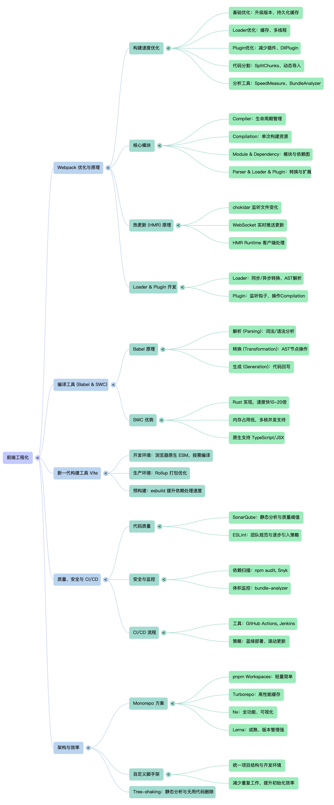

# 前端工程化

## 1、提高 webpack5 构建速度都有哪些方案？

### 一、基础优化

#### 1. 升级到最新版本
```javascript
// package.json
{
  "dependencies": {
    "webpack": "^5.88.0",
    "webpack-cli": "^5.1.4"
  }
}
```

#### 2. 使用持久化缓存
```javascript
// webpack.config.js
module.exports = {
  cache: {
    type: 'filesystem', // 启用文件系统缓存
    buildDependencies: {
      config: [__filename] // 配置文件变化时重建缓存
    },
    cacheDirectory: path.resolve(__dirname, '.webpack_cache')
  }
};
```

#### 3. 缩小构建范围
```javascript
module.exports = {
  module: {
    rules: [
      {
        test: /\.js$/,
        exclude: /node_modules/,
        include: path.resolve(__dirname, 'src')
      }
    ]
  },
  resolve: {
    modules: [path.resolve(__dirname, 'src'), 'node_modules'],
    extensions: ['.js', '.jsx', '.json'],
    alias: {
      '@': path.resolve(__dirname, 'src')
    }
  }
};
```

### 二、Loader 优化

#### 4. 开启 Loader 缓存
```javascript
module.exports = {
  module: {
    rules: [
      {
        test: /\.js$/,
        exclude: /node_modules/,
        use: {
          loader: 'babel-loader',
          options: {
            cacheDirectory: true, // 开启缓存
            cacheCompression: false // 关闭缓存压缩，提高读取速度
          }
        }
      },
      {
        test: /\.css$/,
        use: [
          'style-loader',
          {
            loader: 'css-loader',
            options: {
              cacheDirectory: true // 开启 CSS 缓存
            }
          }
        ]
      }
    ]
  }
};
```

#### 5. 使用 HappyPack 或 thread-loader 多线程
```javascript
// 使用 thread-loader
module.exports = {
  module: {
    rules: [
      {
        test: /\.js$/,
        exclude: /node_modules/,
        use: [
          {
            loader: 'thread-loader',
            options: {
              workers: require('os').cpus().length - 1,
              workerParallelJobs: 2,
              poolTimeout: 2000
            }
          },
          'babel-loader'
        ]
      }
    ]
  }
};
```

### 三、Plugin 优化

#### 6. 减少不必要的 Plugin
```javascript
// 生产环境不需要的 plugin
const isProduction = process.env.NODE_ENV === 'production';

module.exports = {
  plugins: [
    isProduction && new MiniCssExtractPlugin(),
    isProduction && new CompressionPlugin(),
    // 开发环境只使用必要的 plugin
    !isProduction && new HotModuleReplacementPlugin()
  ].filter(Boolean)
};
```

#### 7. 使用 DllPlugin 预编译
```javascript
// webpack.dll.config.js
const path = require('path');
const webpack = require('webpack');

module.exports = {
  entry: {
    vendor: ['react', 'react-dom', 'lodash', 'axios']
  },
  output: {
    path: path.join(__dirname, 'dll'),
    filename: '[name].dll.js',
    library: '[name]_[hash]'
  },
  plugins: [
    new webpack.DllPlugin({
      path: path.join(__dirname, 'dll', '[name]-manifest.json'),
      name: '[name]_[hash]'
    })
  ]
};

// webpack.config.js
const webpack = require('webpack');

module.exports = {
  plugins: [
    new webpack.DllReferencePlugin({
      manifest: require('./dll/vendor-manifest.json')
    })
  ]
};
```

### 四、代码分割优化

#### 8. 合理配置 SplitChunks
```javascript
module.exports = {
  optimization: {
    splitChunks: {
      chunks: 'all',
      minSize: 30000,
      maxSize: 0,
      minChunks: 1,
      maxAsyncRequests: 5,
      maxInitialRequests: 3,
      automaticNameDelimiter: '~',
      cacheGroups: {
        vendors: {
          test: /[\\/]node_modules[\\/]/,
          priority: -10,
          reuseExistingChunk: true
        },
        default: {
          minChunks: 2,
          priority: -20,
          reuseExistingChunk: true
        }
      }
    }
  }
};
```

#### 9. 动态导入（代码分割）
```javascript
// 路由懒加载
const Home = () => import('./pages/Home');
const About = () => import('./pages/About');

// 条件加载
if (condition) {
  import('./heavy-module').then(module => {
    module.init();
  });
}

// 预加载
import(/* webpackPrefetch: true */ './path/to/LoginModal.js');
```

### 五、构建工具优化

#### 10. 使用多进程并行构建
```javascript
const TerserPlugin = require('terser-webpack-plugin');

module.exports = {
  optimization: {
    minimizer: [
      new TerserPlugin({
        parallel: true, // 开启多进程
        terserOptions: {
          compress: {
            drop_console: true // 移除 console
          }
        }
      })
    ]
  }
};
```

#### 11. 使用 Speed Measure Plugin 分析构建速度
```javascript
const SpeedMeasurePlugin = require('speed-measure-webpack-plugin');
const smp = new SpeedMeasurePlugin();

module.exports = smp({
  // webpack 配置
  entry: './src/index.js',
  // ...
});
```

### 六、开发环境优化

#### 12. 开启 HMR
```javascript
module.exports = {
  devServer: {
    hot: true,
    hotOnly: true,
    client: {
      overlay: {
        errors: true,
        warnings: false
      }
    }
  }
};
```

#### 13. 使用 source-map（生产环境慎用）
```javascript
module.exports = {
  devtool: 'eval-cheap-module-source-map', // 开发环境
  // 生产环境
  devtool: false, // 或 'source-map' 如果需要调试
  // devtool: 'hidden-source-map', // 生成 map 但不引用
};
```

### 七、其他优化技巧

#### 14. 使用 externals 减少打包体积
```javascript
module.exports = {
  externals: {
    react: 'React',
    'react-dom': 'ReactDOM',
    lodash: '_',
    axios: 'axios'
  }
};

// 在 HTML 中引入 CDN
<script src="https://cdn.jsdelivr.net/npm/react@18/umd/react.production.min.js"></script>
```

#### 15. 优化 resolve 配置
```javascript
module.exports = {
  resolve: {
    // 减少查找路径
    modules: [path.resolve(__dirname, 'src'), 'node_modules'],
    // 减少后缀尝试
    extensions: ['.js', '.jsx', '.json'],
    // 路径别名
    alias: {
      '@': path.resolve(__dirname, 'src'),
      '@components': path.resolve(__dirname, 'src/components'),
      '@utils': path.resolve(__dirname, 'src/utils')
    },
    // 减少模块解析
    symlinks: false
  }
};
```

#### 16. 使用 IgnorePlugin 忽略某些模块
```javascript
const webpack = require('webpack');

module.exports = {
  plugins: [
    new webpack.IgnorePlugin({
      resourceRegExp: /^\.\/locale$/,
      contextRegExp: /moment$/
    })
  ]
};
```

#### 17. 使用 BundleAnalyzer 分析打包结果
```javascript
const BundleAnalyzerPlugin = require('webpack-bundle-analyzer').BundleAnalyzerPlugin;

module.exports = {
  plugins: [
    new BundleAnalyzerPlugin({
      analyzerMode: 'server',
      analyzerPort: 8888,
      openAnalyzer: false
    })
  ]
};
```

### 八、实际项目配置示例

```javascript
const path = require('path');
const webpack = require('webpack');
const { CleanWebpackPlugin } = require('clean-webpack-plugin');
const MiniCssExtractPlugin = require('mini-css-extract-plugin');
const TerserPlugin = require('terser-webpack-plugin');
const SpeedMeasurePlugin = require('speed-measure-webpack-plugin');

const isProduction = process.env.NODE_ENV === 'production';
const smp = new SpeedMeasurePlugin();

module.exports = smp.wrap({
  mode: isProduction ? 'production' : 'development',
  
  entry: {
    main: './src/index.js'
  },
  
  output: {
    path: path.resolve(__dirname, 'dist'),
    filename: isProduction ? '[name].[contenthash:8].js' : '[name].js',
    chunkFilename: '[name].[contenthash:8].js'
  },
  
  cache: {
    type: 'filesystem',
    buildDependencies: {
      config: [__filename]
    }
  },
  
  module: {
    rules: [
      {
        test: /\.(js|jsx|ts|tsx)$/,
        exclude: /node_modules/,
        use: {
          loader: 'babel-loader',
          options: {
            cacheDirectory: true
          }
        }
      },
      {
        test: /\.css$/,
        use: [
          isProduction ? MiniCssExtractPlugin.loader : 'style-loader',
          'css-loader',
          'postcss-loader'
        ]
      },
      {
        test: /\.(png|jpg|gif|svg)$/,
        type: 'asset',
        parser: {
          dataUrlCondition: {
            maxSize: 8 * 1024 // 8kb 以下转 base64
          }
        }
      }
    ]
  },
  
  optimization: {
    minimize: isProduction,
    minimizer: [
      new TerserPlugin({
        parallel: true,
        terserOptions: {
          compress: {
            drop_console: isProduction
          }
        }
      })
    ],
    splitChunks: {
      chunks: 'all',
      cacheGroups: {
        vendors: {
          test: /[\\/]node_modules[\\/]/,
          name: 'vendors',
          priority: 10
        },
        common: {
          name: 'common',
          minChunks: 2,
          priority: 5,
          reuseExistingChunk: true
        }
      }
    },
    runtimeChunk: {
      name: 'runtime'
    }
  },
  
  plugins: [
    new CleanWebpackPlugin(),
    isProduction && new MiniCssExtractPlugin({
      filename: '[name].[contenthash:8].css'
    }),
    new webpack.ProgressPlugin(),
    new webpack.DefinePlugin({
      'process.env': JSON.stringify(process.env)
    })
  ].filter(Boolean),
  
  resolve: {
    extensions: ['.js', '.jsx', '.ts', '.tsx', '.json'],
    alias: {
      '@': path.resolve(__dirname, 'src')
    }
  },
  
  devtool: isProduction ? false : 'eval-cheap-module-source-map',
  
  devServer: {
    hot: true,
    open: true,
    compress: true,
    port: 3000
  }
});
```

### 总结

提高 webpack5 构建速度的核心策略：
1. **利用缓存**：filesystem cache、loader cache
2. **多线程**：thread-loader、TerserPlugin parallel
3. **减少构建范围**：exclude/include、合理配置 resolve
4. **代码分割**：SplitChunks、动态导入
5. **DllPlugin**：预编译第三方库
6. **分析工具**：SpeedMeasurePlugin、BundleAnalyzer
7. **环境区分**：开发环境和生产环境不同配置

根据项目实际情况选择合适的优化方案，避免过度优化。

## 2、webpack5 源码核心模块有哪几个？分别是什么？

Webpack5 的源码核心模块可以分为以下几个部分：

### 一、核心概念

#### 1. Compiler 模块
```javascript
// Compiler 是 webpack 的主引擎
const { Compiler } = require('webpack');

class MyCompiler extends Compiler {
  constructor(options) {
    super(options);
    // 编译器配置
  }
}

// Compiler 是单例，负责整个构建流程的协调
const compiler = webpack(config);
```

**主要职责：**
- 管理 webpack 的构建生命周期
- 收集配置并初始化
- 触发编译流程
- 管理插件系统
- 输出最终编译结果

#### 2. Compilation 模块
```javascript
// Compilation 代表一次具体的编译过程
compiler.hooks.make.tapAsync('MyPlugin', (compilation, callback) => {
  // 在 compilation 对象上操作
  compilation.hooks.processAssets.tap(
    'MyPlugin',
    (assets) => {
      // 处理资源
    }
  );
  callback();
});
```

**主要职责：**
- 管理一次构建的所有资源
- 负责模块的解析、转换、生成
- 管理依赖关系
- 生成最终输出

#### 3. Module 模块
```javascript
// webpack 支持多种模块类型
const { NormalModule, JsonModule } = require('webpack');

// NormalModule: 普通 JS 模块
// JsonModule: JSON 模块
// AssetModule: 资源模块（图片、字体等）
// DelegatedModule: 外部模块
```

**模块类型：**
- **NormalModule**: 普通模块（JS、CSS等）
- **MultiModule**: 多入口模块
- **JsonModule**: JSON 模块
- **AssetModule**: 资源模块
- **RuntimeModule**: 运行时代码

#### 4. Dependency 模块
```javascript
// 依赖关系管理
const { HarmonyImportDependency } = require('webpack');

class MyDependency extends HarmonyImportDependency {
  constructor(request) {
    super(request);
  }
}
```

**主要职责：**
- 描述模块之间的依赖关系
- 收集 import/require 语句
- 构建依赖图

### 二、构建流程模块

#### 5. Parser 模块
```javascript
const Parser = require('webpack/lib/Parser');

// 解析器负责将源代码转换为 AST
const parser = new Parser({
  // 解析选项
});
```

**主要职责：**
- 将源代码解析为 AST
- 识别各种语法结构（import、require、export）
- 提取依赖关系

#### 6. Loader 模块
```javascript
// Loader 是转换模块的函数
function loader(source, sourceMap, meta) {
  // source: 源代码
  // sourceMap: 源映射
  // meta: 元数据
  
  return result;
}
```

**主要职责：**
- 转换源代码内容
- 支持链式调用
- 提供上下文信息

#### 7. Plugin 模块
```javascript
class MyPlugin {
  apply(compiler) {
    // 监听编译器生命周期
    compiler.hooks.emit.tapAsync('MyPlugin', (compilation, callback) => {
      // 在 emit 阶段执行
      callback();
    });
  }
}
```

**主要职责：**
- 扩展 webpack 功能
- 监听构建生命周期
- 修改构建结果

### 三、优化模块

#### 8. Optimization 模块
```javascript
module.exports = {
  optimization: {
    minimize: true,
    splitChunks: { /* ... */ },
    runtimeChunk: { /* ... */ }
  }
};
```

**主要职责：**
- 代码分割
- 压缩混淆
- Tree Shaking
- 模块合并

#### 9. Stats 模块
```javascript
// 编译统计信息
const stats = compiler.getStats();
const statsJson = stats.toJson({
  assets: true,
  chunks: true,
  modules: true,
  timings: true
});
```

**主要职责：**
- 收集编译统计信息
- 生成构建报告
- 提供性能分析数据

### 四、输出模块

#### 10. Output 模块
```javascript
module.exports = {
  output: {
    path: path.resolve(__dirname, 'dist'),
    filename: '[name].[contenthash:8].js',
    chunkFilename: '[name].[contenthash:8].js'
  }
};
```

**主要职责：**
- 管理输出文件路径
- 控制文件命名
- 生成 source map
- 写入文件系统

### 五、核心模块关系图

```
Compiler (编译器)
  ├── Compilation (编译过程)
  │   ├── Module (模块)
  │   │   ├── Parser (解析器)
  │   │   ├── Loader (加载器)
  │   │   └── Dependency (依赖)
  │   ├── Optimization (优化)
  │   └── Output (输出)
  ├── Plugin (插件系统)
  └── Stats (统计信息)
```

### 六、关键源码文件结构

```
webpack/lib/
├── Compiler.js           # 编译器
├── Compilation.js        # 编译过程
├── Module.js             # 模块基类
├── NormalModule.js       # 普通模块
├── Parser.js             # 解析器
├── dependencies/         # 依赖管理
├── optimize/             # 优化模块
├── DependencyGraph.js    # 依赖图
├── Template.js           # 模板
├── Stats.js              # 统计
└── util/                 # 工具函数
```

## 3、如何保证各个 loader 按照预想方式工作？

### 一、理解 Loader 的执行顺序

#### 1. Loader 的执行规则
```javascript
module.exports = {
  module: {
    rules: [
      {
        test: /\.js$/,
        // Loader 从右向左执行，从下向上执行
        use: [
          'loader3', // 最后执行
          'loader2', // 中间执行
          'loader1'  // 首先执行
        ]
      }
    ]
  }
};
```

#### 2. 使用 enforce 控制顺序
```javascript
module.exports = {
  module: {
    rules: [
      {
        test: /\.js$/,
        use: ['normal-loader']
      },
      {
        test: /\.js$/,
        enforce: 'pre',   // 在所有 loader 之前执行
        use: ['pre-loader']
      },
      {
        test: /\.js$/,
        enforce: 'post',  // 在所有 loader 之后执行
        use: ['post-loader']
      }
    ]
  }
};
```

**执行顺序：**
1. pre-loader
2. normal-loader
3. post-loader

### 二、Loader 分类和职责

#### 3. 前置 Loader (pre)
```javascript
// eslint-loader 应该在其他 loader 之前执行
module.exports = {
  module: {
    rules: [
      {
        test: /\.js$/,
        enforce: 'pre',
        exclude: /node_modules/,
        use: ['eslint-loader']
      }
    ]
  }
};
```

#### 4. 普通 Loader (normal)
```javascript
// babel-loader 等
module.exports = {
  module: {
    rules: [
      {
        test: /\.js$/,
        exclude: /node_modules/,
        use: [
          'babel-loader',
          'ts-loader'
        ]
      }
    ]
  }
};
```

#### 5. 后置 Loader (post)
```javascript
// style-loader 应该在 css-loader 之后执行
module.exports = {
  module: {
    rules: [
      {
        test: /\.css$/,
        use: [
          'style-loader',    // 最后执行：插入到页面
          'css-loader',      // 中间执行：解析 CSS
          'postcss-loader'   // 首先执行：处理 CSS
        ]
      }
    ]
  }
};
```

### 三、使用 oneOf 优化匹配

#### 6. oneOf 规则
```javascript
module.exports = {
  module: {
    rules: [
      {
        test: /\.js$/,
        oneOf: [
          // 只匹配第一个满足条件的规则
          {
            resourceQuery: /raw/,
            type: 'asset/source'
          },
          {
            test: /\.worker\.js$/,
            use: 'worker-loader'
          },
          {
            use: 'babel-loader'
          }
        ]
      }
    ]
  }
};
```

### 四、配置 Loader 选项

#### 7. 精确配置 Loader
```javascript
module.exports = {
  module: {
    rules: [
      {
        test: /\.js$/,
        exclude: /node_modules/,
        use: {
          loader: 'babel-loader',
          options: {
            cacheDirectory: true,
            cacheCompression: false,
            presets: ['@babel/preset-env'],
            plugins: ['@babel/plugin-transform-runtime']
          }
        }
      },
      {
        test: /\.css$/,
        use: [
          {
            loader: 'style-loader',
            options: {
              insert: 'head', // 插入位置
              singleton: true // 只创建一个 style 标签
            }
          },
          {
            loader: 'css-loader',
            options: {
              modules: true, // 启用 CSS Modules
              importLoaders: 1 // 在 CSS loader 之前有几个 loader
            }
          }
        ]
      }
    ]
  }
};
```

### 五、使用条件判断

#### 8. 内联 Loader
```javascript
// 在 import 语句中指定 loader
import 'style-loader!css-loader!./styles.css';
import '!!raw-loader!./data.json';
import '!babel-loader!./script.js';
```

**前缀说明：**
- `!`: 禁用所有 pre 和 normal loader，只使用 inline loader
- `!!`: 禁用所有 loader，只使用 inline loader
- `-!`: 禁用 pre 和 normal loader

#### 9. 条件配置
```javascript
const isProduction = process.env.NODE_ENV === 'production';

module.exports = {
  module: {
    rules: [
      {
        test: /\.js$/,
        use: [
          isProduction ? 'terser-loader' : null
        ].filter(Boolean)
      },
      {
        test: /\.(png|jpg|gif)$/,
        type: 'asset',
        parser: {
          dataUrlCondition: {
            maxSize: isProduction ? 4 * 1024 : 8 * 1024
          }
        }
      }
    ]
  }
};
```

### 六、测试和验证

#### 10. 使用 webpack-merge 合并配置
```javascript
const { merge } = require('webpack-merge');
const baseConfig = require('./webpack.base.js');

const devConfig = {
  module: {
    rules: [
      {
        test: /\.js$/,
        use: 'eslint-loader' // 开发环境启用
      }
    ]
  }
};

module.exports = merge(baseConfig, devConfig);
```

#### 11. 验证 Loader 执行顺序
```javascript
// 创建调试 loader
function debugLoader(source) {
  console.log('debug-loader executing');
  console.log('Source:', source.substring(0, 100));
  return source;
}

module.exports = debugLoader;

// 在配置中添加
module.exports = {
  module: {
    rules: [
      {
        test: /\.js$/,
        use: [
          { loader: path.resolve(__dirname, 'loaders/debug-loader') },
          'babel-loader'
        ]
      }
    ]
  }
};
```

### 七、最佳实践

#### 12. 合理的 Loader 配置示例
```javascript
module.exports = {
  module: {
    rules: [
      // 1. ESLint 最先执行
      {
        test: /\.(js|jsx|ts|tsx)$/,
        enforce: 'pre',
        exclude: /node_modules/,
        use: [
          {
            loader: 'eslint-loader',
            options: {
              cache: true,
              failOnError: false,
              emitWarning: true
            }
          }
        ]
      },
      // 2. TypeScript 编译
      {
        test: /\.ts$/,
        exclude: /node_modules/,
        use: 'ts-loader'
      },
      // 3. Babel 转译
      {
        test: /\.js$/,
        exclude: /node_modules/,
        use: {
          loader: 'babel-loader',
          options: {
            cacheDirectory: true,
            presets: ['@babel/preset-env']
          }
        }
      },
      // 4. CSS 处理
      {
        test: /\.css$/,
        use: [
          'style-loader',
          {
            loader: 'css-loader',
            options: {
              importLoaders: 1
            }
          },
          'postcss-loader'
        ]
      },
      // 5. 图片处理
      {
        test: /\.(png|jpg|gif|svg)$/,
        type: 'asset',
        parser: {
          dataUrlCondition: {
            maxSize: 8 * 1024
          }
        }
      }
    ]
  }
};
```

## 4、是否写过 loader？简单描述一下编写 loader 的思路？

### 一、Loader 基础结构

#### 1. 同步 Loader
```javascript
// loaders/my-loader.js
module.exports = function(source) {
  // source: 文件的源代码
  
  // 1. 处理源代码
  const result = source.replace(/hello/g, 'hi');
  
  // 2. 返回处理后的结果
  return result;
};
```

#### 2. 异步 Loader
```javascript
// loaders/async-loader.js
module.exports = function(source) {
  // 获取回调函数
  const callback = this.async();
  
  // 异步操作
  setTimeout(() => {
    // callback(error, source, sourceMap, meta)
    callback(null, source.replace(/hello/g, 'hi'));
  }, 100);
};
```

### 二、Loader 的完整签名

#### 3. 标准 Loader 模板
```javascript
// loaders/complete-loader.js
module.exports = function(source, sourceMap, meta) {
  // this: loader 上下文
  
  // 1. 验证参数
  if (this.cacheable) {
    this.cacheable(); // 声明可缓存
  }
  
  // 2. 获取配置选项
  const options = this.getOptions();
  
  // 3. 处理源代码
  const result = processSource(source, options);
  
  // 4. 返回结果
  return result;
};

function processSource(source, options) {
  // 处理逻辑
  return source;
}
```

### 三、编写 Loader 的步骤

#### 4. 步骤1: 确定功能需求
```javascript
/**
 * 场景：移除 console.log 的 loader
 * 输入：包含 console.log 的 JS 代码
 * 输出：移除了 console.log 的 JS 代码
 */

// 示例输入
const input = `
  console.log('debug');
  const a = 1;
  console.log(a);
`;

// 示例输出
const output = `
  const a = 1;
`;
```

#### 5. 步骤2: 创建 Loader 文件
```javascript
// loaders/remove-console-loader.js
module.exports = function(source) {
  // 使用正则表达式移除 console.log
  return source.replace(/console\.log\([^)]*\);?/g, '');
};
```

#### 6. 步骤3: 使用 Loader
```javascript
// webpack.config.js
module.exports = {
  module: {
    rules: [
      {
        test: /\.js$/,
        use: [
          {
            loader: path.resolve(__dirname, 'loaders/remove-console-loader.js')
          }
        ]
      }
    ]
  }
};
```

### 四、高级 Loader 编写

#### 7. 使用 AST 解析
```javascript
// loaders/ast-loader.js
const parser = require('@babel/parser');
const traverse = require('@babel/traverse').default;
const generate = require('@babel/generator').default;

module.exports = function(source) {
  // 1. 解析为 AST
  const ast = parser.parse(source, {
    sourceType: 'module'
  });
  
  // 2. 遍历 AST
  traverse(ast, {
    CallExpression(path) {
      // 找到 console.log 调用
      if (path.isExpressionStatement() &&
          path.node.expression.callee.object &&
          path.node.expression.callee.object.name === 'console' &&
          path.node.expression.callee.property.name === 'log') {
        // 移除节点
        path.remove();
      }
    }
  });
  
  // 3. 生成代码
  const output = generate(ast, {}, source);
  
  return output.code;
};
```

#### 8. 带配置选项的 Loader
```javascript
// loaders/configurable-loader.js
const { validate } = require('schema-utils');

// 定义配置 schema
const schema = {
  type: 'object',
  properties: {
    prefix: {
      type: 'string'
    },
    suffix: {
      type: 'string'
    }
  }
};

module.exports = function(source) {
  // 1. 验证配置
  const options = this.getOptions();
  validate(schema, options);
  
  // 2. 使用配置处理
  const result = options.prefix + source + options.suffix;
  
  return result;
};
```

#### 9. 处理 Source Map
```javascript
// loaders/sourcemap-loader.js
module.exports = function(source, sourceMap) {
  this.callback(
    null, // error
    source, // 转换后的代码
    sourceMap, // 传递 source map
    null // meta
  );
};
```

### 五、实战案例

#### 10. 案例1: 国际化 i18n-loader
```javascript
// loaders/i18n-loader.js
const path = require('path');
const fs = require('fs');

module.exports = function(source) {
  const options = this.getOptions();
  const locale = options.locale || 'en';
  const i18nFile = path.resolve(__dirname, `locales/${locale}.json`);
  
  let translations = {};
  if (fs.existsSync(i18nFile)) {
    translations = JSON.parse(fs.readFileSync(i18nFile, 'utf8'));
  }
  
  // 替换 $t('key') 为翻译后的文本
  const result = source.replace(/\$t\(['"]([^'"]+)['"]\)/g, (match, key) => {
    return JSON.stringify(translations[key] || key);
  });
  
  return `module.exports = ${result};`;
};
```

#### 11. 案例2: 组件文档生成 loader
```javascript
// loaders/doc-loader.js
const parser = require('@babel/parser');
const traverse = require('@babel/traverse').default;

module.exports = function(source) {
  const ast = parser.parse(source, {
    sourceType: 'module',
    plugins: ['jsx']
  });
  
  const docs = [];
  
  traverse(ast, {
    FunctionDeclaration(path) {
      // 提取函数注释
      const comments = path.node.leadingComments;
      if (comments) {
        docs.push({
          name: path.node.id.name,
          comment: comments[0].value.trim()
        });
      }
    }
  });
  
  // 生成文档
  this.emitFile('docs.json', JSON.stringify(docs, null, 2));
  
  return source;
};
```

#### 12. 案例3: 图片压缩 loader
```javascript
// loaders/image-compress-loader.js
const sharp = require('sharp');

module.exports = function(source) {
  const callback = this.async();
  const options = this.getOptions();
  
  sharp(this.resourcePath)
    .resize(options.width || null, options.height || null)
    .jpeg({ quality: options.quality || 80 })
    .toBuffer((err, buffer, info) => {
      if (err) {
        return callback(err);
      }
      callback(null, buffer, null, {
        width: info.width,
        height: info.height
      });
    });
};

module.exports.raw = true; // 告诉 webpack 这是一个 raw loader
```

### 六、Loader 最佳实践

#### 13. 命名规范
```javascript
// 好的命名
babel-loader
css-loader
eslint-loader

// 坏的命名
js-loader
file-loader
text-loader
```

#### 14. 错误处理
```javascript
module.exports = function(source) {
  try {
    // 处理逻辑
    const result = processSource(source);
    return result;
  } catch (error) {
    // 抛出错误，webpack 会捕获并显示
    this.emitError(error);
    throw error;
  }
};
```

#### 15. 缓存优化
```javascript
module.exports = function(source) {
  // 声明 loader 是可缓存的
  this.cacheable();
  
  // 处理逻辑
  return source;
};
```

#### 16. 发布到 npm
```javascript
// package.json
{
  "name": "my-custom-loader",
  "version": "1.0.0",
  "main": "index.js",
  "peerDependencies": {
    "webpack": "^5.0.0"
  },
  "keywords": [
    "loader",
    "webpack",
    "webpack-loader"
  ]
}
```

## 5、是否写过 plugin？简单描述一下编写 plugin 的思路？

### 一、Plugin 基础结构

#### 1. 最简单的 Plugin
```javascript
// plugins/my-plugin.js
class MyPlugin {
  apply(compiler) {
    // compiler: webpack 的编译器对象
    
    // 监听事件
    compiler.hooks.done.tap('MyPlugin', (stats) => {
      console.log('构建完成！');
    });
  }
}

module.exports = MyPlugin;
```

#### 2. 使用 Plugin
```javascript
// webpack.config.js
const MyPlugin = require('./plugins/my-plugin');

module.exports = {
  plugins: [
    new MyPlugin()
  ]
};
```

### 二、Plugin 的编写思路

#### 3. 理解生命周期钩子
```javascript
class LifecyclePlugin {
  apply(compiler) {
    // 1. 初始化阶段
    compiler.hooks.environment.tap('LifecyclePlugin', () => {
      console.log('环境已准备好');
    });
    
    compiler.hooks.afterEnvironment.tap('LifecyclePlugin', () => {
      console.log('环境设置完成');
    });
    
    // 2. 编译阶段
    compiler.hooks.compile.tap('LifecyclePlugin', () => {
      console.log('开始编译');
    });
    
    compiler.hooks.make.tapAsync('LifecyclePlugin', (compilation, callback) => {
      console.log('构建模块');
      callback();
    });
    
    // 3. 输出阶段
    compiler.hooks.emit.tapAsync('LifecyclePlugin', (compilation, callback) => {
      console.log('输出资源');
      callback();
    });
    
    // 4. 完成阶段
    compiler.hooks.done.tap('LifecyclePlugin', (stats) => {
      console.log('构建完成');
    });
  }
}

module.exports = LifecyclePlugin;
```

#### 4. Tapable 事件类型
```javascript
// 同步钩子
compiler.hooks.done.tap('Plugin', callback);

// 异步钩子
compiler.hooks.done.tapAsync('Plugin', (stats, callback) => {
  setTimeout(() => {
    callback();
  }, 100);
});

// Promise 钩子
compiler.hooks.done.tapPromise('Plugin', (stats) => {
  return new Promise((resolve) => {
    setTimeout(resolve, 100);
  });
});
```

### 三、实战案例

#### 5. 案例1: 文件生成插件
```javascript
// plugins/file-generator-plugin.js
const fs = require('fs');
const path = require('path');

class FileGeneratorPlugin {
  constructor(options) {
    this.options = options;
  }
  
  apply(compiler) {
    compiler.hooks.emit.tapAsync('FileGeneratorPlugin', (compilation, callback) => {
      const { filename, content } = this.options;
      const filepath = path.join(__dirname, filename);
      
      // 添加到编译输出
      compilation.assets[filename] = {
        source: () => content,
        size: () => content.length
      };
      
      callback();
    });
  }
}

module.exports = FileGeneratorPlugin;

// 使用
const FileGeneratorPlugin = require('./plugins/file-generator-plugin');

module.exports = {
  plugins: [
    new FileGeneratorPlugin({
      filename: 'version.txt',
      content: `Version: ${process.env.npm_package_version}`
    })
  ]
};
```

#### 6. 案例2: 构建统计插件
```javascript
// plugins/build-stats-plugin.js
const fs = require('fs');
const path = require('path');

class BuildStatsPlugin {
  constructor(options) {
    this.options = options || { filename: 'build-stats.json' };
  }
  
  apply(compiler) {
    compiler.hooks.done.tap('BuildStatsPlugin', (stats) => {
      const statsJson = stats.toJson({
        assets: true,
        chunks: true,
        modules: true,
        timings: true
      });
      
      const statsFile = path.join(__dirname, this.options.filename);
      fs.writeFileSync(statsFile, JSON.stringify(statsJson, null, 2));
      
      console.log('构建统计已生成:', statsFile);
    });
  }
}

module.exports = BuildStatsPlugin;
```

#### 7. 案例3: HTML 生成插件（简化版）
```javascript
// plugins/html-generator-plugin.js
class HtmlGeneratorPlugin {
  constructor(options) {
    this.options = options || {};
  }
  
  apply(compiler) {
    compiler.hooks.emit.tapAsync('HtmlGeneratorPlugin', (compilation, callback) => {
      // 获取所有生成的 JS 文件
      const jsFiles = Object.keys(compilation.assets)
        .filter(name => name.endsWith('.js'));
      
      // 生成 HTML
      const html = `
<!DOCTYPE html>
<html>
<head>
  <title>${this.options.title || 'My App'}</title>
</head>
<body>
  <div id="app"></div>
  ${jsFiles.map(file => `<script src="${file}"></script>`).join('\n')}
</body>
</html>
      `.trim();
      
      // 添加 HTML 到输出
      compilation.assets['index.html'] = {
        source: () => html,
        size: () => html.length
      };
      
      callback();
    });
  }
}

module.exports = HtmlGeneratorPlugin;
```

#### 8. 案例4: 压缩输出插件
```javascript
// plugins/compress-plugin.js
const zlib = require('zlib');
const { RawSource } = require('webpack-sources');

class CompressPlugin {
  constructor(options) {
    this.options = options || { algorithm: 'gzip' };
  }
  
  apply(compiler) {
    compiler.hooks.emit.tapAsync('CompressPlugin', (compilation, callback) => {
      Object.keys(compilation.assets).forEach(filename => {
        if (filename.endsWith('.js')) {
          const asset = compilation.assets[filename];
          const source = asset.source();
          
          // 压缩
          zlib.gzip(source, (err, compressed) => {
            if (err) {
              console.error('压缩失败:', err);
              return;
            }
            
            // 添加压缩文件
            compilation.assets[filename + '.gz'] = new RawSource(compressed);
          });
        }
      });
      
      callback();
    });
  }
}

module.exports = CompressPlugin;
```

### 四、Compiler 和 Compilation 的区别

#### 9. Compiler vs Compilation
```javascript
class PluginDemo {
  apply(compiler) {
    // Compiler: 全局单例，代表 webpack 配置
    console.log('Compiler:', compiler.options);
    
    compiler.hooks.make.tapAsync('PluginDemo', (compilation, callback) => {
      // Compilation: 每次编译的实例
      console.log('Compilation:', compilation.name);
      
      // 可以访问所有模块
      compilation.modules.forEach(module => {
        console.log('Module:', module.resource);
      });
      
      callback();
    });
  }
}
```

**区别：**
- **Compiler**: 全局单例，代表整个 webpack 配置，生命周期较长
- **Compilation**: 每次编译创建，代表一次构建过程，生命周期较短

#### 10. 操作 Compilation
```javascript
class ModifyCompilationPlugin {
  apply(compiler) {
    compiler.hooks.make.tapAsync('ModifyCompilation', (compilation, callback) => {
      // 添加模块
      compilation.addModule(/* ... */);
      
      // 修改依赖
      compilation.moduleGraph.getModule(/* ... */);
      
      // 添加资源
      compilation.emitAsset(/* ... */);
      
      callback();
    });
  }
}
```

### 五、高级技巧

#### 11. 监听文件变化
```javascript
class WatchPlugin {
  apply(compiler) {
    compiler.hooks.watchRun.tapAsync('WatchPlugin', (compiler, callback) => {
      console.log('监听到文件变化，重新构建');
      callback();
    });
  }
}
```

#### 12. 自定义错误和警告
```javascript
class ErrorReportingPlugin {
  apply(compiler) {
    compiler.hooks.afterCompile.tap('ErrorReportingPlugin', (compilation) => {
      // 添加错误
      compilation.errors.push(new Error('自定义错误信息'));
      
      // 添加警告
      compilation.warnings.push(new Error('自定义警告信息'));
    });
  }
}
```

#### 13. 修改输出文件名
```javascript
class RenameOutputPlugin {
  apply(compiler) {
    compiler.hooks.emit.tap('RenameOutput', (compilation) => {
      Object.keys(compilation.assets).forEach(filename => {
        // 重命名文件
        if (filename.endsWith('.js')) {
          const newFilename = filename.replace('.js', '.bundle.js');
          compilation.assets[newFilename] = compilation.assets[filename];
          delete compilation.assets[filename];
        }
      });
    });
  }
}
```

### 六、Plugin 最佳实践

#### 14. 命名和文档
```javascript
/**
 * My Awesome Plugin
 * 
 * @param {Object} options - 插件选项
 * @param {string} options.filename - 输出文件名
 * @param {string} options.content - 文件内容
 * 
 * @example
 * new MyPlugin({
 *   filename: 'config.json',
 *   content: JSON.stringify({ key: 'value' })
 * })
 */
class MyPlugin {
  constructor(options) {
    this.options = options;
  }
  
  apply(compiler) {
    // 实现逻辑
  }
}

module.exports = MyPlugin;
```

#### 15. 错误处理
```javascript
class RobustPlugin {
  apply(compiler) {
    compiler.hooks.emit.tapAsync('RobustPlugin', (compilation, callback) => {
      try {
        // 插件逻辑
        this.processCompilation(compilation);
        callback();
      } catch (error) {
        // 添加错误而不是直接抛出
        compilation.errors.push(error);
        callback();
      }
    });
  }
}
```

#### 16. 性能优化
```javascript
class OptimizedPlugin {
  apply(compiler) {
    compiler.hooks.compilation.tap('OptimizedPlugin', (compilation) => {
      // 使用缓存
      const cacheKey = 'optimized-plugin-cache';
      const cached = compilation.getCache(cacheKey);
      
      if (cached) {
        return cached;
      }
      
      // 处理逻辑
      const result = this.process(compilation);
      
      // 缓存结果
      compilation.setCache(cacheKey, result);
      
      return result;
    });
  }
}
```

## 6、请详细描述 Babel 原理？

Babel 是一个 JavaScript 编译器，主要用于将 ECMAScript 2015+ 代码转换为向后兼容的 JavaScript 版本。其工作原理可以分为以下几个核心部分：

### 一、Babel 的三个主要阶段

#### 1. 解析（Parsing）
```javascript
// 源代码
const source = 'const arrow = (x) => x * 2;';

// 解析为 AST
import * as babel from '@babel/parser';

const ast = babel.parse(source, {
  sourceType: 'module', // 指定为模块
  plugins: ['jsx', 'typescript'] // 支持的插件
});

// AST 结构示例
// {
//   type: 'Program',
//   body: [
//     {
//       type: 'VariableDeclaration',
//       declarations: [
//         {
//           type: 'VariableDeclarator',
//           id: { type: 'Identifier', name: 'arrow' },
//           init: {
//             type: 'ArrowFunctionExpression',
//             // ...
//           }
//         }
//       ]
//     }
//   ]
// }
```

**解析步骤：**
1. **词法分析（Lexing）**：将代码转换为 Token 流
   ```javascript
   const arrow = (x) => x * 2;
   // Tokens:
   // const Keyword
   // arrow Identifier
   // = Punctuator
   // ( Punctuator
   // x Identifier
   // ) Punctuator
   // => Punctuator
   // ...
   ```

2. **语法分析（Parsing）**：将 Token 流转换为 AST（抽象语法树）

#### 2. 转换（Transformation）
```javascript
import traverse from '@babel/traverse';

traverse(ast, {
  // 遍历 AST
  ArrowFunctionExpression(path) {
    // 找到箭头函数
    path.node.type = 'FunctionExpression'; // 转换为普通函数
  },
  
  VariableDeclaration(path) {
    if (path.node.kind === 'const') {
      path.node.kind = 'var'; // const 转换为 var
    }
  }
});
```

**转换过程：**
1. 遍历 AST 节点
2. 添加、修改或删除节点
3. 根据插件规则进行转换

#### 3. 生成（Code Generation）
```javascript
import generate from '@babel/generator';

const result = generate(ast, {
  retainLines: true, // 保留行号
  compact: false,    // 不压缩
  comments: true     // 保留注释
}, source);

console.log(result.code);
// 输出: var arrow = function (x) {
//   return x * 2;
// };
```

### 二、Babel 插件系统

#### 4. Babel 插件结构
```javascript
// babel-plugin-my-plugin.js
export default function({ types: t }) {
  return {
    name: 'my-plugin',
    visitor: {
      // 访问器模式
      Identifier(path, state) {
        // 处理标识符
        if (path.node.name === 'foo') {
          path.node.name = 'bar';
        }
      },
      
      FunctionDeclaration(path, state) {
        // 处理函数声明
        const node = path.node;
        // 修改 AST
      }
    }
  };
};
```

#### 5. 插件应用示例
```javascript
// 转换 let/const 为 var
// babel-plugin-transform-var.js
module.exports = function({ types: t }) {
  return {
    visitor: {
      VariableDeclaration(path) {
        if (path.node.kind === 'const' || path.node.kind === 'let') {
          path.node.kind = 'var';
        }
      }
    }
  };
};

// 使用插件
import babel from '@babel/core';

babel.transformSync(source, {
  plugins: ['./babel-plugin-transform-var.js']
});
```

#### 6. 常用插件
```javascript
// @babel/plugin-transform-arrow-functions
// 转换箭头函数为普通函数

// @babel/plugin-transform-template-literals
// 转换模板字符串为字符串拼接

// @babel/plugin-transform-destructuring
// 转换解构赋值

// @babel/plugin-transform-classes
// 转换 class 为构造函数

// @babel/preset-env
// 包含所有需要的插件，根据目标环境自动选择
```

### 三、Babel 配置

#### 7. Babel 配置文件
```javascript
// babel.config.js
module.exports = {
  // 预设
  presets: [
    ['@babel/preset-env', {
      targets: {
        browsers: ['> 0.25%', 'not dead']
      },
      useBuiltIns: 'usage', // 自动引入 polyfill
      corejs: 3
    }],
    '@babel/preset-react',
    '@babel/preset-typescript'
  ],
  
  // 插件
  plugins: [
    '@babel/plugin-transform-runtime',
    '@babel/plugin-proposal-class-properties',
    '@babel/plugin-proposal-optional-chaining'
  ],
  
  // 环境特定配置
  env: {
    development: {
      plugins: ['react-refresh/babel']
    },
    production: {
      plugins: []
    }
  }
};
```

#### 8. Webpack 集成
```javascript
module.exports = {
  module: {
    rules: [
      {
        test: /\.(js|jsx|ts|tsx)$/,
        exclude: /node_modules/,
        use: {
          loader: 'babel-loader',
          options: {
            cacheDirectory: true, // 启用缓存
            presets: ['@babel/preset-env'],
            plugins: [
              '@babel/plugin-transform-runtime'
            ]
          }
        }
      }
    ]
  }
};
```

### 四、Babel AST 操作

#### 9. AST 节点类型
```javascript
import * as t from '@babel/types';

// 创建节点
const identifier = t.identifier('name');
const literal = t.stringLiteral('hello');
const binaryExpression = t.binaryExpression('+', t.identifier('a'), t.numericLiteral(1));

// 创建函数声明
const functionDeclaration = t.functionDeclaration(
  t.identifier('myFunction'),
  [t.identifier('x'), t.identifier('y')],
  t.blockStatement([
    t.returnStatement(
      t.binaryExpression('+', t.identifier('x'), t.identifier('y'))
    )
  ])
);
```

#### 10. Path 操作
```javascript
traverse(ast, {
  // Path 是节点的可操作包装
  BinaryExpression(path) {
    // 获取父节点
    const parent = path.parent;
    
    // 获取兄弟节点
    const siblings = path.getAllNextSiblings();
    
    // 替换节点
    path.replaceWith(t.identifier('newNode'));
    
    // 移除节点
    path.remove();
    
    // 插入节点
    path.insertBefore(t.identifier('before'));
    path.insertAfter(t.identifier('after'));
  }
});
```

#### 11. Scope 作用域
```javascript
traverse(ast, {
  FunctionDeclaration(path) {
    // 获取作用域
    const scope = path.scope;
    
    // 查找变量
    const binding = scope.getBinding('variableName');
    
    // 声明变量
    scope.push({
      id: t.identifier('newVar'),
      init: t.numericLiteral(0)
    });
    
    // 重命名变量
    path.scope.rename('oldName', 'newName');
  }
});
```

### 五、Babel 插件开发实战

#### 12. 实例：移除 console.log
```javascript
// babel-plugin-remove-console.js
export default function({ types: t }) {
  return {
    visitor: {
      CallExpression(path) {
        const callee = path.node.callee;
        
        // 检查是否是 console.log
        if (t.isMemberExpression(callee) &&
            t.isIdentifier(callee.object, { name: 'console' }) &&
            t.isIdentifier(callee.property, { name: 'log' })) {
          path.remove(); // 移除节点
        }
      }
    }
  };
};
```

#### 13. 实例：自动导入 lodash
```javascript
// babel-plugin-auto-import-lodash.js
import * as t from '@babel/types';

export default function() {
  return {
    visitor: {
      CallExpression(path) {
        const { callee, arguments: args } = path.node;
        
        // 检测 _.map 等调用
        if (t.isMemberExpression(callee) &&
            t.isIdentifier(callee.object, { name: '_' }) &&
            t.isIdentifier(callee.property)) {
          
          const methodName = callee.property.name;
          
          // 转换为 import from 'lodash/methodName'
          const importStatement = t.importDeclaration(
            [t.importDefaultSpecifier(t.identifier('_'))],
            t.stringLiteral(`lodash/${methodName}`)
          );
          
          // 添加到文件顶部
          path.parentPath.scope.getProgramParent().unshiftContainer('body', importStatement);
          
          // 转换调用
          path.node.callee = t.identifier('_');
        }
      }
    }
  };
};
```

#### 14. 实例：国际化插值
```javascript
// babel-plugin-i18n.js
const translations = {
  'hello': '你好',
  'world': '世界'
};

export default function() {
  return {
    visitor: {
      StringLiteral(path) {
        const value = path.node.value;
        
        // 检查是否有对应的翻译
        if (translations[value]) {
          path.replaceWith(
            t.callExpression(
              t.memberExpression(
                t.identifier('i18n'),
                t.identifier('t')
              ),
              [t.stringLiteral(value)]
            )
          );
        }
      }
    }
  };
};
```

### 六、Babel 宏（Macros）

#### 15. Babel 宏的使用
```javascript
// 使用 styled-components/macro
import styled from 'styled-components/macro';

const Button = styled.button`
  background: blue;
  color: white;
`;

// 编译时会被处理，避免运行时开销
```

#### 16. 自定义宏
```javascript
// my-macro.js
import { createMacro } from 'babel-plugin-macros';

const myMacro = createMacro(({ references, state, babel }) => {
  const { default: defaultImport = [] } = references;
  
  defaultImport.forEach(referencePath => {
    // 处理调用
    if (referencePath.parentPath.isCallExpression()) {
      // 修改代码
    }
  });
});

export default myMacro;
```

### 七、Babel 性能优化

#### 17. 缓存配置
```javascript
// babel.config.js
module.exports = {
  cacheDirectory: true,
  cacheCompression: false,
  
  // 指定缓存目录
  cacheIdentifier: process.env.NODE_ENV
};
```

#### 18. 减少插件数量
```javascript
// 好的做法：使用 preset-env
module.exports = {
  presets: [
    ['@babel/preset-env', {
      targets: ['last 2 versions'],
      useBuiltIns: 'usage'
    }]
  ]
};

// 不好的做法：手动配置所有插件
module.exports = {
  plugins: [
    '@babel/plugin-transform-arrow-functions',
    '@babel/plugin-transform-template-literals',
    '@babel/plugin-transform-destructuring',
    // ... 更多插件
  ]
};
```

### 八、总结

Babel 的核心工作流程：
1. **解析**：将代码解析为 AST
2. **转换**：通过插件系统遍历和修改 AST
3. **生成**：将修改后的 AST 重新生成代码

Babel 的优势：
- **可扩展性**：通过插件系统支持任意语法转换
- **灵活性**：可以根据目标环境选择性转换
- **工具链支持**：与 Webpack、Rollup 等工具深度集成

## 7、请详细描述前端中编译器 SWC 原理？

SWC (Speedy Web Compiler) 是一个用 Rust 编写的 JavaScript/TypeScript 编译器，旨在提供极快的编译速度。它是 Babel 的替代品，性能提升显著。

### 一、SWC 的核心优势

#### 1. 性能对比
```javascript
// Babel 编译速度
// 大型项目：30-60 秒

// SWC 编译速度
// 同样项目：3-10 秒
// 速度提升：10-20 倍
```

#### 2. 为什么 SWC 更快
```javascript
// 1. Rust 语言特性
// - 无垃圾回收（GC）
// - 内存安全保证
// - 零成本抽象
// - 高效的并发处理

// 2. 编译器优化
// - 更高效的 AST 表示
// - 更快的遍历算法
// - 并行处理能力

// 3. 架构设计
// - 单体设计减少模块间通信开销
// - 更少的中间表示转换
```

### 二、SWC 的架构

#### 3. SWC 的组成
```javascript
// SWC Core
const swc = require('@swc/core');

// 主要模块：
// 1. Parser - 解析器
// 2. Transformer - 转换器
// 3. CodeGenerator - 代码生成器
// 4. Minifier - 压缩器
```

#### 4. SWC 工作流程
```javascript
// 1. 解析阶段
const { parse } = require('@swc/core');

const ast = parse(sourceCode, {
  syntax: 'ecmascript', // 解析语法
  target: 'es2015',     // 目标版本
  isModule: true        // 是否为模块
});

// 2. 转换阶段
const { transformSync } = require('@swc/core');

const output = transformSync(sourceCode, {
  jsc: {
    parser: {
      syntax: 'typescript' // TypeScript 支持
    },
    transform: {
      react: {
        runtime: 'automatic' // JSX 转换
      }
    }
  }
});

// 3. 代码生成
// 内置在 transform 流程中
```

### 三、SWC 的使用

#### 5. 基础使用
```javascript
const swc = require('@swc/core');

// 转换 ES6+ 代码
const result = swc.transformSync(`
  const arrow = (x) => x * 2;
  const [a, b] = [1, 2];
  class Person {
    constructor(name) {
      this.name = name;
    }
  }
`, {
  jsc: {
    target: 'es5'
  }
});

console.log(result.code);
/*
  var arrow = function(x) {
    return x * 2;
  };
  var a = 1, b = 2;
  var Person = function Person(name) {
    this.name = name;
  };
*/
```

#### 6. TypeScript 转换
```javascript
const swc = require('@swc/core');

const result = swc.transformSync(`
  interface User {
    name: string;
    age: number;
  }
  
  const user: User = {
    name: 'John',
    age: 30
  };
`, {
  jsc: {
    parser: {
      syntax: 'typescript',
      tsx: false
    },
    transform: {
      // 类型擦除
    }
  }
});
```

#### 7. JSX 转换
```javascript
const swc = require('@swc/core');

const result = swc.transformSync(`
  const App = () => {
    return (
      <div className="container">
        <h1>Hello World</h1>
      </div>
    );
  };
`, {
  jsc: {
    transform: {
      react: {
        runtime: 'automatic', // 自动引入
        importSource: 'react'
      }
    }
  }
});
```

### 四、SWC 与 Babel 的对比

#### 8. 功能对比
```javascript
// Babel
const babel = require('@babel/core');
babel.transformSync(code, {
  presets: ['@babel/preset-env', '@babel/preset-react', '@babel/preset-typescript'],
  plugins: ['@babel/plugin-transform-runtime']
});

// SWC
const swc = require('@swc/core');
swc.transformSync(code, {
  jsc: {
    parser: {
      syntax: 'typescript',
      tsx: true
    },
    transform: {
      react: {
        runtime: 'automatic'
      }
    },
    target: 'es2015'
  }
});
```

**SWC 的优势：**
- **速度**：快 10-20 倍
- **内存占用**：更少
- **并发处理**：更好的多核支持

**Babel 的优势：**
- **生态**：更成熟，插件更多
- **调试**：更好的错误信息
- **定制化**：更灵活的插件系统

### 五、SWC 在构建工具中的应用

#### 9. Webpack 集成
```javascript
// webpack.config.js
module.exports = {
  module: {
    rules: [
      {
        test: /\.(js|jsx|ts|tsx)$/,
        use: {
          loader: 'swc-loader',
          options: {
            jsc: {
              parser: {
                syntax: 'typescript',
                tsx: true
              },
              transform: {
                react: {
                  runtime: 'automatic'
                }
              },
              target: 'es2015'
            }
          }
        }
      }
    ]
  }
};
```

#### 10. Next.js 使用 SWC
```javascript
// next.config.js
module.exports = {
  swcMinify: true, // 启用 SWC 压缩
  
  experimental: {
    swcPlugins: [
      ['swc-plugin-turbo', {}]
    ]
  }
};

// Next.js 13+ 默认使用 SWC
```

#### 11. Parcel 使用 SWC
```javascript
// .parcelrc
{
  "transformers": {
    "*.tsx": ["@swc/parcel-transformer-typescript"]
  }
};
```

### 六、SWC 插件系统

#### 12. SWC 插件结构
```javascript
// SWC 支持编写插件（基于 WASM）
// my-swc-plugin.wasm

// 在配置中使用
module.exports = {
  jsc: {
    experimental: {
      plugins: [
        [require.resolve('./my-swc-plugin.wasm'), {
          // 插件选项
        }]
      ]
    }
  }
};
```

#### 13. 自定义转换
```javascript
// 使用 SWC 的 Visitor API
const { Visitor } = require('@swc/core/visitor');

class MyVisitor extends Visitor {
  visitIdentifier(node) {
    if (node.value === 'foo') {
      node.value = 'bar';
    }
    return node;
  }
}
```

### 七、SWC 的 AST 操作

#### 14. SWC AST 结构
```javascript
const swc = require('@swc/core');

const result = swc.parseSync('const x = 1;');
console.log(result);
/*
{
  type: "Module",
  body: [
    {
      type: "VariableDeclaration",
      kind: "const",
      declarations: [
        {
          type: "VariableDeclarator",
          id: {
            type: "Identifier",
            value: "x",
            span: { start: 6, end: 7 }
          },
          init: {
            type: "NumericLiteral",
            value: 1,
            span: { start: 10, end: 11 }
          }
        }
      ],
      span: { start: 0, end: 12 }
    }
  ]
}
*/
```

### 八、SWC 性能优化

#### 15. 并行处理
```javascript
const { transformSync } = require('@swc/core');
const { glob } = require('glob');
const path = require('path');
const fs = require('fs');

async function transformAllFiles(pattern) {
  const files = await glob(pattern);
  
  // 并行处理
  const results = await Promise.all(
    files.map(async (file) => {
      const source = fs.readFileSync(file, 'utf8');
      return transformSync(source, {
        jsc: {
          target: 'es2015'
        }
      });
    })
  );
  
  return results;
}

// 使用
transformAllFiles('src/**/*.ts');
```

#### 16. 缓存策略
```javascript
// SWC 内置缓存支持
module.exports = {
  jsc: {
    // 启用缓存
    experimental: {
      cacheRoot: path.resolve(__dirname, '.swc-cache')
    }
  }
};
```

### 九、SWC 的实际应用案例

#### 17. Vite 使用 SWC
```javascript
// vite.config.js
import { defineConfig } from 'vite';

export default defineConfig({
  esbuild: {
    // 替换为 SWC
    // esbuild: false,
  },
  
  plugins: [
    {
      name: 'swc',
      transform(code, id) {
        if (/\.(ts|tsx|js|jsx)$/.test(id)) {
          const swc = require('@swc/core');
          return swc.transformSync(code, {
            jsc: {
              parser: {
                syntax: 'typescript'
              },
              target: 'es2015'
            }
          });
        }
      }
    }
  ]
});
```

#### 18. 自定义构建工具
```javascript
const { transformSync } = require('@swc/core');
const { readFileSync, writeFileSync } = require('fs');
const { globSync } = require('glob');

function build(sourceDir, outputDir) {
  const files = globSync(`${sourceDir}/**/*.{js,ts,jsx,tsx}`);
  
  files.forEach(file => {
    const source = readFileSync(file, 'utf8');
    const result = transformSync(source, {
      jsc: {
        parser: {
          syntax: 'typescript',
          tsx: file.endsWith('.tsx')
        },
        target: 'es2015',
        transform: {
          react: {
            runtime: 'automatic'
          }
        }
      }
    });
    
    const outputPath = file.replace(sourceDir, outputDir).replace(/\.(ts|tsx)$/, '.js');
    writeFileSync(outputPath, result.code);
  });
}

build('src', 'dist');
```

### 十、总结

SWC 的核心优势：
1. **性能**：Rust 实现，速度极快
2. **兼容性**：完全兼容 Babel 的 API
3. **TypeScript 支持**：原生支持，无需额外配置
4. **现代工具链**：Next.js、Vite 等主流工具已集成

SWC 适合的场景：
- 大型项目需要快速构建
- 需要处理大量 TypeScript 文件
- 对构建速度有严格要求

## 8、使用 swc-loader 比使用 babel-loader 的优势多哪些？

### 一、性能优势

#### 1. 编译速度对比
```javascript
// 测试场景：1000 个 TypeScript 文件

// babel-loader
// 构建时间：45-60 秒
// CPU 占用：高

// swc-loader
// 构建时间：3-5 秒
// CPU 占用：较低
// 性能提升：约 10-15 倍
```

#### 2. 基准测试数据
```javascript
// real-world benchmark (2023)
// 项目：Next.js 应用
// 文件数：1500+ TypeScript 文件

// babel-loader
// Full build: 52s
// Incremental build: 15s

// swc-loader
// Full build: 4.2s
// Incremental build: 0.8s
```

### 二、内存效率

#### 3. 内存占用对比
```javascript
// 大型项目内存占用

// babel-loader
// Peak memory: ~2.5 GB
// Node heap size: 1.8 GB

// swc-loader
// Peak memory: ~800 MB
// Node heap size: 400 MB
// 内存节省：约 70%
```

### 三、功能对比

#### 4. Babel vs SWC 功能矩阵
```javascript
// 功能支持对比表

┌─────────────────────────┬─────────┬─────────┐
│ Feature                 │ Babel   │ SWC     │
├─────────────────────────┼─────────┼─────────┤
│ ES2015+ 转换            │ ✓       │ ✓       │
│ TypeScript              │ ✓       │ ✓       │
│ JSX/TSX                 │ ✓       │ ✓       │
│ Flow                    │ ✓       │ ✗       │
│ Plugin 系统             │ ✓       │ 有限    │
│ 自定义插件              │ ✓       │ 有限    │
│ 源映射                  │ ✓       │ ✓       │
│ 压缩                    │ ✓       │ ✓       │
│ 装饰器                  │ ✓       │ ✓       │
│ 私有字段 (#)            │ ✓       │ ✓       │
│ Optional chaining       │ ✓       │ ✓       │
│ Nullish coalescing      │ ✓       │ ✓       │
└─────────────────────────┴─────────┴─────────┘
```

### 四、配置对比

#### 5. Babel Loader 配置
```javascript
module.exports = {
  module: {
    rules: [
      {
        test: /\.(js|jsx|ts|tsx)$/,
        exclude: /node_modules/,
        use: {
          loader: 'babel-loader',
          options: {
            cacheDirectory: true,
            presets: [
              ['@babel/preset-env', {
                targets: {
                  browsers: ['> 0.25%', 'not dead']
                },
                useBuiltIns: 'usage',
                corejs: 3
              }],
              '@babel/preset-react',
              '@babel/preset-typescript'
            ],
            plugins: [
              '@babel/plugin-transform-runtime',
              '@babel/plugin-proposal-class-properties'
            ]
          }
        }
      }
    ]
  }
};
```

#### 6. SWC Loader 配置（更简洁）
```javascript
module.exports = {
  module: {
    rules: [
      {
        test: /\.(js|jsx|ts|tsx)$/,
        exclude: /node_modules/,
        use: {
          loader: 'swc-loader',
          options: {
            jsc: {
              parser: {
                syntax: 'typescript',
                tsx: true
              },
              transform: {
                react: {
                  runtime: 'automatic'
                }
              },
              target: 'es2015',
              loose: false
            }
          }
        }
      }
    ]
  }
};
```

### 五、具体优势详解

#### 7. 优势1：更快的增量构建
```javascript
// 开发场景下的增量构建

// babel-loader
// 首次构建：45s
// 修改一个文件：8-12s

// swc-loader
// 首次构建：4s
// 修改一个文件：0.5-1s
```

#### 8. 优势2：更好的 TypeScript 支持
```javascript
// babel-loader
// 需要额外的 TypeScript 插件
presets: [
  '@babel/preset-typescript'
]

// swc-loader
// 原生支持，无需额外配置
parser: {
  syntax: 'typescript'
}
```

#### 9. 优势3：内置压缩
```javascript
// babel-loader + Terser
// 需要额外的 TerserPlugin
optimization: {
  minimizer: [
    new TerserPlugin()
  ]
}

// swc-loader
// 内置压缩，无需额外配置
minify: true
```

#### 10. 优势4：更好的错误信息
```javascript
// babel-loader 错误
// Error: Transform failed with 2 errors

// swc-loader 错误
// Error: expected ';' but found '}'
//  --> file.ts:10:5
//    |
//  9 |   const x = 1
// 10 | }
//    |   ^
//    |
//    help: add ';'
//     9 |   const x = 1;
```

### 六、实际应用案例

#### 11. Vite 项目迁移
```javascript
// 迁移前 (babel-loader)
import { defineConfig } from 'vite';
import react from '@vitejs/plugin-react';

export default defineConfig({
  plugins: [
    react({
      babel: {
        presets: ['@babel/preset-env', '@babel/preset-react'],
        plugins: ['@babel/plugin-transform-runtime']
      }
    })
  ]
});

// 迁移后 (SWC)
import { defineConfig } from 'vite';
import react from '@vitejs/plugin-react-swc';

export default defineConfig({
  plugins: [react()]
});

// 性能提升：
// - 开发服务器启动时间：50% ↓
// - HMR 速度：60% ↓
```

#### 12. Next.js 项目
```javascript
// Next.js 13+ 默认使用 SWC
// next.config.js
module.exports = {
  swcMinify: true, // 使用 SWC 压缩
  
  experimental: {
    swcPlugins: [] // 添加 SWC 插件
  }
};

// 对比 Babel：
// - 构建速度：10x faster
// - 冷启动：3x faster
```

### 七、兼容性和迁移

#### 13. 迁移策略
```javascript
// 阶段1：并行运行
// 同时使用 babel-loader 和 swc-loader
// 对比结果

// 阶段2：部分迁移
// 使用 swc-loader 处理 TypeScript
// 使用 babel-loader 处理特殊插件

// 阶段3：完全迁移
// 完全使用 swc-loader
```

#### 14. 兼容性检查清单
```javascript
// 检查项目是否可以迁移到 SWC

const migrationChecklist = {
  // 1. TypeScript 版本
  typescript: '4.x 或更高',
  
  // 2. React 版本
  react: '16.8+',
  
  // 3. 使用的 Babel 插件
  // 检查 SWC 是否支持
  
  // 4. 自定义插件
  // 需要重写或找替代方案
  
  // 5. 测试覆盖
  // 确保测试可以正常运行
};
```

### 八、性能测试脚本

#### 15. 对比测试脚本
```javascript
const { benchmark } = require('@swc/core');
const { transformSync } = require('@babel/core');
const { readFileSync } = require('fs');

// 测试代码
const code = readFileSync('./test.ts', 'utf8');

// Babel 测试
console.time('babel');
const babelResult = transformSync(code, {
  presets: ['@babel/preset-env', '@babel/preset-typescript']
});
console.timeEnd('babel');

// SWC 测试
const swc = require('@swc/core');
console.time('swc');
const swcResult = swc.transformSync(code, {
  jsc: {
    parser: {
      syntax: 'typescript'
    },
    target: 'es2015'
  }
});
console.timeEnd('swc');
```

### 九、总结

SWC Loader 相比 Babel Loader 的主要优势：

1. **性能**：快 10-20 倍
2. **内存**：占用减少 70%
3. **配置**：更简洁
4. **TypeScript**：原生支持
5. **压缩**：内置功能
6. **现代化**：持续优化

何时选择 SWC：
- 大型项目需要快速构建
- 使用 TypeScript
- 对性能有严格要求
- 不需要复杂的 Babel 插件

何时继续使用 Babel：
- 依赖特定的 Babel 插件
- 需要高度定制化
- 团队对 Babel 更熟悉
- 项目规模较小，性能差异不明显

## 9、vite 原理是什么？

Vite 是由 Vue.js 作者尤雨溪开发的新一代前端构建工具，它利用浏览器原生 ES 模块能力，提供了极快的开发服务器启动速度和热更新。

### 一、Vite 的核心原理

#### 1. 开发环境 vs 生产环境
```javascript
// 开发环境：利用浏览器原生 ES 模块
// 不需要打包，直接运行

// 生产环境：使用 Rollup 打包
// 预构建、代码分割、优化
```

**开发环境特点：**
- 使用 ES Module（ESM）原生支持
- 按需编译，只编译请求的文件
- 极快的热更新（HMR）
- 无需等待整个项目打包

**生产环境特点：**
- 使用 Rollup 进行打包
- 代码分割和优化
- Tree-shaking
- 压缩混淆

### 二、开发环境原理

#### 2. ES Module 原生支持
```javascript
// 浏览器原生支持 ESM
<script type="module">
  import { createApp } from '/@modules/vue.js';
  import App from '/src/App.js';
  
  createApp(App).mount('#app');
</script>

// Vite 会拦截这些导入，返回编译后的代码
```

#### 3. 请求拦截和转换
```javascript
// Vite 开发服务器会拦截所有请求
// 然后根据文件类型进行转换

// 示例请求流程：
// 1. 浏览器请求：/src/main.js
// 2. Vite 拦截，读取文件内容
// 3. 编译/转换代码
// 4. 返回处理后的代码给浏览器
```

#### 4. 预构建（Pre-bundling）
```javascript
// vite.config.js
export default {
  optimizeDeps: {
    include: ['vue', 'vue-router', 'axios'],
    exclude: ['your-local-package']
  }
};

// Vite 使用 esbuild 预构建依赖
// 1. 扫描源码中的依赖
// 2. 使用 esbuild 将依赖打包成 ESM 格式
// 3. 缓存到 node_modules/.vite
```

**为什么需要预构建：**
- CommonJS 转换为 ESM
- 减少 HTTP 请求（打包多个依赖）
- 性能优化（esbuild 比 webpack 快 10-100 倍）

### 三、Vite 的源码结构

#### 5. 核心模块
```javascript
// Vite 源码主要分为：

// 1. Server 模块（开发服务器）
// - plugins/index.ts - 插件系统
// - server/index.ts - 服务器实现
// - server/pluginContainer.ts - 插件容器

// 2. Build 模块（生产构建）
// - build/index.ts - 构建入口
// - build/plugins.ts - 构建插件
// - build/optimizer.ts - 依赖优化

// 3. Shared 模块（共享功能）
// - shared/constants.ts - 常量
// - shared/utils.ts - 工具函数
// - shared/plugins.ts - 通用插件
```

### 四、HMR 原理

#### 6. 热模块替换（HMR）
```javascript
// Vite 的 HMR 实现
class HMR {
  constructor(server) {
    this.server = server;
    this.clients = new Set();
  }
  
  // 监听文件变化
  handleFileChange(file) {
    // 1. 重新编译文件
    const module = this.compileModule(file);
    
    // 2. 推送更新到客户端
    this.clients.forEach(client => {
      client.send({
        type: 'update',
        updates: [
          {
            type: 'js-update',
            timestamp: Date.now(),
            path: file,
            acceptedPath: file
          }
        ]
      });
    });
  }
}
```

#### 7. 客户端 HMR 处理
```javascript
// 客户端 HMR 运行时
if (import.meta.hot) {
  // 接受 HMR 更新
  import.meta.hot.accept((newModule) => {
    // 更新模块
    updateModule(newModule);
  });
  
  // 处理依赖更新
  import.meta.hot.dispose(() => {
    // 清理副作用
    cleanup();
  });
}
```

### 五、插件系统

#### 8. Vite 插件接口
```javascript
// vite 插件与 Rollup 插件兼容
export default function myPlugin() {
  return {
    name: 'my-plugin',
    
    // 配置钩子
    config(config, { command }) {
      // 修改配置
      return {
        server: {
          port: 3001
        }
      };
    },
    
    // 转换钩子
    transform(code, id) {
      // 转换代码
      if (id.endsWith('.js')) {
        return code.replace(/foo/g, 'bar');
      }
    },
    
    // 解析钩子
    resolveId(source, importer) {
      // 解析模块 ID
      if (source === 'my-virtual-module') {
        return source;
      }
    },
    
    // 加载钩子
    load(id) {
      // 加载模块内容
      if (id === 'my-virtual-module') {
        return 'export const value = 123';
      }
    }
  };
}
```

#### 9. 常用 Vite 插件
```javascript
// vite.config.js
import vue from '@vitejs/plugin-vue';
import react from '@vitejs/plugin-react';
import { createSvgIconsPlugin } from 'vite-plugin-svg-icons';
import Components from 'unplugin-vue-components/vite';

export default {
  plugins: [
    vue(), // Vue 支持
    react(), // React 支持
    createSvgIconsPlugin({}), // SVG 图标
    Components({}) // 组件自动导入
  ]
};
```

### 六、构建流程

#### 10. 生产构建流程
```javascript
// Vite 构建流程
async function build(config) {
  // 1. 初始化 Rollup
  const rollupOptions = config.build.rollupOptions;
  
  // 2. 创建 Rollup 实例
  const bundle = await rollup(rollupOptions);
  
  // 3. 生成输出
  await bundle.write({
    dir: config.build.outDir,
    format: 'es', // ESM 格式
    sourcemap: config.build.sourcemap
  });
  
  // 4. 生成 HTML
  await generateIndexHtml(config);
  
  // 5. 关闭 bundle
  await bundle.close();
}
```

#### 11. 代码分割配置
```javascript
// vite.config.js
export default {
  build: {
    rollupOptions: {
      output: {
        // 手动代码分割
        manualChunks: {
          'vue-vendor': ['vue', 'vue-router'],
          'utils': ['lodash', 'axios']
        },
        
        // chunk 文件命名
        chunkFileNames: 'assets/js/[name]-[hash].js',
        entryFileNames: 'assets/js/[name]-[hash].js',
        assetFileNames: 'assets/[ext]/[name]-[hash].[ext]'
      }
    },
    
    // chunk 大小警告限制
    chunkSizeWarningLimit: 1000
  }
};
```

### 七、性能优化原理

#### 12. esbuild 预构建
```javascript
// Vite 使用 esbuild 进行预构建
// esbuild 是 Go 编写的，速度极快

const { buildSync } = require('esbuild');

// 预构建依赖
buildSync({
  entryPoints: ['vue', 'vue-router'],
  bundle: true,
  format: 'esm',
  outdir: 'node_modules/.vite',
  splitting: true
});

// esbuild 优势：
// - 编译速度极快（比 webpack 快 10-100 倍）
// - 低内存占用
// - 原生 TypeScript/JSX 支持
```

#### 13. 文件系统缓存
```javascript
// Vite 的缓存策略
export default {
  // 启用文件系统缓存
  cacheDir: 'node_modules/.vite',
  
  // 强制重新预构建
  server: {
    force: false
  }
};

// 缓存机制：
// 1. 依赖预构建缓存
// 2. 请求转换缓存
// 3. 文件内容哈希
// 4. 配置变更检测
```

### 八、实际应用示例

#### 14. 创建自定义 Vite 插件
```javascript
// vite-plugin-env.js
import { createFilter } from '@rollup/pluginutils';

export default function envPlugin(options = {}) {
  const filter = createFilter(options.include, options.exclude);
  const envVars = process.env;
  
  return {
    name: 'vite-plugin-env',
    
    config(config) {
      // 注入环境变量
      return {
        define: Object.fromEntries(
          Object.entries(envVars).map(([key, value]) => {
            return [`import.meta.env.${key}`, JSON.stringify(value)];
          })
        )
      };
    },
    
    transform(code, id) {
      if (filter(id)) {
        // 替换 process.env 为 import.meta.env
        return code.replace(
          /process\.env\.(\w+)/g,
          'import.meta.env.$1'
        );
      }
    }
  };
};

// 使用
import envPlugin from './vite-plugin-env';

export default {
  plugins: [envPlugin()]
};
```

#### 15. Vite 多页面配置
```javascript
// vite.config.js
import { defineConfig } from 'vite';
import { resolve } from 'path';

export default defineConfig({
  build: {
    rollupOptions: {
      input: {
        main: resolve(__dirname, 'index.html'),
        about: resolve(__dirname, 'about.html'),
        contact: resolve(__dirname, 'contact.html')
      }
    }
  }
});
```

### 九、Vite vs Webpack

#### 16. 对比总结
```javascript
// Vite
// 开发环境：极快（无打包）
// 生产环境：使用 Rollup
// 配置：简单直观
// 插件：Rollup 插件生态
// 适用：现代浏览器项目

// Webpack
// 开发环境：较慢（需要打包）
// 生产环境：webpack 自带
// 配置：复杂灵活
// 插件：丰富的插件生态
// 适用：需要兼容旧浏览器、复杂项目
```

### 总结

Vite 的核心原理：
1. **开发环境**：利用浏览器原生 ESM，按需编译
2. **生产环境**：使用 Rollup 打包优化
3. **预构建**：esbuild 预构建依赖，提升性能
4. **HMR**：基于 WebSocket 的热更新
5. **插件系统**：兼容 Rollup 插件，扩展性强

## 10、说一下 webpack 的热更新原理。

Webpack 的热更新（Hot Module Replacement，HMR）允许在不刷新浏览器的情况下替换、添加或删除模块，保持应用状态。

### 一、HMR 的工作原理

#### 1. HMR 整体流程
```javascript
// HMR 完整流程

// 1. webpack-dev-server 启动
// 2. 编译并生成 bundle
// 3. 建立 WebSocket 连接
// 4. 监听文件变化
// 5. 文件变化时重新编译
// 6. 通过 WebSocket 发送更新
// 7. 浏览器接收更新
// 8. HMR runtime 处理更新
// 9. 应用模块更新
// 10. 保持应用状态
```

#### 2. 服务端实现
```javascript
// webpack-dev-server 实现
const express = require('express');
const webpack = require('webpack');
const webpackDevMiddleware = require('webpack-dev-middleware');
const webpackHotMiddleware = require('webpack-hot-middleware');

const config = require('./webpack.config.js');
const compiler = webpack(config);

const app = express();

// 1. webpack-dev-middleware
// 负责提供编译后的文件
app.use(webpackDevMiddleware(compiler, {
  publicPath: config.output.publicPath,
  stats: { colors: true }
}));

// 2. webpack-hot-middleware
// 负责 HMR 通信
app.use(webpackHotMiddleware(compiler, {
  heartbeat: 2000, // 心跳间隔
  path: '/__webpack_hmr' // HMR 路径
}));

app.listen(3000);
```

### 二、HMR 的通信机制

#### 3. WebSocket 通信
```javascript
// HMR 使用 WebSocket 进行双向通信
// 客户端 <=> 服务端

// 客户端代码（HMR runtime）
class HMR {
  constructor() {
    this.socket = new WebSocket('ws://localhost:3000/__webpack_hmr');
    this.setupSocketListeners();
  }
  
  setupSocketListeners() {
    this.socket.onmessage = (event) => {
      const message = JSON.parse(event.data);
      
      switch (message.type) {
        case 'hash':
          // 收到新的 hash
          this.currentHash = message.data;
          break;
          
        case 'ok':
          // 确认更新
          this.checkUpdate();
          break;
          
        case 'hot':
          // 收到热更新
          this.handleHotUpdate(message.data);
          break;
      }
    };
  }
  
  handleHotUpdate(manifest) {
    // 处理热更新
    const { c: modules } = manifest;
    
    modules.forEach(moduleId => {
      // 请求更新后的模块
      fetch(`/__webpack_hmr/${moduleId}`)
        .then(response => response.json())
        .then(module => {
          // 应用模块更新
          this.applyUpdate(module);
        });
    });
  }
}
```

#### 4. 消息格式
```javascript
// HMR 消息类型

// 1. hash 消息
{
  type: 'hash',
  data: 'abc123' // 编译 hash
}

// 2. ok 消息
{
  type: 'ok'
}

// 3. hot 消息
{
  type: 'hot',
  data: {
    c: ['./src/app.js', './src/component.js'], // 变化的模块
    r: 0, // 运行时
    m: {} // 模块信息
  }
}
```

### 三、文件监听机制

#### 5. 文件监听实现
```javascript
// webpack 使用 chokidar 监听文件变化
const chokidar = require('chokidar');

class Watcher {
  constructor(compiler) {
    this.compiler = compiler;
    this.watcher = null;
  }
  
  watch() {
    // 创建文件监听器
    this.watcher = chokidar.watch(this.compiler.options.context, {
      ignored: /node_modules/,
      persistent: true,
      ignoreInitial: true
    });
    
    // 监听文件变化
    this.watcher.on('all', (event, path) => {
      console.log(`File ${event}: ${path}`);
      this.handleFileChange(event, path);
    });
  }
  
  handleFileChange(event, path) {
    // 1. 标记需要重新编译
    this.compiler.invalidate(path);
    
    // 2. 触发重新编译
    this.compile();
  }
  
  async compile() {
    // 重新编译
    const stats = await this.compiler.run();
    
    // 发送 HMR 更新
    this.sendHMRUpdate(stats);
  }
}
```

### 四、客户端 HMR Runtime

#### 6. HMR Runtime 实现
```javascript
// 客户端 HMR Runtime（简化版）
class HMR {
  constructor() {
    this.modules = {}; // 模块缓存
    this.queue = []; // 更新队列
    this.check = this.check.bind(this);
  }
  
  // 检查更新
  check() {
    const currentHash = this.currentHash;
    fetch('/__webpack_hmr')
      .then(response => response.json())
      .then(manifest => {
        if (manifest.hash !== currentHash) {
          this.handleUpdate(manifest);
        }
      });
  }
  
  // 处理更新
  async handleUpdate(manifest) {
    const { modules } = manifest;
    
    // 下载更新的模块
    const updates = await Promise.all(
      modules.map(id => this.downloadUpdate(id))
    );
    
    // 应用更新
    this.applyUpdates(updates);
  }
  
  // 下载更新
  async downloadUpdate(moduleId) {
    const response = await fetch(`/__webpack_hmr/${moduleId}`);
    return response.json();
  }
  
  // 应用更新
  applyUpdates(updates) {
    updates.forEach(update => {
      const { id, code } = update;
      
      // 执行新模块代码
      const newModule = this.executeModule(code);
      
      // 检查模块是否接受 HMR
      if (newModule.hot) {
        // 调用模块的 accept 处理函数
        newModule.hot.accept(this.modules[id]);
        
        // 更新模块缓存
        this.modules[id] = newModule;
      }
    });
  }
  
  // 执行模块代码
  executeModule(code) {
    // 使用 Function 构造器执行代码
    const fn = new Function('module', 'exports', 'require', code);
    const module = { exports: {}, hot: null };
    const require = this.createRequire(module);
    
    fn(module, module.exports, require);
    
    return module;
  }
  
  // 创建 require 函数
  createRequire(module) {
    return (id) => {
      return this.modules[id].exports;
    };
  }
}
```

### 五、模块热更新 API

#### 7. module.hot API
```javascript
// module.hot 是 HMR 的核心 API

// 接受模块更新
if (module.hot) {
  // 基本用法
  module.hot.accept();
  
  // 接受特定依赖的更新
  module.hot.accept('./dependency', () => {
    // 当依赖更新时执行
    console.log('Dependency updated');
  });
  
  // 接受自身更新
  module.hot.accept((err) => {
    if (err) {
      console.error('HMR error:', err);
    } else {
      // 自身更新时执行
      console.log('Self updated');
    }
  });
  
  // 拒绝更新
  module.hot.decline();
  
  // 处理更新前的清理
  module.hot.dispose((data) => {
    // 清理副作用
    cleanup();
    
    // 保存状态
    data.state = getCurrentState();
  });
  
  // 恢复状态
  module.hot.addStatusHandler((status) => {
    if (status === 'idle') {
      // 恢复之前保存的状态
      const data = module.hot.data;
      if (data && data.state) {
        restoreState(data.state);
      }
    }
  });
}
```

### 六、React Fast Refresh

#### 8. React Fast Refresh 集成
```javascript
// React Fast Refresh 是针对 React 的 HMR 优化
// 它可以在保持组件状态的同时更新组件

// 配置
const ReactRefreshWebpackPlugin = require('@pmmmwh/react-refresh-webpack-plugin');

module.exports = {
  plugins: [
    new ReactRefreshWebpackPlugin({
      overlay: {
        runtime: true, // 显示错误覆盖层
        include: true
      }
    })
  ],
  
  module: {
    rules: [
      {
        test: /\.jsx?$/,
        exclude: /node_modules/,
        use: {
          loader: 'babel-loader',
          options: {
            plugins: ['react-refresh/babel']
          }
        }
      }
    ]
  }
};

// React 组件使用 HMR
// 自动支持，无需手动配置
// 组件状态会自动保持
```

### 七、Vue HMR

#### 9. Vue HMR 实现
```javascript
// Vue-loader 会自动处理 HMR
// 组件会自动接受更新

// vue.config.js
module.exports = {
  chainWebpack: (config) => {
    // 热更新
    config.plugin('hmr').use(require('webpack/lib/HotModuleReplacementPlugin'));
  }
};

// Vue 组件使用 HMR
// 自动支持
// 组件状态和 DOM 状态会保持
```

### 八、HMR 优化

#### 10. 减少不必要的重新编译
```javascript
module.exports = {
  // 减少监听文件数量
  watchOptions: {
    ignored: /node_modules/,
    aggregateTimeout: 300, // 延迟重新编译
    poll: 1000 // 轮询间隔
  },
  
  // 缓存
  cache: {
    type: 'filesystem',
    cacheDirectory: path.resolve(__dirname, '.webpack_cache')
  }
};
```

### 九、HMR 调试

#### 11. HMR 日志和错误处理
```javascript
// 启用详细日志
const webpack = require('webpack');

module.exports = {
  plugins: [
    new webpack.HotModuleReplacementPlugin({
      // 显示详细日志
      multiStep: false
    })
  ],
  
  devServer: {
    hot: true,
    client: {
      logging: 'info', // 日志级别
      overlay: {
        errors: true,
        warnings: false
      }
    }
  }
};

// 处理 HMR 错误
if (module.hot) {
  module.hot.dispose(() => {
    // 清理
    cleanup();
  });
  
  module.hot.accept((error) => {
    if (error) {
      console.error('HMR failed:', error);
      // 可以选择刷新页面
      window.location.reload();
    }
  });
}
```

### 总结

Webpack HMR 的核心原理：
1. **文件监听**：chokidar 监听文件变化
2. **重新编译**：只编译变化的模块
3. **WebSocket 通信**：实时推送更新到客户端
4. **HMR Runtime**：客户端处理更新逻辑
5. **状态保持**：通过 module.hot API 保持应用状态

HMR 的优势：
- 提升开发体验
- 保持应用状态
- 减少页面刷新
- 提高开发效率

## 11、如何对 bundle 体积进行监控和分析？

### 一、Bundle 分析工具

#### 1. webpack-bundle-analyzer
```javascript
// 安装
npm install --save-dev webpack-bundle-analyzer

// webpack.config.js
const BundleAnalyzerPlugin = require('webpack-bundle-analyzer').BundleAnalyzerPlugin;

module.exports = {
  plugins: [
    new BundleAnalyzerPlugin({
      analyzerMode: 'server', // 'server', 'static', 'disabled'
      analyzerPort: 8888,
      openAnalyzer: false, // 是否自动打开浏览器
      generateStatsFile: true, // 生成 stats.json
      statsFilename: 'stats.json',
      statsOptions: {
        source: false
      },
      defaultSizes: 'parsed', // 'stat', 'parsed', 'gzip'
      logLevel: 'info'
    })
  ]
};
```

#### 2. 使用分析
```javascript
// 运行构建后，会自动打开分析页面
npm run build

// 或使用命令行
npx webpack --profile --json > stats.json
webpack-bundle-analyzer stats.json

// 可视化界面会显示：
// - 每个 bundle 的大小
// - 模块之间的依赖关系
// - 重复代码
// - 可优化的空间
```

### 二、Stats 分析

#### 3. 生成和分析 Stats
```javascript
// webpack.config.js
module.exports = {
  stats: {
    colors: true,
    modules: true,
    chunks: true,
    chunkModules: true,
    children: false,
    warnings: true,
    errors: true,
    timings: true,
    assets: true,
    entrypoints: true,
    performance: true,
    providedExports: true,
    usedExports: true,
    exports: true
  }
};

// 获取 stats 对象
const compiler = webpack(config);
compiler.run((err, stats) => {
  const statsJson = stats.toJson({
    assets: true,
    chunks: true,
    modules: true,
    timings: true,
    entrypoints: true
  });
  
  console.log('Total size:', statsJson.assets.reduce((sum, asset) => {
    return sum + asset.size;
  }, 0));
});
```

#### 4. 分析脚本
```javascript
// scripts/analyze-bundle.js
const fs = require('fs');
const path = require('path');

const statsPath = path.join(__dirname, '../stats.json');
const stats = JSON.parse(fs.readFileSync(statsPath, 'utf8'));

// 分析资产
console.log('=== Assets ===');
stats.assets.forEach(asset => {
  const sizeKB = (asset.size / 1024).toFixed(2);
  console.log(`${asset.name}: ${sizeKB} KB`);
});

// 分析 chunks
console.log('\n=== Chunks ===');
stats.chunks.forEach(chunk => {
  const sizeKB = (chunk.size / 1024).toFixed(2);
  console.log(`Chunk ${chunk.id}: ${sizeKB} KB`);
  console.log(`  Modules: ${chunk.modules.length}`);
});

// 找出最大的模块
console.log('\n=== Largest Modules ===');
const allModules = stats.chunks.flatMap(chunk => chunk.modules);
allModules
  .sort((a, b) => b.size - a.size)
  .slice(0, 10)
  .forEach(module => {
    const sizeKB = (module.size / 1024).toFixed(2);
    console.log(`${module.name}: ${sizeKB} KB`);
  });
```

### 三、CI/CD 集成

#### 5. GitHub Actions 集成
```yaml
# .github/workflows/bundle-analysis.yml
name: Bundle Analysis

on:
  pull_request:
    branches: [main]

jobs:
  analyze:
    runs-on: ubuntu-latest
    steps:
      - uses: actions/checkout@v2
      
      - name: Setup Node.js
        uses: actions/setup-node@v2
        with:
          node-version: '16'
      
      - name: Install dependencies
        run: npm ci
      
      - name: Build
        run: npm run build
      
      - name: Bundle Analysis
        uses: andresz1/size-limit-action@v1
        with:
          github_token: ${{ secrets.GITHUB_TOKEN }}
```

#### 6. 自定义 CI 脚本
```javascript
// scripts/check-bundle-size.js
const fs = require('fs');
const path = require('path');

const statsPath = path.join(__dirname, '../dist/stats.json');
const stats = JSON.parse(fs.readFileSync(statsPath, 'utf8'));

const BUNDLE_LIMITS = {
  'main.js': 500 * 1024, // 500KB
  'vendor.js': 1000 * 1024, // 1MB
  total: 1500 * 1024 // 1.5MB
};

let hasIssues = false;

// 检查单个文件大小
stats.assets.forEach(asset => {
  if (BUNDLE_LIMITS[asset.name] && asset.size > BUNDLE_LIMITS[asset.name]) {
    console.error(`❌ ${asset.name} exceeds limit: ${(asset.size / 1024).toFixed(2)} KB`);
    hasIssues = true;
  }
});

// 检查总大小
const totalSize = stats.assets.reduce((sum, asset) => sum + asset.size, 0);
if (totalSize > BUNDLE_LIMITS.total) {
  console.error(`❌ Total bundle size exceeds limit: ${(totalSize / 1024).toFixed(2)} KB`);
  hasIssues = true;
}

if (hasIssues) {
  process.exit(1);
}

console.log('✅ All bundle sizes are within limits');
```

### 四、性能监控

#### 7. 监控 Lighthouse 性能
```javascript
// scripts/lighthouse.js
const lighthouse = require('lighthouse');
const chromeLauncher = require('chrome-launcher');

async function runLighthouse(url) {
  const chrome = await chromeLauncher.launch({ chromeFlags: ['--headless'] });
  
  const options = {
    logLevel: 'info',
    output: 'json',
    onlyCategories: ['performance'],
    port: chrome.port
  };
  
  const runnerResult = await lighthouse(url, options);
  
  await chrome.kill();
  
  const { score } = runnerResult.lhr.categories.performance;
  console.log(`Performance Score: ${Math.round(score * 100)}`);
  
  return runnerResult.lhr;
}

runLighthouse('http://localhost:3000');
```

#### 8. 监控 Web Vitals
```javascript
// src/utils/monitor.js
import { getCLS, getFID, getLCP, getTTFB } from 'web-vitals';

function sendToAnalytics(metric) {
  // 发送到监控平台
  fetch('/api/analytics', {
    method: 'POST',
    body: JSON.stringify({
      metric: metric.name,
      value: metric.value,
      rating: metric.rating,
      id: metric.id
    }),
    keepalive: true
  });
}

// 监控 Core Web Vitals
getCLS(sendToAnalytics);
getFID(sendToAnalytics);
getLCP(sendToAnalytics);
getTTFB(sendToAnalytics);
```

### 五、Source Map 分析

#### 9. 生成和分析 Source Map
```javascript
// webpack.config.js
module.exports = {
  devtool: 'source-map', // 生产环境生成 source map
  
  output: {
    path: path.resolve(__dirname, 'dist'),
    filename: '[name].[contenthash:8].js',
    sourceMapFilename: '[name].[contenthash:8].js.map'
  }
};

// 分析 source map
const { SourceMapConsumer } = require('source-map');

async function analyzeSourceMap() {
  const sourceMapData = JSON.parse(
    fs.readFileSync('dist/main.js.map', 'utf8')
  );
  
  const consumer = await new SourceMapConsumer(sourceMapData);
  
  // 统计原始文件数量
  const sources = new Set();
  consumer.eachMapping(mapping => {
    if (mapping.source) {
      sources.add(mapping.source);
    }
  });
  
  console.log(`Source files: ${sources.size}`);
  console.log(`Sources:`, Array.from(sources));
  
  consumer.destroy();
}
```

### 六、持续优化

#### 10. 优化建议脚本
```javascript
// scripts/optimize-suggestions.js
const stats = JSON.parse(fs.readFileSync('stats.json', 'utf8'));

const suggestions = [];

// 1. 检查重复的依赖
const moduleCount = {};
stats.chunks.forEach(chunk => {
  chunk.modules.forEach(module => {
    const name = module.name;
    moduleCount[name] = (moduleCount[name] || 0) + 1;
  });
});

Object.entries(moduleCount)
  .filter(([name, count]) => count > 1)
  .forEach(([name, count]) => {
    suggestions.push({
      type: 'duplicate',
      message: `Module ${name} appears in ${count} chunks`,
      solution: 'Consider using SplitChunks to extract common dependencies'
    });
  });

// 2. 检查过大的模块
stats.chunks.forEach(chunk => {
  chunk.modules.forEach(module => {
    if (module.size > 100 * 1024) {
      suggestions.push({
        type: 'large',
        message: `Module ${module.name} is ${(module.size / 1024).toFixed(2)} KB`,
        solution: 'Consider code splitting or lazy loading'
      });
    }
  });
});

// 3. 输出建议
console.log('Optimization Suggestions:');
suggestions.forEach((suggestion, index) => {
  console.log(`\n${index + 1}. [${suggestion.type.toUpperCase()}] ${suggestion.message}`);
  console.log(`   Solution: ${suggestion.solution}`);
});
```

### 总结

Bundle 体积监控和分析的关键点：
1. **使用工具**：webpack-bundle-analyzer、stats
2. **CI/CD 集成**：自动化监控
3. **性能指标**：Web Vitals、Lighthouse
4. **持续优化**：定期分析和改进
5. **设置阈值**：限制 bundle 大小

## 12、你的项目工程化 Sonar 是如何配置的？

SonarQube 是一个代码质量管理平台，可以分析代码质量、覆盖率、复杂度等指标。

### 一、SonarQube 安装和配置

#### 1. 安装 SonarQube
```bash
# 使用 Docker 安装
docker run -d --name sonarqube \
  -p 9000:9000 \
  -p 9092:9092 \
  -e SONAR_JDBC_URL="jdbc:postgresql://db:5432/sonar" \
  -e SONAR_JDBC_USERNAME=sonar \
  -e SONAR_JDBC_PASSWORD=sonar \
  sonarqube:latest

# 访问 http://localhost:9000
# 默认账号：admin/admin
```

#### 2. 安装 SonarScanner
```bash
# 全局安装
npm install -g sonar-scanner

# 或项目级别安装
npm install --save-dev sonar-scanner
```

### 二、项目配置

#### 3. sonar-project.properties
```properties
# sonar-project.properties

# 项目标识
sonar.projectKey=my-project
sonar.projectName=My Project
sonar.projectVersion=1.0.0

# 源代码位置
sonar.sources=src
sonar.tests=tests
sonar.inclusions=**/*.js,**/*.jsx,**/*.ts,**/*.tsx
sonar.exclusions=**/*.spec.js,**/*.test.js,**/dist/**,**/node_modules/**

# 语言设置
sonar.javascript.libraries=lib

# 代码覆盖率
sonar.javascript.lcov.reportPaths=coverage/lcov.info

# 编码
sonar.sourceEncoding=UTF-8

# 排除的文件
sonar.coverage.exclusions=**/*.spec.js,**/*.test.js,**/tests/**,**/dist/**

# 复杂度阈值
sonar.javascript.functions.complexity.threshold=15
sonar.javascript.complexity.threshold=20

# 重复代码
sonar.cpd.javascript.minimumTokens=50
```

#### 4. package.json 脚本
```json
{
  "scripts": {
    "sonar": "sonar-scanner",
    "sonar:clean": "sonar-scanner -X",
    "analyze": "npm run test:coverage && npm run sonar"
  }
}
```

### 三、Vue 项目配置

#### 13、已一个 Vue 项目为例，说一下 Sonar 的具体配置。

```javascript
// vue.config.js
module.exports = {
  chainWebpack: (config) => {
    // 配置 Jest 进行测试
    config.module
      .rule('js')
      .test(/\.js$/)
      .exclude.add(/node_modules/)
      .end()
      .use('istanbul-instrumenter-loader')
      .loader('istanbul-instrumenter-loader')
      .options({
        esModules: true
      })
      .before('babel-loader');
  },
  
  // 配置 Jest
  jest: {
    collectCoverage: true,
    collectCoverageFrom: [
      'src/**/*.{js,vue}',
      '!src/main.js',
      '!src/router/index.js',
      '!**/node_modules/**'
    ],
    coverageReporters: ['html', 'lcov', 'text-summary'],
    coverageDirectory: '<rootDir>/coverage'
  }
};

// package.json
{
  "scripts": {
    "test:unit": "vue-cli-service test:unit --coverage",
    "test:unit:watch": "vue-cli-service test:unit --watch --coverage",
    "sonar:scan": "sonar-scanner"
  }
}

// sonar-project.properties
sonar.projectKey=vue-project
sonar.projectName=Vue Project
sonar.projectVersion=1.0.0

# Vue 特定配置
sonar.sources=src
sonar.tests=tests,tests/unit
sonar.inclusions=**/*.js,**/*.vue
sonar.exclusions=**/node_modules/**,**/dist/**,**/coverage/**

# 代码覆盖率
sonar.javascript.lcov.reportPaths=coverage/lcov.info

# Vue 单文件组件支持
sonar.vue.file.suffixes=.vue
sonar.javascript.file.suffixes=.js,.vue

# 质量配置
sonar.qualitygate.wait=true
```

### 四、CI/CD 集成

#### 14. GitHub Actions 集成
```yaml
# .github/workflows/sonarqube.yml
name: SonarQube Scan

on:
  push:
    branches: [main, develop]
  pull_request:
    types: [opened, synchronize, reopened]

jobs:
  sonarqube:
    name: SonarQube Scan
    runs-on: ubuntu-latest
    
    steps:
      - uses: actions/checkout@v2
        with:
          fetch-depth: 0
      
      - name: Setup Node.js
        uses: actions/setup-node@v2
        with:
          node-version: '16'
      
      - name: Install dependencies
        run: npm ci
      
      - name: Run tests with coverage
        run: npm run test:coverage
      
      - name: SonarQube Scan
        uses: sonarsource/sonarqube-scan-action@master
        env:
          SONAR_TOKEN: ${{ secrets.SONAR_TOKEN }}
          SONAR_HOST_URL: ${{ secrets.SONAR_HOST_URL }}
```

#### 15. Jenkins 集成
```groovy
// Jenkinsfile
pipeline {
  agent any
  
  stages {
    stage('Install') {
      steps {
        sh 'npm install'
      }
    }
    
    stage('Test') {
      steps {
        sh 'npm run test:coverage'
      }
    }
    
    stage('SonarQube Analysis') {
      steps {
        script {
          def scannerHome = tool 'SonarQubeScanner'
          withSonarQubeEnv('My SonarQube') {
            sh "${scannerHome}/bin/sonar-scanner"
          }
        }
      }
    }
  }
  
  post {
    always {
      script {
        def qg = waitForQualityGate()
        if (qg.status != 'OK') {
          error "Pipeline aborted due to quality gate failure: ${qg.status}"
        }
      }
    }
  }
}
```

### 五、SonarQube 规则配置

#### 16. 自定义质量配置文件
```xml
<!-- sonar-quality-profile.xml -->
<profile>
  <name>My JavaScript Profile</name>
  <language>js</language>
  <rules>
    <rule>
      <repositoryKey>javascript</repositoryKey>
      <key>S1442</key>
      <severity>MAJOR</severity>
      <parameters>
        <parameter key="max">120</parameter>
      </parameters>
    </rule>
    <rule>
      <repositoryKey>javascript</repositoryKey>
      <key>S1066</key>
      <severity>MINOR</severity>
    </rule>
  </rules>
</profile>
```

#### 17. 质量阈值配置
```javascript
// 通过 SonarQube UI 配置
// 或通过 API

// 代码覆盖率阈值
{
  "coverage": {
    "on_new_code": "80"
  }
}

// 新代码覆盖率
{
  "new_coverage": "80"
}

// 代码异味
{
  "code_smell": "10"
}

// 安全热点
{
  "security_hotspot": "0"
}
```

### 六、高级配置

#### 18. 多模块项目配置
```properties
# monorepo/sonar-project.properties
sonar.projectKey=monorepo-project
sonar.modules=module1,module2,module3

# 模块1
module1.sonar.projectName=Module 1
module1.sonar.sources=module1/src
module1.sonar.tests=module1/tests

# 模块2
module2.sonar.projectName=Module 2
module2.sonar.sources=module2/src
module2.sonar.tests=module2/tests

# 模块3
module3.sonar.projectName=Module 3
module3.sonar.sources=module3/src
module3.sonar.tests=module3/tests
```

#### 19. 排除第三方代码
```properties
# sonar-project.properties
sonar.exclusions=**/node_modules/**,**/dist/**,**/build/**

# 排除特定文件
sonar.exclusions=**/*.config.js,**/*.spec.js,**/*.test.js

# 只分析特定目录
sonar.inclusions=src/**,components/**

# 覆盖率排除
sonar.coverage.exclusions=**/*.spec.js,**/*.test.js,**/tests/**
```

### 七、SonarQube API 使用

#### 20. 获取项目指标
```javascript
// scripts/get-sonar-metrics.js
const axios = require('axios');

const SONAR_HOST = 'http://localhost:9000';
const SONAR_TOKEN = 'your-token';

async function getProjectMetrics(projectKey) {
  const response = await axios.get(
    `${SONAR_HOST}/api/measures/component`,
    {
      params: {
        component: projectKey,
        metricKeys: 'coverage,complexity,ncloc,duplicated_lines_density'
      },
      auth: {
        username: SONAR_TOKEN,
        password: ''
      }
    }
  );
  
  return response.data.component.measures;
}

getProjectMetrics('my-project').then(measures => {
  measures.forEach(measure => {
    console.log(`${measure.metric}: ${measure.value}`);
  });
});
```

#### 21. 获取问题列表
```javascript
async function getIssues(projectKey) {
  const response = await axios.get(
    `${SONAR_HOST}/api/issues/search`,
    {
      params: {
        componentKeys: projectKey,
        severities: 'CRITICAL,MAJOR,MINOR',
        resolved: 'false'
      },
      auth: {
        username: SONAR_TOKEN,
        password: ''
      }
    }
  );
  
  return response.data.issues;
}

getIssues('my-project').then(issues => {
  issues.forEach(issue => {
    console.log(`${issue.severity}: ${issue.message}`);
    console.log(`  File: ${issue.component}`);
    console.log(`  Line: ${issue.line}`);
  });
});
```

### 总结

SonarQube 配置的关键点：
1. **基础配置**：sonar-project.properties
2. **覆盖率**：配置 LCOV 报告路径
3. **CI/CD**：集成到 GitHub Actions、Jenkins
4. **质量阈值**：设置代码质量标准
5. **API**：自动化获取指标和问题

## 14、你的项目 CI CD 使用是什么？

### 一、CI/CD 工具选择

#### 1. GitHub Actions
```yaml
# .github/workflows/ci-cd.yml
name: CI/CD Pipeline

on:
  push:
    branches: [main, develop]
  pull_request:
    branches: [main]

jobs:
  # 测试和构建
  test:
    runs-on: ubuntu-latest
    
    strategy:
      matrix:
        node-version: [14.x, 16.x, 18.x]
    
    steps:
      - name: Checkout code
        uses: actions/checkout@v3
      
      - name: Setup Node.js ${{ matrix.node-version }}
        uses: actions/setup-node@v3
        with:
          node-version: ${{ matrix.node-version }}
          cache: 'npm'
      
      - name: Install dependencies
        run: npm ci
      
      - name: Run linter
        run: npm run lint
      
      - name: Run type check
        run: npm run type-check
      
      - name: Run tests
        run: npm run test:coverage
      
      - name: Upload coverage reports
        uses: codecov/codecov-action@v3
        with:
          files: ./coverage/lcov.info
          flags: unittests
          name: codecov-umbrella
      
      - name: Build
        run: npm run build
  
  # 代码质量分析
  sonarqube:
    needs: test
    runs-on: ubuntu-latest
    if: github.event_name == 'push'
    
    steps:
      - uses: actions/checkout@v3
        with:
          fetch-depth: 0
      
      - name: SonarQube Scan
        uses: sonarsource/sonarqube-scan-action@master
        env:
          SONAR_TOKEN: ${{ secrets.SONAR_TOKEN }}
          SONAR_HOST_URL: ${{ secrets.SONAR_HOST_URL }}
  
  # 部署到测试环境
  deploy-staging:
    needs: [test, sonarqube]
    runs-on: ubuntu-latest
    if: github.ref == 'refs/heads/develop'
    
    steps:
      - uses: actions/checkout@v3
      
      - name: Build Docker image
        run: |
          docker build -t myapp:staging .
          docker tag myapp:staging registry.example.com/myapp:staging
      
      - name: Login to Docker Registry
        uses: docker/login-action@v2
        with:
          registry: registry.example.com
          username: ${{ secrets.DOCKER_USERNAME }}
          password: ${{ secrets.DOCKER_PASSWORD }}
      
      - name: Push Docker image
        run: docker push registry.example.com/myapp:staging
      
      - name: Deploy to staging
        uses: appleboy/ssh-action@master
        with:
          host: ${{ secrets.STAGING_HOST }}
          username: ${{ secrets.STAGING_USER }}
          key: ${{ secrets.STAGING_SSH_KEY }}
          script: |
            docker pull registry.example.com/myapp:staging
            docker stop myapp-staging || true
            docker rm myapp-staging || true
            docker run -d --name myapp-staging -p 3000:3000 \
              -e NODE_ENV=staging \
              registry.example.com/myapp:staging
  
  # 部署到生产环境
  deploy-production:
    needs: [test, sonarqube]
    runs-on: ubuntu-latest
    if: github.ref == 'refs/heads/main'
    
    steps:
      - uses: actions/checkout@v3
      
      - name: Build Docker image
        run: |
          docker build -t myapp:production .
          docker tag myapp:production registry.example.com/myapp:production
      
      - name: Login to Docker Registry
        uses: docker/login-action@v2
        with:
          registry: registry.example.com
          username: ${{ secrets.DOCKER_USERNAME }}
          password: ${{ secrets.DOCKER_PASSWORD }}
      
      - name: Push Docker image
        run: docker push registry.example.com/myapp:production
      
      - name: Deploy to production
        uses: appleboy/ssh-action@master
        with:
          host: ${{ secrets.PRODUCTION_HOST }}
          username: ${{ secrets.PRODUCTION_USER }}
          key: ${{ secrets.PRODUCTION_SSH_KEY }}
          script: |
            docker pull registry.example.com/myapp:production
            docker stop myapp-production || true
            docker rm myapp-production || true
            docker run -d --name myapp-production -p 3000:3000 \
              -e NODE_ENV=production \
              registry.example.com/myapp:production
```

#### 2. Jenkins Pipeline
```groovy
// Jenkinsfile
pipeline {
  agent any
  
  environment {
    NODE_VERSION = '16'
    DOCKER_REGISTRY = 'registry.example.com'
  }
  
  stages {
    stage('Checkout') {
      steps {
        checkout scm
      }
    }
    
    stage('Install') {
      steps {
        sh """
          nvm use ${NODE_VERSION}
          npm ci
        """
      }
    }
    
    stage('Lint') {
      steps {
        sh """
          nvm use ${NODE_VERSION}
          npm run lint
        """
      }
    }
    
    stage('Test') {
      steps {
        sh """
          nvm use ${NODE_VERSION}
          npm run test:coverage
        """
      }
      post {
        always {
          publishHTML(target: [
            reportDir: 'coverage',
            reportFiles: 'index.html',
            reportName: 'Coverage Report',
            keepAll: true
          ])
        }
      }
    }
    
    stage('Build') {
      steps {
        sh """
          nvm use ${NODE_VERSION}
          npm run build
        """
      }
    }
    
    stage('SonarQube Scan') {
      steps {
        script {
          def scannerHome = tool 'SonarQubeScanner'
          withSonarQubeEnv('My SonarQube') {
            sh "${scannerHome}/bin/sonar-scanner"
          }
        }
      }
    }
    
    stage('Quality Gate') {
      steps {
        script {
          timeout(time: 1, unit: 'HOURS') {
            def qg = waitForQualityGate()
            if (qg.status != 'OK') {
              error "Pipeline aborted due to quality gate failure: ${qg.status}"
            }
          }
        }
      }
    }
    
    stage('Build Docker Image') {
      steps {
        sh """
          docker build -t ${DOCKER_REGISTRY}/myapp:${env.BUILD_NUMBER} .
          docker tag ${DOCKER_REGISTRY}/myapp:${env.BUILD_NUMBER} ${DOCKER_REGISTRY}/myapp:latest
        """
      }
    }
    
    stage('Push Docker Image') {
      steps {
        withCredentials([usernamePassword(
          credentialsId: 'docker-registry-credentials',
          usernameVariable: 'DOCKER_USERNAME',
          passwordVariable: 'DOCKER_PASSWORD'
        )]) {
          sh """
            docker login -u ${DOCKER_USERNAME} -p ${DOCKER_PASSWORD} ${DOCKER_REGISTRY}
            docker push ${DOCKER_REGISTRY}/myapp:${env.BUILD_NUMBER}
            docker push ${DOCKER_REGISTRY}/myapp:latest
          """
        }
      }
    }
    
    stage('Deploy to Staging') {
      when {
        branch 'develop'
      }
      steps {
        withCredentials([usernamePassword(
          credentialsId: 'staging-ssh-credentials',
          usernameVariable: 'STAGING_USER',
          passwordVariable: 'STAGING_PASSWORD'
        )]) {
          sh """
            sshpass -p ${STAGING_PASSWORD} ssh -o StrictHostKeyChecking=no ${STAGING_USER}@staging-server << 'ENDSSH'
              docker pull ${DOCKER_REGISTRY}/myapp:${env.BUILD_NUMBER}
              docker stop myapp-staging || true
              docker rm myapp-staging || true
              docker run -d --name myapp-staging -p 3000:3000 \
                -e NODE_ENV=staging \
                ${DOCKER_REGISTRY}/myapp:${env.BUILD_NUMBER}
            ENDSSH
          """
        }
      }
    }
    
    stage('Deploy to Production') {
      when {
        branch 'main'
      }
      steps {
        input 'Deploy to Production?'
        
        withCredentials([usernamePassword(
          credentialsId: 'production-ssh-credentials',
          usernameVariable: 'PRODUCTION_USER',
          passwordVariable: 'PRODUCTION_PASSWORD'
        )]) {
          sh """
            sshpass -p ${PRODUCTION_PASSWORD} ssh -o StrictHostKeyChecking=no ${PRODUCTION_USER}@production-server << 'ENDSSH'
              docker pull ${DOCKER_REGISTRY}/myapp:${env.BUILD_NUMBER}
              docker stop myapp-production || true
              docker rm myapp-production || true
              docker run -d --name myapp-production -p 3000:3000 \
                -e NODE_ENV=production \
                ${DOCKER_REGISTRY}/myapp:${env.BUILD_NUMBER}
            ENDSSH
          """
        }
      }
    }
  }
  
  post {
    always {
      cleanWs()
    }
    success {
      emailext(
        subject: "Build Success: ${env.JOB_NAME} - ${env.BUILD_NUMBER}",
        body: "Build completed successfully.",
        to: "${env.CHANGE_AUTHOR_EMAIL}"
      )
    }
    failure {
      emailext(
        subject: "Build Failed: ${env.JOB_NAME} - ${env.BUILD_NUMBER}",
        body: "Build failed. Please check the logs.",
        to: "${env.CHANGE_AUTHOR_EMAIL}"
      )
    }
  }
}
```

### 二、部署策略

#### 3. 蓝绿部署
```javascript
// scripts/blue-green-deploy.js
const { exec } = require('child_process');
const http = require('http');

async function healthCheck(url) {
  return new Promise((resolve) => {
    http.get(url, (res) => {
      resolve(res.statusCode === 200);
    }).on('error', () => resolve(false));
  });
}

async function blueGreenDeploy(env) {
  const appName = 'myapp';
  const bluePort = 3000;
  const greenPort = 3001;
  
  // 1. 确定当前活跃环境
  const currentPort = bluePort;
  const newPort = greenPort;
  
  // 2. 拉取新镜像
  await exec(`docker pull registry.example.com/${appName}:${env}`);
  
  // 3. 启动新容器
  await exec(`docker run -d --name ${appName}-${newPort} -p ${newPort}:3000 registry.example.com/${appName}:${env}`);
  
  // 4. 健康检查
  const isHealthy = await healthCheck(`http://localhost:${newPort}/health`);
  
  if (isHealthy) {
    // 5. 更新 Nginx 配置
    await exec(`sed -i 's/proxy_pass http://localhost:${currentPort};/proxy_pass http://localhost:${newPort};/' /etc/nginx/nginx.conf`);
    await exec(`nginx -s reload`);
    
    // 6. 停止旧容器
    await exec(`docker stop ${appName}-${currentPort}`);
    await exec(`docker rm ${appName}-${currentPort}`);
    
    console.log('Deployment successful');
  } else {
    // 回滚
    await exec(`docker stop ${appName}-${newPort}`);
    await exec(`docker rm ${appName}-${newPort}`);
    throw new Error('Health check failed');
  }
}

blueGreenDeploy('production');
```

#### 4. 滚动更新
```javascript
// scripts/rolling-update.js
async function rollingUpdate() {
  const serviceName = 'myapp';
  const replicas = 3;
  
  for (let i = 0; i < replicas; i++) {
    // 1. 更新一个实例
    await exec(`docker service update --replicas ${i} ${serviceName}`);
    
    // 2. 等待实例停止
    await new Promise(resolve => setTimeout(resolve, 5000));
    
    // 3. 启动新实例
    await exec(`docker service update --image registry.example.com/myapp:latest ${serviceName}`);
    await exec(`docker service update --replicas ${i + 1} ${serviceName}`);
    
    // 4. 健康检查
    const isHealthy = await healthCheck(`http://localhost:3000/health`);
    if (!isHealthy) {
      throw new Error('Health check failed');
    }
  }
}
```

### 总结

CI/CD 的核心要素：
1. **自动化测试**：lint、type-check、unit test
2. **代码质量**：SonarQube 分析
3. **构建**：Docker 镜像构建
4. **部署**：多环境部署
5. **策略**：蓝绿部署、滚动更新

## 15、node_modules 的包安全性问题如何解决？

### 一、依赖安全扫描

#### 1. npm audit
```bash
# 扫描已知漏洞
npm audit

# 自动修复漏洞
npm audit fix

# 强制修复（可能破坏性更改）
npm audit fix --force

# 详细信息
npm audit --json
```

#### 2. 使用 Snyk
```bash
# 安装 Snyk
npm install -g snyk

# 授权
snyk auth

# 扫描项目
snyk test

# 监控项目
snyk monitor

# CI/CD 集成
npm install --save-dev snyk
```

```javascript
// package.json
{
  "scripts": {
    "snyk:test": "snyk test",
    "snyk:monitor": "snyk monitor"
  }
}
```

#### 3. GitHub Actions 集成
```yaml
# .github/workflows/security.yml
name: Security Scan

on:
  push:
    branches: [main]
  pull_request:
    branches: [main]
  schedule:
    - cron: '0 0 * * *' # 每天运行

jobs:
  security:
    runs-on: ubuntu-latest
    
    steps:
      - uses: actions/checkout@v3
      
      - name: Run npm audit
        run: npm audit --audit-level=moderate
      
      - name: Run Snyk
        uses: snyk/actions/node@master
        env:
          SNYK_TOKEN: ${{ secrets.SNYK_TOKEN }}
        with:
          command: monitor
          args: --org=your-org
```

### 二、锁定依赖版本

#### 4. package-lock.json
```json
{
  "name": "my-project",
  "version": "1.0.0",
  "lockfileVersion": 2,
  "requires": true,
  "packages": {
    "node_modules/lodash": {
      "version": "4.17.21",
      "resolved": "https://registry.npmjs.org/lodash/-/lodash-4.17.21.tgz",
      "integrity": "sha512-v2kDEe57lecTulaDIuNTPy3Ry4gLGJ6Z1O3vE1krgXZNrsQ+LFTGHVxVjcXPs17LhbZVGedAJv8XZ1tvj5FvSg=="
    }
  }
}
```

#### 5. 使用 .npmrc 配置
```
# .npmrc
# 使用官方 npm 源
registry=https://registry.npmjs.org/

# 使用淘宝镜像（可选）
registry=https://registry.npmmirror.com/

# 只安装精确版本
save-exact=true

# 生成 package-lock.json
package-lock=true
```

### 三、依赖白名单

#### 6. .npmignore
```
# .npmignore
node_modules/
dist/
.git/
.env
```

#### 7. 只安装必要的依赖
```json
{
  "dependencies": {
    "react": "^18.0.0"
  },
  "devDependencies": {
    "typescript": "^4.0.0",
    "eslint": "^8.0.0"
  }
}
```

### 四、定期更新依赖

#### 8. 使用 npm-check-updates
```bash
# 安装
npm install -g npm-check-updates

# 检查可更新的包
ncu

# 更新 package.json
ncu -u

# 安装更新后的包
npm install
```

#### 9. 使用 Renovate Bot
```json
// renovate.json
{
  "extends": [
    "config:base"
  ],
  "schedule": ["every weekend"],
  "timezone": "Asia/Shanghai",
  "labels": ["dependencies"],
  "assignees": ["@your-username"],
  "reviewers": ["@your-username"]
}
```

### 五、CI/CD 安全检查

#### 10. Pre-commit 钩子
```javascript
// package.json
{
  "scripts": {
    "preinstall": "npx npm-force-resolutions",
    "precommit": "npm run lint && npm run test && npm audit"
  }
}
```

#### 11. Husky 配置
```bash
# 安装 Husky
npm install --save-dev husky

# 初始化
npx husky install

# 添加 pre-commit 钩子
npx husky add .husky/pre-commit "npm run lint && npm run test && npm audit"
```

### 六、使用安全工具

#### 12. OWASP Dependency-Check
```bash
# 下载
wget https://github.com/jeremylong/DependencyCheck/releases/download/v7.0.0/dependency-check-7.0.0-release.zip

# 解压并运行
unzip dependency-check-7.0.0-release.zip
./dependency-check/bin/dependency-check.sh --scan ./ --out ./report.html
```

#### 13. 使用 Yarn 的安全特性
```bash
# 启用 Yarn 2+
yarn set version berry

# 启用严格模式
yarn config set enableStrictSsl true

# 使用 npmrc
yarn config set npmScopes.my-org.registry https://registry.example.com
```

### 总结

解决 node_modules 安全性问题的方法：
1. **定期扫描**：npm audit、Snyk
2. **锁定版本**：package-lock.json
3. **依赖白名单**：只安装必要的包
4. **定期更新**：npm-check-updates、Renovate
5. **CI/CD 检查**：pre-commit、安全扫描

## 16、Webpack SplitChunks 你是如何配置的？

### 一、基础配置

#### 1. 默认配置
```javascript
module.exports = {
  optimization: {
    splitChunks: {
      chunks: 'async', // 'async', 'initial', 'all'
      minSize: 20000,
      minRemainingSize: 0,
      minChunks: 1,
      maxAsyncRequests: 30,
      maxInitialRequests: 30,
      enforceSizeThreshold: 50000,
      cacheGroups: {
        defaultVendors: {
          test: /[\\/]node_modules[\\/]/,
          priority: -10,
          reuseExistingChunk: true
        },
        default: {
          minChunks: 2,
          priority: -20,
          reuseExistingChunk: true
        }
      }
    }
  }
};
```

#### 2. 配置说明
```javascript
module.exports = {
  optimization: {
    splitChunks: {
      // chunks: 选择哪些 chunk 进行分割
      // - async: 只分割异步加载的 chunk（默认）
      // - initial: 只分割入口 chunk
      // - all: 分割所有 chunk
      chunks: 'all',
      
      // minSize: chunk 最小大小（字节）
      minSize: 30000, // 30KB
      
      // maxSize: chunk 最大大小（字节）
      maxSize: 0, // 0 表示不限制
      
      // minChunks: 最小引用次数
      minChunks: 1,
      
      // maxAsyncRequests: 最大异步请求数
      maxAsyncRequests: 5,
      
      // maxInitialRequests: 最大入口请求数
      maxInitialRequests: 3,
      
      // automaticNameDelimiter: 文件名分隔符
      automaticNameDelimiter: '~',
      
      // cacheGroups: 缓存组配置
      cacheGroups: {
        // vendors: 第三方库
        vendors: {
          test: /[\\/]node_modules[\\/]/,
          name: 'vendors',
          priority: 10,
          reuseExistingChunk: true
        },
        
        // common: 公共代码
        common: {
          name: 'common',
          minChunks: 2,
          priority: 5,
          reuseExistingChunk: true
        }
      }
    }
  }
};
```

### 二、实际项目配置

#### 3. React 项目配置
```javascript
module.exports = {
  optimization: {
    splitChunks: {
      chunks: 'all',
      minSize: 30000,
      maxSize: 0,
      minChunks: 1,
      maxAsyncRequests: 6,
      maxInitialRequests: 4,
      cacheGroups: {
        // React 核心库
        react: {
          test: /[\\/]node_modules[\\/](react|react-dom|react-router|react-router-dom)[\\/]/,
          name: 'react',
          priority: 20
        },
        
        // UI 库
        ui: {
          test: /[\\/]node_modules[\\/](antd|@ant-design|@material-ui)[\\/]/,
          name: 'ui',
          priority: 15
        },
        
        // 工具库
        utils: {
          test: /[\\/]node_modules[\\/](lodash|axios|dayjs)[\\/]/,
          name: 'utils',
          priority: 10
        },
        
        // 其他第三方库
        vendors: {
          test: /[\\/]node_modules[\\/]/,
          name: 'vendors',
          priority: 5,
          reuseExistingChunk: true
        },
        
        // 公共代码
        common: {
          name: 'common',
          minChunks: 2,
          priority: 0,
          reuseExistingChunk: true
        }
      }
    },
    runtimeChunk: {
      name: 'runtime'
    }
  }
};
```

#### 4. Vue 项目配置
```javascript
module.exports = {
  optimization: {
    splitChunks: {
      chunks: 'all',
      cacheGroups: {
        // Vue 核心库
        vue: {
          test: /[\\/]node_modules[\\/](vue|vue-router|vuex|@vue)[\\/]/,
          name: 'vue',
          priority: 20
        },
        
        // Element UI
        element: {
          test: /[\\/]node_modules[\\/](element-ui|@element-plus)[\\/]/,
          name: 'element',
          priority: 15
        },
        
        // 工具库
        utils: {
          test: /[\\/]node_modules[\\/](lodash|axios|dayjs)[\\/]/,
          name: 'utils',
          priority: 10
        },
        
        // 其他第三方库
        vendors: {
          test: /[\\/]node_modules[\\/]/,
          name: 'vendors',
          priority: 5,
          reuseExistingChunk: true
        },
        
        // 公共代码
        common: {
          name: 'common',
          minChunks: 2,
          priority: 0,
          reuseExistingChunk: true
        }
      }
    },
    runtimeChunk: {
      name: 'runtime'
    }
  }
};
```

### 三、高级配置

#### 5. 自定义分割策略
```javascript
module.exports = {
  optimization: {
    splitChunks: {
      chunks: 'all',
      cacheGroups: {
        // 使用函数自定义 test
        customVendor: {
          test: (module) => {
            const path = module.resource;
            if (!path) return false;
            return path.includes('node_modules') && 
                   !path.includes('.test.js');
          },
          name: 'custom-vendor',
          priority: 10
        },
        
        // 按模块大小分割
        largeChunks: {
          test: (module) => {
            return module.size() > 100000; // 100KB
          },
          name: 'large-chunks',
          priority: 5
        },
        
        // 按类型分割
        scripts: {
          test: /[\\/]src[\\/]scripts[\\/]/,
          name: 'scripts',
          priority: 10
        },
        
        styles: {
          test: /[\\/]src[\\/]styles[\\/]/,
          name: 'styles',
          priority: 10
        }
      }
    }
  }
};
```

#### 6. 动态分割
```javascript
module.exports = {
  optimization: {
    splitChunks: {
      chunks: 'all',
      maxAsyncRequests: 5,
      cacheGroups: {
        vendors: {
          test: /[\\/]node_modules[\\/]/,
          name(module) {
            // 根据包名动态生成 chunk 名称
            const packageName = module.context.match(/[\\/]node_modules[\\/](.*?)([\\/]|$)/)[1];
            return `vendor.${packageName}`;
          },
          priority: 10
        }
      }
    }
  }
};
```

### 四、性能优化

#### 7. 减少包大小
```javascript
module.exports = {
  optimization: {
    splitChunks: {
      chunks: 'all',
      minSize: 30000, // 30KB 以下不分割
      maxSize: 244000, // 244KB 以上继续分割
      minChunks: 2, // 至少被 2 个入口引用
      cacheGroups: {
        vendors: {
          test: /[\\/]node_modules[\\/]/,
          name: 'vendors',
          priority: 10,
          reuseExistingChunk: true
        }
      }
    }
  }
};
```

#### 8. 按需加载
```javascript
// 路由懒加载
const Home = () => import(/* webpackChunkName: "home" */ './views/Home');
const About = () => import(/* webpackChunkName: "about" */ './views/About');
const Dashboard = () => import(/* webpackChunkName: "dashboard" */ './views/Dashboard');

// 动态导入
function loadModule() {
  return import(/* webpackChunkName: "lazy-module" */ './heavy-module')
    .then(module => {
      return module.default;
    });
}

// 预加载
import(/* webpackPrefetch: true */ './path/to/LoginModal.js');
// 预获取
import(/* webpackPreload: true */ './path/to/Button.js');
```

### 五、监控和调试

#### 9. 分析 SplitChunks 效果
```javascript
const BundleAnalyzerPlugin = require('webpack-bundle-analyzer').BundleAnalyzerPlugin;

module.exports = {
  plugins: [
    new BundleAnalyzerPlugin({
      analyzerMode: 'static',
      openAnalyzer: false,
      generateStatsFile: true
    })
  ]
};
```

#### 10. 自定义 chunk 名称
```javascript
module.exports = {
  optimization: {
    splitChunks: {
      chunks: 'all',
      cacheGroups: {
        vendors: {
          test: /[\\/]node_modules[\\/]/,
          name(module, chunks) {
            const hash = require('crypto')
              .createHash('md5')
              .update(chunks.map(chunk => chunk.name).join('-'))
              .digest('hex');
            return `vendors.${hash}`;
          },
          priority: 10
        }
      }
    }
  }
};
```

### 总结

Webpack SplitChunks 配置要点：
1. **chunks**: 选择分割范围（async、initial、all）
2. **cacheGroups**: 配置缓存组，按需分割
3. **priority**: 设置优先级
4. **minSize/maxSize**: 控制包大小
5. **动态导入**: 按需加载模块

## 17、Webpack 文件监听原理是什么？

### 一、文件监听机制

#### 1. 监听器选择
```javascript
// webpack 支持多种监听方式
module.exports = {
  watchOptions: {
    // 1. 轮询（polling）- 通用性最好
    poll: 1000, // 每秒轮询一次
    
    // 2. 原生监听（native）
    // 使用操作系统原生文件监听 API
    // - macOS: FSEvents
    // - Windows: ReadDirectoryChangesW
    // - Linux: inotify
    
    // 3. 混合模式
    // 当原生监听不可用时自动降级到轮询
  }
};
```

#### 2. chokidar 监听库
```javascript
// webpack 默认使用 chokidar 进行文件监听
const chokidar = require('chokidar');

class FileWatcher {
  constructor(options) {
    this.options = {
      ignored: /node_modules/,
      persistent: true,
      ignoreInitial: true, // 忽略初始扫描
      usePolling: options.poll ? true : false,
      interval: options.poll || 1000,
      ...options
    };
    
    this.watcher = null;
  }
  
  watch() {
    // 创建监听器
    this.watcher = chokidar.watch('.', this.options);
    
    // 监听文件变化事件
    this.watcher
      .on('add', (path) => this.onFileAdd(path))
      .on('change', (path) => this.onFileChange(path))
      .on('unlink', (path) => this.onFileUnlink(path))
      .on('addDir', (path) => this.onDirAdd(path))
      .on('unlinkDir', (path) => this.onDirUnlink(path))
      .on('error', (error) => this.onError(error))
      .on('ready', () => this.onReady());
  }
  
  onFileAdd(path) {
    console.log('File added:', path);
    this.triggerRebuild(path);
  }
  
  onFileChange(path) {
    console.log('File changed:', path);
    this.triggerRebuild(path);
  }
  
  onFileUnlink(path) {
    console.log('File removed:', path);
    this.triggerRebuild(path);
  }
  
  onDirAdd(path) {
    console.log('Directory added:', path);
  }
  
  onDirUnlink(path) {
    console.log('Directory removed:', path);
  }
  
  onError(error) {
    console.error('Watcher error:', error);
  }
  
  onReady() {
    console.log('Initial scan complete');
  }
}
```

### 二、监听优化

#### 3. 文件过滤
```javascript
module.exports = {
  watchOptions: {
    // 忽略的文件和目录
    ignored: [
      /node_modules/,
      /dist/,
      /.git/,
      // 使用函数动态判断
      (path) => {
        return path.endsWith('.swp');
      }
    ],
    
    // 聚合延迟
    aggregateTimeout: 300, // 300ms 内的变化合并为一次
  }
};
```

#### 4. 性能优化
```javascript
module.exports = {
  watchOptions: {
    // 减少监听文件数量
    ignored: /node_modules/,
    
    // 合并快速连续的变化
    aggregateTimeout: 300,
    
    // 轮询间隔（Windows 下可能需要）
    poll: 1000,
    
    // 使用的文件系统事件类型
    // 'events' 使用原生文件系统事件
    // 'poll' 使用轮询
    useFsEvents: false
  }
};
```

### 三、监听原理详解

#### 5. 原生文件系统事件
```javascript
// 不同操作系统的实现

// macOS - FSEvents
class FSEventsWatcher {
  watch(path) {
    const FSEvents = require('fsevents');
    const watcher = FSEvents.watch(path, {
      recursive: true
    }, (path, flags) => {
      if (flags.isDirectory || flags.isSymbolicLink) {
        return;
      }
      
      // 解析标志
      if (flags.itemCreated) {
        this.onFileAdd(path);
      } else if (flags.itemModified) {
        this.onFileChange(path);
      } else if (flags.itemRemoved) {
        this.onFileUnlink(path);
      }
    });
    
    return watcher;
  }
}

// Linux - inotify
class InotifyWatcher {
  watch(path) {
    const fs = require('fs');
    const inotify = require('inotify');
    
    const watcher = inotify.init();
    const wd = watcher.addWatch({
      path: path,
      watch_for: inotify.IN_MODIFY | inotify.IN_CREATE | inotify.IN_DELETE
    });
    
    watcher.on('event', (event) => {
      if (event.mask === inotify.IN_MODIFY) {
        this.onFileChange(event.name);
      } else if (event.mask === inotify.IN_CREATE) {
        this.onFileAdd(event.name);
      } else if (event.mask === inotify.IN_DELETE) {
        this.onFileUnlink(event.name);
      }
    });
    
    return watcher;
  }
}

// Windows - ReadDirectoryChangesW
class WindowsWatcher {
  watch(path) {
    const fs = require('fs');
    
    // 轮询文件变化
    const interval = setInterval(() => {
      const stats = fs.statSync(path);
      const lastModified = stats.mtimeMs;
      
      if (lastModified !== this.lastModified) {
        this.onFileChange(path);
        this.lastModified = lastModified;
      }
    }, 1000);
    
    return interval;
  }
}
```

#### 6. 轮询机制
```javascript
class PollingWatcher {
  constructor(path, interval = 1000) {
    this.path = path;
    this.interval = interval;
    this.fileStats = new Map();
    this.timer = null;
  }
  
  watch() {
    this.scanFiles();
    this.timer = setInterval(() => {
      this.scanFiles();
    }, this.interval);
  }
  
  scanFiles() {
    const fs = require('fs');
    const path = require('path');
    
    const files = this.getFiles(this.path);
    
    files.forEach(file => {
      const stats = fs.statSync(file);
      const mtime = stats.mtimeMs;
      const size = stats.size;
      
      const key = file;
      const lastStats = this.fileStats.get(key);
      
      if (!lastStats) {
        // 新文件
        this.fileStats.set(key, { mtime, size });
        this.onFileAdd(file);
      } else if (lastStats.mtime !== mtime || lastStats.size !== size) {
        // 文件变化
        this.fileStats.set(key, { mtime, size });
        this.onFileChange(file);
      }
    });
    
    // 检查删除的文件
    this.fileStats.forEach((stats, file) => {
      if (!files.includes(file)) {
        this.fileStats.delete(file);
        this.onFileUnlink(file);
      }
    });
  }
  
  getFiles(dir) {
    const fs = require('fs');
    const path = require('path');
    let files = [];
    
    const items = fs.readdirSync(dir);
    items.forEach(item => {
      const fullPath = path.join(dir, item);
      const stats = fs.statSync(fullPath);
      
      if (stats.isDirectory()) {
        files = files.concat(this.getFiles(fullPath));
      } else {
        files.push(fullPath);
      }
    });
    
    return files;
  }
  
  stop() {
    if (this.timer) {
      clearInterval(this.timer);
      this.timer = null;
    }
  }
}
```

### 四、Webpack 中的实现

#### 7. Watchpack 模块
```javascript
// webpack 内部使用 Watchpack 模块
const Watchpack = require('watchpack');

const wp = new Watchpack({
  // 忽略的文件
  ignored: /node_modules/,
  
  // 聚合延迟
  aggregateTimeout: 300,
  
  // 轮询配置
  poll: false
});

// 设置监听
wp.watch({
  files: true, // 监听文件
  directories: true, // 监听目录
  missing: true, // 监听删除
  symlinks: true // 监听符号链接
});

// 获取变化
const changes = wp.getMtimeTimes();

console.log('Changed files:', changes);

// 关闭监听
wp.close();
```

#### 8. Compiler.watch() 实现
```javascript
const webpack = require('webpack');
const config = require('./webpack.config.js');

const compiler = webpack(config);

// 开启监听模式
const watching = compiler.watch({
  // watchOptions
  aggregateTimeout: 300,
  poll: 1000,
  ignored: /node_modules/
}, (err, stats) => {
  if (err) {
    console.error(err);
  } else {
    console.log(stats.toString());
  }
});

// 停止监听
watching.close();
```

### 五、事件处理

#### 9. 防抖和节流
```javascript
class DebouncedWatcher {
  constructor(watcher) {
    this.watcher = watcher;
    this.timer = null;
    this.delay = 300;
    this.pendingChanges = new Set();
  }
  
  onChange(path) {
    // 添加到待处理集合
    this.pendingChanges.add(path);
    
    // 清除之前的定时器
    if (this.timer) {
      clearTimeout(this.timer);
    }
    
    // 设置新的定时器
    this.timer = setTimeout(() => {
      // 处理所有变化
      this.flush();
    }, this.delay);
  }
  
  flush() {
    if (this.pendingChanges.size === 0) {
      return;
    }
    
    const changes = Array.from(this.pendingChanges);
    this.pendingChanges.clear();
    
    console.log('Processing changes:', changes);
    
    // 触发重新构建
    this.triggerRebuild(changes);
  }
  
  triggerRebuild(changedFiles) {
    // 重新构建逻辑
  }
}
```

### 六、性能监控

#### 10. 监听性能统计
```javascript
class PerformanceWatcher {
  constructor() {
    this.stats = {
      fileChanges: 0,
      rebuilds: 0,
      averageRebuildTime: 0,
      rebuildTimes: []
    };
  }
  
  recordChange() {
    this.stats.fileChanges++;
  }
  
  recordRebuild(startTime, endTime) {
    const duration = endTime - startTime;
    this.stats.rebuilds++;
    this.stats.rebuildTimes.push(duration);
    this.stats.averageRebuildTime = 
      this.stats.rebuildTimes.reduce((sum, time) => sum + time, 0) / 
      this.stats.rebuilds;
  }
  
  getStats() {
    return {
      ...this.stats,
      averageRebuildTime: Math.round(this.stats.averageRebuildTime)
    };
  }
}
```

### 总结

Webpack 文件监听的核心原理：
1. **使用 chokidar**：跨平台文件监听库
2. **多种模式**：原生监听、轮询、混合
3. **事件聚合**：合并快速连续的变化
4. **文件过滤**：忽略不必要的文件
5. **性能优化**：减少监听文件数量

## 18、目前你所了解到的前端构建工具都有哪些？它们的区别是什么？

### 一、主流前端构建工具

#### 1. Webpack
```javascript
// 最流行的打包工具
module.exports = {
  entry: './src/index.js',
  output: {
    path: path.resolve(__dirname, 'dist'),
    filename: 'bundle.js'
  },
  module: {
    rules: [
      {
        test: /\.js$/,
        use: 'babel-loader'
      }
    ]
  }
};
```

**特点：**
- 功能最全面
- 插件生态丰富
- 配置灵活但复杂
- 支持各种模块系统（CommonJS、ESM、AMD）
- 成熟稳定，文档完善

**适用场景：**
- 大型复杂项目
- 需要高度定制化
- 企业级应用

#### 2. Vite
```javascript
// 现代化的开发工具
// vite.config.js
import { defineConfig } from 'vite';
import react from '@vitejs/plugin-react';

export default defineConfig({
  plugins: [react()],
  server: {
    port: 3000
  }
});
```

**特点：**
- 开发环境极快（原生 ESM）
- 生产环境使用 Rollup
- 配置简单直观
- 内置 TypeScript 支持
- 开箱即用的功能

**适用场景：**
- 现代浏览器项目
- 快速开发
- 中小型项目

#### 3. Rollup
```javascript
// 专注于库的打包工具
// rollup.config.js
export default {
  input: 'src/index.js',
  output: {
    file: 'bundle.js',
    format: 'cjs',
    exports: 'named'
  },
  plugins: [
    require('@rollup/plugin-node-resolve')(),
    require('@rollup/plugin-commonjs')()
  ]
};
```

**特点：**
- Tree-shaking 更彻底
- 输出更小、更高效的代码
- 适合打包库
- 配置相对简单

**适用场景：**
- 打包 JavaScript 库
- 需要最优的输出
- 组件库开发

#### 4. Parcel
```javascript
// 零配置的打包工具
// 无需配置文件，自动识别
// npm install -g parcel-bundler
// parcel index.html
```

**特点：**
- 真正的零配置
- 自动处理依赖
- 内置 TypeScript、Sass、Less 等
- 支持多页面应用
- 热模块替换（HMR）

**适用场景：**
- 快速原型开发
- 简单项目
- 零配置需求

#### 5. esbuild
```javascript
// 极快的 JavaScript 打包工具
// package.json
{
  "scripts": {
    "build": "esbuild src/index.js --bundle --outfile=dist/bundle.js"
  }
}
```

**特点：**
- 用 Go 语言编写
- 速度极快（比 Webpack 快 10-100 倍）
- 支持 TypeScript、JSX
- 内置压缩
- API 简单

**适用场景：**
- 需要极快构建速度
- 大型项目
- 作为其他工具的后端

#### 6. Turbopack
```javascript
// Next.js 的底层打包工具
// 基于 Rust 实现，比 Webpack 快 700 倍
// 由 Next.js 团队开发
```

**特点：**
- Rust 实现
- 极快的增量构建
- 与 Webpack API 兼容
- 内置缓存系统

**适用场景：**
- Next.js 项目
- 大型 React 应用
- 需要极致性能

### 二、工具对比表

#### 7. 功能对比
```javascript
// 功能对比表

┌────────────────────┬─────────┬───────┬───────┬────────┬────────┬───────────┐
│ Feature            │ Webpack │ Vite  │Rollup │ Parcel │ esbuild│ Turbopack│
├────────────────────┼─────────┼───────┼───────┼────────┼────────┼───────────┤
│ 配置复杂度        │ 复杂   │ 简单  │ 中等  │ 最简单 │ 简单   │ 中等      │
│ 开发速度          │ 慢      │ 极快  │ N/A   │ 快     │ 极快   │ 极快     │
│ 生产构建速度      │ 中等    │ 快     │ 快    │ 中等   │ 极快   │ 极快     │
│ Tree-shaking       │ 支持    │ 支持   │ 优秀  │ 支持   │ 支持   │ 支持      │
│ 代码分割          │ 完善    │ 完善   │ 支持  │ 支持   │ 支持   │ 完善      │
│ HMR               │ 完善    │ 完善   │ 无    │ 支持   │ 无     │ 支持      │
│ 插件生态          │ 最丰富  │ 中等  │ 中等  │ 较少   │ 较少   │ 较少      │
│ TypeScript 支持    │ 需插件 │ 原生   │ 需插件│ 原生  │ 原生   │ 需插件   │
│ 学习曲线          │ 陡峭   │ 平缓  │ 平缓  │ 最平缓 │ 平缓   │ 平缓     │
│ 社区活跃度        │ 极高   │ 高    │ 高    │ 中等   │ 高     │ 中等      │
└────────────────────┴─────────┴───────┴───────┴────────┴────────┴───────────┘
```

### 三、构建时间对比

#### 8. 基准测试数据
```javascript
// 假设项目：1000 个 TypeScript 文件

// Webpack
// 开发环境启动：20-30 秒
// 生产构建：60-90 秒

// Vite
// 开发环境启动：< 1 秒
// 生产构建：10-20 秒

// Parcel
// 开发环境启动：3-5 秒
// 生产构建：20-30 秒

// esbuild
// 开发环境启动：< 1 秒
// 生产构建：3-5 秒

// Turbopack
// 开发环境启动：< 1 秒
// 生产构建：5-8 秒
```

### 四、选择建议

#### 9. 根据项目类型选择
```javascript
// 大型企业项目
// 选择：Webpack
// 理由：功能全面、生态成熟、团队熟悉

// 中小型项目
// 选择：Vite
// 理由：开发体验好、配置简单、性能优秀

// 组件库/工具库开发
// 选择：Rollup
// 理由：Tree-shaking 更好、输出质量高

// 快速原型/演示
// 选择：Parcel
// 理由：零配置、开箱即用

// 需要极致性能
// 选择：esbuild 或 Turbopack
// 理由：构建速度极快

// Next.js 项目
// 选择：Turbopack（或继续用 Webpack）
// 理由：官方支持、性能优秀
```

### 总结

不同构建工具的核心区别：
1. **Webpack**：功能全面但配置复杂，适合大型项目
2. **Vite**：开发体验极佳，适合现代项目
3. **Rollup**：适合打包库，输出质量高
4. **Parcel**：零配置，适合快速开发
5. **esbuild/Turbopack**：性能极致，适合大型项目

## 19、tree-shaking 原理是什么？

Tree-shaking 是一种通过删除未引用代码来减小包体积的技术。

### 一、Tree-shaking 基础

#### 1. 什么是 Tree-shaking
```javascript
// utils.js
export function add(a, b) {
  return a + b;
}

export function subtract(a, b) {
  return a - b;
}

export function multiply(a, b) {
  return a * b;
}

// main.js
import { add } from './utils';

console.log(add(1, 2));

// tree-shaking 后，只有 add 函数被打包
// subtract 和 multiply 会被删除
```

#### 2. Tree-shaking 的条件
```javascript
// 1. 使用 ES6 模块
// CommonJS 不支持 tree-shaking
export const func = () => {};

// 2. 静态分析
// 动态导入无法进行 tree-shaking
const moduleName = 'utils';
import(moduleName); // 无法 tree-shake

// 3. 无副作用
// 函数执行有副作用的不容易被 tree-shake
export function sideEffect() {
  console.log('side effect');
}
```

### 二、Webpack Tree-shaking

#### 3. 开启 Tree-shaking
```javascript
module.exports = {
  mode: 'production', // 生产模式自动开启
  
  optimization: {
    usedExports: true, // 标记未使用的导出
    sideEffects: true, // 启用副作用分析
    minimize: true // 压缩代码
  },
  
  // package.json 中标记无副作用的包
  // "sideEffects": false
};
```

#### 4. sideEffects 配置
```javascript
// package.json
{
  "name": "my-package",
  "version": "1.0.0",
  "sideEffects": [
    "*.css",
    "*.scss",
    "./src/polyfill.js"
  ]
}

// 或全局禁用副作用
{
  "sideEffects": false
}
```

#### 5. usedExports 分析
```javascript
// Webpack 分析导出的使用情况

// utils.js
export const used = 1; // ✓ 被使用
export const unused = 2; // ✗ 未使用

// main.js
import { used } from './utils';
console.log(used);

// Webpack 会在打包时标记未使用的导出
// 然后在压缩阶段删除这些代码
```

### 三、Rollup Tree-shaking

#### 6. Rollup 的 Tree-shaking
```javascript
// rollup.config.js
export default {
  input: 'src/index.js',
  output: {
    file: 'dist/bundle.js',
    format: 'cjs'
  },
  plugins: [
    require('@rollup/plugin-node-resolve')(),
    require('@rollup/plugin-commonjs')()
  ]
};

// Rollup 的 Tree-shaking 更彻底
// 因为它专注于库的打包
```

#### 7. 保留模块
```javascript
// 有时需要保留某些模块
// rollup.config.js
export default {
  input: 'src/index.js',
  output: {
    file: 'dist/bundle.js',
    format: 'cjs',
    // 保留模块以支持某些功能
    preserveModules: false
  },
  plugins: [
    // 保留特定导出
    {
      name: 'preserve-exports',
      transform(code, id) {
        if (id.includes('important')) {
          return code;
        }
      }
    }
  ]
};
```

### 四、Vite Tree-shaking

#### 8. Vite 的 Tree-shaking 配置
```javascript
// vite.config.js
import { defineConfig } from 'vite';

export default defineConfig({
  build: {
    rollupOptions: {
      output: {
        // Rollup 的配置
        // Vite 底层使用 Rollup
        treeShaking: true
      }
    },
    // 优化依赖
    minify: 'esbuild'
  }
});
```

#### 9. 依赖的 Tree-shaking
```javascript
// 确保依赖支持 tree-shaking
// package.json
{
  "dependencies": {
    "lodash-es": "^4.17.21", // ✓ ES Module，支持 tree-shaking
    "lodash": "^4.17.21"      // ✗ CommonJS，不支持
  }
}

// 使用 lodash-es 而不是 lodash
import { debounce } from 'lodash-es';
```

### 五、高级优化

#### 10. 纯函数优化
```javascript
// 纯函数只返回值，没有副作用
// 纯函数更容易被 tree-shake

// 好的示例
export const PURE = value => value * 2;

// 使用 /*#__PURE__*/ 标记
// 告诉压缩工具这是纯函数
export const result = /*#__PURE__*/ compute();
```

#### 11. 顶层变量标记
```javascript
// 使用 /*#__PURE__*/ 标记顶层调用
var x = /*#__PURE__*/ expensiveCalculation();

// 压缩工具会检查这个标记
// 如果结果未被使用，整个调用会被删除
```

### 六、分析 Tree-shaking 效果

#### 12. 使用 webpack-bundle-analyzer
```javascript
const BundleAnalyzerPlugin = require('webpack-bundle-analyzer').BundleAnalyzerPlugin;

module.exports = {
  plugins: [
    new BundleAnalyzerPlugin({
      analyzerMode: 'static',
      generateStatsFile: true
    })
  ]
};
```

#### 13. 检查未使用的导出
```javascript
// 使用 webpack 的 stats
const compiler = webpack(config);
compiler.run((err, stats) => {
  const statsJson = stats.toJson({
    unusedExports: true
  });
  
  console.log('Unused exports:', statsJson.unusedExports);
});
```

### 总结

Tree-shaking 的核心原理：
1. **静态分析**：分析模块导入导出关系
2. **标记未使用**：识别未被引用的代码
3. **删除代码**：在压缩阶段删除未使用的代码
4. **无副作用**：纯函数更容易被优化
5. **ES6 模块**：必须使用 ES Module 语法

## 20、项目中 Eslint 这块配置你是如何配置的，怎么平衡团队大家的抗拒心情？

### 一、ESLint 基础配置

#### 1. 基础配置文件
```javascript
// .eslintrc.js
module.exports = {
  root: true,
  parser: '@typescript-eslint/parser',
  parserOptions: {
    project: './tsconfig.json',
    tsconfigRootDir: __dirname,
    sourceType: 'module'
  },
  plugins: [
    '@typescript-eslint',
    'react',
    'react-hooks'
  ],
  extends: [
    'eslint:recommended',
    'plugin:@typescript-eslint/recommended',
    'plugin:react/recommended',
    'plugin:react-hooks/recommended',
    'prettier' // 必须放最后，覆盖冲突规则
  ],
  rules: {
    // 自定义规则
    'no-console': process.env.NODE_ENV === 'production' ? 'error' : 'warn',
    'no-debugger': 'warn',
    'prefer-const': 'warn',
    'no-var': 'error',
    
    // React 规则
    'react/react-in-jsx-scope': 'off',
    'react/prop-types': 'off',
    'react-hooks/rules-of-hooks': 'error',
    'react-hooks/exhaustive-deps': 'warn',
    
    // TypeScript 规则
    '@typescript-eslint/no-unused-vars': ['warn', {
      argsIgnorePattern: '^_',
      varsIgnorePattern: '^_'
    }],
    '@typescript-eslint/explicit-module-boundary-types': 'off',
    '@typescript-eslint/no-explicit-any': 'warn'
  },
  settings: {
    react: {
      version: 'detect'
    }
  },
  env: {
    browser: true,
    node: true,
    es6: true
  }
};
```

### 二、逐步引入策略

#### 2. 第一阶段：基础检查（不强制）
```javascript
// .eslintrc.js
module.exports = {
  extends: [
    'eslint:recommended' // 只检查最基本的问题
  ],
  rules: {
    // 只开启影响代码质量的规则
    'no-unused-vars': 'warn', // 警告，不报错
    'no-undef': 'error',     // 未定义变量必须报错
    'semi': 'off',          // 关闭分号检查（常见争议点）
    'quotes': 'off'         // 关闭引号检查
  }
};
```

#### 3. package.json 配置
```json
{
  "scripts": {
    "lint": "eslint src --ext .js,.jsx,.ts,.tsx",
    "lint:fix": "eslint src --ext .js,.jsx,.ts,.tsx --fix"
  }
}
```

### 三、团队协作策略

#### 4. 分阶段推行
```javascript
// 第一阶段（1-2周）：只检查，不阻止提交
// .eslintrc.js
module.exports = {
  rules: {
    // 所有规则都是 warn，不是 error
    'no-console': 'warn',
    'no-debugger': 'warn',
    'no-unused-vars': 'warn'
  }
};

// package.json
{
  "scripts": {
    "precommit": "npm run lint" // 只提示，不阻止
  }
}

// 第二阶段（1个月后）：部分规则变为 error
module.exports = {
  rules: {
    // 影响代码质量的关键规则
    'no-undef': 'error',        // 必须报错
    'no-dupe-keys': 'error',     // 重复的 key
    'no-unreachable': 'error',   // 不可达代码
    
    // 风格规则仍然是 warn
    'no-console': 'warn',
    'semi': 'warn'
  }
};

// 第三阶段（2个月后）：大部分规则变为 error
// 持续收集团队反馈，逐步调整
```

#### 5. 争议规则的解决方案
```javascript
// 对于有争议的规则

// 方案1：关闭争议规则
module.exports = {
  rules: {
    'semi': 'off',        // 分号
    'quotes': 'off',       // 引号
    'indent': 'off',       // 缩进
    'max-len': 'off'       // 行长度
  }
};

// 方案2：使用 Prettier 处理格式化
// .prettierrc.js
module.exports = {
  semi: true,
  singleQuote: true,
  trailingComma: 'es5',
  tabWidth: 2,
  useTabs: false
};

// .eslintrc.js
module.exports = {
  extends: [
    'prettier', // 让 Prettier 处理格式
    'plugin:prettier/recommended'
  ]
};

// 方案3：团队投票决定
// 在团队会议上投票决定哪些规则开启
module.exports = {
  rules: {
    // 团队决定保留的规则
    'no-console': process.env.NODE_ENV === 'production' ? 'error' : 'off',
    'no-debugger': 'off', // 开发环境允许 debugger
    'prefer-const': 'off' // 不强制使用 const
  }
};
```

### 四、自定义规则

#### 6. 编写符合团队习惯的规则
```javascript
// eslint-rules/custom-rules.js
module.exports = {
  // 自定义：console.log 必须有前缀
  'log-prefix': ['error', {
    prefix: '[LOG]'
  }],
  
  // 自定义：禁止使用 alert
  'no-alert': 'error',
  
  // 自定义：组件必须有注释
  'component-require-doc': ['warn', {
    minLines: 10
  }]
};

// .eslintrc.js
module.exports = {
  rules: {
    'log-prefix': 'error',
    'no-alert': 'error',
    'component-require-doc': 'warn'
  }
};
```

### 五、Git 集成

#### 7. Pre-commit Hook（温和版）
```javascript
// .husky/pre-commit
#!/bin/sh

# 只运行检查，不阻止提交
echo "Running ESLint..."
npm run lint

# 提示问题，但不阻止
if [ $? -ne 0 ]; then
  echo "⚠️  ESLint found some issues. Consider fixing them."
  echo "Run 'npm run lint:fix' to auto-fix."
fi

# 继续提交
exit 0
```

#### 8. Pre-commit Hook（严格版，可选）
```javascript
// .husky/pre-commit-strict
#!/bin/sh

# 只在特定分支启用
if [ "$(git branch --show-current)" != "main" ]; then
  echo "Skipping ESLint on branch: $(git branch --show-current)"
  exit 0
fi

echo "Running ESLint..."
npm run lint

# 阻止提交
if [ $? -ne 0 ]; then
  echo "❌ ESLint found errors. Please fix before committing."
  echo "Run 'npm run lint:fix' to auto-fix."
  exit 1
fi

exit 0
```

### 六、CI/CD 集成

#### 9. GitHub Actions 配置
```yaml
# .github/workflows/eslint.yml
name: ESLint

on:
  pull_request:
    branches: [main, develop]

jobs:
  eslint:
    runs-on: ubuntu-latest
    
    steps:
      - uses: actions/checkout@v2
      
      - name: Setup Node.js
        uses: actions/setup-node@v2
        with:
          node-version: '16'
      
      - name: Install dependencies
        run: npm ci
      
      - name: Run ESLint
        run: npm run lint
      
      - name: Annotate PR with ESLint results
        if: always()
        uses: reviewdog/action-eslint@v1
        with:
          github_token: ${{ secrets.GITHUB_TOKEN }}
          reporter: github-pr-review
          level: error
```

### 七、沟通和培训

#### 10. 团队培训
```javascript
// 定期分享会
// 1. ESLint 的好处
// - 提高代码质量
// - 减少潜在 bug
// - 统一代码风格
// - 自动化代码审查

// 2. 演示实际案例
// 展示 ESLint 发现的真实 bug

// 3. 配置说明
// 解释为什么选择这些规则

// 4. 最佳实践
// 分享 ESLint 的最佳实践
```

#### 11. 文档编写
```markdown
# 开发规范

## ESLint 配置说明

### 为什么要使用 ESLint？

1. **提高代码质量**：自动发现潜在问题
2. **统一代码风格**：减少代码审查时的争议
3. **提高开发效率**：IDE 集成，实时反馈
4. **减少 bug**：很多 bug 可以在开发阶段发现

### 规则说明

#### 必须遵守的规则（Error）

这些规则会导致编译失败，必须修复：

- `no-undef`：禁止使用未定义的变量
- `no-dupe-keys`：禁止对象中出现重复的 key

#### 建议遵守的规则（Warn）

这些规则只会警告，不会阻止提交：

- `no-console`：生产环境避免使用 console
- `no-unused-vars`：避免定义未使用的变量

#### 争议规则说明

以下规则经过团队讨论，暂时关闭：

- `semi`：分号使用（由 Prettier 统一处理）
- `quotes`：引号使用（由 Prettier 统一处理）

### 使用方式

```bash
# 检查代码
npm run lint

# 自动修复
npm run lint:fix
```

### 反馈渠道

如果你对规则有疑问或建议：

1. 在团队会议上提出
2. 提交 issue 到代码仓库
3. 联系技术负责人
```

### 八、持续优化

#### 12. 定期回顾和调整
```javascript
// 每 3 个月团队回顾

// 1. 收集反馈
// - 哪些规则最有帮助？
// - 哪些规则最烦人？
// - 是否需要新增/删除规则？

// 2. 分析数据
// ESLint 报告最多的规则是什么？

// 3. 调整配置
// 根据反馈和数据调整规则

// 示例：团队觉得某个规则太严格
module.exports = {
  rules: {
    // 从 error 改为 warn
    'max-len': ['warn', { code: 120 }],
    
    // 或者关闭
    'complexity': 'off'
  }
};
```

### 总结

平衡团队抗拒情绪的关键：
1. **逐步引入**：不要一次性启用所有规则
2. **温和开始**：先警告，后报错
3. **解释原因**：说明每个规则的好处
4. **工具自动化**：使用 Prettier 处理格式化
5. **团队决策**：重要规则团队投票决定
6. **持续沟通**：定期回顾和调整
7. **提供帮助**：编写文档和培训材料

## 21、你有开发过自己的脚手架么？解决了项目中的什么问题？

### 一、脚手架开发背景

#### 1. 项目初始化痛点
```javascript
// 项目初始化的重复工作

// 每次创建新项目需要：
// 1. 创建目录结构
// 2. 初始化 package.json
// 3. 配置 Webpack/Vite
// 4. 配置 ESLint/Prettier
// 5. 配置 TypeScript
// 6. 配置 Git
// 7. 配置 CI/CD
// 8. ... 等等

// 这些工作非常重复且容易出错
```

#### 2. 开发脚手架的目标
```javascript
// 我们开发的脚手架需要解决：

// 1. 快速初始化项目
// 2. 统一项目结构
// 3. 预配置工具链
// 4. 减少重复工作
// 5. 降低出错率
// 6. 团队规范统一
```

### 二、脚手架实现

#### 3. 基础脚手架结构
```javascript
// my-cli/package.json
{
  "name": "my-cli",
  "version": "1.0.0",
  "bin": "./bin/cli.js",
  "description": "My project scaffolding tool",
  "dependencies": {
    "commander": "^9.0.0",
    "inquirer": "^8.0.0",
    "fs-extra": "^11.0.0",
    "chalk": "^5.0.0",
    "ora": "^6.0.0"
  }
}
```

#### 4. 命令行交互
```javascript
// my-cli/bin/cli.js
#!/usr/bin/env node

const program = require('commander');
const inquirer = require('inquirer');
const chalk = require('chalk');
const ora = require('ora');

program
  .version('1.0.0')
  .description('My project scaffolding tool')
  .argument('[project-name]', 'Project name')
  .option('-t, --type <type>', 'Project type', 'react')
  .option('-ts, --typescript', 'Use TypeScript')
  .parse(process.argv);

async function createProject() {
  const projectName = program.args[0] || 'my-project';
  const projectType = program.opts().type || 'react';
  const useTypescript = program.opts().typescript || false;
  
  console.log(chalk.cyan('🚀 Creating new project:'), projectName);
  
  // 交互式配置
  const answers = await inquirer.prompt([
    {
      type: 'confirm',
      name: 'useRouter',
      message: 'Do you need React Router?',
      default: true
    },
    {
      type: 'confirm',
      name: 'useStateManagement',
      message: 'Do you need Redux?',
      default: false
    },
    {
      type: 'checkbox',
      name: 'features',
      message: 'Select additional features:',
      choices: [
        'ESLint',
        'Prettier',
        'Jest',
        'Husky'
      ],
      default: ['ESLint', 'Prettier']
    }
  ]);
  
  const spinner = ora('Creating project...').start();
  
  try {
    // 创建项目
    await generateProject({
      name: projectName,
      type: projectType,
      typescript: useTypescript,
      ...answers
    });
    
    spinner.succeed('Project created successfully!');
    
    console.log(chalk.green('\n✅ Next steps:'));
    console.log(chalk.white(`  cd ${projectName}`));
    console.log(chalk.white('  npm install'));
    console.log(chalk.white('  npm run dev'));
  } catch (error) {
    spinner.fail('Failed to create project');
    console.error(error);
    process.exit(1);
  }
}

createProject();
```

#### 5. 项目生成逻辑
```javascript
// my-cli/lib/generator.js
const path = require('path');
const fs = require('fs-extra');
const chalk = require('chalk');

const TEMPLATES_DIR = path.join(__dirname, '../templates');

async function generateProject(options) {
  const projectPath = path.resolve(process.cwd(), options.name);
  
  // 1. 创建项目目录
  await fs.ensureDir(projectPath);
  
  // 2. 复制模板文件
  const templateDir = path.join(
    TEMPLATES_DIR,
    options.typescript ? 'react-ts' : 'react-js'
  );
  await fs.copy(templateDir, projectPath);
  
  // 3. 替换变量
  await replaceVariables(projectPath, options);
  
  // 4. 创建额外文件
  await createExtraFiles(projectPath, options);
  
  // 5. 初始化 Git
  await initGit(projectPath);
  
  return projectPath;
}

async function replaceVariables(projectPath, options) {
  const files = await fs.readdir(projectPath);
  
  for (const file of files) {
    const filePath = path.join(projectPath, file);
    const stat = await fs.stat(filePath);
    
    if (stat.isFile()) {
      let content = await fs.readFile(filePath, 'utf8');
      
      // 替换变量
      content = content
        .replace(/{{PROJECT_NAME}}/g, options.name)
        .replace(/{{PROJECT_TYPE}}/g, options.type)
        .replace(/{{USE_TYPESCRIPT}}/g, options.typescript);
      
      await fs.writeFile(filePath, content);
    }
  }
}

async function createExtraFiles(projectPath, options) {
  // 根据选项创建额外文件
  
  if (options.useRouter) {
    await fs.copy(
      path.join(TEMPLATES_DIR, 'router/'),
      path.join(projectPath, 'src/router/')
    );
  }
  
  if (options.useStateManagement) {
    await fs.copy(
      path.join(TEMPLATES_DIR, 'redux/'),
      path.join(projectPath, 'src/store/')
    );
  }
  
  if (options.features.includes('ESLint')) {
    await createESLintConfig(projectPath);
  }
  
  if (options.features.includes('Prettier')) {
    await createPrettierConfig(projectPath);
  }
}

async function createESLintConfig(projectPath) {
  const config = {
    extends: [
      'eslint:recommended',
      'plugin:react/recommended',
      'plugin:react-hooks/recommended'
    ],
    rules: {
      'no-console': 'warn',
      'react/react-in-jsx-scope': 'off'
    }
  };
  
  await fs.writeJson(
    path.join(projectPath, '.eslintrc.json'),
    config,
    { spaces: 2 }
  );
}

async function initGit(projectPath) {
  const { exec } = require('child_process');
  
  return new Promise((resolve, reject) => {
    exec(`cd "${projectPath}" && git init`, (error) => {
      if (error) reject(error);
      else resolve();
    });
  });
}
```

### 三、解决的问题

#### 6. 问题1：统一项目结构
```javascript
// 之前：每个项目结构不同
// project-a/
//   src/
//   source/
//   js/
//   css/

// project-b/
//   src/
//   components/
//   utils/

// 解决：脚手架统一结构
// my-project/
//   src/
//     components/
//     pages/
//     utils/
//     hooks/
//   public/
//   tests/
```

#### 7. 问题2：预配置开发环境
```javascript
// 之前：每个项目都要手动配置
// 解决：脚手架自动配置

// 自动生成的配置文件：
// - .eslintrc.json
// - .prettierrc.json
// - tsconfig.json
// - vite.config.js / webpack.config.js
// - .gitignore
// - .env.example
```

#### 8. 问题3：减少重复工作
```javascript
// 之前：创建新项目需要 30-60 分钟
// 解决：脚手架 1 分钟完成

// 统计：
// - 项目初始化：从 60 分钟降到 1 分钟
// - 配置错误：从 5 次降到 0 次
// - 团队协作：显著提升
```

#### 9. 问题4：团队规范统一
```javascript
// 之前：每个开发者习惯不同
// 开发者 A：使用 Prettier + 空格缩进
// 开发者 B：使用 ESLint + Tab 缩进
// 开发者 C：不使用任何格式化工具

// 解决：脚手架统一规范
// 所有项目使用相同的配置
// 所有人遵循相同的规范
```

### 四、高级功能

#### 10. 模板系统
```javascript
// 使用 handlebars 等模板引擎
const Handlebars = require('handlebars');

function compileTemplate(template, data) {
  const compiled = Handlebars.compile(template);
  return compiled(data);
}

// package.json 模板
const packageTemplate = `
{
  "name": "{{name}}",
  "version": "1.0.0",
  "dependencies": {
    "{{framework}}": "{{version}}"
  }{{#if typescript}}
  ,
  "devDependencies": {
    "typescript": "^4.0.0"
  }{{/if}}
}
`;

const result = compileTemplate(packageTemplate, {
  name: 'my-project',
  framework: 'react',
  version: '^18.0.0',
  typescript: true
});
```

#### 11. 插件系统
```javascript
// 支持第三方插件
class PluginManager {
  constructor() {
    this.plugins = [];
  }
  
  register(plugin) {
    this.plugins.push(plugin);
  }
  
  async apply(context) {
    for (const plugin of this.plugins) {
      await plugin.apply(context);
    }
  }
}

// 自定义插件示例
const typeScriptPlugin = {
  name: 'typescript',
  apply: async (context) => {
    // 添加 TypeScript 支持
    await addTypeScriptConfig(context.projectPath);
    await installTypescript(context.projectPath);
  }
};
```

### 五、部署和使用

#### 12. 发布到 npm
```javascript
// 1. 添加 publish 脚本
// package.json
{
  "scripts": {
    "prepublishOnly": "npm test",
    "publish": "npm publish"
  }
}

// 2. 发布
npm publish

// 3. 团队使用
npm install -g my-cli
my-cli create my-project --type react --typescript
```

### 六、持续改进

#### 13. 收集反馈
```javascript
// 脚手架使用分析
// 1. 哪些选项最常用？
// 2. 创建项目成功率
// 3. 常见错误
// 4. 用户满意度

// 根据数据改进
// - 优化常用流程
// - 修复常见错误
// - 增强用户体验
```

### 总结

开发脚手架解决的问题：
1. **统一项目结构**：所有项目结构一致
2. **预配置开发环境**：自动配置工具链
3. **减少重复工作**：大幅提升初始化效率
4. **团队规范统一**：强制执行团队规范
5. **降低出错率**：减少配置错误
6. **提升开发体验**：开发者可以快速开始

## 22、综合聊一下你对前端工程化的理解。

### 一、前端工程化的定义

#### 1. 什么是前端工程化
```javascript
// 前端工程化是指：

// 1. 将前端开发从手工作坊模式升级到工业生产模式
// 2. 通过工具、流程、规范提升开发效率和代码质量
// 3. 建立标准化的开发、测试、部署流程
// 4. 实现自动化和可重复性的开发流程
```

#### 2. 核心理念
```javascript
// 前端工程化的核心理念

// 1. 自动化
// - 自动构建
// - 自动测试
// - 自动部署
// - 自动监控

// 2. 标准化
// - 代码规范
// - 目录结构
// - 命名规范
// - 提交规范

// 3. 模块化
// - 代码模块化
// - 组件模块化
// - 业务模块化

// 4. 组件化
// - 可复用的 UI 组件
// - 业务组件
// - 页面组件

// 5. 流程化
// - 开发流程
// - 代码审查流程
// - 测试流程
// - 发布流程
```

### 二、工程化的层次

#### 3. 代码层面
```javascript
// 1. 语言增强
// - TypeScript：类型系统
// - Babel：语法转换
// - Prettier：代码格式化

// 2. 代码规范
// - ESLint：代码检查
// - Stylelint：样式检查
// - 代码风格指南

// 3. 代码质量
// - 单元测试：Jest、Mocha
// - 集成测试：Cypress、Playwright
// - E2E 测试
```

#### 4. 构建层面
```javascript
// 1. 构建工具
// - Webpack：功能全面
// - Vite：开发体验好
// - Rollup：适合库
// - esbuild：性能极致

// 2. 构建优化
// - Tree-shaking
// - 代码分割
// - 压缩混淆
// - 资源优化

// 3. 持续集成
// - CI/CD 流水线
// - 自动化测试
// - 自动化部署
```

#### 5. 架构层面
```javascript
// 1. 项目架构
// - Monorepo：多项目管理
// - Micro-frontend：微前端
// - Server-side Rendering：SSR
// - Static Site Generation：SSG

// 2. 状态管理
// - Redux
// - Vuex/Pinia
// - Zustand
// - Recoil

// 3. 设计模式
// - MVC/MVVM
// - 观察者模式
// - 发布订阅模式
// - 单例模式
```

### 三、工程化的价值

#### 6. 效率提升
```javascript
// 量化指标

// 开发效率
// - 初始化项目：从 60 分钟降到 1 分钟
// - 构建速度：从 5 分钟降到 30 秒
// - 热更新：从 10 秒降到 1 秒

// 团队效率
// - 代码审查时间：减少 50%
// - Bug 率：减少 30%
// - 发布频率：提升 3 倍
```

#### 7. 质量保障
```javascript
// 1. 代码质量
// - 自动化测试覆盖率：> 80%
// - ESLint 规则：100% 通过
// - 代码审查覆盖率：100%

// 2. 性能质量
// - Core Web Vitals 达标率：> 90%
// - Lighthouse 分数：> 90
// - Bundle 大小：< 500KB

// 3. 安全质量
// - 依赖安全扫描：通过
// - 漏洞扫描：无高危漏洞
```

### 四、工程化的实践

#### 8. 团队协作
```javascript
// 1. 规范制定
// - 代码规范文档
// - Git 工作流规范
// - 提交信息规范
// - Code Review 规范

// 2. 工具支持
// - Git Hooks：自动检查
// - PR 模板：标准化信息
// - CI/CD：自动化流程

// 3. 知识分享
// - 技术分享会
// - 文档沉淀
// - 最佳实践总结
```

#### 9. 监控和告警
```javascript
// 1. 性能监控
// - Web Vitals
// - Lighthouse
// - 自定义性能指标

// 2. 错误监控
// - Sentry
// - Bugsnag
// - 自定义错误系统

// 3. 业务监控
// - 用户行为分析
// - 转化率监控
// - A/B 测试
```

### 五、工程化的挑战

#### 10. 常见问题
```javascript
// 1. 学习成本
// - 新工具层出不穷
// - 配置复杂
// - 解决方案：培训、文档、渐进式引入

// 2. 性能瓶颈
// - 构建时间长
// - Bundle 体积大
// - 解决方案：优化工具、代码分割、缓存

// 3. 团队协作
// - 规范执行困难
// - 风格不统一
// - 解决方案：自动化工具、强制检查

// 4. 技术债务
// - 工具版本落后
// - 依赖包不更新
// - 解决方案：定期升级、自动化更新
```

### 六、未来趋势

#### 11. 新兴技术
```javascript
// 1. AI 辅助开发
// - Copilot
// - ChatGPT
// - 自动生成代码

// 2. 新一代工具
// - Turbopack：极快的打包工具
// - esbuild：Rust 实现的工具链
// - SWC：Rust 实现的编译器

// 3. 新架构
// - Edge Computing：边缘计算
// - WebAssembly：高性能计算
// - Serverless：无服务器架构
```

### 总结

前端工程化的核心价值：
1. **提升效率**：自动化、标准化、工具化
2. **保障质量**：测试、监控、代码审查
3. **降低成本**：减少 bug、提升开发效率
4. **团队协作**：统一规范、流程标准化
5. **持续改进**：监控、反馈、优化

工程化不是目的，而是手段，最终目标是更好地交付价值给用户。

## 23、请你描述下目前的 Monorepo 的方案有哪些？各自的优缺点是什么？

### 一、Monorepo 概述

#### 1. 什么是 Monorepo
```javascript
// Monorepo 是指：
// 在一个代码仓库中管理多个相关的项目/包
// 这些项目可以独立发布，但共享代码和配置

// 示例结构：
my-monorepo/
├── packages/
│   ├── ui/           # UI 组件库
│   ├── utils/        # 工具库
│   ├── app-a/        # 应用 A
│   └── app-b/        # 应用 B
├── package.json     # 根 package.json
└── pnpm-workspace.yaml
```

#### 2. Monorepo vs Multirepo
```javascript
// Multirepo：每个项目独立的仓库
// pros/
project-a/
project-b/
project-c/

// cons/
- 代码重复
- 版本不一致
- 跨项目修改困难
- 依赖管理复杂

// Monorepo：所有项目在一个仓库
// pros/
- 代码共享
- 统一版本
- 跨项目修改简单
- 统一依赖管理

// cons/
- 仓库体积大
- 构建时间长
- 权限管理复杂
- 学习成本
```

### 二、主流 Monorepo 方案

#### 3. Lerna
```javascript
// Lerna 是最早的 Monorepo 管理工具之一
// npm install -g lerna

// lerna.json
{
  "version": "1.0.0",
  "packages": [
    "packages/*"
  ],
  "command": {
    "publish": {
      "conventionalCommits": true,
      "registry": "https://registry.npmjs.org"
    },
    "bootstrap": {
      "ignore": "component-*",
      "npmClientArgs": ["--no-package-lock"]
    }
  }
}

// 常用命令
lerna init                    # 初始化
lerna bootstrap               # 安装依赖
lerna create package-name    # 创建新包
lerna publish                 # 发布包
lerna run build              # 在所有包中运行命令
```

**优点：**
- 成熟稳定，生态丰富
- 支持语义化版本
- 自动化发布流程
- 支持独立的版本策略

**缺点：**
- 配置相对复杂
- 需要维护 lerna.json
- 性能不如新一代工具
- 社区活跃度下降

#### 4. Nx
```javascript
// Nx 是新一代 Monorepo 管理工具
// 性能优秀，提供智能缓存
// npm install -g create-nx-workspace

// 使用方式
npx create-nx-workspace@latest my-workspace

// 生成的项目结构
my-workspace/
├── apps/          # 应用
├── libs/          # 库
├── nx.json        # Nx 配置
├── package.json
└── tsconfig.base.json
```

**优点：**
- 极快的构建速度（智能缓存）
- 可视化的依赖图
- 生成器（支持各种框架）
- 微前端支持
- 强大的命令行工具

**缺点：**
- 学习曲线陡峭
- 配置复杂
- 相对较新，社区较小
- 对小项目可能过重

#### 5. Turborepo
```javascript
// Turborepo 是 Vercel 开发的 Monorepo 工具
// 关注性能和简单性

// turbo.json
{
  "$schema": "https://turbo.build/schema.json",
  "globalDependencies": ["**/.env.*local"],
  "pipeline": {
    "build": {
      "dependsOn": ["^build"],
      "outputs": [".next/**", "!.next/cache/**"]
    },
    "lint": {
      "outputs": []
    },
    "test": {
      "dependsOn": ["lint"],
      "outputs": ["coverage/**"],
      "inputs": ["src/**/*.tsx", "test/**/*.tsx"]
    }
  }
}

// package.json
{
  "scripts": {
    "build": "turbo run build",
    "dev": "turbo run dev",
    "lint": "turbo run lint",
    "test": "turbo run test"
  },
  "devDependencies": {
    "turbo": "latest"
  }
}
```

**优点：**
- 性能极佳（基于 Rust 的工具链）
- 配置简单
- 智能缓存
- 远程缓存支持
- 与 Vercel 生态集成好

**缺点：**
- 功能相对简单
- 不支持独立的版本策略
- 生态不如 Nx 丰富
- 学习曲线

#### 6. pnpm Workspaces
```javascript
// pnpm 是快速的包管理器
// 原生支持 workspace
// npm install -g pnpm

// pnpm-workspace.yaml
packages:
  - 'packages/*'

// package.json（根）
{
  "name": "my-monorepo",
  "private": true,
  "workspaces": [
    "packages/*"
  ],
  "devDependencies": {
    "typescript": "^4.0.0"
  },
  "scripts": {
    "install": "pnpm install",
    "build": "pnpm -r --filter './packages/*' run build",
    "test": "pnpm -r --filter './packages/*' run test"
  }
}

// packages/ui/package.json
{
  "name": "@my-monorepo/ui",
  "version": "1.0.0",
  "dependencies": {
    "@my-monorepo/utils": "workspace:*" // 使用 workspace 协议
  }
}
```

**优点：**
- 原生支持，无需额外工具
- 节省磁盘空间（硬链接）
- 安装速度快
- 简单直观

**缺点：**
- 功能较基础
- 需要配合其他工具
- 不支持独立的版本策略
- 缓存和优化需要自己实现

#### 7. Rush
```javascript
// Rush 是微软开发的 Monorepo 工具
// 适合大型企业项目

// rush.json
{
  "$schema": "https://developer.microsoft.com/json-schemas/rush/v5/rush.schema.json",
  "rushVersion": "5.0.0",
  "pnpmVersion": "7.0.0",
  "projects": [
    {
      "packageName": "@my-monorepo/ui",
      "projectFolder": "packages/ui"
    }
  ]
}

// 常用命令
rush update          # 更新依赖
rush build            # 构建所有项目
rush publish          # 发布包
```

**优点：**
- 适合超大型项目（100+ packages）
- 企业级特性
- 完善的文档
- 严格的安全性

**缺点：**
- 配置复杂
- 学习成本高
- 对小项目过重
- 社区相对较小

### 三、方案对比

#### 8. 功能对比表
```javascript
// 功能对比

┌──────────────┬───────┬────┬───────┬────────┬──────┐
│ Feature      │ Lerna │ Nx │Turborepo│ pnpm   │ Rush │
├──────────────┼───────┼────┼───────┼────────┼──────┤
│ 构建速度    │ 慢     │ 快 │ 极快   │ 中等   │ 慢   │
│ 缓存         │ 基础   │ 优秀 │ 优秀   │ 无     │ 好   │
│ 版本管理     │ 支持   │ 不支持│ 不支持 │ 不支持 │ 支持 │
│ 配置复杂度   │ 中等   │ 复杂│ 简单   │ 简单   │ 复杂 │
│ 学习曲线     │ 中等   │ 陡峭 │ 平缓   │ 平缓   │ 陡峭 │
│ 社区活跃度   │ 中等   │ 高   │ 高     │ 高     │ 低   │
│ 适用项目规模 │ 中小  │ 大   │ 中大   │ 中小   │ 超大  │
└──────────────┴───────┴────┴───────┴────────┴──────┘
```

### 四、选择建议

#### 9. 根据项目规模选择
```javascript
// 小型项目（< 10 packages）
// 选择：pnpm Workspaces
// 理由：简单、轻量、足够用

// 中型项目（10-50 packages）
// 选择：Turborepo
// 理由：性能好、配置简单、现代化

// 大型项目（50-100 packages）
// 选择：Nx
// 理由：功能全面、可视化工具、生态丰富

// 超大型项目（> 100 packages）
// 选择：Rush
// 理由：企业级、稳定性高、适合超大规模
```

#### 10. 根据团队需求选择
```javascript
// 快速启动
// 选择：Turborepo 或 pnpm Workspaces

// 需要独立版本策略
// 选择：Lerna（可配合其他工具）

// 需要可视化依赖图
// 选择：Nx

// 需要极致性能
// 选择：Turborepo 或 Nx

// 需要企业级功能
// 选择：Rush
```

### 五、实践案例

#### 11. 组合方案
```javascript
// Lerna + pnpm Workspaces
// 结合 Lerna 的版本管理和 pnpm 的性能

// package.json（根）
{
  "scripts": {
    "bootstrap": "lerna bootstrap --use-workspaces",
    "publish": "lerna publish from-package",
    "build": "lerna run build"
  },
  "workspaces": [
    "packages/*"
  ],
  "devDependencies": {
    "lerna": "^6.0.0"
  }
}

// pnpm-workspace.yaml
packages:
  - 'packages/*'
```

#### 12. Nx + Turborepo（未来）
```javascript
// Vercel 收购了 Nx
// 未来可能会整合 Turborepo 的性能
// 目前可以同时使用 Nx 和 Turborepo
```

### 总结

Monorepo 方案的核心区别：
1. **Lerna**：成熟稳定，适合独立版本管理
2. **Nx**：功能全面，适合大型项目
3. **Turborepo**：性能极致，配置简单
4. **pnpm**：轻量简单，适合中小项目
5. **Rush**：企业级，适合超大型项目

选择建议：
- 小型项目：pnpm Workspaces
- 中型项目：Turborepo
- 大型项目：Nx
- 超大型项目：Rush